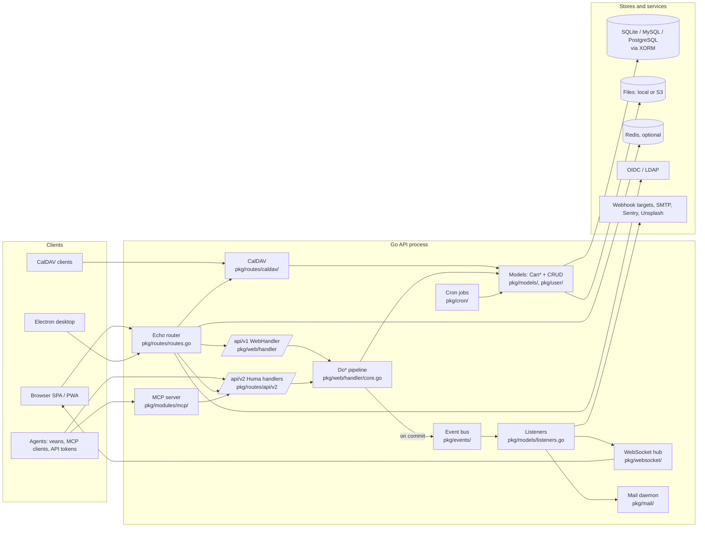

# Overview

Vikunja is a self-hosted to-do and project management application: projects hold tasks, tasks live in views (list, gantt, table, kanban), and everything is shareable with users, teams, or via public links. This repo is a monorepo containing the Go API server, the Vue single-page frontend that the server embeds and serves, an Electron desktop wrapper, and `veans`, a CLI that lets coding agents track their work in Vikunja.

Read this page first, then [Repository map](02-repository-map.md). If you have a concrete task, jump to the [playbooks](README.md#start-here).

## Who uses it and how

| Consumer | Talks to | Notes |
|---|---|---|
| Browser users | Vue SPA in `frontend/`, served by the Go binary from `frontend/embed.go` (embeds `frontend/dist/`) | Also installable as a PWA (`frontend/src/sw.ts`) |
| Desktop users | Electron wrapper in `desktop/` loading the same built frontend | Adds a quick-entry window and OAuth via a custom URL scheme (`desktop/oauth.js`) |
| CalDAV clients (Tasks.org, Thunderbird, DAVx5) | `/dav/**` and `/.well-known/caldav`, HTTP Basic auth with CalDAV tokens | `pkg/routes/caldav/`, data format in `pkg/caldav/` |
| Coding agents and scripts | `/api/v2` with API tokens, or the MCP server at `/api/v2/mcp` | `veans/` CLI, `pkg/modules/mcp/` |
| Other apps | Vikunja as OAuth 2.0 authorization server, webhooks, Atom feeds | `pkg/modules/auth/oauth2server/`, `pkg/models/webhooks.go`, `pkg/routes/feeds/` |
| Operators | Cobra CLI: `vikunja web|migrate|user|dump|restore|doctor|repair|healthcheck` | `pkg/cmd/` |

Vikunja is AGPL-3.0 and fully functional without a license. A license key (`pkg/license/`) unlocks "pro" features such as the admin panel, time tracking, audit logs, and user invites. Do not remove or bypass those checks without confirming with the user first (see [License system](../docs/license.md)).

## Design goals and constraints

- **Three databases, one code path.** SQLite, MySQL/MariaDB, and PostgreSQL are all supported. Every migration and query must work on all three (`pkg/migration/`, `pkg/db/`). CI runs the backend suites against six DB configurations.
- **Permissions live in the model.** Every entity in `pkg/models/` decides access itself through `CanRead`/`CanCreate`/`CanUpdate`/`CanDelete` methods. HTTP handlers never re-check permissions; they call the generic pipeline in `pkg/web/handler/core.go`.
- **Two API versions coexist.** `/api/v1` (Echo, swaggo annotations) is frozen. `/api/v2` (Huma, generated OpenAPI) receives all new routes. Both call the same model code. See [API contract](05-api-contract.md).
- **The frontend is mid-migration.** A legacy axios service/model layer (`frontend/src/services`, `models`, `modelTypes`) coexists with a generated fetch client (`frontend/src/client/generated`) plus TanStack Query. New code uses the generated client. See [Frontend architecture](04-frontend-architecture.md).
- **Events are in-process.** Domain events go through Watermill's in-memory channel (`pkg/events/`). Nothing is durable across restarts and nothing crosses instances. See [Events and listeners](components/backend/events-and-listeners.md).
- **Generated code is committed.** Swagger v1 docs, the frontend v2 client, yaegi plugin symbol tables, and translations are generated and checked in. Some are CI-gated on every PR, some only regenerated after merge. See [Repository map](02-repository-map.md#generated-code).

## Tech stack

### Backend (`pkg/`, module `code.vikunja.io/api`)

| Concern | Choice | Where |
|---|---|---|
| Language | Go 1.27 (`go.mod`; `mise.toml` pins 1.27.1) | |
| HTTP router | Echo v5 (`github.com/labstack/echo/v5` 5.3.1) | `pkg/routes/routes.go` → `NewEcho`, `RegisterRoutes` |
| v2 API framework | Huma v2 (`github.com/danielgtaylor/huma/v2` 2.39.1) mounted on Echo via `pkg/modules/humabridge` | `pkg/routes/api/v2/huma.go` → `NewAPI` |
| v1 API docs | swaggo (`github.com/swaggo/swag`) annotations, generated into `pkg/swagger/` | `pkg/routes/api/v1/` |
| ORM | XORM 1.4.1 (`xorm.io/xorm`, `xorm.io/builder`) | `pkg/db/db.go` |
| Migrations | xormigrate (`src.techknowlogick.com/xormigrate`), one timestamped file per migration | `pkg/migration/` |
| Config | Viper, `VIKUNJA_*` env overrides, `config-raw.json` as the documented source | `pkg/config/config.go` |
| CLI | Cobra | `pkg/cmd/` |
| Events | Watermill 1.5 with the in-memory `gochannel` pub/sub | `pkg/events/events.go` |
| Scheduled jobs | robfig/cron v3 behind a 40-line wrapper | `pkg/cron/cron.go` |
| Auth | HS256 JWT (`golang-jwt/jwt/v5`), refresh sessions, API tokens, link shares, OIDC (`go-oidc`), LDAP (`go-ldap`), TOTP (`pquerna/otp`), OAuth2 server | `pkg/modules/auth/`, `pkg/models/sessions.go`, `pkg/models/api_tokens.go` |
| Rate limiting | `ulule/limiter` with memory or Redis store | `pkg/routes/rate_limit.go` |
| Cache / KV | Optional Redis (`go-redis/v9`) or in-memory | `pkg/red/`, `pkg/modules/keyvalue/` |
| Files | Local disk or S3 (`aws-sdk-go-v2`), afero in tests | `pkg/files/` |
| Mail | `wneessen/go-mail` behind a queue goroutine | `pkg/mail/` |
| Realtime | `coder/websocket` hub | `pkg/websocket/` |
| Rich text | goldmark, html-to-markdown, bluemonday | `pkg/richtext/` |
| Plugins | Native Go plugins or yaegi-interpreted source | `pkg/plugins/`, `pkg/yaegi_symbols/` |
| MCP | `modelcontextprotocol/go-sdk` | `pkg/modules/mcp/` |
| Observability | slog (`pkg/log`), Sentry (`pkg/errorreport`), Prometheus (`pkg/metrics`) | |
| Tests | testify, go-testfixtures with embedded YAML fixtures | `pkg/db/fixtures/`, `pkg/webtests/` |
| Build | mage (`magefile.go`), golangci-lint 2.13.0 (`.golangci.yml`) | |

### Frontend (`frontend/`)

| Concern | Choice | Where |
|---|---|---|
| Framework | Vue 3.5, Composition API with `<script setup lang="ts">` enforced by ESLint | `frontend/eslint.config.js` |
| Language | TypeScript 6 via `vue-tsc` (typecheck has ~1500 pre-existing errors and is non-blocking in CI) | `frontend/tsconfig.app.json` |
| Build | Vite 8, PWA plugin, Tailwind v4 (prefixed `tw-`), Sass | `frontend/vite.config.ts` |
| State | Pinia 4, setup-style stores | `frontend/src/stores/` |
| Server state (new) | TanStack Query 5 (`@tanstack/vue-query`) | `frontend/src/client/queries/` |
| Routing | vue-router 5 with `createWebHistory` | `frontend/src/router/index.ts` |
| HTTP (legacy) | axios, `AbstractService`/`AbstractModel` | `frontend/src/services/abstractService.ts` |
| HTTP (new) | Generated fetch client from the v2 OpenAPI via `@hey-api/openapi-ts` | `frontend/src/client/generated/`, `frontend/openapi-ts.config.ts` |
| UI | `bulma-css-variables`, Font Awesome, floating-vue, TipTap 3 editor | `frontend/src/styles/`, `frontend/src/components/input/editor/` |
| i18n | vue-i18n 11, `en.json` is the source, Crowdin manages the rest | `frontend/src/i18n/` |
| Tests | Vitest 4 + happy-dom (co-located `*.test.ts`), Playwright 1.63 e2e | `frontend/tests/e2e/` |
| Package manager | pnpm 11.26 via corepack, Node 24 | `frontend/package.json` → `packageManager` |

### Other modules

- `veans/`: separate Go module (`code.vikunja.io/veans`), CLI for agents, targets `/api/v2` only. See [veans](components/veans.md) and `veans/AGENTS.md`.
- `desktop/`: Electron 43 wrapper. See [desktop](components/desktop.md).
- `build/`: separate Go module holding the `release:*` mage targets used by CI. See [Build and release](components/build-and-release.md).

## Architecture at a glance

Key runtime facts, each verified in code:

- One process serves the API, the static frontend, CalDAV, websockets, and MCP. `pkg/cmd/web.go` starts it; `pkg/initialize/init.go` → `FullInit` wires config, DB, migrations, mail daemon, cron jobs, websocket hub, and the event router in that order.
- Every write request runs in one XORM transaction opened and committed by the `Do*` function, never by the model. Events dispatched during the request are queued against the session and published only after commit (`events.DispatchOnCommit` → `events.DispatchPending`).
- The frontend is served from the same origin by default (`window.API_URL = '/api/v1'` in `frontend/index.html`), but can point anywhere; the URL is discoverable at runtime through `frontend/src/helpers/checkAndSetApiUrl.ts`.

## Where to go next

- Directory guide and "where does X go": [Repository map](02-repository-map.md)
- How a request flows through Go: [Backend architecture](03-backend-architecture.md)
- How the SPA boots and talks to the API: [Frontend architecture](04-frontend-architecture.md)
- Wire formats, auth, errors, keeping both sides in sync: [API contract](05-api-contract.md)
- Entities and tables: [Data model](06-data-model.md)
- Setup, build, test, debug: [Development workflow](07-development-workflow.md)
- Terms used throughout: [Glossary](09-glossary.md)
