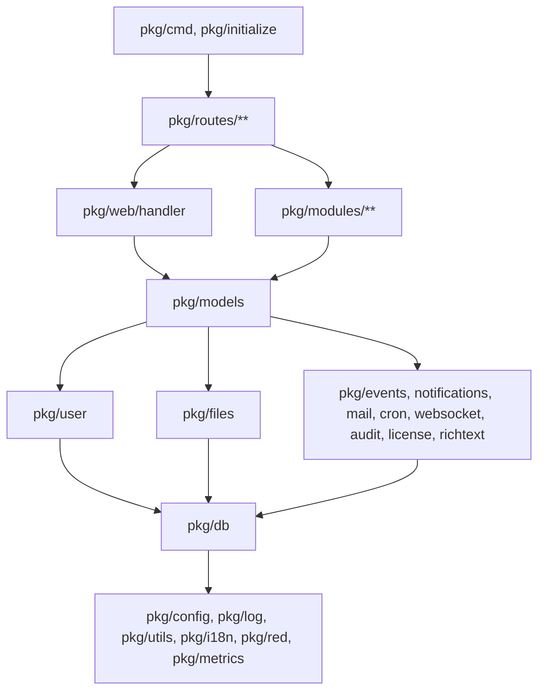
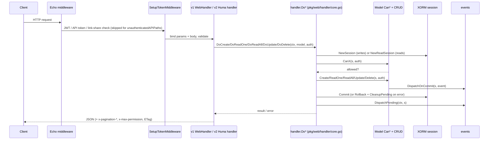

# Backend architecture

How the Go API is layered, wired, and run. Component details live under [components/backend/](README.md#backend-components); this page is the map that connects them.

## Package layering and dependency direction



Rules that keep this acyclic:

- `pkg/user` never imports `pkg/models` (`pkg/models` imports `pkg/user`; a `*user.User` satisfies `web.Auth`). Cross-cutting user logic such as deletion cascades lives in `pkg/models/user_delete.go` or `pkg/routes/api/shared/auth.go`.
- `pkg/web` knows nothing about concrete models; it defines the `CRUDable`/`Permissions` interfaces (`pkg/web/web.go`) that models implement.
- `pkg/models` never opens or commits a DB session; it receives `*xorm.Session` from the caller.
- `pkg/routes/api/v1` and `pkg/routes/api/v2` both call `pkg/web/handler` → `Do*` and share credential logic in `pkg/routes/api/shared/`.

## Startup

`main.go` → `pkg/cmd/cmd.go` → cobra. Running the bare binary is the same as `vikunja web` (`rootCmd.Run` aliases `webCmd`). `pkg/initialize/init.go` provides three levels of wiring:

| Function | Does | Used by |
|---|---|---|
| `LightInit()` | `log.InitLogger()`, `config.InitConfig()`, timezone check, `red.InitRedis()`, `keyvalue.InitStorage()` | `migrate` (the engine is created inside `migration.initMigration`), `testmail` (plus `mail.StartMailDaemon`) |
| `FullInitWithoutAsync()` | `LightInit()`, then `files.InitFileHandler`, **`migration.Migrate(nil)`** (migrations run on every start), `InitEngines()` (`models.SetEngine`, `files.SetEngine`, ParadeDB indexes), `license.Init`, `audit.Init` if enabled, `mail.StartMailDaemon`, LDAP connect, OIDC provider discovery (fatal on duplicate issuer), `i18n.Init`, `plugins.Initialize` | `healthcheck`, `dump`, `restore`, `repair *` |
| `FullInit()` | The above, then `cron.Init()`, 13 `Register*Cron()` calls plus the one-shot `openid.CleanupSavedOpenIDProviders()`, `ws.InitHub()`, and a goroutine that registers listeners (`models.RegisterListeners`, `migrationHandler.RegisterListeners`, `ws.RegisterListeners`) and runs `events.InitEvents()` | `web`, every `user *` subcommand |

`doctor` only initializes the logger and config. `events.InitEvents()` blocks in Watermill's `router.Run`; the `BootedEvent` dispatch written after it in the same goroutine therefore only fires when the router stops. No listener subscribes to `BootedEvent`, so nothing depends on it.

## Request pipeline

`pkg/routes/routes.go` → `NewEcho()` builds the Echo instance with, in order: `RequestID`, request logger (slog attrs, level by status via `httpLogLevel`), `Recover`, `NormalizeArrayParams` (rewrites `foo[]=` to `foo=`), `RequestMeta` when auditing, Sentry middleware, `CustomValidator`, `BodyLimit(maxFileSize + 2 MB)`, and `CreateHTTPErrorHandler`. Echo is configured with `UnescapePathParamValues: true` and `NoGroupAutoRegister404Routes: true` (multiple groups share `/api/v1`, which would otherwise panic).

`RegisterRoutes(e)` then mounts, in order: CalDAV (`/.well-known/caldav`, `/dav`) and feeds behind Basic-auth rate limiting, `/health`, the static frontend, CORS (skipped for `/dav` and `/feeds`, supports `http://host:*` port wildcards via `matchCORSOrigin`), `/api/v1` (`registerAPIRoutes`), pprof, `/api/v2` (`registerAPIRoutesV2`), and finally `collectRoutesForAPITokens(e)` which walks every registered route to build the API-token permission table.



Key files:

| Concern | Where |
|---|---|
| Auth middleware, `unauthenticatedAPIPaths` (single map for v1 and v2; `unauthenticatedPathSet` panics at startup on a typo) | `pkg/routes/routes.go`, `pkg/routes/api_tokens.go` → `SetupTokenMiddleware` |
| Rate limiters (`unauthRateLimit`, `tokenRefreshRateLimit`, `basicAuthRateLimit`, per-user/IP `RateLimit`) | `pkg/routes/rate_limit.go` |
| v1 generic handler (`WebHandler{EmptyStruct}` with `CreateWeb`, `ReadOneWeb`, `ReadAllWeb`, `UpdateWeb`, `DeleteWeb`) | `pkg/web/handler/*.go` |
| v2 typed handlers, registry, envelopes, error bridge | `pkg/routes/api/v2/{huma,registry,types,errors}.go` |
| Framework-agnostic pipeline | `pkg/web/handler/core.go` |
| Feature and admin gates (return 404, not 403) | `pkg/routes/feature_gate.go`, `pkg/routes/admin_gate.go` |

## Sessions and transactions

`pkg/db/db.go`:

| Function | Semantics | Who calls it |
|---|---|---|
| `db.NewSession()` | Opens a transaction. Caller must `Commit()` or `Rollback()`; `Close()` rolls back | `DoCreate`, `DoUpdate`, `DoDelete`, custom v2 handlers, cron jobs, listeners |
| `db.NewReadSession()` | Autocommit, no transaction held | `DoReadOne`, `DoReadAll` |
| `db.NewAutocommitSession()` | Same as read session | |

Models take `s *xorm.Session` and never commit. When a model needs another model's data it calls that model's method with the same session, so the whole request is one transaction. A per-session memo (`pkg/db/session_cache.go` → `Remember`, `RememberEach`) caches repeated lookups inside one request and is invalidated by a write hook that inspects executed SQL. Because that hook hangs off the session's context, `.golangci.yml` forbids `s.Context(...)` outside `pkg/db`; use `db.SetSessionContext`.

## Events and background work

- `events.DispatchOnCommit(s, event)` queues an event on the session pointer; `DispatchPending(ctx, s)` publishes after commit; `CleanupPending(s)` drops them on rollback. Use this from model code. `events.Dispatch(event)` publishes immediately and is for code outside a transaction.
- The bus is Watermill's in-memory `gochannel` (`pkg/events/events.go` → `InitEvents`): retry up to 5 times with exponential backoff up to 1 hour, a `poison` topic whose consumer logs and reports to Sentry, Prometheus router metrics. Nothing is persisted; a restart loses in-flight events.
- Listeners implement `events.Listener` (`Handle(*message.Message) error`, `Name() string`) and are registered with `events.RegisterListener(topic, l)` in `pkg/models/listeners.go` → `RegisterListeners()`.
- Cron jobs use `cron.Schedule(spec, func())` from `pkg/cron/cron.go`. There is no job registry, naming, or metrics; each job logs its own failures.
- Long work triggered by HTTP (imports, exports, webhook delivery) is an event plus a listener, not a job queue. See [cron-and-background-jobs](components/backend/cron-and-background-jobs.md).

## Errors

Every domain error is a struct implementing `web.HTTPErrorProcessor`. The canonical shape (`pkg/models/error.go`):

```go
type ErrProjectDoesNotExist struct{ ID int64 }
func IsErrProjectDoesNotExist(err error) bool { _, ok := err.(ErrProjectDoesNotExist); return ok }
func (err ErrProjectDoesNotExist) Error() string { ... }
const ErrCodeProjectDoesNotExist = 3001
func (err ErrProjectDoesNotExist) HTTPError() web.HTTPError {
    return web.HTTPError{HTTPCode: http.StatusNotFound, Code: ErrCodeProjectDoesNotExist, Message: "This project does not exist."}
}
```

- Codes are grouped in blocks: 1xxx users (`pkg/user/error.go`), 2xxx generic, 3xxx projects, 4xxx tasks, 6xxx teams, 7xxx sharing, 8xxx labels, 9xxx permissions, 10xxx buckets, 11xxx saved filters, 12xxx subscriptions, 13xxx link shares, 14xxx API tokens, 15xxx OpenID, 16xxx sessions, 17xxx OAuth, 18xxx time entries, 19xxx exports. Code `11` is the middleware-level invalid-token error (`pkg/routes/api_tokens.go`). `pkg/web/error_codes_test.go` fails on duplicate codes.
- Wrap with `fmt.Errorf("...: %w", err)`. The HTTP handlers match with `errors.As`, so wrapped domain errors still map to the right status. **The `IsErr*` helpers use a direct type assertion and do not see wrapped errors**; unwrap or use `errors.As` when checking a wrapped error.
- v1 mapping: `pkg/routes/error_handler.go` → `CreateHTTPErrorHandler`, in order: `echo.HTTPStatusCoder`, `*echo.HTTPError`, 413 → `files.ErrFileIsTooLarge`, `json.Marshaler` (keeps `ValidationHTTPError.InvalidFields`), `web.HTTPErrorProcessor`, else 500. 5xx are reported to Sentry with fingerprints from `pkg/errorreport`.
- v2 mapping: `pkg/routes/api/v2/errors.go` → `translateDomainError` produces RFC 9457 `application/problem+json` and copies `code` and `i18n_params` onto it. Validation failures become 422 (v1 uses 412). An `init()` replaces `huma.NewError` so 5xx bodies never leak driver errors. See [API contract](05-api-contract.md#error-format).

## Configuration

`pkg/config/config.go` declares every setting as a `Key` constant (`ServiceSecret Key = "service.secret"`) with getters (`GetString`, `GetBool`, `GetInt`, `GetDuration`, `GetStringSlice`). `InitConfig()` sets defaults, enables `VIKUNJA_` env overrides (`.` → `_`), searches for `config.{yml,yaml,json,...}` in `service.rootpath`, `/etc/vikunja/`, `~/.config/vikunja/`, and the working directory, or uses `--config <file>` (unreadable file is fatal). A second pass, `setConfigFromEnv()`, splits every `VIKUNJA_*` variable on `_` into a nested map so deep keys like `VIKUNJA_AUTH_OPENID_PROVIDERS_DEX_CLIENTID` work. Any key can be read from a file via `<key>.file`. `config-raw.json` documents keys and defaults and generates `config.yml.sample`.

Verified on 2026-09-16: without a config file the binary logs `service.publicurl is required when cors.enable is true` and stops; a minimal working `config.yml` needs `service.publicurl`, `service.rootpath`, `service.secret`, and a database.

## Logging

`pkg/log` wraps `log/slog`. Levels are the strings `CRITICAL|ERROR|WARNING|NOTICE|INFO|DEBUG` (`log.level`), format `text` or `structured` (JSON). Package-level helpers: `log.Debugf`, `Infof`, `Warningf`, `Errorf`, `Criticalf`, `Fatalf`. Separate component loggers with their own config keys: HTTP (`log.http`, `log.httplevel`), database (`log.database`, `log.databaselevel`; set `DEBUG` to see SQL), events (`log.events`), mail (`log.mail`). Never log secrets.

## Concurrency model

| Goroutine / mechanism | Where | Notes |
|---|---|---|
| Echo server | `pkg/cmd/web.go` | One process; graceful shutdown on signal |
| Watermill router | `pkg/initialize/init.go` goroutine → `events.InitEvents` | Unverified: handlers run concurrently per topic. `events.WaitForPendingHandlers()` drains in tests |
| Cron scheduler | `pkg/cron/cron.go` | robfig/cron; jobs run in their own goroutines |
| Mail daemon | `pkg/mail/mail.go` → `StartMailDaemon` | Channel-fed queue; `SendTestMail` is synchronous |
| WebSocket hub | `pkg/websocket/hub.go` | Per-connection read/write loops; `PublishForUser` fans out |
| Session cache | `pkg/db/session_cache.go` | Per-session, not shared across goroutines |
| Task position locking | `pkg/models/task_position.go` | Deterministic lock ordering (`viewLockOrder`) to avoid deadlocks |

Context propagation: HTTP handlers receive `ctx` from Echo or Huma; `DispatchWithContext` copies request metadata (IP, user agent, request id) into event messages for audit. Cron jobs and listeners create their own contexts.

## Where each subsystem is documented

| Subsystem | Page |
|---|---|
| Routing, middleware, rate limits, static files | [http-routing-and-middleware](components/backend/http-routing-and-middleware.md) |
| JWT, sessions, API tokens, link shares, OIDC, LDAP, TOTP, OAuth2 server | [auth-and-sessions](components/backend/auth-and-sessions.md) |
| `Do*` pipeline and permission contract | [crud-framework](components/backend/crud-framework.md) |
| v1 routes | [api-v1](components/backend/api-v1.md) |
| v2 routes, Huma, AutoPatch | [api-v2-huma](components/backend/api-v2-huma.md) |
| Projects, permissions, sharing | [models-projects-and-permissions](components/backend/models-projects-and-permissions.md), [models-sharing-teams-labels](components/backend/models-sharing-teams-labels.md) |
| Tasks, positions, repeat | [models-tasks](components/backend/models-tasks.md) |
| Filters and search | [models-filtering-and-search](components/backend/models-filtering-and-search.md) |
| Views and kanban | [models-views-and-kanban](components/backend/models-views-and-kanban.md) |
| Events, listeners, webhooks, audit | [events-and-listeners](components/backend/events-and-listeners.md) |
| Notifications and mail | [notifications-and-mail](components/backend/notifications-and-mail.md) |
| Cron and background jobs | [cron-and-background-jobs](components/backend/cron-and-background-jobs.md) |
| DB engine, sessions, fixtures, migrations | [db-and-migrations](components/backend/db-and-migrations.md) |
| Config, logging, Sentry | [config-and-logging](components/backend/config-and-logging.md) |
| Files, attachments, backgrounds, avatars | [files-and-storage](components/backend/files-and-storage.md) |
| CalDAV | [caldav](components/backend/caldav.md) |
| Importers | [importers](components/backend/importers.md) |
| WebSocket | [websocket](components/backend/websocket.md) |
| MCP | [mcp](components/backend/mcp.md) |
| Plugins | [plugins](components/backend/plugins.md) |
| `pkg/user` | [user-package](components/backend/user-package.md) |
| License, audit, metrics, health, doctor, Redis, keyvalue, richtext, i18n | [operations-subsystems](components/backend/operations-subsystems.md) |
| CLI and startup | [cli-commands](components/backend/cli-commands.md) |
