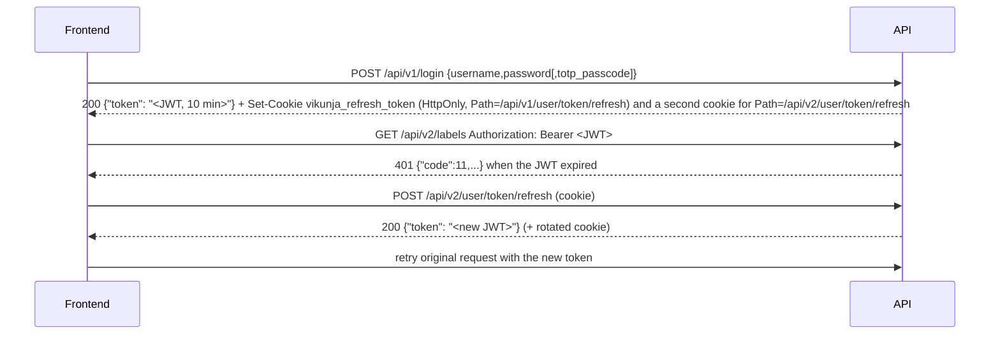

# API contract and the backend ↔ frontend boundary

Everything that crosses HTTP between `pkg/` and `frontend/` (and `veans/`, MCP clients, CalDAV). All response samples below were captured from a locally built server on 2026-09-16.

## Two versions, one model layer

| | `/api/v1` | `/api/v2` |
|---|---|---|
| Status | **Frozen.** Bug fixes and ports only | **All new routes** |
| Framework | Echo handlers, mostly the generic `handler.WebHandler` (`pkg/web/handler/*.go`) | Huma v2 typed handlers (`pkg/routes/api/v2/*.go`) on Echo via `pkg/modules/humabridge` |
| Spec | swaggo comments on handlers → `pkg/swagger/` (generated by CI after merge) | Reflected from Go types and `huma.Operation` at runtime; `doc:` and `readOnly:` struct tags supply descriptions |
| Docs UI | `/api/v1/docs` (Redoc), `/api/v1/docs.json` | `/api/v2/docs` (Scalar, vendored JS), spec at `/api/v2/openapi.json`, `/api/v2/openapi.yaml`, `/api/v2/openapi-3.0.json` |
| Create / update verbs | **PUT creates, POST updates** | **POST creates, PUT replaces, PATCH merges** (PATCH is synthesized by AutoPatch for every GET+PUT pair) |
| List response | Bare JSON array + headers `x-pagination-total-pages`, `x-pagination-result-count` | Envelope `{"items":[...],"total":N,"page":N,"per_page":N,"total_pages":N}` |
| Single read | Object + `x-max-permission` header | Object + `max_permission` field (per-resource read body) + quoted `ETag` header, `If-None-Match` → 304 |
| Search param | `s` | `q` (`ListParams` in `pkg/routes/api/v2/types.go`, `per_page` max 1000) |
| Validation failure | `412` with `{"code":2002,"message":...,"invalid_fields":[...]}` via `models.ValidationHTTPError` (`ErrCodeInvalidData`) | `422` RFC 9457 with `errors[].location = "body.<field>"` |
| Domain error | `{"code":<n>,"message":"..."}` | `application/problem+json` with `title`, `status`, `detail`, plus Vikunja's `code` and `i18n_params` |
| Consumers | Legacy frontend services, CalDAV-adjacent UI, older clients | Generated frontend client, `veans`, MCP |

Both versions call the same `handler.Do*` functions and therefore the same model `Can*` and CRUD methods. A behavior difference you observe between versions is in the transport layer, not the model. Example observed: `PUT /api/v1/labels` with `{"title":""}` created a label (201) while `POST /api/v2/labels` returned 422, because v2 enforces the `minLength:"1"` struct tag at the Huma layer.

## Where the contract is defined

| Piece | File |
|---|---|
| Model wire shape (shared by both versions) | `json:"..."` tags on `pkg/models/*.go`, `pkg/user/user.go` |
| v2 field docs and read-only markers | `doc:"..."`, `readOnly:"true"`, `minLength`, `enum` tags on the same structs |
| v2 operations | `Register(api, huma.Operation{OperationID, Summary, Description, Method, Path, Tags}, handler)` in each `pkg/routes/api/v2/<resource>.go`; `init() { AddRouteRegistrar(RegisterFooRoutes) }` |
| v2 envelopes | `pkg/routes/api/v2/types.go` → `Paginated[T]`, `ListParams`, `singleBody[T]`, `singleReadBody[T]`, `conditionalReadResponse`, `emptyBody` |
| v2 API config | `pkg/routes/api/v2/huma.go` → `NewAPI` (security schemes `JWTKeyAuth`, `APITokenAuth`, `BasicAuth`; `Servers[0]` must stay the relative `/api/v2`) |
| Canonical spec for codegen | `apiv2.NewCanonicalAPI()` called by `mage generate:frontend-client` (`magefile.go`) |
| Generated frontend client | `frontend/src/client/generated/{sdk.gen.ts,types.gen.ts,client.gen.ts}` from `frontend/openapi-ts.config.ts` |
| v1 annotations | `// @Summary`, `// @Router` comments in `pkg/routes/api/v1/*.go` and on `WebHandler` registrations in `pkg/routes/routes.go` |
| Legacy frontend types | `frontend/src/modelTypes/I*.ts` (camelCase, converted by `src/helpers/case.ts`) |

Operation IDs become generated function names (`labels-list` → `labelsList`) and MCP tool names (`labels_list`).

## Auth and session flow



- JWT: HS256 signed with `service.secret`, claims `type`, `id`, `username`, `is_admin`, `exp`, `sid` (session id), `jti`. Issued by `pkg/modules/auth/auth.go` → `NewUserJWTAuthtoken`; short TTL `service.jwtttlshort` (600 s default), long TTL for "stay logged in".
- Refresh token: stored hashed in `sessions` (`pkg/models/sessions.go`), delivered as one HttpOnly cookie **per refresh endpoint path** so the long-lived token is not sent on every request. `SameSite=None` only when the public URL is https.
- Middleware: `pkg/routes/api_tokens.go` → `SetupTokenMiddleware()` validates JWTs, or an `Authorization: Bearer tk_...` API token, and skips paths in `unauthenticatedAPIPaths` (`pkg/routes/routes.go`). Invalid or missing credentials return `401 {"code":11,"message":"missing, malformed, expired or otherwise invalid token provided"}` on both versions.
- Link shares: `POST /api/v{1,2}/shares/:share/auth` (optional password) returns a JWT with `type: 2`; the frontend keeps it in memory per tab.
- API tokens: `tk_` prefixed, SHA-256 stored, scoped by `(group, permission)` derived from route paths (`pkg/models/api_routes.go` → `getRouteGroupName`; `POST /api/v2/tasks/{task}/duplicate` becomes group `tasks`, permission `duplicate`). v1 and v2 share keys because create/update verbs are normalized. PATCH is accepted as an alias for the stored PUT. AutoPatch's internal GET leg inherits the PATCH authorization (`shouldSkipRouteCheck`).
- OIDC: `/api/v{1,2}/auth/openid/:provider/callback`; providers from config; LDAP via `pkg/modules/auth/ldap`. TOTP is enforced inside `pkg/routes/api/shared/auth.go` → `AuthenticateUserCredentials`.
- Vikunja as OAuth2 server for desktop/agent clients: `/oauth/authorize` (frontend route + `pkg/modules/auth/oauth2server`), `POST /api/v2/oauth/token` (JSON or form encoded, PKCE required).

Rate limits on credential endpoints are unconditional (`pkg/routes/rate_limit.go` → `perMinuteIPRateLimit`); `unauthenticatedPathSet` panics at boot if a rate-limited path is missing from the unauthenticated map.

## Error format

v1 (`pkg/routes/error_handler.go`):

```json
{"code":3001,"message":"This project does not exist."}
{"code":0,"message":"You don't have the permission to see this"}
```

v2 (`pkg/routes/api/v2/errors.go` → `translateDomainError`):

```json
{"$schema":"http://localhost:3456/api/v2/schemas/VikunjaErrorModel.json","title":"Forbidden","status":403,"detail":"You don't have the permission to see this"}
{"$schema":"...","title":"Unprocessable Entity","status":422,"detail":"validation failed","errors":[{"message":"expected length >= 1","location":"body.title","value":""}]}
```

Rules that follow from the code:

- A nonexistent id returns **403, not 404**, on both versions when the caller cannot prove access (`handler.ErrReadForbidden`). Real 404s come from explicit `ErrXDoesNotExist` errors raised inside model methods.
- v2 5xx bodies never include the underlying error text; it is logged instead (`init()` in `errors.go` replaces `huma.NewError`).
- The numeric `code` is the frontend's translation key: `frontend/src/message/index.ts` looks up `error.<code>` in `src/i18n/lang/en.json`. Adding a domain error means adding both the Go constant and the `en.json` entry. 56 Go codes currently have no frontend string (162 unique `ErrCode*`/`ErrorCode*` constants vs 107 numeric `error.*` keys, counted 2026-09-16; the count includes `ErrorCodeGenericForbidden`, whose Go literal `0001` is the number 1 while the JSON key is the string `"0001"`, so it never matches) (see [Known issues](13-known-issues.md)).
- `i18n_params` on the error carries values for placeholders in that string.

## Realtime and other channels

- WebSocket at `/api/v{1,2}/ws`: first message `{"action":"auth","token":"<jwt>"}`, then `{"action":"subscribe","event":"notification.created"}`; server pushes `{"event": ..., "data": ...}`. Events allow-listed in `pkg/websocket/connection.go` → `isValidEvent`. Client: `frontend/src/composables/useWebSocket.ts`.
- Webhooks: outbound POSTs per project (`pkg/models/webhooks.go`), events registered in `pkg/models/listeners.go` → `RegisterEventForWebhook`.
- CalDAV: `/dav/projects/<id>` with Basic auth (CalDAV token from user settings). Format code in `pkg/caldav/`.
- Atom feed: `/feeds/notifications.atom` and `/api/v2/notifications.atom` with a feeds-scoped API token.
- MCP: `/api/v2/mcp` streamable HTTP; tools derived from the v2 spec for operation IDs in `pkg/modules/mcp/exposure.go` → `exposedOperations` (typed tools for labels, projects, tasks, task assignees, task comments, and user search; everything else as catalog actions discoverable through `find_action` / `do_action`). Requires an API token with the `mcp:access` scope, which `pkg/models/api_routes.go` → `init()` seeds explicitly rather than deriving from route collection. See [mcp](components/backend/mcp.md).

## Keeping both sides in sync

When the contract changes, do these in order. Each step names what silently breaks if skipped.

1. **Model** (`pkg/models/<entity>.go`): change the struct, keep `json` tags snake_case, add `doc:` on new fields and `readOnly:"true"` on server-controlled ones. Skipped: v2 spec ships the field undocumented.
2. **Migration** (`pkg/migration/<ts>.go`) and **fixtures** (`pkg/db/fixtures/<table>.yml`) if the column set changed. Skipped: tests fail on missing columns or empty fixture data.
3. **v2 handler** (`pkg/routes/api/v2/<resource>.go`) for new operations; register via `init()`; write `Summary` and `Description`. **v1 handler** only if fixing a bug there; keep its swaggo comments accurate.
4. **Webtests**: `pkg/webtests/<resource>_test.go` and `huma_<resource>_test.go` (both positive and forbidden cases). Run `mage test:filter Test<Resource>`.
5. **Regenerate the frontend client**: `mage generate:frontend-client`, commit `frontend/src/client/generated/`. Skipped: `mage check:frontend-client` fails CI.
6. **Frontend types**: use the regenerated `types.gen.ts`. If legacy code consumes the field, update the matching `frontend/src/modelTypes/I*.ts` and model class too (camelCase). Skipped: legacy views show stale data.
7. **Error strings**: new `ErrCode*` → `frontend/src/i18n/lang/en.json` under `"error"`. Skipped: users see the raw server message.
8. **MCP**: add the operation ID to `exposedOperations` if agents should reach it. Skipped: tool absent, no error.
9. **API token scopes**: nothing to do for ordinary routes; they are collected at startup (`collectRoutesForAPITokens`). Choose the path so the derived `(group, permission)` reads sensibly. Routes under the MCP prefix are excluded from collection and use the hand-seeded `mcp:access` scope instead.
10. **veans** (`veans/internal/client/types.go`) mirrors models by hand; update it if the CLI uses the field.
11. **Swagger v1**: do not run `mage generate:swagger-docs` unless asked; CI regenerates after merge.

Verification: `mage test:filter <name>`, `mage check:frontend-client`, `cd frontend && pnpm vitest run <touched tests>`, and for user-visible flows an e2e spec.

## Sample calls (captured)

```bash
curl -s -X POST http://localhost:3456/api/v1/register -H 'Content-Type: application/json' \
  -d '{"username":"wiki","password":"wikipass123","email":"wiki@example.com"}'
# {"id":1,"name":"","username":"wiki","created":"...","updated":"..."}

curl -s -c cookies.txt -X POST http://localhost:3456/api/v1/login -H 'Content-Type: application/json' \
  -d '{"username":"wiki","password":"wikipass123"}'
# {"token":"eyJ..."}
```

```bash
curl -s -X POST http://localhost:3456/api/v2/labels -H "Authorization: Bearer $TOKEN" \
  -H 'Content-Type: application/json' -d '{"title":"wiki-label"}'
# 201 {"id":1,"title":"wiki-label",...,"created_by":{...}}

curl -s -X PATCH http://localhost:3456/api/v2/labels/1 -H "Authorization: Bearer $TOKEN" \
  -H 'Content-Type: application/merge-patch+json' -d '{"title":"renamed"}'
# 200 (AutoPatch: GET + merge + PUT)

curl -s -b cookies.txt -X POST http://localhost:3456/api/v2/user/token/refresh
# {"$schema":".../AuthTokenBodyBody.json","token":"eyJ..."}
```

`rest/` holds a Bruno collection with equivalent requests for a GUI client.
