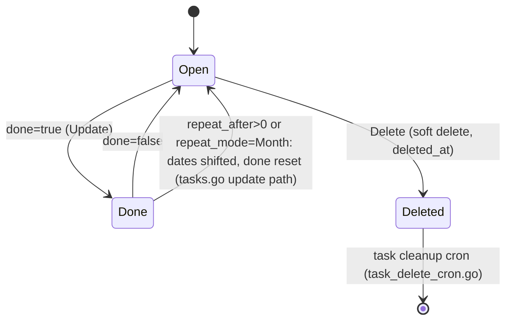

# Data model

Core entities, where each is defined on every layer, their relationships, lifecycles, and invariants. Table names come from `TableName()` methods; the registration list is `pkg/models/models.go` → `GetTables()` (34 tables) plus `users`, `user_tokens`, `totp`, `files`, `notifications`, `migration_status`, `license_status`.

## Entity relationship diagram

```mermaid
erDiagram
    users ||--o{ projects : owns
    projects ||--o{ projects : "parent_project_id"
    projects ||--o{ project_ancestors : "closure table"
    projects ||--o{ project_views : has
    projects ||--o{ tasks : contains
    projects ||--o{ users_projects : "shared with user"
    projects ||--o{ team_projects : "shared with team"
    projects ||--o{ link_shares : "public link"
    projects ||--o{ webhooks : has
    teams ||--o{ team_members : has
    teams ||--o{ team_projects : has
    project_views ||--o{ buckets : "kanban columns"
    project_views ||--o{ task_positions : "order per view"
    project_views ||--o{ task_buckets : "membership per view"
    buckets ||--o{ task_buckets : holds
    tasks ||--o{ task_positions : has
    tasks ||--o{ task_buckets : has
    tasks ||--o{ task_assignees : has
    tasks ||--o{ label_tasks : has
    labels ||--o{ label_tasks : has
    tasks ||--o{ task_reminders : has
    tasks ||--o{ task_relations : "task_id / other_task_id"
    tasks ||--o{ task_comments : has
    tasks ||--o{ task_attachments : has
    files ||--o| task_attachments : backs
    tasks ||--o{ time_entries : has
    tasks ||--o{ task_unread_statuses : "per user"
    users ||--o{ saved_filters : owns
    users ||--o{ favorites : "kind: task|project"
    users ||--o{ subscriptions : "entity: project|task"
    users ||--o{ reactions : "on task or comment"
    users ||--o{ api_tokens : owns
    users ||--o{ sessions : "refresh tokens"
    users ||--o{ oauth_codes : has
    users ||--o{ notifications : receives
    users ||--o{ user_tokens : "reset/confirm/caldav"
    users ||--o| totp : has
    users ||--o{ user_invite_links : created
    users ||--o{ migration_status : imports
```

## Entity reference

| Entity | Go type (file) | Table | Frontend (legacy `modelTypes` / generated) | Notes |
|---|---|---|---|---|
| User | `user.User` (`pkg/user/user.go`) | `users` | `IUser` / `User` | `status` (0 active, 1 email confirmation required, 2 disabled, 3 locked), `is_admin`, `bot_owner_id` (bots have no password, username must start with `bot-`), `frontend_settings` JSON, `issuer`/`subject` for OIDC/LDAP, deletion scheduling fields |
| Project | `Project` (`pkg/models/project.go`) | `projects` | `IProject` / `Project` | `parent_project_id` (NULL in DB for top level, normalized to 0 in JSON), `owner_id`, `is_archived`, `identifier` (prefix for task indexes), `background_file_id`, `position`, `views` loaded on read |
| ProjectAncestor | `ProjectAncestor` (`project_ancestor.go`) | `project_ancestors` | not exposed | Denormalized closure table for permission inheritance; rebuilt by `shared.rebuildProjectAncestors` in the testing endpoint and repaired by `vikunja repair projects` |
| ProjectView | `ProjectView` (`project_view.go`) | `project_views` | `IProjectView` / `ProjectView` | `view_kind` (`list`, `gantt`, `table`, `kanban`), `filter` (a `TaskCollection` JSON), `bucket_configuration_mode` (`none`, `manual`, `filter`), `default_bucket_id`, `done_bucket_id`, `position` |
| Task | `Task` (`tasks.go`) | `tasks` | `ITask` / `Task` | See lifecycle below. `index` + project `identifier` form the human id (`PROJ-12`); `bucket_id` is `xorm:"-"` (derived per view), `position` is per view, `is_favorite`/`is_unread`/`subscription` are per caller |
| ProjectTaskCounter, TaskIndexAlias | `task_index.go` | `project_task_counters`, `task_index_aliases` | not exposed | Per-project index counter and old identifiers kept after moves |
| TaskPosition | `TaskPosition` (`task_position.go`) | `task_positions` | `position` on `ITask` | `(task_id, project_view_id, position)`; float positions with recalculation and conflict repair |
| Bucket | `Bucket` (`kanban.go`) | `buckets` | `IBucket` / `Bucket` | Belongs to a view; `limit` (0 = unlimited), computed `count`, embeds `TaskCollection` |
| TaskBucket | `TaskBucket` (`kanban_task_bucket.go`) | `task_buckets` | `bucket_id` on task | One row per `(task_id, project_view_id)`: a task sits in one bucket per kanban view |
| Label, LabelTask | `label.go`, `label_task.go` | `labels`, `label_tasks` | generated `Label` only (no legacy `ILabel`; fully on the generated client) | Labels are owned by their creator and visible through tasks the caller can see |
| TaskAssginee (sic) | `task_assignees.go` | `task_assignees` | `assignees` on task | Exported type name has a long-lived typo; table is correct |
| TaskReminder | `task_reminder.go` | `task_reminders` | `ITaskReminder` | Absolute `reminder` or relative `relative_period` seconds from `relative_to` (`due_date`, `start_date`, `end_date`) |
| TaskRelation | `task_relation.go` | `task_relations` | `ITaskRelation`, `RELATION_KIND` | Kinds: `subtask`, `parenttask`, `related`, `duplicateof`, `duplicates`, `blocking`, `blocked`, `precedes`, `follows`, `copiedfrom`, `copiedto`. Creating one inserts both directions. Frontend enum lacks `duplicateof` and misspells `PROCEDES` |
| TaskComment | `task_comments.go` | `task_comments` | `ITaskComment` | HTML body (TipTap); mentions resolved by `pkg/richtext` |
| TaskAttachment + File | `task_attachment.go`, `files.File` (`pkg/files/files.go`) | `task_attachments`, `files` | `IAttachment`, `IFile` | Blob in local dir or S3 keyed by file id; `cover_image_attachment_id` on task |
| Team, TeamMember | `teams.go` | `teams`, `team_members` | `ITeam`, `ITeamMember` | `external_id`/`issuer` for OIDC-synced teams (`team_sync.go`), `is_public` |
| ProjectUser, TeamProject | `project_users.go`, `project_team.go` | `users_projects`, `team_projects` | `IUserShareBase`, `ITeamShareBase` | Share rows with `permission` |
| LinkSharing | `link_sharing.go` | `link_shares` | `ILinkShare` | `hash`, `permission`, `sharing_type` (1 without password, 2 with), `password` (bcrypt) |
| SavedFilter | `saved_filters.go` | `saved_filters` | `ISavedFilter` | `filters` is a `TaskCollection`; appears as a pseudo project with id `-(id+1)` |
| Subscription | `subscription.go` | `subscriptions` | `ISubscription` | `entity` (`project`, `task`; value 1 was namespaces and is kept to avoid renumbering), unique per `(entity, entity_id, user_id)`, `muted` overrides inheritance |
| Favorite | `favorites.go` | `favorites` | `is_favorite` flags | `(entity_id, kind, user_id)`, kind 1 task, 2 project |
| Reaction | `reaction.go` | `reactions` | `IReaction` | On tasks or comments (`entity_kind`), emoji `value` |
| Webhook | `webhooks.go` | `webhooks` | `IWebhook` | `events []string`, `target_url`, `secret`, optional basic auth |
| APIToken | `api_tokens.go` | `api_tokens` | `IApiToken` | `permissions` JSON `{group: [permission]}`, `expires_at` required, `owner_id` may be a bot |
| Session | `sessions.go` | `sessions` | `ISession` | `id` = JWT `sid`, `token_hash` = SHA-256 of the refresh token, device info, OIDC id token for RP-initiated logout |
| OAuthCode | `oauth_codes.go` | `oauth_codes` | n/a | Authorization codes with PKCE challenge |
| TimeEntry | `time_tracking.go` | `time_entries` | `ITimeEntry` | Pro feature; `end_time` NULL while running |
| UserInviteLink (+Team) | `user_invite_link.go` | `user_invite_links`, `user_invite_link_teams` | admin views | Pro feature; hashed token, `max_uses`, `expires_at` |
| TaskUnreadStatus | `task_unread_statuses.go` | `task_unread_statuses` | `is_unread` | Per user |
| UnsplashPhoto | `unsplash.go` | `unsplash_photos` | background info | Attribution for Unsplash backgrounds |
| Notification | `notifications.DatabaseNotification` (`pkg/notifications/database.go`) | `notifications` | `INotification` | `name` identifies the registered type so rows can be rehydrated |
| Token (user) | `user.Token` (`pkg/user/token.go`) | `user_tokens` | n/a | Password reset, email confirm, CalDAV tokens distinguished by `kind` |
| TOTP | `user.TOTP` (`pkg/user/totp.go`) | `totp` | `ITotp` | |
| MigrationStatus | `migration.Status` (`pkg/modules/migration/migration_status.go`) | `migration_status` | polled by `stores/migration.ts` | Import job progress |
| license.Status | `pkg/license/license.go` | `license_status` | `/info` → `enabled_pro_features` | |

Fixtures for every table: `pkg/db/fixtures/<table>.yml` (38 files). Tests rely on their ids; add rows, do not renumber.

## Enums duplicated across sides

No generator links these. Change both.

| Concept | Go | TypeScript |
|---|---|---|
| Permission level | `pkg/models/permissions.go`: `PermissionUnknown -1`, `PermissionRead 0`, `PermissionWrite 1`, `PermissionAdmin 2` | `frontend/src/constants/permissions.ts` `PERMISSIONS` |
| Task repeat mode | `pkg/models/tasks.go`: `TaskRepeatModeDefault 0`, `Month 1`, `FromCurrentDate 2` | `frontend/src/types/IRepeatMode.ts` |
| Project view kind | `pkg/models/project_view.go`: `ProjectViewKindList 0 … Kanban 3`, serialized as strings via `MarshalJSON` | `frontend/src/modelTypes/IProjectView.ts` `PROJECT_VIEW_KINDS` |
| Bucket configuration mode | `BucketConfigurationModeNone 0`, `Manual 1`, `Filter 2`, serialized as strings | same file |
| Relation kind | `pkg/models/task_relation.go` (12 values) | `frontend/src/types/IRelationKind.ts` (10 values; no `duplicateof`) |
| Reminder relative-to | `pkg/models/task_reminder.go`: `due_date`, `start_date`, `end_date` | `frontend/src/types/IReminderPeriodRelativeTo.ts` |
| Priority | none in Go; plain `int64`, mapped to CalDAV 0–9 in `pkg/caldav/priority.go` (`mapPriorityToCaldav`) | `frontend/src/constants/priorities.ts` `UNSET 0 … DO_NOW 5` |
| Auth type | `user.AuthTypeUser 1`, `auth.AuthTypeLinkShare 2` | `frontend/src/modelTypes/IUser.ts` `AUTH_TYPES` |
| Pro features | `pkg/license/license.go` `Feature*` | `frontend/src/constants/proFeatures.ts` (`admin_panel`, `time_tracking`, `user_invites`) |
| Error codes | `ErrCode*` constants | `frontend/src/i18n/lang/en.json` → `error` |
| Filter fields and operators | `pkg/models/task_collection_filter.go` | `frontend/src/helpers/filters.ts` `AVAILABLE_FILTER_FIELDS`, `FILTER_OPERATORS` |
| Supported locales | `pkg/i18n/i18n.go` | `frontend/src/i18n/index.ts` `SUPPORTED_LOCALES` |
| Migrator ids | `Name()` of each importer under `pkg/modules/migration/*` | `frontend/src/views/migrate/migrators.ts` |
| WebSocket events | `pkg/websocket/connection.go` `validEvents` | string literals in `stores/timeTracking.ts`, `Notifications.vue` |

## Pseudo projects and derived ids

- `FavoritesPseudoProjectID = -1` (`pkg/models/project.go`) with three hard-coded views (ids -1, -2, -3).
- A saved filter with id `n` is addressed as project id `-(n+1)`: `GetSavedFilterIDFromProjectID(projectID) = projectID*-1 - 1` (`pkg/models/saved_filters.go`). Every code path taking a project id must handle `IsPseudoProjectID`.
- Task human identifiers are `<project identifier>-<index>` or `#<index>` when the project has no identifier; `pkg/models/task_index.go` keeps the counter and aliases.

## Lifecycles

### Task done and repeating

- On update, `pkg/models/tasks.go` detects a repeating task marked done and instead shifts `due_date`, `start_date`, `end_date`, and reminders, then sets `done=false` (`addRepeatIntervalToTime`, `setTaskDatesMonthRepeat`, `setTaskDatesFromCurrentDateRepeat`). `done_at` is server controlled.
- `repeat_after` is seconds, capped by `MaxTaskRepeatAfterSeconds` (10 years, `ErrCodeInvalidTaskRepeatInterval 4029`).
- Marking done can also move the task into the view's `done_bucket_id` (`kanban_task_bucket.go`), and moving into the done bucket marks it done.

### Kanban membership and position

- A task's bucket is a row in `task_buckets` per view; `Task.BucketID` is filled only when reading through a view, and `?expand=buckets` returns the full `buckets` array (one per view), which `BucketSelect.vue` reads. Moving between buckets is a request to `/projects/{p}/views/{v}/buckets/{b}/tasks` with `{"task_id": N}` (`PUT` on v2, `POST` on v1), not a task update.
- Bucket `limit` is enforced on move (`ErrCodeBucketLimitExceeded 10004`); a view needs at least one bucket (`10003`). One done bucket per view is structural (`done_bucket_id` is a single column); `ErrCodeOnlyOneDoneBucketPerProject 10005` is defined but nothing constructs it.
- Ordering is `task_positions.position` per view. Positions are floats; when they collide or exhaust precision, `RecalculateTaskPositions` rewrites the whole view (`ErrCodeNeedsFullRecalculation 4028`). Two repair CLI commands exist for drifted data.

### Sessions

Login → `models.CreateSession` (refresh token hashed) → JWT with `sid`. Refresh rotates the token; `RegisterSessionCleanupCron` deletes expired rows hourly; logout deletes the row (`pkg/routes/api/shared/auth.go` → `LogoutSession`). Listing and revoking sessions is exposed in user settings.

### User deletion

Requested through settings → `deletion_scheduled_at` set → hourly `RegisterUserDeletionCron` deletes users past the grace period (`pkg/models/user_delete.go`) and `RegisterDeletionNotificationCron` (`pkg/user/delete.go`) mails reminders. Owned projects go with the user; shared projects lose the share.

### Imports

Upload or credentials → `migration_status` row created → event → background listener (`pkg/modules/migration/handler/`) runs the importer and updates status → frontend `stores/migration.ts` polls. Uploads are stored as files and cleaned hourly.

## Invariants worth knowing

- Every write goes through a model method that received the session from `handler.Do*`; models never open sessions. See [Backend architecture](03-backend-architecture.md#sessions-and-transactions).
- `CanRead` returns the caller's maximum permission; v1 exposes it as the `x-max-permission` header, v2 as `max_permission`, and the frontend uses it to show or hide controls.
- Project permission inheritance goes through `project_ancestors`; a child project is readable by whoever can read an ancestor. Moving a project rewrites the closure rows. Setting `parent_project_id` to 0 explicitly requires admin (security fix GHSA-44v6-7fxq-vgf4).
- `xorm` builds composite indexes in struct field order: `Task.ProjectID` must precede `Done`/`DueDate` for `index(project_done_due_date)`. Do not reorder struct fields casually.
- Composite uniqueness: `(project_id, index)` on tasks, `(entity, entity_id, user_id)` on subscriptions, `(task_id, project_view_id)` on positions and buckets. E2E factories mirror numeric ids onto `index` to avoid collisions.
- Soft delete exists only on tasks (`deleted_at`). Everything else is hard deleted.
- Descriptions and comments are stored as HTML; clients may send Markdown to v2 with `format=markdown`, converted by `pkg/richtext`.
