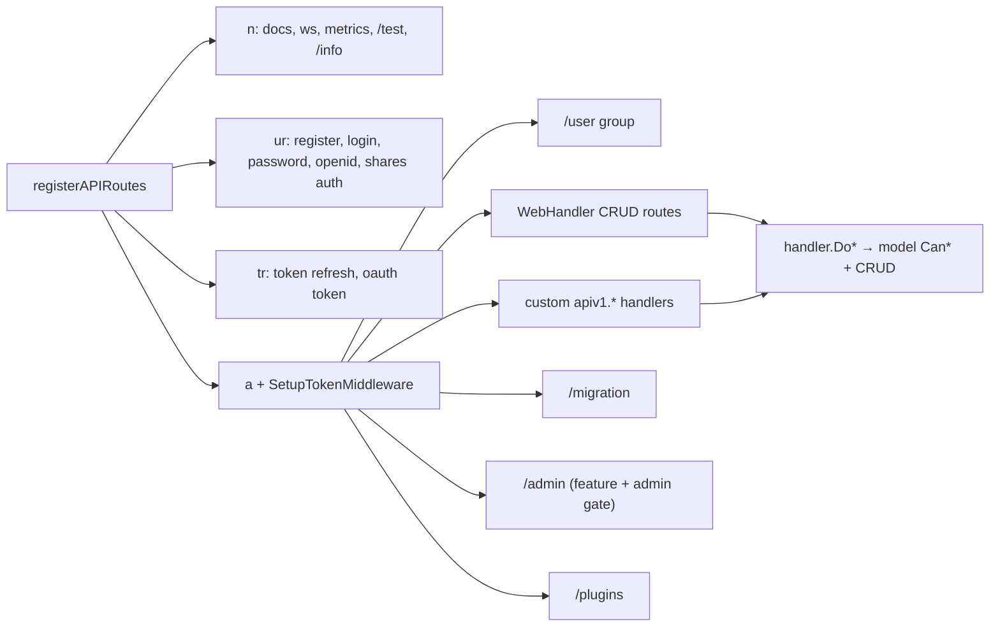

# API v1 (frozen Echo routes)

The original `/api/v1` HTTP surface: plain Echo handlers registered in `pkg/routes/routes.go` → `registerAPIRoutes`, most of them the generic `handler.WebHandler`, documented by swaggo comments that CI compiles into `pkg/swagger/`. It is **frozen**; new routes go to [api-v2-huma](./api-v2-huma.md). Context: [Backend architecture](../../03-backend-architecture.md#request-pipeline), [API contract](../../05-api-contract.md).

## Responsibility

- Owns: route registration for `/api/v1`, the handful of hand-written v1 handlers in `pkg/routes/api/v1/`, the admin handlers in `pkg/routes/api/v1/admin/`, and the swaggo annotations that produce the v1 OpenAPI 2.0 document.
- Does not own: middleware, rate limits, CORS, the error handler ([http-routing-and-middleware](./http-routing-and-middleware.md)); the `Do*` pipeline and permission checks ([crud-framework](./crud-framework.md)); credential logic shared with v2 (`pkg/routes/api/shared/`, see [auth-and-sessions](./auth-and-sessions.md)); importers mounted under `/migration` ([importers](./importers.md)).

### What "frozen" means

Policy in `../../../docs/api.md`: v1 keeps running and is supported but does not grow. Allowed: bug fixes, keeping swaggo annotations accurate, and porting a resource to v2. Not allowed: new routes, new fields that only v1 exposes, new handlers in `pkg/routes/api/v1/`. Models in `pkg/models/` are shared, so a model change reaches both versions automatically.

## Entry points and public API

| Entry | Where | Called by |
|---|---|---|
| `registerAPIRoutes(a, noAuthRateLimit, refreshRateLimit)` | `pkg/routes/routes.go` | `RegisterRoutes` after CORS, before `/api/v2` |
| `registerMigrations(m)` | `pkg/routes/routes.go` | `registerAPIRoutes` for the `/migration` group |
| `handler.WebHandler{EmptyStruct: ...}` + `CreateWeb`/`ReadOneWeb`/`ReadAllWeb`/`UpdateWeb`/`DeleteWeb` | `pkg/web/handler/*.go` | every generic CRUD route |
| `apiv1.*` handlers | `pkg/routes/api/v1/*.go` | custom routes listed below |
| `adminapi.*` handlers | `pkg/routes/api/v1/admin/*.go` | the `/admin` group |
| `unauthenticatedAPIPaths` | `pkg/routes/routes.go` | `SetupTokenMiddleware` skipper and `collectRoutesForAPITokens` (shared with v2) |

## Key types and functions

### Group structure in `registerAPIRoutes`

| Group | Middleware | Routes |
|---|---|---|
| `n := a.Group("")` | `setupRateLimit(n, "ip")` only, no auth | `/docs.json`, `/docs`, `/docs/redoc.standalone.js`, `/ws`, metrics (`setupMetrics`), `/test/all` + `/test/:table` (only when `service.testingtoken` is set), `/info`, unauthenticated plugin routes |
| `ur := a.Group("")` | `noAuthRateLimit` | `/register`, `/user/password/token`, `/user/password/reset`, `/user/confirm` (if `auth.local.enabled`); `/login` (local or LDAP); `/auth/openid/:provider/callback` (if OpenID); `/shares/:share/auth` (if link sharing) |
| `tr := a.Group("")` | `refreshRateLimit` | `POST /user/token/refresh` (`apiv1.RefreshToken`), `POST /oauth/token` (`oauth2server.HandleToken`) |
| `a` after `a.Use(SetupTokenMiddleware())` | JWT/API-token auth, `setupRateLimit(a, rate_limit.kind)`, `setupMetricsMiddleware` | everything else |
| `u := a.Group("/user")` | inherits `a` | user show/settings/password/logout/export/deletion/TOTP/CalDAV tokens/webhooks/sessions/bots |
| `m := a.Group("/migration")` | inherits `a` | `registerMigrations`: Todoist, Trello, Microsoft To Do (config-gated), Vikunja file, TickTick, WeKan, CSV (always) |
| `admin := a.Group("/admin", RequireFeature(license.FeatureAdminPanel), RequireInstanceAdmin())` | both gates return 404 | `/overview`, `/users`, `/users/:id/admin`, `/users/:id/status`, `/users/:id`, `/projects`, `/projects/:id/owner` |
| `a.Group("/plugins")` and `n.Group("/plugins")` | if `plugins.enabled` | `plugins.RegisterPluginRoutes(authenticated, unauthenticated)` (`pkg/plugins/manager.go`) |

All groups share the `/api/v1` prefix, which is why `NewEcho` sets `NoGroupAutoRegister404Routes: true`. `noStoreCacheControl()` is applied to the whole group first. The unauthenticated set is not derived from the groups: a path only skips JWT if it is in `unauthenticatedAPIPaths`, so a route added to `n` or `ur` without that map entry still requires a token.

### The `WebHandler` registration shape

Every generic resource is six lines: a `handler.WebHandler` whose `EmptyStruct` returns a fresh model, then one route per verb. Example from `routes.go`:

```go
labelHandler := &handler.WebHandler{EmptyStruct: func() handler.CObject { return &models.Label{} }}
a.GET("/labels", labelHandler.ReadAllWeb)
a.GET("/labels/:label", labelHandler.ReadOneWeb)
a.PUT("/labels", labelHandler.CreateWeb)
a.DELETE("/labels/:label", labelHandler.DeleteWeb)
a.POST("/labels/:label", labelHandler.UpdateWeb)
```

The `*Web` methods bind path/query/body into the model (`c.Bind`), run `ctx.Validate` (`pkg/routes/validation.go` → `CustomValidator`, govalidator), then call the framework-agnostic `handler.Do*` in `pkg/web/handler/core.go`. One model can back several paths (`taskCollectionHandler` serves `/tasks`, `/projects/:project/tasks`, and `/projects/:project/views/:view/tasks`). `admin.GET("/users")` reuses the same machinery with `adminapi.UserList` as the `CObject` (`pkg/routes/api/v1/admin/users.go`, only `ReadAll` and `CanRead` implemented).

### Verb semantics, pagination, permission header

- **PUT creates, POST updates** (v2 inverts this). Delete is `DELETE`, reads are `GET`. `POST /:entitykind/:entityid/reactions/delete` is a delete via POST because reactions need a body.
- List responses are bare JSON arrays with headers `x-pagination-total-pages` and `x-pagination-result-count` (`pkg/web/handler/read_all.go:113-115`, also exposed via `Access-Control-Expose-Headers`). Search is `?s=`, paging `?page=&per_page=`.
- Single reads add `x-max-permission` (`pkg/web/handler/read_one.go:59`), an int `0|1|2`.
- Validation failures return **412** with `{"code":2002,"message":"Invalid Data","invalid_fields":[...]}`: `models.InvalidFieldErrorWithMessage` (`pkg/models/error.go`) builds a `ValidationHTTPError` with `http.StatusPreconditionFailed` and `ErrCodeInvalidData`; its `MarshalJSON` keeps `invalid_fields` when `CreateHTTPErrorHandler` serialises it.
- Other domain errors are `{"code":<n>,"message":"..."}` from `pkg/routes/error_handler.go`; see [API contract](../../05-api-contract.md#error-format).

### Files in `pkg/routes/api/v1/`

| File | Handlers |
|---|---|
| `avatar.go` | `GetAvatar` (`GET /avatar/:username`, `?size=` default 250 via `avatar.GetAvatarForUsername`), `UploadAvatar` (`PUT /user/settings/avatar/upload`, multipart field `avatar`, sets provider to upload) |
| `docs.go` | `DocsJSON` (serves `swag.ReadDoc()`, imports `pkg/swagger` for its side effect), `RedocUI` (embedded `redoc/redoc.html` templated with `service.publicurl`), `RedocJS` (embedded `redoc/redoc.standalone.js`) |
| `info.go` | `Info` → `shared.BuildInfo()` (`pkg/routes/api/shared/info.go` → `VikunjaInfos`); same payload as v2 `/info` |
| `link_sharing_auth.go` | `AuthenticateLinkShare`: binds `LinkShareAuth{Hash param:"share", Password}` and calls `shared.AuthenticateLinkShare`; returns a JWT of type link share |
| `login.go` | `Login`, `RenewToken` (`POST /user/token`), `RefreshToken` (cookie-based, `auth.RefreshTokenPathV1`), `Logout` |
| `notifications.go` | `MarkAllNotificationsAsRead` (`POST /notifications`; rejects link shares with `echo.ErrForbidden`) |
| `task_attachment.go` | `UploadTaskAttachment` (`PUT /tasks/:task/attachments`, multipart `files[]`, `models.UploadTaskAttachments`, per-file result via `webfiles.BuildUploadResult`), `GetTaskAttachment` (download, `?preview_size=sm|md|lg|xl`, `webfiles.WriteAttachmentDownload`) |
| `task_by_index.go` | `GetTaskByProjectIndex` is a **doc-only stub** (`//nolint:unused`) so swag has a function to hang the second `@Router` for `/projects/{project}/tasks/by-index/{index}` on; the route is wired to `taskHandler.ReadOneWeb` with `ResolveProjectIdentifier()` middleware (`pkg/routes/resolve_project.go`) |
| `testing.go` | `HandleTesting` (`PATCH /test/:table`) and `HandleTestingTruncateAll` (`DELETE /test/all`); both compare the raw `Authorization` header to `service.testingtoken` and return `echo.ErrForbidden` otherwise; `?truncate=false` appends instead of replacing; bodies go to `shared.ReplaceTableContents` / `shared.TruncateAllTestingTables`. Errors are returned as 500 with `{"error":true,"message":...}` |
| `token_check.go` | `CheckToken` (`POST /token/test`, returns **418** `🍵`), `TestToken` (`GET /token/test`, `{"message":"ok"}`); `shouldSkipRouteCheck` in `pkg/routes/api_tokens.go` exempts `/token/test` from the API-token route check so any valid token can probe itself |
| `user_caldav_token.go` | `GenerateCaldavToken`, `GetCaldavTokens`, `DeleteCaldavToken` |
| `user_confirm_email.go` | `UserConfirmEmail` |
| `user_deletion.go` | `UserRequestDeletion`, `UserConfirmDeletion`, `UserCancelDeletion` (password-confirmed; gated by `service.enableuserdeletion`) |
| `user_export.go` | `RequestUserDataExport`, `DownloadUserDataExport`, `GetUserExportStatus`; shared `checkExportRequest` |
| `user_list.go` | `UserList` (`GET /users`, search), `ListUsersForProject` (`GET /projects/:project/projectusers`) |
| `user_password_reset.go` | `UserResetPassword`, `UserRequestResetPasswordToken` |
| `user_register.go` | `RegisterUser` (`UserRegister = shared.UserRegister`) |
| `user_settings.go` | `GetUserAvatarProvider`, `ChangeUserAvatarProvider`, `UpdateGeneralUserSettings`, `GetAvailableTimezones` |
| `user_show.go` | `UserShow` → `UserWithSettings` (embeds `user.User` plus `settings`, `deletion_scheduled_at`, `is_local_user`, `auth_provider`, `is_admin`, `pending_email`) |
| `user_totp.go` | `UserTOTPEnroll`, `UserTOTPEnable`, `UserTOTPDisable`, `UserTOTPQrCode`, `UserTOTP`; `getLocalUserFromContext` refuses non-local users |
| `user_update_email.go`, `user_update_password.go` | `UpdateUserEmail`, `UserChangePassword` |
| `user_webhooks.go` | `GetUserWebhooks`, `CreateUserWebhook`, `UpdateUserWebhook`, `DeleteUserWebhook`, `GetUserDirectedWebhookEvents` (user-level webhooks, gated by `webhooks.enabled`) |
| `webhooks.go` | `GetAvailableWebhookEvents` → `models.GetAvailableWebhookEvents()` |

`pkg/routes/api/v1/admin/`: `overview.go` → `GetOverview`; `users.go` → `UserList` (CObject); `user_create.go` → `CreateUser`; `users_admin.go` → `PatchAdmin` (`IsAdminPatch`); `users_mgmt.go` → `PatchStatus` (`StatusPatch`), `DeleteUser`; `projects.go` → `PatchProjectOwner` (`OwnerPatch`). Note these admin routes already use `PATCH`, the one place v1 does.

### Swagger annotations and `pkg/swagger/`

- The document header (`@title`, `@description` with the pagination/permission/error/auth sections, `@BasePath /api/v1`, `@securityDefinitions.apikey JWTKeyAuth`) is the comment block at the top of `pkg/routes/routes.go`.
- Custom handlers carry their own block. Real example, `pkg/routes/api/v1/task_attachment.go:44`:

```go
// @Summary Upload a task attachment
// @tags task
// @Accept mpfd
// @Param id path int true "Task ID"
// @Security JWTKeyAuth
// @Success 200 {object} models.Message "Attachments were uploaded successfully."
// @Router /tasks/{id}/attachments [put]
func UploadTaskAttachment(c *echo.Context) error {
```

- For `WebHandler` routes the annotations sit on the **model methods**, e.g. `pkg/models/label.go:69` (`Create`, `@Router /labels [put]`), `:150` (`ReadAll`), `:167` (`ReadOne`). swag allows one `@Router` per function, hence `task_by_index.go`.
- Generation: `mage generate:swagger-docs` runs `swag init -g ./pkg/routes/routes.go --parseDependency -d . -o ./pkg/swagger` (`magefile.go` → `Generate.SwaggerDocs`). Output `pkg/swagger/{docs.go,swagger.json,swagger.yaml}` is committed but **never hand-edited and not regenerated in PRs**; `release.yml` regenerates after merge to `main` (see [Repository map](../../02-repository-map.md#generated-code)). `mage check:got-swag` (`Check.GotSwag`, `magefile.go:705`) regenerates and compares the `swagger.json` hash; it is not part of the PR checks.

## Internal structure



## Dependencies

- **Uses:** `pkg/web/handler`, `pkg/models`, `pkg/user`, `pkg/routes/api/shared` (info, auth, testing helpers), `pkg/modules/auth` (`GetAuthFromClaims`), `pkg/modules/avatar`, `pkg/modules/background/*`, `pkg/modules/migration/*`, `pkg/web/files`, `pkg/swagger` (blank import in `docs.go`), `github.com/swaggo/swag`.
- **Used by:** legacy frontend services (`frontend/src/services/*`, see [api-client-legacy](../frontend/api-client-legacy.md)), Playwright seeding (`frontend/tests/support`), older third-party clients, and the API-token route table (`collectRoutesForAPITokens` walks v1 and v2 routes together).

## Invariants and assumptions

- v1 and v2 share `unauthenticatedAPIPaths`; a v1 path listed there is skipped by `SetupTokenMiddleware` on both groups and excluded from token permissions (`CollectRoutesForAPITokenUsage` ignores `!requiresJWT`).
- API-token permissions are keyed by prefix-stripped path, so v1 and v2 routes for the same resource share `(group, permission)` (`pkg/models/api_routes.go` → `getRouteGroupName`). Renaming a v1 path silently changes which tokens can call it.
- `ctx.Validate` runs before `Do*`, so validation (412) precedes permission (403). v2 mirrors this in its `Register` wrapper.
- The testing endpoints exist only when `service.testingtoken` is non-empty; `NewCanonicalAPI` (v2) asserts no `/test/` path leaks into the generated client, and v1 has no equivalent check.
- `/api/v1/user/token/refresh` must stay exactly `auth.RefreshTokenPathV1`: the refresh cookie is scoped to that path (`pkg/modules/auth/auth.go:60`).

## Configuration

| Key (`config.yml`) | Effect on v1 routes |
|---|---|
| `service.testingtoken` | mounts `/test/all` and `/test/:table` |
| `auth.local.enabled`, `auth.ldap.enabled`, `auth.openid.enabled` | which credential routes exist |
| `service.enablelinksharing`, `service.enabletotp`, `service.enableuserdeletion`, `service.enabletaskattachments`, `service.enabletaskcomments` | feature groups |
| `webhooks.enabled`, `backgrounds.*`, `migration.*.enable`, `plugins.enabled` | webhook, background, importer, plugin routes |
| `ratelimit.kind` | `setupRateLimit(a, ...)` on the authenticated group |

## Error handling

Handlers return Go errors; `pkg/routes/error_handler.go` → `CreateHTTPErrorHandler` maps them (see [Backend architecture](../../03-backend-architecture.md#errors)). Exceptions that write their own responses: `testing.go` (500 with `error: true`), `avatar.go` (400 "Uploaded file is no image."), `token_check.go` (418). `echo.ErrForbidden` from custom handlers becomes a bare Echo 403 without a Vikunja `code`.

## Tests

- `pkg/webtests/<resource>_test.go` drive `WebHandler` routes through `webHandlerTest` (`pkg/webtests/integrations.go`, `testReadAllWithUser`, `testCreateWithLinkShare`, ...). Run one with `go test -run 'TestLabel' ./pkg/webtests/` (`mage test:filter` passes `-short`, which skips webtests; see the `api-v2-routes` skill).
- Custom handlers: `pkg/routes/api/v1/*_test.go` where present; `pkg/routes/error_handler_test.go`, `rate_limit_test.go`, `static_test.go`.
- Swagger is not tested for accuracy; only staleness (`mage check:got-swag`).

## Gotchas and tech debt

- Annotation drift, both real: `pkg/routes/api/v1/avatar.go:43` documents `@Router /{username}/avatar [get]` but the route is `GET /avatar/:username`; `pkg/models/label.go:99` documents `@Router /labels/{id} [put]` for `Label.Update` while the route is `POST /labels/:label`. swag does not cross-check against Echo.
- `POST /token/test` answering 418 is relied on by clients as a "token valid" probe; keep it.
- Route names must not be used for CRUD detection (Echo v5 dropped handler names); `isStandardCRUDRoute` in `pkg/models/api_routes.go` uses path heuristics instead. New v1 paths with unusual shapes may land in the `other` token group.
- Security history encoded in the token table: GHSA-v479-vf79-mg83 (method/sub-resource confusion, exact `(Path, Method)` matching) and GHSA-9rg3-v78m-26q8 (expand scopes), both in `pkg/models/api_routes.go` around lines 441-448.
- No TODO/FIXME comments exist in `pkg/routes/api/v1/` or `routes.go` (only inside the vendored `redoc.standalone.js`).

## Related pages

[api-v2-huma](./api-v2-huma.md), [http-routing-and-middleware](./http-routing-and-middleware.md), [auth-and-sessions](./auth-and-sessions.md), [crud-framework](./crud-framework.md), [importers](./importers.md), [files-and-storage](./files-and-storage.md), [user-package](./user-package.md), [API contract](../../05-api-contract.md), [add-api-endpoint playbook](../../playbooks/add-api-endpoint.md), rules in `../../../docs/api.md`.
