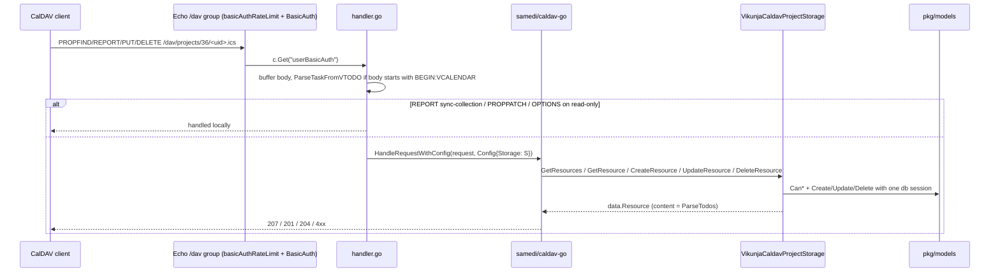

# CalDAV

Vikunja exposes every project (plus the Favorites pseudo project and saved filters) as a CalDAV calendar of VTODOs. Two layers: `pkg/caldav` converts between `models.Task` and iCalendar text, `pkg/routes/caldav` adapts Vikunja to the `github.com/samedi/caldav-go` server library and fills the gaps that library leaves. Mounted from [`pkg/routes/routes.go`](./http-routing-and-middleware.md) outside `/api`.

## Responsibility

- Owns: VTODO serialization/parsing, WebDAV/CalDAV HTTP handling for `/dav/**` and `/.well-known/caldav`, Basic-auth for those paths, RFC 6578 sync-collection, PROPPATCH refusal.
- Does not own: task permissions or persistence (delegates to `models.Task.Can*`/`Create`/`Update`/`Delete`), CalDAV token CRUD (`pkg/user/caldav_token.go`, see [user-package](./user-package.md)), the API-token permission table ([auth-and-sessions](./auth-and-sessions.md)).

## Entry points and public API

| Entry | Where | Called by |
|---|---|---|
| `caldav.ParseTodos(config, todos)` | `pkg/caldav/caldav.go` | `GetCaldavTodosForTasks`, feeds |
| `caldav.GetCaldavTodosForTasks(project, tasks)` | `pkg/caldav/parsing.go` | `VikunjaProjectResourceAdapter.GetContent` |
| `caldav.ParseTaskFromVTODO(content)` → `(*models.Task, ParsedVTODOProperties, error)` | `parsing.go` | `handler.go` → `ProjectHandler`, `CreateResource`, `UpdateResource` |
| `caldav.BasicAuth(c, user, pass)` | `pkg/routes/caldav/auth.go` | `middleware.BasicAuth` on `/dav` and `/.well-known` groups |
| `EntryHandler`, `PrincipalHandler`, `ProjectHandler`, `TaskHandler` | `pkg/routes/caldav/handler.go` | `registerCalDavRoutes` (`routes.go:1068`) and the `/.well-known` group (`routes.go:243-254`) |
| `VikunjaCaldavProjectStorage` (implements `data.Storage`) | `listStorageProvider.go` | `caldav.HandleRequestWithConfig` inside the handlers |
| `handleSyncCollectionReport` | `sync_collection.go` | `ProjectHandler` when method is `REPORT` and body mentions `sync-collection` |
| `handlePropPatch` | `proppatch.go` | `ProjectHandler`, `TaskHandler` on `PROPPATCH` |
| `user.GenerateNewCaldavToken`, `GetCaldavTokens`, `GetCaldavTokensWithSession`, `DeleteCaldavTokenByID` | `pkg/user/caldav_token.go` | v1 `/user/settings/token/caldav*` (`routes.go:606-608`), v2 `pkg/routes/api/v2/caldav_tokens.go`, `auth.go` |

## Key types and functions

### Format layer (`pkg/caldav`)

| Name | Notes |
|---|---|
| `Todo`, `Alarm`, `Relation`, `Config` (`caldav.go`) | Intermediate structs; `Config.ProdID` is `"Vikunja Todo App"`, `X-PUBLISHED-TTL:PT4H` is emitted on every calendar. |
| `ParseTodos` | Emits `UID` (falls back to timestamp + sha256 of the summary), `DTSTAMP`, `SUMMARY`, colour as `X-APPLE-CALENDAR-COLOR`/`X-OUTLOOK-COLOR`/`X-FUNAMBOL-COLOR`/`COLOR` (`getCaldavColor`), `DTSTART`, `DURATION` only when there is no due date, `DTEND`, `DESCRIPTION` as Markdown via `richtext.HTMLToMarkdown`, `COMPLETED`+`STATUS:COMPLETED` keyed on `Done` (not `done_at`: a reopened repeating task keeps `done_at`, commit `f10388931`), `DUE`, `CREATED`, `PRIORITY`, `RRULE`, `CATEGORIES`, `LAST-MODIFIED`, then alarms and relations. `ORGANIZER` is disabled in `GetCaldavTodosForTasks` ("until we figure out how this works"). All text goes through `escapeICalText`, which also strips CR/LF to block property injection (`caldav_test.go:578`). |
| `getRruleFromInterval` | `RepeatAfter` seconds → `WEEKLY`/`DAILY`/`HOURLY`/`MINUTELY`/`SECONDLY` + `INTERVAL`; `TaskRepeatModeMonth` → `FREQ=MONTHLY;BYMONTHDAY=<due day>`. Other repeat modes and inbound `RRULE` are **not** parsed back (no `RRULE` case in `ParseTaskFromVTODO`). |
| `ParseAlarms` | Reminders relative to start → `TRIGGER;RELATED=START`, relative to due **or** end → `RELATED=END`, absolute → `VALUE=DATE-TIME`. Always `ACTION:DISPLAY` with the task summary as description. |
| `ParseRelations` | Only `parenttask` (`RELTYPE=PARENT`) and `subtask` (`RELTYPE=CHILD`) are exported; every other `RelationKind` is skipped. |
| `mapPriorityToCaldav` / `parseVTODOPriority` (`priority.go`) | Vikunja 1..5 → CalDAV 9,5,3,2,1; inbound 1..9 → 5,4,3,3,2,1,1,1,1; 0 stays 0. |
| `ParseTaskFromVTODO` | Uses `github.com/arran4/golang-ical`; finds the VTODO anywhere in the components (not just first, commit `62799c129`). Reads UID, SUMMARY, DESCRIPTION, PRIORITY, DTSTART/DUE/DTEND/DURATION (`DURATION` + `DTSTART` computes the end), COMPLETED/STATUS (COMPLETED alone implies done; explicit STATUS wins), CATEGORIES → `Labels`, colour props → `HexColor`, `RELATED-TO` with `RELTYPE=PARENT|CHILD` → `RelatedTasks`, VALARMs → `Reminders`. Returns `ParsedVTODOProperties` so `UpdateResource` overlays only what the client sent (commit `4c5ec6a4d`). |
| `parseVAlarm` | `RELATED=END` triggers map to `due_date` when the task has one (or has no end date), otherwise `end_date` (commit `f9435bad9`). |
| `caldavTimeToTimestamp` | Handles `YYYYMMDDTHHMMSS`, 8-char dates, `TZID=` parameters (via `time.LoadLocation`), and a trailing `Z` which forces UTC and ignores any `TZID` (commit `b3e9580e2`, issue #3883). Naive stamps are parsed in `config.GetTimeZone()` (commit `d94429d33`); the result is always converted to the server timezone. |

### HTTP layer (`pkg/routes/caldav`)

| Name | Notes |
|---|---|
| Path constants (`listStorageProvider.go:41-51`) | `DavBasePath=/dav`, `ProjectBasePath=/dav/projects`, `PrincipalBasePath=/dav/principals`, `ProjectHomeSetPath=/dav/projects/` |
| `VikunjaCaldavProjectStorage{project, task, user, isPrincipal, isEntry}` | One instance per request (`TestConcurrentRequestsDoNotShareState`). `GetResources` returns the principal link for entry/principal requests, the project list (`project.ReadAll(..., -1, 50)`) for the home set, or one project with its tasks. |
| `getProjectFromParam` (`handler.go`) | Non-integer → 404; `-1` → `FavoritesPseudoProject`; ids below `-1` → saved filter via `GetSavedFilterIDFromProjectID`; otherwise `GetProjectSimpleByID`. Does **no** permission check; the storage methods do. |
| `canReadCollection`, `canWriteCollection`, `checkCollectionWrite`, `collectionContains(All)`, `denyArchived` | Permission glue. Pseudo collections (favorites/filters) can never be written as collections but tasks they aggregate are written in their real project (`TestPseudoCollection_Writes`). Archived projects refuse writes. |
| `CreateResource` | Rejects a PUT whose UID already exists anywhere the user can see with 404 so clients syncing a stale href do not duplicate tasks (commit `137d740bf`, issue #3482), converts the Markdown description to HTML (`applyDescriptionFromMarkdown`, commit `8d10e053d`), then `Create`, `persistLabels`, `persistRelations`. |
| `UpdateResource` | Loads the stored task, overlays only `ParsedVTODOProperties` fields; `Reminders == nil` means "no VALARM, keep stored"; `Labels == nil` means CATEGORIES absent. |
| `persistRelations` | Related UIDs that do not exist yet are created as placeholder tasks titled `DUMMY-UID-<uid>` in the caller's project so `CanCreate` applies; every relation runs `TaskRelation.CanCreate` (commit `03b0a694c`). `removeStaleRelations` only removes subtask relations the VTODO explicitly dropped. |
| `VikunjaProjectResourceAdapter.CalculateEtag` | Task: `"<id>-<updated unix>"`; collection: `"<project id>-<latest task or project update>"`, which also serves as ctag and sync-token. |
| `handleSyncCollectionReport` | Token format `data:,"<projectID>-<unix>"`. Empty token → full listing; token for another project, unparsable, pseudo project, or older than `models.TaskDeleteRetention` (so soft-deleted tasks can still be reported) → `403` with `<D:valid-sync-token/>` to force a resync. Intercepted before caldav-go because that library answers unknown REPORTs with an empty 412, which makes iOS stop syncing (`handler.go:98-104`). |
| `handlePropPatch` | caldav-go has no PROPPATCH case (blanket 501). Vikunja answers `207` with `403 Forbidden` per property after a `CanRead` check; PROPPATCH on the home-set root still falls through to 501 (`handler.go:106-112`). |
| `ProjectHandler` OPTIONS branch | For read-only collections answers `Allow: GET, HEAD, OPTIONS, PROPFIND, REPORT` so clients stop retrying PUT/DELETE; unknown or unreadable projects get 404 to avoid id enumeration. |
| `TaskHandler` | Decodes the task UID from `URL.EscapedPath()` because router decoding is ambiguous (commit `cd82ad4d5`, #3560; `href_encoding_test.go`). |
| `BasicAuth` (`auth.go`) | Order: password with `tk_` prefix → API token with `caldav:access` permission whose owner matches the username; else CalDAV tokens (bcrypt compare over `user_tokens` rows of kind `TokenCaldavAuth`); else the account password, **rejected when TOTP is enabled**. Bots are always rejected. Failures log and return `false, nil`, never an error, to avoid username enumeration (`TestBasicAuthUsernameEnumeration`). |

## Internal structure

Route table (`registerCalDavRoutes`, `routes.go:1068-1082`): `/dav`, `/dav/`, `/dav/principals/*`, `/dav/projects`, `/dav/projects/:project`, `/dav/projects/:project/:task`, each with and without trailing slash, all `Any`. `/.well-known/caldav` is a separate group with the same middlewares. Both groups share `basicAuthRateLimit()` (`pkg/routes/rate_limit.go`) with `/feeds` and `/api/v2/notifications.atom`, and CORS is skipped for paths starting with `/dav` or `/feeds` because CalDAV needs its own OPTIONS answers (`routes.go:285-290`).

## Dependencies

- **Uses:** `github.com/samedi/caldav-go` (server), `github.com/arran4/golang-ical` (parser), `pkg/models` (tasks, projects, saved filters, labels, relations, `TaskDeleteRetention`), `pkg/user` (tokens, credentials, TOTP), `pkg/richtext` (Markdown↔HTML), `pkg/config` (`GetTimeZone`, `service.enablecaldav`), `pkg/utils` (ISO 8601 durations, sha256).
- **Used by:** `pkg/routes/routes.go` only. The frontend only shows the URL (`frontend/src/views/user/settings/Caldav.vue` builds `${apiBase}/dav/principals/${username}/`) and manages tokens; route `/user/settings/caldav` is hidden when `/info` reports `caldav_enabled=false`.

## Invariants and assumptions

- A task's CalDAV identity is `tasks.uid`, not its numeric id; hrefs are `<ProjectBasePath>/<projectID>/<url-escaped uid>.ics` (`taskURL`, `encodeURIPathSegment`). Multiget and single reads verify the UID belongs to the URL's project and is readable by the user (`pkg/webtests/caldav_test.go` "Cross-user task read by UID is rejected").
- Every timestamp on the wire is UTC with `Z` (`makeCalDavTimeFromTimeStamp`); inbound values end up in the server timezone.
- The home set (`/dav/projects/`) and principal are collections but **not** calendars (commits `2822de95e`, `9b9989784`, Apple Calendar fails otherwise; `discovery_test.go:185`).
- The sync-token and ctag derive from `CalculateEtag`; anything that changes a task must bump `tasks.updated` or clients will not see it.
- caldav-go is unaware of permissions; every storage method opens its own `db.NewSession()` and checks `Can*` itself.

## Configuration

| Key (`config.yml`) | Env var | Effect |
|---|---|---|
| `service.enablecaldav` (default `true`) | `VIKUNJA_SERVICE_ENABLECALDAV` | Skips both route groups when false; surfaced as `caldav_enabled` in `/info` (`pkg/routes/api/shared/info.go:104`) |
| `service.timezone` | | Used by `caldavTimeToTimestamp` for naive timestamps and for the returned location |

## Error handling

- Storage methods return caldav-go's `errs.ForbiddenError` / `errs.ResourceNotFoundError`; the library turns them into 403/404. Parse failures in `ProjectHandler` become `models.ErrInvalidData` ("Invalid task"); in `CreateResource`/`UpdateResource` they are logged at error level with the VTODO at debug level.
- `BasicAuth` never returns an error to Echo: any failure is a 401 from `middleware.BasicAuth`, and the reason is only in the log.
- The sync-collection handler uses RFC 6578 §3.6 `403 + <D:valid-sync-token/>` as its universal "resync" signal.
- Missing UID or SUMMARY only warn (`parsing.go:337,342`).

## Tests

| Location | Covers | Run |
|---|---|---|
| `pkg/caldav/*_test.go` | `ParseTodos` output (incl. rich-text descriptions, colour, escaping), `ParseTaskFromVTODO` (~1100 lines of cases), timezone handling with a non-UTC server (`TestCaldavTimeToTimestamp_NonUTCServerTimezone`, `TestParseTaskFromVTODO_UTCAlarmNonUTCServerTimezone`), priority mapping, rrule intervals | `mage test:filter TestParseTaskFromVTODO` |
| `pkg/routes/caldav/*_test.go` | Auth (API token, enumeration timing, credentials), concurrency isolation, description Markdown/HTML, href encoding, subtask create/update, stale-UID PUT, relation authorization, pseudo collections, archived projects, OPTIONS | `mage test:filter TestPseudoCollection_Writes` |
| `pkg/caldavtests/` (protocol suite, full router) | `discovery_test.go` (well-known → principal → home → calendars, non-calendar home set), `propfind_test.go` (depth 0/1, etags), `report_test.go` (calendar-query, calendar-multiget, percent signs), `sync_test.go` (ETag, ctag, `If-Match`/`If-None-Match`), `client_compat_test.go` (DAVx5 flow, Thunderbird flow, Tasks.org child-only `RELATED-TO` and children-before-parent), `vtodo_roundtrip_test.go`, `relations_test.go`, `crud_test.go`, `auth_test.go`, `smoke_test.go`, `bugs_test.go` (issue reproductions expected to fail until fixed; currently `GitHub_Issue_3482_completed_task_duplicated_into_stale_collection`). Helpers: `vtodo_builder.go`, `propfind_bodies.go`, `xml_helpers.go`, `integrations.go` (fixture users). Skipped under `-short`. | `mage test:caldav` (`go test -p 1 -timeout 45m ./pkg/caldavtests`) |
| `pkg/webtests/caldav_test.go` | Import/export VTODO, cross-user and cross-project UID reads, multiget scoping, discovery paths, subtasks across lists, collection properties, calendar-query, TOTP blocks password auth, disabled/locked users | `mage test:filter TestCaldav` |

Not covered: real client binaries; only recorded request sequences.

## Gotchas and tech debt

- FIXMEs: `listStorageProvider.go:537` (`GetShallowResource` loads all tasks instead of just the project) and `listStorageProvider.go:932` (`removeStaleRelations` does a full `ReadOne` to get `RelatedTasks`).
- Hotspot: `pkg/routes/caldav/listStorageProvider.go` has 64 commits, 30 of them `fix:` (git log on 2026-09-16); most recent ones are about permissions, pseudo collections, and stale hrefs. Read the tests before touching it.
- caldav-go gaps patched in `handler.go`: sync-collection REPORT, PROPPATCH, OPTIONS advertising PUT/DELETE on read-only collections, double-slash principal hrefs (`caldavConfig` trims the path). The home-set root PROPPATCH still returns 501.
- `RRULE` is write-only; inbound recurrence from clients is dropped silently.
- Only parent/child relations cross the wire; other relation kinds survive on the Vikunja side because `removeStaleRelations` only touches what the VTODO can express.
- Descriptions round-trip through Markdown; formatting TipTap emits that Markdown cannot express is lost on a client edit.
- Placeholder tasks `DUMMY-UID-<uid>` are real tasks; a client that references a UID it never uploads leaves them behind.
- `GetResources` for the home set calls `project.ReadAll(s, user, "", -1, 50)`; `getLimitFromPageIndex` (`pkg/models/models.go:94`) returns no limit for `page < 1`, so all projects are listed.
- Client quirks documented in tests/comments: iOS stops syncing on 412 for unknown REPORT; Apple Calendar requires a non-calendar home set (#3884); Tasks.org sends `RELATED-TO;RELTYPE=PARENT` only from the child; DAVx5 updates parents without repeating `RELATED-TO`; Thunderbird checks `current-user-privilege-set` before writing; Apple/DAVx5/Thunderbird rely on `getctag`.

## Related pages

- [http-routing-and-middleware](./http-routing-and-middleware.md) (rate limits, CORS exemption), [auth-and-sessions](./auth-and-sessions.md) (API token `caldav:access`), [user-package](./user-package.md) (token kinds)
- [models-tasks](./models-tasks.md) (repeat modes, reminders, relations, soft-delete retention), [models-filtering-and-search](./models-filtering-and-search.md) (saved filters as pseudo projects)
- [operations-subsystems](./operations-subsystems.md#richtext) for the Markdown conversion
- [11 Testing guide](../../11-testing-guide.md)
