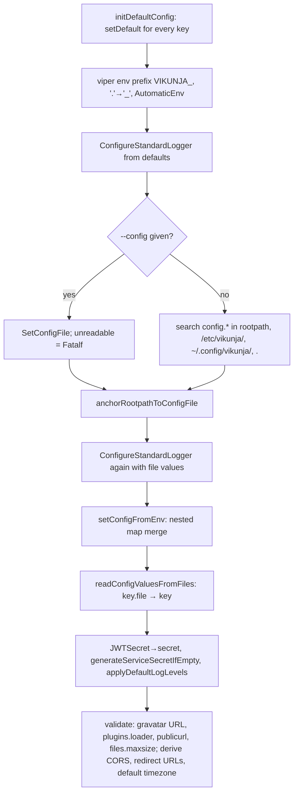

# Config, logging, and Sentry

`pkg/config` turns defaults, a config file, `VIKUNJA_*` environment variables, and `<key>.file` indirections into one Viper store read through typed `Key` constants. `pkg/log` wraps `log/slog` with one global logger plus component loggers, and `pkg/errorreport` gives Sentry stable grouping keys. Context: [Backend architecture](../../03-backend-architecture.md#configuration).

## Responsibility

- **Owns:** the `Key` catalogue and defaults, config search and merge order, derived values (`publicurl` normalisation, CORS origin append, migration redirect URLs, per-component log levels), secret generation, max upload size, timezone; logger construction and the `log.*` helpers; Sentry fingerprints; the Sentry middleware and init.
- **Does not own:** documentation of keys (`config-raw.json` → `config.yml.sample`), operational validation beyond startup fatals (`pkg/doctor`, see [operations-subsystems](./operations-subsystems.md)), audit logging (`pkg/audit`), the request logger middleware itself (`pkg/routes/routes.go`, see [http-routing-and-middleware](./http-routing-and-middleware.md)).

## Entry points and public API

| Entry | Where | Called by |
|---|---|---|
| `config.InitConfig()` | `pkg/config/config.go` | `initialize.LightInit`, `doctor` PreRun, `db.CreateDBEngine` (if type empty), `db.CreateTestEngine` with `VIKUNJA_TESTS_USE_CONFIG=1` |
| `config.InitDefaultConfig()`, `ResetForTests()` | `pkg/config/config.go` | every backend `TestMain`; tests that mutate keys |
| `config.SetConfigFile(path)` | `pkg/config/config.go` | `pkg/cmd/cmd.go` `cobra.OnInitialize` for `--config` |
| `Key.GetString/GetBool/GetInt/GetInt64/GetDuration/GetStringSlice/Get/Set` | `pkg/config/config.go` | everywhere |
| `config.GetTimeZone()`, `ResolvePath(p)`, `GetMaxFileSizeInMBytes()`, `SetMaxFileSizeMBytesFromString` | `pkg/config/config.go` | `pkg/db`, `pkg/files`, body-limit middleware |
| `log.InitLogger()`, `ConfigureStandardLogger(...)` | `pkg/log/logging.go` | `initialize.LightInit`, `InitConfig` (twice) |
| `log.Debug[f]/Info[f]/Warning[f]/Error[f]/Critical[f]/Fatal[f]` | `pkg/log/logging.go` | everywhere |
| `NewXormLogger`, `NewEchoLogger`, `NewHTTPLogger`, `NewWatermillLogger`, `NewMailLogger` | `pkg/log/*.go` | `pkg/db`, `pkg/migration`, `pkg/routes/routes.go`, `pkg/events`, `pkg/mail` |
| `errorreport.Apply`, `ApplyFingerprint`, `Fingerprint`, `Normalize` | `pkg/errorreport/fingerprint.go` | `pkg/routes/error_handler.go`, `pkg/events/events.go` (poison queue), `pkg/modules/migration/handler/listeners.go` |
| `routes.SentryMiddleware`, `GetSentryHubFromContext/Request` | `pkg/routes/sentry_middleware.go` | `routes.setupSentry`, `reportToSentry` |

## Key types and functions

### `Key` and the catalogue (`pkg/config/config.go`)

`type Key string`; each constant is the dotted Viper path (`ServiceSecret Key = "service.secret"`). Getters are thin wrappers over `viper.Get*`. The most consequential keys:

| Section | Keys (defaults) | Notes |
|---|---|---|
| `service.*` | `secret` (generated), `JWTSecret` (deprecated alias), `jwtttl` 259200 / `jwtttllong` 2592000 / `jwtttlshort` 600, `interface` `:3456`, `unixsocket`, `unixsocketmode`, `publicurl` (required when `cors.enable`), `rootpath` (cwd), `timezone` `GMT`, `maxitemsperpage` 50, `enableregistration`, `enablelinksharing`, `enablecaldav`, `enabletotp`, `enabletaskattachments`, `enabletaskcomments`, `enableemailreminders`, `enableuserdeletion`, `enablepublicteams`, `demomode`, `motd`, `testingtoken`, `bcryptrounds` 11, `maxavatarsize` 1024, `customlogourl[dark]`, `ipextractionmethod` `direct`, `trustedproxies` | `publicurl` gets a trailing `/` and must be `http(s)://`; its host is appended to `cors.origins` |
| `database.*` | `type` `sqlite`, `path` `<rootpath>/vikunja.db`, `host` `localhost`, `user` `vikunja`, `password`, `database` `vikunja`, `schema` `public`, `sslmode` `disable`, `sslcert/sslkey/sslrootcert`, `tls` `false`, `maxopenconnections` 100, `maxidleconnections` 50, `maxconnectionlifetime` 1800000 | see [db-and-migrations](./db-and-migrations.md#configuration) |
| `log.*` | `enabled` true, `standard` `stdout`, `level` `INFO`, `format` `text`, `path` `<rootpath>/logs`, `database` `off`, `http` `stdout`, `events` `off`, `mail` `off`, `databaselevel/httplevel/eventslevel/maillevel` (inherit `log.level`) | outputs: `stdout`, `stderr`, `file`, `off` |
| `mailer.*` | `enabled` false, `host`, `port` 587, `username`, `password`, `authtype` `plain`, `fromemail` `mail@vikunja`, `skiptlsverify`, `forcessl`, `queuelength` 100, `queuetimeout` 30 | see [notifications-and-mail](./notifications-and-mail.md) |
| `auth.*` | `local.enabled` true, `openid.enabled` false, `openid.providers` (map), `ldap.enabled` false, `ldap.host/port/basedn/userfilter/binddn/bindpassword/usetls/verifytls`, `ldap.groupsync*`, `ldap.attribute.username/email/displayname/memberid` | `auth.openid.providers` is exempt from `.file` indirection |
| `ratelimit.*` | `enabled` false, `kind` `user`, `limit` 100, `period` 60, `store` `memory` (`keyvalue` resolves to `keyvalue.type`), `noauthlimit` 10, `tokenrefreshlimit` 60, `basicauthlimit` 10 | |
| `files.*` | `basepath` `files`, `maxsize` `20MB`, `type` `local`, `s3.endpoint/bucket/region/accesskey/secretkey/usepathstyle/disablesigning/tempdir` | `maxsize` parsed by `datasize`; invalid is fatal |
| `metrics.*` | `enabled` false, `username`, `password`, `pprof` false | |
| `sentry.*` | `enabled` (unset → false), `dsn` (Vikunja's public DSN), `frontendenabled` (unset → false), `frontenddsn` | see Sentry below |
| `webhooks.*` | `enabled` true, `timeoutseconds` 30, `proxyurl`, `proxypassword`, `allownonroutableips` false | the last three are deprecated aliases copied into `outgoingrequests.*` with a warning |
| `audit.*` | `enabled` false, `logfile` (empty → `<log.path>/audit.log`), `rotation.maxsizemb` 100, `rotation.maxage` 30 | |
| `plugins.*` | `enabled` false, `dir` `<rootpath>/plugins`, `loader` `native` (`yaegi` or `native`, else fatal) | see [plugins](./plugins.md) |
| `license.*` | `key` "" | read `pkg/license/license.go` package comment before touching; see [License system](../../../docs/license.md) |
| others | `cors.*`, `redis.*`, `keyvalue.type`, `avatar.*`, `backgrounds.*`, `migration.*` (importer OAuth + `claimtimeout` `5m`, `maxcsvrows`, `vikunjafile.*` limits), `defaultsettings.*`, `outgoingrequests.*`, `autotls.*`, `legal.*` | |

### Loading order (`InitConfig`)

- `anchorRootpathToConfigFile`: with `--config`, a `service.rootpath` absent from the file defaults to the config file's directory, a relative one is joined to it, and `database.path` is re-derived, so a pinned install does not scatter data into the caller's cwd.
- `setConfigFromEnv` re-reads `os.Environ()` and splits `VIKUNJA_A_B_C` on `_` into a nested map merged with `viper.MergeConfigMap`. This is what makes map-valued keys like `VIKUNJA_AUTH_OPENID_PROVIDERS_DEX_CLIENTID` work; `AutomaticEnv` alone only resolves keys Viper already knows. Key segments are lower-cased, so keys with underscores in their own name (`defaultsettings.avatar_provider`) cannot be set this way. Unverified: whether any deployment relies on that.
- `readConfigValuesFromFiles` walks `viper.AllKeys()` and, for any `<key>.file` (env expanded, resolved against rootpath), reads the file and `Set`s `<key>`; a missing file is fatal. `auth.openid.providers*` is skipped.
- `generateServiceSecretIfEmpty` generates 32 random bytes as hex when `service.secret` is empty. Because it is a per-process value, **every restart without a configured secret invalidates all issued JWTs**; `service.secret` deliberately has no default so the `service.JWTSecret` deprecation can tell "unset" from "set". `pkg/doctor/config.go` → `checkJWTSecret` reports a 64-char secret as "auto-generated".
- `GetTimeZone()` caches the `*time.Location` for `service.timezone`; invalid is fatal. `time/tzdata` is embedded, so containers without tzdata still work.
- `SetMaxFileSizeMBytesFromString` / `GetMaxFileSizeInMBytes` (falls back to 20) feed the Echo body limit and attachment checks.
- `InitDefaultConfig()` = defaults + secret generation, for tests and callers that skip `InitConfig`; `ResetForTests()` does `viper.Reset()` first because a value set with `Set` sits at override level and would outrank a later `InitConfig`.

### `config-raw.json` and the sample

`config-raw.json` is a tree of `{key, default_value, comment, children}` (227 `key` entries) and is the documentation source. `mage generate:config-yaml <commented>` (`magefile.go` → `Generate.ConfigYAML` → `generateConfigYAMLFromJSON`) renders `config.yml.sample`, which is gitignored and never committed. Defaults in `initDefaultConfig` and `config-raw.json` are maintained by hand in both places.

### Logging (`pkg/log`)

- `InitLogger()` installs a text handler on stdout at INFO so logging works before config exists; `ConfigureStandardLogger(enabled, output, path, level, format)` replaces it once config is known (called twice during `InitConfig`).
- `makeLogHandler` maps level strings (`CRITICAL|ERROR` → Error, `WARNING` → Warn, `NOTICE|INFO` → Info, `DEBUG` → Debug, unknown → Info), format `text` or `structured` (JSON; anything else is fatal), output `stdout`/`stderr`/`file` (`<log.path>/<component>.log`, 0600, dir 0744) or `off`/disabled → `io.Discard`.
- Component loggers each carry `component=<name>`: `NewXormLogger` (`database`, checks the level before formatting because xorm formats every statement; `ShowSQL` defaults true and is gated by the level), `NewEchoLogger` and `NewHTTPLogger` (`http`), `NewWatermillLogger` (`events`; `Trace` maps to Debug), `NewMailLogger` (`mail`). `NoopBackend` in `noop.go` is a slog-shaped no-op.
- `log.Critical[f]` logs at Error and **returns**; `log.Fatal[f]` logs at Error and `os.Exit(1)`. Several CLI paths use `Critical` where exit is expected (see [cli-commands](./cli-commands.md#exit-codes)).
- Never log secrets or event payloads; the poison-queue logger in `pkg/events/events.go` only logs metadata.

### Sentry

- `pkg/routes/routes.go` → `setupSentry(e)` (called from `NewEcho`): when `sentry.enabled`, `sentry.Init` with `sentry.dsn`, `AttachStacktrace`, `Release: version.Version`, then `e.Use(SentryMiddleware{Repanic: true})`. `sentry.Flush` is deferred inside `setupSentry`, so it runs at setup time, not at shutdown (Unverified: whether events are lost on exit).
- `SentryMiddleware` clones the current hub per request, sets the request on the scope with body stripped, stores the hub in the request context (`sentryHubKey`), and re-panics after `RecoverWithContext` so Echo's `Recover` still produces the 500.
- `pkg/routes/error_handler.go` → `CreateHTTPErrorHandler` calls `reportToSentry(originalErr, c)` for `code >= 500`, using the request hub when present and `errorreport.Apply` for grouping.
- `pkg/errorreport/fingerprint.go`: every report goes through one of three call sites, so Sentry's stack-based grouping would merge unrelated errors. `Fingerprint(err)` therefore groups by what the error *is*: `panic` + inner parts for `middleware.PanicStackError`; `["vikunja", <code>]` for `web.HTTPErrorProcessor`; `["postgres", code, msg]`, `["mysql", number, msg]`, `["sqlite", code, extended, msg]`, `["echo", status, msg]`; else `[innermost %T, Normalize(msg)]`, or `{{ default }}` when nothing usable remains. `Normalize` replaces URLs, emails, UUIDs, 16+ hex runs, quoted literals, paths and numbers with `?`, collapses whitespace, lower-cases, and caps at 120 runes so no user data lands in grouping keys. `ApplyFingerprint` also tags `error.type`.
- Frontend DSN injection: `pkg/routes/static.go` → `serveIndexFile` templates `window.SENTRY_ENABLED` from `sentry.frontendenabled` and `window.SENTRY_DSN` from `sentry.frontenddsn` into `index.html` (see [realtime-and-pwa](../frontend/realtime-and-pwa.md)).

## Internal structure

Config precedence, highest first: `Key.Set` (override level, used by derivations and deprecations) → `setConfigFromEnv` merge and `AutomaticEnv` → config file → `setDefault`. `<key>.file` values are applied with `Set`, so they beat everything.

## Dependencies

- **Uses:** `spf13/viper`, `c2h5oh/datasize`, `log/slog`, `getsentry/sentry-go`, driver error types (`lib/pq`, `go-sql-driver/mysql`, `go-sqlite3`) for fingerprints, `pkg/web` for `HTTPErrorProcessor`.
- **Used by:** every package (`config`, `log`); `pkg/routes` and `pkg/events` (`errorreport`); `pkg/doctor` reads config for its checks.

## Invariants and assumptions

- `config.InitConfig()` must run before any `Key.Get*` that matters; `db.CreateDBEngine` guards the common miss by checking `database.type == ""`. Tests use `InitDefaultConfig()` instead and `ResetForTests()` when they `Set` keys (`pkg/config/config_test.go`).
- `service.secret` must have **no default** (comment on `generateServiceSecretIfEmpty`); adding one breaks the `JWTSecret` migration and the doctor heuristic.
- `applyDefaultLogLevels` runs after env/file merge so `log.<component>level` inherits `log.level` only when unset (`TestLogLevelDefaults`).
- `pkg/log` must stay import-free of the rest of the backend (it is imported by `pkg/config`).
- `errorreport.Normalize` must strip identifiers before anything reaches Sentry; tests in `fingerprint_test.go` pin the placeholders.

## Configuration

Covered by the tables above. Environment form is always `VIKUNJA_` + key upper-cased with `.` → `_`, e.g. `VIKUNJA_LOG_DATABASE=stdout VIKUNJA_LOG_DATABASELEVEL=DEBUG` for SQL logging. Any key can be `<key>.file: /run/secrets/x`.

## Error handling

Startup fatals (`log.Fatalf`, exit 1): unreadable `--config`, `service.publicurl` missing while `cors.enable` (default true), `publicurl` without `http(s)://`, invalid `avatar.gravatarbaseurl`, invalid `plugins.loader`, unparsable `files.maxsize`, invalid timezone (`GetTimeZone`, and `LightInit` logs Critical for `service.timezone`), unreadable `<key>.file`, invalid `log.format`, log file not creatable. Non-fatal: config file present but unparsable (warns and uses defaults), env merge failure (warns), deprecated keys (warns). Sentry init failure is `Criticalf` and the server continues without it.

## Tests

- `pkg/config/config_test.go`: `TestServiceSecret` (jwtsecret migration from file and env, precedence, generation), `TestLogLevelDefaults`, `TestGetRootpathLocation`, `TestResolvePath`. Run `mage test:filter TestServiceSecret`.
- `pkg/log/logging_test.go`: `TestConfigureStandardLoggerWithPath`, `TestMakeLogHandlerCreatesCorrectLogFile`, `TestConfigureStandardLoggerSetsPathBeforeHandler`.
- `pkg/errorreport/fingerprint_test.go` (207 lines) covers `Normalize` and each driver branch.
- `pkg/doctor/*_test.go` cover database/files/output; the config group (`CheckConfig`: config file, root path, public URL, JWT secret, CORS origins) has no dedicated test.
- Not covered: `setConfigFromEnv` nesting, `readConfigValuesFromFiles`, `anchorRootpathToConfigFile`, `SentryMiddleware`.

## How to add a config key

1. Add a `Key` constant in the matching block of `pkg/config/config.go` and a `setDefault` in `initDefaultConfig` (omit the default only if "unset" must be distinguishable, as for `service.secret`).
2. Add the same key with `default_value` and `comment` to `config-raw.json`; run `mage generate:config-yaml false` locally to check the rendering, do not commit `config.yml.sample`.
3. If the value is a secret, nothing extra: `<key>.file` works automatically. If it is a map or list, check `setConfigFromEnv` produces the shape you expect from `VIKUNJA_*`.
4. If it changes runtime behaviour operators must see, add a check in `pkg/doctor` (`config.go` for config-shaped checks, `services.go` for connectivity) and, if the frontend needs it, expose it through `/api/v1/info` (see [api-v1](./api-v1.md)).
5. Add a `t.Run` in `config_test.go` when the key has derivation logic; use `ResetForTests()` in cleanup.

## Gotchas and tech debt

- A `--config` path is applied in `cobra.OnInitialize`, not `PersistentPreRun`, because subcommands define their own `PreRun` and would shadow it (`pkg/cmd/cmd.go`).
- `InitConfig` configures the standard logger before the file is read, so the first lines (including "Using config file") use default settings.
- `migration.initMigration` builds its xorm logger from `log.events*`, not `log.database*` (`pkg/migration/migration.go:72`).
- Default `sentry.dsn` and `sentry.frontenddsn` point at Vikunja's own project; enabling Sentry without your own DSN sends reports upstream.
- `webhooks.proxyurl/proxypassword/allownonroutableips` are still read and copied to `outgoingrequests.*` in `initDefaultConfig`; removal is a one-place change flagged in the comment there.
- `setupSentry` defers `sentry.Flush` inside its own frame; there is no flush on shutdown in `pkg/cmd/web.go`.
- No TODO/FIXME comments exist in `pkg/config`, `pkg/log`, `pkg/errorreport`, or `pkg/routes/sentry_middleware.go` as of this writing.

## Related pages

- [cli-commands](./cli-commands.md) (which init level loads config where), [http-routing-and-middleware](./http-routing-and-middleware.md), [operations-subsystems](./operations-subsystems.md) (doctor, metrics, audit), [events-and-listeners](./events-and-listeners.md) (poison-queue reporting), [db-and-migrations](./db-and-migrations.md)
- [03 Backend architecture](../../03-backend-architecture.md#configuration), [07 Development workflow](../../07-development-workflow.md#configuration-for-local-runs), [08 Conventions](../../08-conventions.md#if-you-change-x-you-must-also-change-y), [12 Debugging](../../12-debugging.md)
