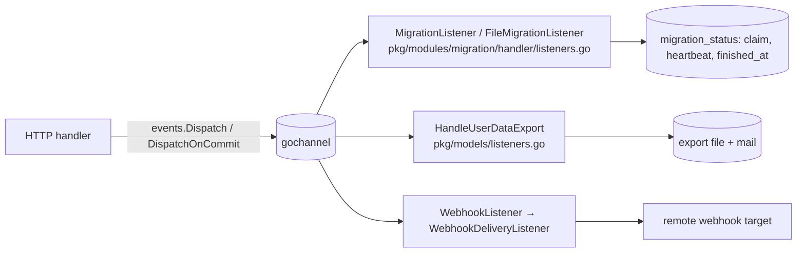

# Cron and background jobs

Everything that runs outside an HTTP request: the robfig/cron scheduler in `pkg/cron`, the thirteen `Register*Cron` jobs (plus one startup-only cleanup) wired in `pkg/initialize/init.go` → `FullInit`, and the "event plus listener" pattern that carries long work (imports, exports, webhook deliveries) off the request goroutine. There is no job queue, no persistence and no cross-instance coordination; this page is explicit about what that means. Context: [Backend architecture → Concurrency model](../../03-backend-architecture.md#concurrency-model); bus internals in [events-and-listeners](./events-and-listeners.md).

## Responsibility

- **Owns:** `pkg/cron/cron.go` (40 lines: `Init`, `Schedule`, `Stop`), the list of scheduled jobs, and the conventions for background work.
- **Does not own:** the event bus (`pkg/events`), notification delivery (`pkg/notifications`, `pkg/mail`), import logic (`pkg/modules/migration/**`), metrics registration (`pkg/metrics`).

## Entry points and public API

| Entry | Where | Called by |
|---|---|---|
| `cron.Init()` (`c = cron.New(); c.Start()`) | `pkg/cron/cron.go` | `FullInit` before any `Register*Cron` |
| `cron.Schedule(spec string, f func()) error` (wraps `c.AddFunc`) | `pkg/cron/cron.go` | every `Register*Cron` |
| `cron.Stop()` | `pkg/cron/cron.go` | `pkg/cmd/web.go:198` on graceful shutdown (after `server.Shutdown`) |
| `Register*Cron()` (13 calls, plus the one-shot `openid.CleanupSavedOpenIDProviders()`) | see table | `pkg/initialize/init.go:139-152` |
| `events.Dispatch`, listeners | `pkg/events`, `pkg/models/listeners.go`, `pkg/modules/migration/handler/listeners.go` | HTTP handlers that hand work off |

That is the whole scheduler API. `cron.New()` is called with no options, so the standard 5-field spec applies (no seconds), each firing runs in its own goroutine, and there is no built-in overlap protection. Unverified: robfig/cron v3 without `cron.WithChain(cron.Recover(...))` does not recover panics, so a panicking job would crash the process; no job in the table below is wrapped.

## The job list

All jobs open `db.NewSession()` themselves. "On failure" describes the body; registration failure is either `log.Errorf` (job silently missing) or `log.Fatalf` (process exits) as noted.

| Schedule | Function | Where | What it does | On failure |
|---|---|---|---|---|
| `* * * * *` | `RegisterReminderCron` | `pkg/models/task_reminder.go:367` | Skipped entirely unless (`service.enableemailreminders` and `mailer.enabled`) or `webhooks.enabled`. `getTasksWithRemindersDueAndTheirUsers(now)` for the next minute; `Notify(ReminderDueNotification)` per user with `EmailRemindersEnabled`; `Dispatch(TaskReminderFiredEvent)` when webhooks are on | Query or notify error: `log.Errorf`, return without commit (rows rolled back, no retry, reminders for that minute lost). Register: `Fatalf` |
| `* * * * *` | `RegisterOverdueReminderCron` | `pkg/models/task_overdue_reminder.go:136` | Same gate. `getUndoneOverdueTasks` picks users whose `overdue_tasks_reminders_time` (in their timezone) falls in this minute, sends one `UndoneTaskOverdueNotification` or a batched `UndoneTasksOverdueNotification`, dispatches `task.overdue` per task and `tasks.overdue` per user | Same as above; a notify error aborts the loop for all remaining users. Register: `Fatalf` |
| `0 * * * *` | `RegisterUserDeletionCron` | `pkg/models/user_delete.go:37` | `deleteUsers`: users with `deletion_scheduled_at < now`; `DeleteUser` each in its own transaction | Per-user `log.Errorf` + rollback, continues. Register: `Errorf` |
| `0 * * * *` | `RegisterTaskCleanupCron` | `pkg/models/task_delete_cron.go:36` | `deleteExpiredTasks(now)`: hard-deletes tasks soft-deleted more than `TaskDeleteRetention` (30 d) ago | `log.Errorf`, return. Register: `Errorf` |
| `0 * * * *` | `RegisterOldExportCleanupCron` | `pkg/models/export.go:469` | Deletes export files older than 7 days referenced by `users.export_file_id` | `log.Errorf`. Register: `Fatalf` |
| `0 * * * *` | `migration.RegisterImportUploadCleanupCron` | `pkg/modules/migration/import_upload.go:168` | `cleanupImportUploads`: removes upload files of imports that never ran (no `active_user_id`) or whose heartbeat is older than `migration.claimtimeout` | `log.Errorf`. Register: `Fatalf` |
| `* * * * *` | `RegisterAddTaskToFilterViewCron` | `pkg/models/saved_filters.go:629` | For saved filters with a date clause and a manual kanban view: re-evaluate the filter as its owner, insert missing `task_buckets`/`task_positions`, drop stale ones; skips filters whose owner is inactive | Per-filter `log.Errorf` and `continue`. Register: `Fatalf` |
| `0 * * * *` | `user.RegisterTokenCleanupCron` | `pkg/user/token.go:154` | `CleanupOldTokens`: expired password-reset/confirm tokens | `log.Errorf`. Register: `Fatalf` |
| `0 * * * *` | `RegisterSessionCleanupCron` | `pkg/models/sessions.go:225` | Deletes sessions whose `last_active` is older than `service.jwtttl` (short) or `service.jwtttllong` (long) | `log.Errorf`. Register: `Fatalf` |
| `0 * * * *` | `user.RegisterDeletionNotificationCron` | `pkg/user/delete.go:33` | `notifyUsersScheduledForDeletion`: mails reminder 3/2/1 (`AccountDeletionNotification`), at most one per 24 h, stamping `deletion_last_reminder_sent` in the same transaction | Per-user `log.Errorf`. Register: `Errorf` |
| startup only | `openid.CleanupSavedOpenIDProviders` | `pkg/modules/auth/openid/providers.go:427` | Not a cron: clears cached provider entries from keyvalue once | – |
| `* * * * *` | `openid.RegisterEmptyOpenIDTeamCleanupCron` | `pkg/modules/auth/openid/cron.go:59` | `RemoveEmptySSOTeams`: deletes teams with an `external_id` and no members | `log.Errorf`. Register: `Fatalf` |
| `* * * * *` | `openid.RegisterProviderAvailabilityCron` | `pkg/modules/auth/openid/status.go:217` | `retryUnavailableProviders`: re-discovers OIDC providers that were unreachable at boot, with capped exponential backoff and jitter tracked in `providerRetryState` | `log.Errorf`. Register: `Fatalf` |
| `0 * * * *` | `RegisterAPITokenExpiryCheckCron` | `pkg/models/api_tokens_expiry_cron.go:40` | Only when `mailer.enabled`. `checkForExpiringAPITokensAt(now)`: tokens expiring within 7 d get `APITokenExpiringWeekNotification`, within 24 h `APITokenExpiringDayNotification`, deduped by `(name, token id)` | Per-token `log.Errorf`, continues. Register: `Fatalf` |

Timezone: reminder crons use `config.GetTimeZone()` and per-user `Timezone`; the claim-timeout comparisons in `pkg/modules/migration` bind the time in the configured zone on purpose (comment in `import_upload.go:147`).

## Background work triggered by HTTP

There is no job table. A request that must return before the work is done dispatches an event and a listener does the work on the bus goroutine.

| Work | Trigger | Listener | Retry | Progress visible to the user |
|---|---|---|---|---|
| Service import (Todoist, Trello, …) | `handler.StartMigration` claims a `migration_status` row (`migration.ClaimMigration`), checks credentials, `events.Dispatch(MigrationRequestedEvent{MigrationStatusID})`; a dispatch failure releases the claim | `MigrationListener` → `runMigration` with `migration.StartRun` heartbeat; stale events (`finished_at` set) are skipped | None: `Handle` returns `nil` after `reportMigrationFailure` (user mail + `FailMigration`, Sentry only for non-4xx causes via `shouldReportMigrationError`) | `migration_status` polled by `stores/migration.ts` |
| File import (CSV, Vikunja, TickTick, …) | `handler_file.go` stores the upload as a `files.File`, dispatches `FileMigrationRequestedEvent` | `FileMigrationListener`, then `RemoveImportUpload` in a `defer` | None (a retry would re-apply a partial import) | same |
| User data export | `pkg/routes/api/v1/user_export.go`, `v2/user_export.go` → `DispatchOnCommit(UserDataExportRequestedEvent)` | `HandleUserDataExport` → `ExportUserData` → `DataExportReadyNotification` mail | Watermill retry (5×) then poison; a retry re-runs the whole export | `users.export_file_id`, export status endpoint |
| Webhook delivery | any registered event | `WebhookListener` fans out one `WebhookDeliveryEvent` per webhook; `WebhookDeliveryListener` POSTs | Per delivery: Watermill retry then poison, `skip_error_reporting` set so Sentry stays quiet | none (log only) |

## Retry semantics

| Path | Retries | Backoff | After the last failure |
|---|---|---|---|
| Event listener (`InitEvents`) | 5 | exponential from 100 ms, ×2, random factor 1, max 1 h | message published to the in-memory `poison` topic, logged at ERROR, Sentry unless `MetadataSkipErrorReporting`; then discarded |
| Event listener in `InitEventsForTesting` | 3 | 50 ms → 1 s | error is logged by Watermill; no poison queue |
| Listener that returns `nil` after handling its own error (migration listeners, `WebhookListener` fan-out) | 0 | – | whatever the listener did (status row, mail, log) |
| Cron job | 0 | – | next scheduled tick; the failed tick is not replayed |
| Mail daemon | 0 | – | `log.Errorf`, message dropped (`pkg/mail/mail.go`) |

## Idempotency per job

- **Reminders / overdue:** not idempotent by themselves; correctness relies on the one-minute window in `getTasksWithRemindersDueAndTheirUsers`/`getUndoneOverdueTasks`. Two instances running the cron send duplicates; a restart in the window loses that minute.
- **API token expiry, deletion reminders:** idempotent via `GetNotificationsForNameAndUser` / `deletion_last_reminder_sent`.
- **Cleanups (tasks, sessions, tokens, exports, uploads, SSO teams):** idempotent deletes; safe to run anywhere, any number of times.
- **Saved-filter kanban cron:** idempotent by design (`bulkInsertTaskPositions(..., false)` skips existing keys; comment at `saved_filters.go:622`).
- **Imports:** guarded by the claim row (`active_user_id`, heartbeat, `finished_at`); a re-delivered event for a finished status is a no-op, a stale claim is released by `releaseStaleClaims` after `migration.claimtimeout`.
- **Export:** not idempotent; a Watermill retry regenerates the file and sends a second mail.
- **Webhook delivery:** the payload is built once and replayed verbatim on retry (`WebhookDeliveryEvent.Payload`), so the target sees identical bodies; there is no delivery id for the receiver to dedupe on.

## Observability

- **Logs:** every job logs its own failures with a `[... Cron]` prefix via `log.Errorf`; successes are `log.Debugf`. Watermill logs through `log.NewWatermillLogger` only when `log.events` is not `off`.
- **Sentry:** `pkg/log` has no Sentry hook, so `log.Errorf` from a cron never reaches Sentry. Only two background paths report: the poison logger (`pkg/events/events.go`) and `reportMigrationFailure` (`pkg/modules/migration/handler/listeners.go`).
- **Prometheus (`metrics.enabled`, `/api/v1/metrics`):** `pkg/metrics/metrics.go` exposes `vikunja_{project,user,task,team,files,attachments}_count` (DB counts cached 30 s in keyvalue), `vikunja_active_users`, `vikunja_active_link_shares`, DB pool metrics (`db.RegisterConnectionPoolMetrics`), Go and process collectors, and Watermill's router metrics (`metrics.NewPrometheusMetricsBuilder(...).AddPrometheusRouterMetrics(router)`; handler execution counters/histograms keyed by handler name, Unverified: exact metric names).
- **What does not exist:** a durable queue, dead-letter storage or replay, per-job success/failure/duration metrics, "last run" timestamps, an admin view of jobs, distributed locks, leader election, or any cross-instance delivery. With N API instances every cron runs N times and every event is handled only on the instance that published it. The `/health` endpoint does not reflect cron or bus state.

## Dependencies

- **Uses:** `github.com/robfig/cron/v3`, `pkg/db`, `pkg/events`, `pkg/notifications`, `pkg/config`, `pkg/log`.
- **Used by:** `pkg/initialize` (registration), `pkg/cmd/web.go` (`Stop`). Nothing else imports `pkg/cron`.

## Invariants and assumptions

- `cron.Init()` must run before any `Schedule`; `Schedule` on a nil `c` panics. `FullInitWithoutAsync` deliberately skips crons for CLI commands.
- Jobs create and close their own sessions and never receive one; a job that forgets `Commit()` (the pattern is `defer s.Close()` plus explicit `Commit`) silently rolls back.
- Feature gates are evaluated at registration time (`RegisterReminderCron`, `RegisterAPITokenExpiryCheckCron`); changing `mailer.enabled` needs a restart.
- Cron-dispatched events carry no request metadata, so audit entries and webhooks from them have `SourceSystem` and a `User` field rather than `Doer`.

## Configuration

| Key (`config.yml`) | Effect |
|---|---|
| `service.enableemailreminders`, `mailer.enabled`, `webhooks.enabled` | Whether reminder/overdue/expiry crons are registered at all |
| `service.timezone` | Zone for reminder comparisons and claim timeouts |
| `service.jwtttl`, `service.jwtttllong` | Session cleanup cutoffs |
| `migration.claimtimeout` | Stale-claim and stale-upload threshold |
| `metrics.enabled`, `log.events`, `sentry.enabled` | Observability switches above |

## Error handling

See Retry semantics and Observability. Domain errors are not translated anywhere here: a cron error is a log line, a listener error is a retry.

## Tests

- Call the extracted body with a fixed `now`: `deleteExpiredTasks(now)` (`pkg/models/task_delete_cron_test.go`), `checkForExpiringAPITokensAt(now)` (`pkg/models/api_tokens_expiry_cron_test.go`, with `notifications.Fake()` + `t.Cleanup(notifications.Unfake)`), `getTasksWithRemindersDueAndTheirUsers` (`task_reminder_test.go`), `getUndoneOverdueTasks` (`task_overdue_reminder_test.go`), `CleanupOldTokens` (`pkg/user/user_test.go`). Jobs whose body is an inline closure (`RegisterSessionCleanupCron`, `RegisterOldExportCleanupCron`, `RegisterAddTaskToFilterViewCron`, `RegisterEmptyOpenIDTeamCleanupCron`) have no direct unit test; extract the closure into a `func(now time.Time)` before adding one. `retryUnavailableProviders` is covered by `TestRetryUnavailableProvidersBackoff` (`pkg/modules/auth/openid/status_test.go`); `deleteUsers` and `notifyUsersScheduledForDeletion` have no test either.
- Listeners: `events.TestListener(t, event, listener)` with `events.Fake()` active; migration listeners in `pkg/modules/migration/handler/{listeners,migration_handler}_test.go` cover claim reuse, panic release, stale events, and failure reporting.
- Whole pipeline: `pkg/e2etests/integrations.go` → `setupE2ETestEnv` (`InitEventsForTesting`, `events.Unfake()`, `WaitForPendingHandlers` between tests); `pkg/e2etests/user_webhook_test.go` dispatches `TaskReminderFiredEvent`/`TaskOverdueEvent` directly "to simulate the cron" and captures the webhook. Run with `mage test:feature` or `mage test:filter TestUserWebhook`.
- Nothing tests `pkg/cron` itself or the schedule strings.

## Gotchas and tech debt

- Docstring drift: `RegisterOverdueReminderCron` says "checks once a day" but is scheduled every minute; the daily behaviour comes from the per-user time window inside `getUndoneOverdueTasks`.
- `RegisterReminderCron`/`RegisterOverdueReminderCron` return early on the first notify error, leaving later users un-notified for that minute.
- Mixed registration failure policy (`Errorf` vs `Fatalf`) means some jobs can be silently absent after a bad spec edit; there is no startup log of registered jobs.
- `HandleUserDataExport` is the only heavy listener with automatic retry; a transient failure at the end produces duplicate exports and mails.
- Every-minute crons (`saved_filters`, OpenID team cleanup) run a query per minute per instance even when there is nothing to do; the provider retry returns early from in-memory state (`unavailableProviderKeys`) when every provider is up.
- No TODO/FIXME comments in the files listed on this page as of 2026-09-16.

## Related pages

[events-and-listeners](./events-and-listeners.md), [notifications-and-mail](./notifications-and-mail.md), [importers](./importers.md), [files-and-storage](./files-and-storage.md) (exports, uploads), [user-package](./user-package.md) (deletion, tokens), [auth-and-sessions](./auth-and-sessions.md) (sessions, OpenID), [models-tasks](./models-tasks.md) (reminders), [operations-subsystems](./operations-subsystems.md) (metrics), [config-and-logging](./config-and-logging.md), [playbooks/background-job](../../playbooks/background-job.md), [Known issues](../../13-known-issues.md).
