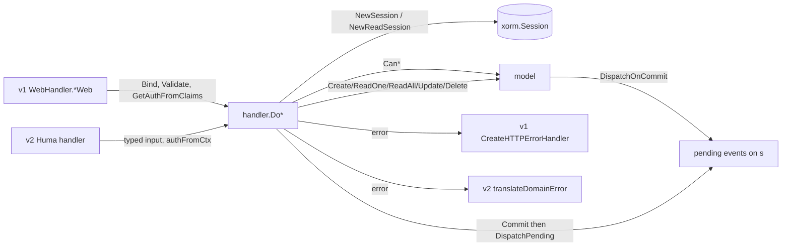

# CRUD framework (`pkg/web`)

The generic pipeline that both API versions run a model through: open a session, ask the model's `Can*` method, call its CRUD method, commit or roll back, flush events. `pkg/web/web.go` defines the interfaces, `pkg/web/handler/core.go` the framework-agnostic `Do*` functions, the other `pkg/web/handler/*.go` files the v1 Echo wrappers, and `pkg/web/files/` the response writers shared by v1 and v2 file endpoints. It knows nothing about concrete models (see [Backend architecture](../../03-backend-architecture.md#package-layering-and-dependency-direction)). The step checklist for implementing a model against it is the [crudable skill](../../../skills/crudable/SKILL.md); this page explains what the framework does with what you implement.

## Responsibility

- Owns: the `web.CRUDable`, `web.Permissions`, `web.Auth`, `web.HTTPErrorProcessor`/`HTTPError` contracts; session lifetime and commit/rollback for every generic request; the permission-before-mutation order; event flushing after commit; v1 binding, validation, pagination clamping, `x-pagination-*` and `x-max-permission` headers, the `[]`-instead-of-`null` rule; `ErrGenericForbidden`; the attachment/background download writers; the cross-package error-code uniqueness test.
- Does not own: which caller is allowed (`Can*` on the model, `./models-*` pages), who the caller is (`./auth-and-sessions.md`), v2 envelopes, ETags and RFC 9457 errors (`./api-v2-huma.md`), route registration (`./http-routing-and-middleware.md`), the v1 error-to-JSON mapping (`pkg/routes/error_handler.go`, same page).

## Entry points and public API

| Entry | Where | Called by |
|---|---|---|
| `DoCreate(ctx, obj, auth) error` | `pkg/web/handler/core.go` | `CreateWeb`; v2 handlers (`grep -l 'handler.Do' pkg/routes/api/v2/*.go` → 40 files) |
| `DoReadOne(ctx, obj, auth) (maxPermission int, error)` | `core.go` | `ReadOneWeb`; v2 read handlers, which fold `maxPermission` into the body and ETag |
| `DoReadAll(ctx, obj, auth, search, page, perPage) (result any, count int, total int64, error)` | `core.go` | `ReadAllWeb`; v2 list handlers |
| `DoUpdate`, `DoDelete` | `core.go` | `UpdateWeb`, `DeleteWeb`; v2 |
| `WebHandler{EmptyStruct func() CObject}` with `CreateWeb`, `ReadOneWeb`, `ReadAllWeb`, `UpdateWeb`, `DeleteWeb` | `helper.go`, `create.go`, `read_one.go`, `read_all.go`, `update.go`, `delete.go` | `pkg/routes/routes.go` (v1 only), `pkg/webtests/integrations.go` → `webHandlerTest` |
| `ErrGenericForbidden{Message}`, `ErrReadForbidden()` | `error.go` | `Do*`; v2 through `errReadForbidden` in `pkg/routes/api/v2/errors.go` (used by the hand-rolled read checks in `tasks.go`) |
| `WriteFileDownload`, `WriteAttachmentDownload`, `WriteProjectBackground`, `BuildUploadResult`, `AttachmentUploadResult` | `pkg/web/files/*.go` | v1 `task_attachment.go`, v2 `task_attachments.go`, `backgrounds.go` |
| `TestErrorCodesAreUnique` | `pkg/web/error_codes_test.go` | CI |

No caller outside `pkg/routes/api/v2/` and `pkg/web/` uses `handler.Do*` directly (grep on 2026-09-16); v1 always goes through `WebHandler`.

## Key types and functions

| Name | File | What it is |
|---|---|---|
| `web.Permissions` | `web.go` | `CanRead(s, a) (bool, int, error)`, `CanCreate/CanUpdate/CanDelete(s, a) (bool, error)`. **`CanRead`'s int is the caller's maximum permission** on the entity (`models.Permission`: 0 read, 1 write, 2 admin) |
| `web.CRUDable` | `web.go` | `Create/ReadOne/Update/Delete(s, a) error` mutate the receiver in place; `ReadAll(s, a, search, page, perPage) (result any, resultCount int, numberOfTotalItems int64, err error)` returns a slice as `any` |
| `web.Auth` | `web.go` | `GetID() int64`; implemented by `*user.User` and `*models.LinkSharing` (negative ids) |
| `web.HTTPError{HTTPCode, Code, Message, I18nParams}`, `HTTPErrorProcessor`, `HTTPErrorWithDetails` | `web.go` | The error contract every domain error implements; `HTTPCode` is `json:"-"` |
| `web.Authprovider`, `web.Auths` | `web.go` | Leftovers from the standalone library; the only reference outside `web.go` is the example in `pkg/web/readme.md:158` |
| `handler.CObject` | `helper.go` | `web.CRUDable` + `web.Permissions`; what `EmptyStruct` must return |
| `handler.WebHandler` | `helper.go` | v1 glue: one instance per model, one method per verb |
| `ErrGenericForbidden` | `error.go` | 403 with `Message` default "Forbidden"; `ErrReadForbidden()` is the read variant "You don't have the permission to see this". Has **no** `Code`, so v1 renders `{"code":0,...}` |
| `message{Message}` | `delete.go` | `{"message":"Successfully deleted."}` v1 delete body |

Models satisfy the interfaces by embedding them and overriding what they need: `web.Permissions \`xorm:"-" json:"-"\`` and `web.CRUDable \`xorm:"-" json:"-"\`` (`pkg/models/sessions.go`, `api_tokens.go`). A method that is not overridden is a nil-interface call and **panics at runtime**, which is why the skill says to implement every operation you route.

## Internal structure

### `Do*` step by step (`pkg/web/handler/core.go`)

| Step | `DoCreate` / `DoUpdate` / `DoDelete` | `DoReadOne` | `DoReadAll` |
|---|---|---|---|
| Session | `db.NewSession()` (transaction) | `db.NewReadSession()` (autocommit, since commit `fe712620f`) | `db.NewReadSession()` |
| Close | deferred `s.Close()`; a close error is only logged | same | same |
| Permission | `CanCreate` / `CanUpdate` / `CanDelete`; error → rollback + `events.CleanupPending`; `false` → rollback, `log.Warningf("Tried to ... (User: %v)", a.GetID())`, `ErrGenericForbidden{}` | `CanRead` → `(canRead, maxPermission, err)`; `false` → `ErrReadForbidden()` | **none**; `ReadAll` filters by `auth` itself |
| Model call | `obj.Create/Update/Delete(s, a)`; error → rollback + cleanup | `obj.ReadOne(s, a)` | `obj.ReadAll(s, a, search, page, perPage)` |
| Commit | `s.Commit()`; error → `CleanupPending`, return | `s.Commit()` (no-op on autocommit) | same |
| Events | `events.DispatchPending(ctx, s)` publishes what the model queued with `events.DispatchOnCommit(s, ev)` | same | same |
| Returns | `error` | `maxPermission, error` | `result, resultCount, total, error` |

Consequences:

- Permission checks and the CRUD method share **one session**, so `CanRead` can load the row into the receiver and `ReadOne` can trust it (the skill's "initial querying happens in `Can*`" rule). The `Can*` call is the only place the framework asks; a model whose `Create` silently checks nothing else is fully exposed.
- A model must never `Commit`, `Rollback` or `Close` the session it is handed; the pipeline does. Nested `db.NewSession()` calls inside a model deadlock SQLite (see `pkg/user/caldav_token.go` comment).
- `DoReadAll` does no `Can*` call at all. Every `ReadAll` implementation owns its scoping (`Session.ReadAll` rejects link shares and filters by `a.GetID()`; `APIToken.ReadAll` checks bot ownership).
- Events queued during a failed request are dropped by `CleanupPending`, never published. Code outside the pipeline that wants the same guarantee must call `events.CleanupPending(s)` itself (`pkg/routes/api/shared/auth.go` does).
- The forbidden log line intentionally prints only the auth id (`e983fa10c` stopped logging the whole auth object).

### v1 Echo wrappers (`create.go`, `read_one.go`, `read_all.go`, `update.go`, `delete.go`)

1. `currentStruct := c.EmptyStruct()`, then `ctx.Bind(currentStruct)`: path params (`param:"..."` tags), query and body in one call. A bind failure becomes `models.ErrInvalidModel{Message, Err}` (code 2004, 400) carrying Echo's message.
2. `ctx.Validate(currentStruct)` for create and update only (govalidator via `pkg/routes/validation.go`); failures are `ValidationHTTPError` (412, code 2002, `invalid_fields`). Read and delete skip validation.
3. `auth.GetAuthFromClaims(ctx)`; failure is a 500 "Could not determine the current user."
4. `Do*` with `ctx.Request().Context()`.
5. Response: create 201 with the mutated struct; read/update 200 with the struct; delete 200 `{"message":"Successfully deleted."}`.

`ReadAllWeb` additionally:

- `page` defaults to `"1"`, must parse, must not be negative (400). `per_page` defaults to `service.maxitemsperpage` (50) when absent or 0, must be ≥1, and is **clamped down** to `service.maxitemsperpage` when larger. Search comes from `?s=`.
- Sets `x-pagination-total-pages` = `ceil(total / perPage)` (0 when `resultCount == 0`), `x-pagination-result-count`, and `Access-Control-Expose-Headers` for both. The `pageNumber < 0` branch that forces one page is unreachable after the earlier check.
- Normalises a nil result or a nil slice hidden in the `any` to `[]interface{}{}` via reflection, so v1 lists are never `null`. v2 has its own rule (type-assert the slice, see the `api-v2-routes` skill).

`ReadOneWeb` sets `x-max-permission` from `DoReadOne`'s return and exposes it via `Access-Control-Expose-Headers`.

### How v2 reuses `Do*`

v2 handlers (`pkg/routes/api/v2/<resource>.go`) skip Echo binding: Huma fills a typed input struct, the handler copies path ids onto the model ("URL wins over body"), calls `authFromCtx` (`auth.GetAuthFromContext` through `humabridge`), then the same `Do*`. `DoReadOne`'s `maxPermission` becomes the `max_permission` field and part of the ETag (`conditionalReadResponse` in `types.go`); `DoReadAll`'s `total` feeds `NewPaginated`. Errors go through `translateDomainError`, which maps `ErrGenericForbidden` to a 403 problem document. Pagination limits on v2 come from `ListParams` (`pkg/routes/api/v2/types.go`: `per_page` default 50, `maximum:"1000"`), not from `ReadAllWeb`'s clamp; nothing in `pkg/routes/api/v2/` reads `ServiceMaxItemsPerPage`, so a v2 client can request up to 1000 items regardless of that setting.

**The one exception to "never check permissions in a handler":** a non-CRUD v2 action (`POST /tasks/{id}/duplicate`, bulk endpoints, toggles) has no `Do*` wrapper, so the handler must open `db.NewSession()`, call the relevant `Can*` itself, refuse with `huma.Error403Forbidden` (or `handler.ErrReadForbidden()` for read denials so the body matches), do the work, and commit or roll back explicitly. Template and rationale: [api-v2-routes skill, "Non-CRUDable / custom routes"](../../../skills/api-v2-routes/SKILL.md).

### `pkg/web/files/`

| Function | Behaviour |
|---|---|
| `WriteFileDownload(w, r, f)` | `Cache-Control: no-cache` (overrides the API group's `no-store` so `If-Modified-Since` still works), `Content-Disposition: attachment`, detected MIME or `application/octet-stream`, `X-Content-Type-Options: nosniff`, `Content-Length`, `Last-Modified` = `f.Created`. Seekable readers (local storage) go through `http.ServeContent` (Range support); non-seekable (S3, test storage) get a manual 304 check and `io.Copy`. Does not close the reader |
| `WriteAttachmentDownload(w, r, ta, preview)` | Closes `ta.File.File`; a non-nil `preview` is written as `image/png` with `no-cache`, else delegates to `WriteFileDownload` |
| `WriteProjectBackground(w, r, bgFile, stat)` | Deliberately different wire shape kept byte-identical to v1: always `image/jpg`, no disposition or length, `Last-Modified` from storage modtime, 304 on `If-Modified-Since` |
| `BuildUploadResult(success, failures)` | Per-file upload outcome; failures implementing `HTTPErrorProcessor` keep their numeric `code` |

### `pkg/web/readme.md`

The README of the former standalone library `code.vikunja.io/web` (LGPL badge, `go get` instructions, `SetAuthProvider`/`SetLoggingProvider`/`SetSessionFactory` config, `crud.WebHandler`, `namespaces` examples). Still accurate: the interface definitions, "each request runs in its own session, rolled back on error", `CanRead` returning the max permission for `x-max-permission`, pagination header semantics, `?s=` search, `param` tag binding. Stale: the handler config section (there is no `SetSessionFactory` in `pkg/web/handler`; sessions come from `pkg/db` directly), the namespace-era route examples, the LGPL/`go get` framing. Its TODO list (`readme.md:40-45`) still has two open items: before/after hooks and "magic" fallback for missing CRUD methods; neither exists. Read it for the design intent, this page for what the code does.

## Dependencies

- **Uses:** `pkg/db` (`NewSession`, `NewReadSession`), `pkg/events` (`DispatchPending`, `CleanupPending`), `pkg/log`, `pkg/config` (`ServiceMaxItemsPerPage`), `pkg/models` (only `ErrInvalidModel` and `TaskAttachment` in the Echo/file layers; `core.go` and `web.go` import no models), `pkg/modules/auth` (`GetAuthFromClaims`), `pkg/files` (`File`), `github.com/labstack/echo/v5`, `xorm.io/xorm`.
- **Used by:** every model in `pkg/models` (interfaces), `pkg/routes/routes.go` (v1 `WebHandler` instances), all `pkg/routes/api/v2/*.go` CRUD handlers, `pkg/routes/api/v1/task_attachment.go` and v2 file handlers (`pkg/web/files`), `pkg/routes/error_handler.go` and `pkg/routes/api/v2/errors.go` (`HTTPErrorProcessor`). `pkg/modules/migration/handler` does not use `WebHandler`; importers have their own Echo wrappers (`./importers.md`).

## Invariants and assumptions

- `Can*` runs before the CRUD method on the same session, and the CRUD method may rely on data `Can*` loaded into the receiver (`Session.CanDelete` copies the row into `*sess`; `APIToken.CanDelete` likewise).
- `CanRead` returns the caller's max permission on success; `DoReadOne` forwards it unchanged, v1 to `x-max-permission`, v2 to `max_permission` and the ETag. Returning a wrong value leaks or hides UI affordances and busts caches.
- A nonexistent id must surface as `false` from `Can*` (→ 403 `ErrReadForbidden`) or as an explicit `ErrXDoesNotExist` from the model (→ 404); the framework itself never emits 404 (see [API contract](../../05-api-contract.md#error-format)).
- Reads run without a transaction (`NewReadSession`); a `ReadOne` that writes (counters, backfills) must open its own session, as `backfillTokenSha256` does.
- `ReadAll` returns `(slice, len(slice), total)`; `resultCount == 0` yields zero pages on v1. Returning `nil` is safe on v1 (normalised) but must be type-asserted on v2.
- Models never commit, never call `s.Context(...)` (`.golangci.yml` forbids it), and queue events with `DispatchOnCommit`, not `Dispatch`.
- Domain errors implement `HTTPErrorProcessor` as **value** receivers on structs; `IsErr*` helpers type-assert directly and miss wrapped errors, while both HTTP layers use `errors.As` ([Conventions](../../08-conventions.md#errors)).

## Configuration

| Key (`config.yml`) | Env var | Effect |
|---|---|---|
| `service.maxitemsperpage` (50) | `VIKUNJA_SERVICE_MAXITEMSPERPAGE` | Default and upper bound for v1 `per_page`; v2 `ListParams` has its own bound |

## Error handling

- Permission denied: `ErrGenericForbidden` (403, no code) from `DoCreate/DoUpdate/DoDelete`; `ErrReadForbidden()` (403, message "You don't have the permission to see this") from `DoReadOne`. Both log a warning with the auth id.
- Bad input on v1: `models.ErrInvalidModel` 2004 (400) for bind failures; `ValidationHTTPError` 2002 (412) for validation; plain Echo 400s for bad `page`/`per_page`.
- Auth resolution failure in a v1 wrapper: Echo 500 wrapping the cause.
- Model and DB errors propagate unchanged; the session is rolled back and pending events dropped. Commit errors are returned without a rollback call (the deferred `Close` rolls back).
- Rendering: v1 `CreateHTTPErrorHandler` (`errors.As` on `HTTPErrorProcessor`), v2 `translateDomainError`. `web.HTTPError.I18nParams` rides along on both.
- `TestErrorCodesAreUnique` scans every `.go` file under `pkg/` for `Err(or)?Code\w+ = <n>` and fails on a number bound to two different names; pick codes from the block table in [Backend architecture](../../03-backend-architecture.md#errors).

## Tests

| What | Where | Run |
|---|---|---|
| Error-code uniqueness across packages | `pkg/web/error_codes_test.go` | `mage test:filter TestErrorCodesAreUnique` |
| Upload result mapping | `pkg/web/files/task_attachment_test.go` → `TestBuildUploadResult` | `mage test:filter TestBuildUploadResult` |
| The pipeline itself | No unit tests in `pkg/web/handler/` (no `_test.go` files). Covered end to end by `pkg/webtests`: `webHandlerTest` drives `WebHandler` methods per model (`testReadAllWithUser`, `testCreateWithLinkShare`, …), `webHandlerTestV2` drives the Huma routes; `project_test.go` asserts `x-max-permission` values, `huma_project_test.go` the `max_permission` field | `go test -run TestProject ./pkg/webtests/` (webtests skip under `mage test:filter`'s `-short`) |
| Model `Can*` contracts | `pkg/models/*_test.go` per entity; the crudable skill requires positive, negative, inherited and shared-access cases | `mage test:filter TestLabel` |

Not covered: pagination clamping, the `x-pagination-*` headers and the nil-slice normalisation have no test at all (no file under `pkg/webtests` mentions `x-pagination-total-pages`, grep 2026-09-16); `DoReadAll` skipping `Can*` is a design fact, not a tested one.

## Gotchas and tech debt

- Embedding `web.CRUDable`/`web.Permissions` and forgetting an override compiles fine and panics on first request. Route only the verbs you implemented, and implement `CanUpdate`/`CanDelete` when you ship `Create` (skill anti-pattern).
- `ErrGenericForbidden` has no numeric code, so v1 clients see `"code":0` and the frontend cannot translate it. Unverified: whether a code is planned.
- `ReadAllWeb` never validates the bound struct, so query/body values used by `ReadAll` (filters, `expand`) are unvalidated on v1; v2 validates through Huma tags.
- `DoReadAll` has no permission gate; a `ReadAll` that forgets to scope by `a.GetID()` leaks every row. Review every new `ReadAll` for its `WHERE`.
- `core.go` is small (211 lines, 11 commits) but every request passes through it; behaviour changes there affect both API versions at once. The read-session change (`fe712620f`, 2026-09-08) is the most recent semantic shift: reads no longer hold a transaction.
- The `Authprovider`/`Auths` types in `web.go` and most of `readme.md`'s "Handler config" section describe the old library API and are dead in this repo.
- Open TODOs from the library era live in `pkg/web/readme.md:40-45` (hooks, "magic" CRUD fallback); nothing in code references them.
- The `pageNumber < 0` branch in `read_all.go` is dead code after the earlier negative-page check.
- Because `x-max-permission` is only set on `ReadOneWeb`, v1 list responses carry no per-item permission; the frontend derives it from separate reads or the project's permission (see [frontend project-views](../frontend/project-views.md)).

## Related pages

- [crudable skill](../../../skills/crudable/SKILL.md) and [api-v2-routes skill](../../../skills/api-v2-routes/SKILL.md) — the checklists for implementing against this framework
- [models-projects-and-permissions](./models-projects-and-permissions.md) — how `Can*` methods compute permissions and inherit them
- [api-v1](./api-v1.md), [api-v2-huma](./api-v2-huma.md) — the two transports over `Do*`
- [auth-and-sessions](./auth-and-sessions.md) — what `web.Auth` you receive
- [db-and-migrations](./db-and-migrations.md) — `NewSession` vs `NewReadSession`, the session cache
- [events-and-listeners](./events-and-listeners.md) — `DispatchOnCommit`/`DispatchPending`
- [files-and-storage](./files-and-storage.md) — the storage side of `pkg/web/files`
- [Backend architecture, request pipeline](../../03-backend-architecture.md#request-pipeline), [API contract](../../05-api-contract.md), [Conventions](../../08-conventions.md#permissions)
- Playbook: [add-api-endpoint](../../playbooks/add-api-endpoint.md)
