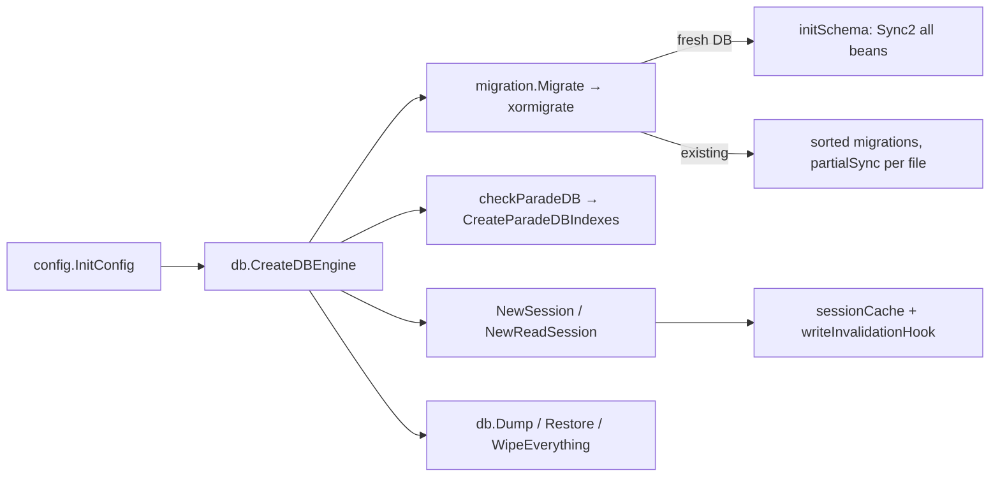

# DB engine, sessions, fixtures, and migrations

`pkg/db` owns the single XORM engine, session creation, the per-session memo, dump/restore of table data, and the test engine plus fixtures. `pkg/migration` owns schema evolution on top of it. This page is the explanation behind the rules in the [`migration` skill](../../../skills/migration/SKILL.md) and the [add-migration playbook](../../playbooks/add-migration.md). Architecture context: [Backend architecture](../../03-backend-architecture.md#sessions-and-transactions).

## Responsibility

- **Owns:** engine construction for sqlite/mysql/postgres, connection-string building, sqlite path resolution, sessions and the memo, table registry, dump/restore/truncate of table contents, test engine and fixture loading, ParadeDB detection and its bm25 indexes, the migration list, xormigrate wiring, DDL helpers, schema checks.
- **Does not own:** model beans and `TableName()` (`pkg/models`, `pkg/user`, `pkg/files`, `pkg/notifications`, `pkg/license`, `pkg/modules/migration`), commit/rollback decisions (`pkg/web/handler`, see [crud-framework](./crud-framework.md)), the `dump`/`restore` zip format (`pkg/modules/dump`, see [cli-commands](./cli-commands.md)).

## Entry points and public API

| Entry | Where | Called by |
|---|---|---|
| `CreateDBEngine()` | `pkg/db/db.go` | `models.SetEngine`, `files.SetEngine` (via `initialize.InitEngines`), `migration.initMigration`, `ListMigrations` |
| `NewSession()`, `NewReadSession()`, `NewAutocommitSession()` | `pkg/db/db.go` | `pkg/web/handler`, cron jobs, listeners, CLI `repair`, `health.Check` |
| `RegisterTables(beans)`, `RegisteredTableNames()` | `pkg/db/db.go` | `init()` in `pkg/models/models.go`, `pkg/user/db.go`, `pkg/files/db.go`, `pkg/notifications/db.go`, `pkg/license/license.go`, `pkg/modules/migration/db.go` |
| `Type()`, `GetDialect()`, `ILIKE`, `MultiFieldSearch*`, `IsUniqueConstraintError` | `pkg/db/db.go`, `pkg/db/helpers.go` | model queries in `pkg/models` |
| `Remember`, `RememberEach`, `SetSessionContext` | `pkg/db/session_cache.go` | permission lookups in `pkg/models`; anything that must replace a session context |
| `Dump()`, `Restore()`, `RestoreAndTruncate()`, `TruncateAllTables()`, `WipeEverything()` | `pkg/db/dump.go`, `pkg/db/db.go` | `pkg/modules/dump`, `pkg/routes/api/shared/testing.go` (`/api/v1/test/*` seeding) |
| `CreateTestEngine()`, `InitTestFixtures()`, `LoadFixtures()`, `AssertExists/Missing/Count` | `pkg/db/test.go`, `pkg/db/test_fixtures.go` | every `TestMain` / `SetupTests` in the backend |
| `CreateParadeDBIndexes()`, `RegisterConnectionPoolMetrics()` | `pkg/db/db.go` | `initialize.InitEngines`, `models.SetupTests`; `pkg/metrics/metrics.go` |
| `Migrate(nil)`, `ListMigrations()`, `Rollback(id)`, `MigrateTo(id, x)`, `AddPluginMigrations` | `pkg/migration/migration.go` | `initialize.FullInitWithoutAsync`, `pkg/cmd/migrate.go`, `pkg/modules/dump/restore.go`, plugin loader |

## Key types and functions

### Engine (`pkg/db/db.go`)

- `x *xorm.Engine` is a package global; `CreateDBEngine` returns it if already set (singleton) and calls `config.InitConfig()` itself when `database.type` is empty.
- `initMysqlEngine`: `tcp(host)` or `unix(path)` when `database.host` starts with `/`; DSN adds `charset=utf8mb4&parseTime=true&tls=<database.tls>`; pool from `database.maxopenconnections/maxidleconnections/maxconnectionlifetime` (ms).
- `initPostgresEngine` → `newPostgresEngine("")`, pings, then `checkParadeDB`. If `pg_search` is installed it **closes and reopens** with `default_query_exec_mode=exec` because ParadeDB's `|||` operator needs the search term at plan time (statement cache traded for working search).
- `getPostgreSQLConnectionString`: unix-socket form when host starts with `/`; user and password are `url.PathEscape`d; `database.schema` is pinned as `search_path="<schema>",public` (quoted, case preserved; issue #3118) and also applied with `engine.SetSchema`.
- `sanitizePostgresConnectionError` redacts `user:password@` in three encodings plus a `postgres(ql)://...@` regex so pgx parse errors never log credentials. `CreateDBEngine` pings eagerly so an unreachable DB is reported as a connection error rather than a later "schema/extension" failure (#3287).
- Every engine gets `SetTZLocation(config.GetTimeZone())`, `SetTZDatabase(GMT)`, `names.GonicMapper{}` (struct `ProjectID` → column `project_id`, `URL` stays `url`), the xorm logger from `log.database*` keys, and `AddHook(writeInvalidationHook{})`.

### SQLite path resolution

`resolveDatabasePath(DatabasePathConfig, userDataDir)`: `"memory"` → `DatabasePathMemory`; absolute → cleaned; relative and `service.rootpath` differs from the executable's directory → joined with rootpath; otherwise joined with the per-OS user data dir (`XDG_DATA_HOME/vikunja`, `~/.local/share/vikunja`, `~/Library/Application Support/Vikunja`, `%LOCALAPPDATA%\Vikunja`), falling back to rootpath if that dir cannot be created. `ResolvedDatabasePath()` never creates directories; `ensureDatabasePath()` does (only the user data dir). `initSqliteEngine` then: for `memory` uses a **temp file in WAL mode** (shared-cache `:memory:` deadlocks under concurrency); otherwise logs the path, **warns** (does not refuse) when `isSystemDirectory` matches `/bin`, `/etc`, `/proc`, `C:\Windows\...`, opens the file once to surface permission errors with uid/gid, and connects with `?_busy_timeout=5000&_journal_mode=WAL`.

### Sessions and the memo (`pkg/db/session_cache.go`)

| Function | Semantics |
|---|---|
| `NewSession()` | `Begin()` a transaction (`log.Fatalf` if that fails); caller commits/rolls back; `Close()` rolls back |
| `NewAutocommitSession()` / `NewReadSession()` | identical: no transaction, writes durable immediately |
| `Remember[T](s, key, fetch)` | memoizes `fetch` for the session; misses forever once the session has written; stores nothing on error |
| `RememberEach[T](s, ids, key, fetch)` | id-keyed batch variant, dedupes ids, fetches only the misses |
| `SetSessionContext(ctx, s)` | replaces the context while re-attaching the memo pointer |

The memo lives in a `sync.Map` keyed by `weak.Pointer[xorm.Session]` (cleaned by `runtime.AddCleanup`) **and** in the session context. `writeInvalidationHook.BeforeProcess` reads the memo from `c.Ctx` and marks it dirty when `isWriteStatement(sql)` (leading keyword not in the `select/show/pragma/describe/begin/commit/...` allow-list; a `WITH` is scanned for write verbs; anything unrecognised counts as a write). Calling `s.Context(...)` directly drops that pointer and the memo would serve stale permission rows, which is why `.golangci.yml` `forbidigo` bans `^(s|sess|tx)\.Context$` outside `pkg/db/`. `invalidateAllSessionCaches()` exists for writes xorm never sees (`LoadFixtures` defers it).

### Query helpers (`pkg/db/helpers.go`)

- `ILIKE(col, search)`: `ILIKE` on postgres, `builder.Like` elsewhere (MySQL/SQLite `LIKE` are case-insensitive by default).
- `MultiFieldSearch(fields, search)` → `...WithTableAlias` → `...WithBoosts`: on postgres with ParadeDB builds `field ||| ?::pdb.fuzzy(1, t)` (optionally `::pdb.boost(n)`) OR'd per field; otherwise ORs `ILIKE` per field. Boosts only affect ParadeDB scoring.
- `IsUniqueConstraintError(err, name)`: string-matches MySQL `error 1062 ... duplicate entry`, Postgres `duplicate key value violates unique constraint`, SQLite `unique constraint failed`. The SQLite branch also returns true when the message merely contains `task_buckets` (hard-coded; see gotchas).

### Dump/restore of rows (`pkg/db/dump.go`)

`Dump()` returns `map[table][]byte` JSON for `RegisteredTableNames()` (registered beans plus the literal `"migration"` table). `Restore(table, rows)` validates the name against `^[a-zA-Z_][a-zA-Z0-9_]*$`, drops columns unknown to `x.DBMetas()` with a warning, converts `0/1` to bool for bool columns, parses time strings through `dumpTimeFormats` (empty or `0001-` → NULL so nobody gets scheduled for deletion), inserts row by row, then on postgres `setval`s `<table>_id_seq` (failure only warns). `RestoreAndTruncate` deletes first (`DELETE FROM` on sqlite, `TRUNCATE TABLE` elsewhere); `TruncateAllTables` does that for every registered table (e2e seeding). `WipeEverything` (`db.go`) drops every registered table including `migration`.

### Test engine and fixtures (`pkg/db/test.go`, `pkg/db/test_fixtures.go`)

- `CreateTestEngine()`: with `VIKUNJA_TESTS_USE_CONFIG=1` it runs `config.InitConfig()` and the real `CreateDBEngine()` (CI's `test-api` matrix sets it for every DB except `sqlite-in-memory`); otherwise `sqlite3 file::memory:?cache=shared`. Logger level is `DEBUG` but SQL is only shown when `TESTS_VERBOSE=1`. The write hook is attached here too.
- `InitTestFixtures(tables...)` calls `config.InitDefaultConfig()` then `InitFixtures`, which builds a `testfixtures` loader from the `//go:embed fixtures` FS, `GetDialect()`, `DangerousSkipTestDatabaseCheck`, the configured timezone, and `SkipResetSequences` on postgres. `LoadFixtures()` truncates and reloads, then on postgres resets every sequence with a generated `SETVAL` query.
- `AssertExists(t, table, values, custom)`: `custom=true` builds raw SQL (postgres oddities); otherwise `condFromValues` quotes identifiers (`limit` is a reserved word) and turns `nil` into `IS NULL` (`builder.Eq` would render `= NULL`).

### Fixtures directory (`pkg/db/fixtures/`, 38 files, one per table)

- File name = table name; each file is a YAML list of rows with explicit `id`s. **Ids are load-bearing**: tests address rows by number (`user1`/id 1, project 1, task 1 ... 52 tasks, 44 projects, 25 users), and relations between files are by id (`tasks.yml` `project_id: 1`, `created_by_id: 1`). Adding a row means appending with the next free id, never renumbering.
- Rows encode regression cases in comments, e.g. `labels.yml`/`label_tasks.yml` for GHSA-hj5c-mhh2-g7jq, and `users.yml` explains why humans carry `bot_owner_id: 0`.
- `pkg/models/setup_tests.go` → `SetupTests()` lists the tables it loads explicitly; a new table with a fixture must be added there or its rows never appear in model/web tests.

### Migrations (`pkg/migration/migration.go`)

| Symbol | What it does |
|---|---|
| `migrations []*xormigrate.Migration` | filled by each file's `init()`; `AddPluginMigrations` appends plugin ones |
| `initMigration(x)` | creates the engine if `x == nil`, runs `checkPostgresSchemaMismatch` (fatal), **sorts by ID** (init order is not guaranteed), builds `xormigrate.New`, `InitSchema(initSchema)` |
| `initSchema` | on a database with no `migration` table: `tx.Sync2` of all `schemaBeans()` (models, files, license, migration-status, user, notifications) and every migration is marked applied; `//nolint:forbidigo` because there are no existing tables |
| `Migrate(x)` | `log.Fatalf` on failure; runs on every `web` start and inside `restore` |
| `ListMigrations()` | `x.Find(&ms)` on the `migration` table, prints a table; on a never-migrated DB this is the `no such table: migration` error noted in [Development workflow](../../07-development-workflow.md#build-and-run-the-backend) |
| `Rollback(id)` / `MigrateTo(id, x)` | xormigrate `RollbackTo` / `MigrateTo`; most `Rollback` funcs are `return nil` |
| `partialSync(tx, beans...)` | `SyncWithOptions{IgnoreConstrains: true, IgnoreDropIndices: true}`: adds columns and plain indexes, drops nothing, **creates no unique indexes** |
| `dropTableColum` | `ALTER TABLE ... DROP COLUMN` on all three DBs |
| `modifyColumn` | mysql `MODIFY COLUMN`, postgres `ALTER COLUMN`; **sqlite: logs a warning and does nothing** |
| `renameTable` | sqlite/postgres `ALTER TABLE RENAME TO`, mysql `RENAME TABLE` (identifiers backtick-quoted on all three) |
| `columnExists` | sqlite `PRAGMA table_info`, mysql `SHOW COLUMNS LIKE`, postgres `information_schema.columns` filtered by `table_schema = current_schema()` (#3118, otherwise a stale copy in another schema passes the check) |
| `renameColumn` | skips when old is missing or new exists; mysql path hard-codes `BIGINT NOT NULL DEFAULT 0` as the type |

`schema_check.go` → `checkPostgresSchemaMismatch` refuses to migrate when `users`+`migration` exist only in a schema other than the active one, so a mis-set `database.schema` cannot create a second empty install; `validateSchemaPlacement` also errors when the configured schema does not exist (`current_schema()` silently falls back to `public`).

## Internal structure

File and struct convention for a migration (`pkg/migration/20260405194817.go` is the minimal reference; scaffold with `mage dev:make-migration <Name>`):

- file `pkg/migration/<YYYYMMDDHHMMSS>.go`, `date +%Y%m%d%H%M%S` for the id;
- a **local** struct named `<table><timestamp>` with only the changed columns and a `TableName()`; never reuse `models.*` types, because the model keeps evolving and the migration must stay frozen;
- `init()` appends `&xormigrate.Migration{ID, Description, Migrate, Rollback}`.

## Dependencies

- **Uses:** `pkg/config`, `pkg/log`, `xorm.io/xorm` + `builder`, `xormigrate`, `go-testfixtures`, drivers `go-sqlite3`, `pgx/v5/stdlib`, `go-sql-driver/mysql`, Prometheus collectors.
- **Used by:** everything that touches data: `pkg/models`, `pkg/user`, `pkg/files`, `pkg/notifications`, `pkg/license`, `pkg/web/handler`, `pkg/initialize`, `pkg/cmd`, `pkg/modules/dump`, `pkg/routes/api/shared/testing.go`, `pkg/health`, `pkg/metrics`, `pkg/doctor`.

## Invariants and assumptions

- **Every migration must run on sqlite, mysql, postgres.** CI `test-migration-smoke` (`.github/workflows/test.yml`) downloads the last unstable binary, runs its `migrate`, then runs the freshly built binary's `migrate` on the same database for each of sqlite, postgres, mariadb, mysql. `modifyColumn` being a no-op on sqlite means sqlite installs silently keep old column types.
- **Never plain `tx.Sync`/`Sync2` on an existing table.** xorm drops every index the struct does not declare; v2.4.0 shipped that and destroyed `users`/`tasks` indexes on every upgraded install (#3244), and aborted with `2BP01` on pgloader-converted postgres whose PK index is named `idx_<oid>_primary`. `.golangci.yml` `forbidigo` bans `^tx\.Sync2?$` in `pkg/migration/`; `initSchema` is the single nolint. `20260720120000` recreates the lost indexes and its test pins the behaviour, including lowercase-SQL sqlite indexes xorm's dialect skips (#3313).
- **`partialSync` creates no unique index** (`IgnoreConstrains`). Add one explicitly per dialect after checking for duplicates so the failure message is actionable (`20260830162731` + its test).
- **Migrations sort by ID string**, so ids must be 14-digit timestamps; a shorter id would sort first and run out of order.
- **Registered beans define the world**: `Dump`, `WipeEverything`, `TruncateAllTables` only know tables passed to `RegisterTables`. A new table needs `GetTables()` in its package (see [Conventions](../../08-conventions.md#if-you-change-x-you-must-also-change-y)).
- **Models never open sessions**; they receive `*xorm.Session`. Only `pkg/db` may call `s.Context`.
- **The memo assumes all writes go through the engine**: raw writes via another connection or `x.Exec` on the engine (not the session) are invisible to the hook. Tests and fixture loaders call `invalidateAllSessionCaches` for that reason.
- **Fixture ids are stable contracts**; `AssertExists` failures print the whole table to help you see what shifted.
- Restoring a dump recreates the schema via `MigrateTo` on a wiped DB; `pkg/modules/dump/restore.go` then runs `Migrate(nil)` and `models.RebuildProjectAncestors` because `initSchema` marks everything applied without running data backfills.

## Configuration

| Key (`config.yml`) | Env var | Effect |
|---|---|---|
| `database.type` | `VIKUNJA_DATABASE_TYPE` | `sqlite` (default), `mysql`, `postgres`; anything else is `log.Fatalf` |
| `database.path` | `VIKUNJA_DATABASE_PATH` | sqlite file, or `memory` for an ephemeral temp-file DB; default `<rootpath>/vikunja.db` |
| `database.host/user/password/database` | `VIKUNJA_DATABASE_*` | mysql/postgres connection; host starting with `/` is a unix socket |
| `database.schema` | `VIKUNJA_DATABASE_SCHEMA` | postgres schema, pinned into `search_path`; default `public` |
| `database.sslmode/sslcert/sslkey/sslrootcert`, `database.tls` | | postgres SSL params; mysql `tls=` value |
| `database.maxopenconnections` (100), `maxidleconnections` (50), `maxconnectionlifetime` (1800000 ms) | | pool; sqlite ignores them |
| `log.database`, `log.databaselevel` | `VIKUNJA_LOG_DATABASE=stdout`, `VIKUNJA_LOG_DATABASELEVEL=DEBUG` | SQL logging (default `off`) |
| `service.timezone` | | `engine.SetTZLocation`; DB storage is always GMT |

Note `migration.initMigration` builds its xormigrate logger from `log.events`/`log.eventslevel`, not `log.database`. Migration progress therefore follows the events logger settings.

## Error handling

- Engine and migration failures are fatal at startup (`log.Fatalf` in `CreateDBEngine` default branch, `NewSession` `Begin`, `Migrate`, `initMigration`); postgres errors pass through `sanitizePostgresConnectionError` first.
- `Restore` returns errors for bad table names, unparsable times, and failed inserts; unknown columns and sequence resets only warn; a missing table definition is `log.Fatalf`.
- `IsUniqueConstraintError` is the only cross-DB constraint check; callers map it to domain errors (e.g. task-bucket uniqueness). Everything else surfaces as a wrapped driver error → 500 → Sentry (see [config-and-logging](./config-and-logging.md#sentry)).
- `checkPostgresSchemaMismatch` messages name the env var to set (`VIKUNJA_DATABASE_SCHEMA`).

## Tests

| Area | Files | Run |
|---|---|---|
| Connection strings, credential redaction | `pkg/db/db_test.go` | `mage test:filter TestGetPostgreSQLConnectionString` |
| sqlite path resolution, user data dir, system-dir detection | `pkg/db/db_path_test.go` | `mage test:filter Test_resolveDatabasePath` |
| search helpers, unique-constraint parsing | `pkg/db/helpers_test.go` | `mage test:filter TestMultiFieldSearch` |
| memo and write detection | `pkg/db/session_cache_test.go` | `mage test:filter TestRemember` |
| dump time parsing and restore conversions | `pkg/db/dump_test.go` | `mage test:filter TestRestore` |
| migrations (16 `_test.go` files, `main_test.go` does `log.InitLogger` + `config.InitDefaultConfig`) | `pkg/migration/*_test.go`, `schema_check_test.go` | `mage test:filter TestAddActiveUserClaim20260830162731` |

Migration test patterns worth copying: `20260720120000_test.go` (break the schema with a partial `Sync`, insert duplicates, assert the migration errors with the table and column named, then succeeds and is idempotent; a differently named equivalent index is kept); `20260830162731_test.go` (declare a full "before" struct locally, snapshot `x.DBMetas()` columns and indexes, run the migration, assert nothing was dropped, read rows back through the migration's struct, assert the new unique index rejects duplicates). Run against other DBs with `VIKUNJA_TESTS_USE_CONFIG=1` plus `VIKUNJA_DATABASE_*`. Not covered: `renameTable`/`modifyColumn` have no direct tests; ParadeDB paths only run in CI's `paradedb` matrix entry.

## How-to

**Add a column** (details in the [playbook](../../playbooks/add-migration.md)):

1. `mage dev:make-migration <Table>`; keep only the new field(s) in the local struct, tags identical to the model's.
2. `Migrate: partialSync(tx, struct{})`; if the column needs a unique index, create it per dialect after a duplicate check.
3. Add the field to the model in `pkg/models/` (or `pkg/user/`), update `pkg/db/fixtures/<table>.yml` rows if the column is `not null`, then `mage test:filter <YourTest>` and `mage test:feature`.
4. Write `<timestamp>_test.go` asserting no column/index was dropped.

**Add a table:**

1. Model with `TableName()`; append it to the package's `GetTables()` so `RegisterTables` and `initSchema` see it.
2. Migration with a full local struct; plain `tx.Sync2(struct{})` is allowed here (`//nolint:forbidigo` with a reason) and `Rollback` should `DropTables`.
3. New `pkg/db/fixtures/<table>.yml` and add the name to `models.SetupTests()`'s list.
4. If the table has data that `/api/v1/test/*` seeding must clear, add it to `dependentTestingTables` in `pkg/routes/api/shared/testing.go`.

## Gotchas and tech debt

- `pkg/cmd/migrate.go:33` `// TODO: add args to run migrations up or down, until a certain point etc` — `MigrateTo` exists in the package but no CLI exposes it.
- `IsUniqueConstraintError` SQLite branch returns true for any unique failure whose message contains `task_buckets`, regardless of `constraintName` (`pkg/db/helpers.go`).
- `renameColumn` on mysql forces `BIGINT NOT NULL DEFAULT 0`; it is only correct for id-like columns.
- `renameTable` quotes with backticks on postgres too; this works because xorm's `Statement.ReplaceQuote` rewrites backticks to the dialect quote on every raw `Exec` (mysql and sqlite are passed through), and `20221113170740` (`lists` → `projects` and friends) exercises that branch on every dialect.
- The test engine uses `file::memory:?cache=shared` while production `memory` uses a WAL temp file, so lock behaviour differs; `pkg/models/main_test.go` documents that a second session blocks until the first commits under shared cache.
- `restore.go` picks `ms[len(ms)-2]` as the migration to `MigrateTo` before replaying data. Unverified: why the second-to-last id rather than the last.
- `initSchema` marks all migrations applied on fresh installs, so data backfills inside migrations never run on a fresh or restored DB; anything that must exist on a fresh DB belongs in code, not a migration.

## Related pages

- [crud-framework](./crud-framework.md), [models-tasks](./models-tasks.md), [models-filtering-and-search](./models-filtering-and-search.md) (search helpers in use)
- [cli-commands](./cli-commands.md) (`migrate`, `dump`, `restore`), [config-and-logging](./config-and-logging.md), [operations-subsystems](./operations-subsystems.md) (doctor DB checks, metrics), [plugins](./plugins.md) (`AddPluginMigrations`)
- [06 Data model](../../06-data-model.md), [07 Development workflow](../../07-development-workflow.md#tests), [11 Testing guide](../../11-testing-guide.md), [playbooks/add-migration](../../playbooks/add-migration.md), [`migration` skill](../../../skills/migration/SKILL.md)
