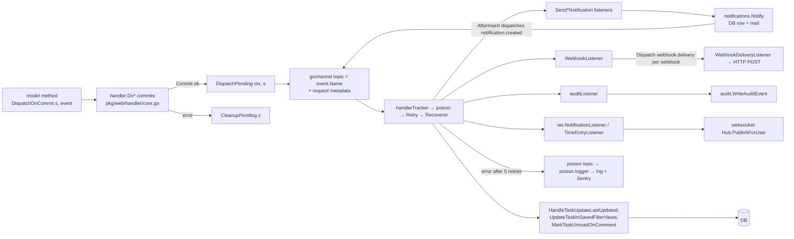

# Events and listeners

The in-process event bus that decouples model mutations from their side effects (notifications, webhooks, audit entries, websocket pushes, saved-filter maintenance, imports, exports). It is Watermill's `gochannel` pub/sub wrapped by `pkg/events`; the events and listeners themselves live in `pkg/models` and a few other packages. Context: [Backend architecture → Events and background work](../../03-backend-architecture.md#events-and-background-work).

## Responsibility

- **Owns:** the router and pub/sub (`pkg/events/events.go`), the listener registry (`pkg/events/listeners.go`), transactional dispatch (`DispatchOnCommit`/`DispatchPending`), request metadata propagation (`pkg/events/request_meta.go`), and the test double (`pkg/events/testing.go`).
- **Does not own:** event definitions and listener logic (`pkg/models/events.go`, `pkg/models/listeners.go`, `pkg/user/events.go`, `pkg/modules/migration/handler/`, `pkg/websocket/listener.go`, `pkg/audit/listener.go`), the notification channel ([notifications-and-mail](./notifications-and-mail.md)), scheduled work ([cron-and-background-jobs](./cron-and-background-jobs.md)), or the audit sink itself ([operations-subsystems](./operations-subsystems.md)).

## Entry points and public API

| Entry | Where | Called by |
|---|---|---|
| `Event` interface (`Name() string`) | `pkg/events/events.go` | every event struct |
| `Listener` interface (`Handle(*message.Message) error`, `Name() string`), `RegisterListener(topic, l)` | `pkg/events/listeners.go` | `models.RegisterListeners`, `migrationHandler.RegisterListeners`, `ws.RegisterListeners`, `audit.RegisterEventForAudit`, `models.RegisterEventForWebhook` |
| `InitEvents()` (blocks in `router.Run`) | `pkg/events/events.go` | goroutine in `pkg/initialize/init.go` → `FullInit` |
| `InitEventsForTesting(ctx)` (non-blocking, returns ready channel) | `pkg/events/events.go` | `pkg/e2etests/integrations.go` → `setupE2ETestEnv` |
| `Dispatch(e)`, `DispatchWithContext(ctx, e)` | `pkg/events/events.go` | code outside a transaction: crons, `WebhookListener`, `DatabaseNotification.AfterInsert`, migration handlers |
| `DispatchOnCommit(key, e)`, `DispatchPending(ctx, key)`, `CleanupPending(key)` | `pkg/events/events.go` | models (`DispatchOnCommit`); `pkg/web/handler/core.go` and every custom handler that owns a session (`DispatchPending`/`CleanupPending`) |
| `WithRequestMeta`, `RequestMetaFromContext`, `MetadataKey*` | `pkg/events/request_meta.go` | `pkg/routes/middleware/request_meta.go` → `RequestMeta()`, `pkg/audit/listener.go` → `enrichFromMetadata` |
| `WaitForPendingHandlers()` | `pkg/events/events.go` | `pkg/e2etests/integrations.go`, the test seed endpoint in `pkg/routes/api/shared/testing.go` |
| `Fake()`, `Unfake()`, `AssertDispatched`, `GetDispatchedEvents`, `CountDispatchedEvents`, `ClearDispatchedEvents`, `TestListener` | `pkg/events/testing.go` | unit tests |

## Key types and functions

- `pkg/events/events.go` → `InitEvents`: builds a `message.Router`, attaches Watermill Prometheus router metrics to `metrics.GetRegistry()`, creates `gochannel.NewGoChannel(Config{OutputChannelBuffer: 1024})`, a `middleware.PoisonQueue(pubsub, "poison")`, and the `poison.logger` consumer. Middleware order: `handlerTracker` → `poison` → `middleware.Retry{MaxRetries: 5, InitialInterval: 100ms, MaxInterval: 1h, Multiplier: 2, RandomizationFactor: 1, MaxElapsedTime: 0}` → `middleware.Recoverer`. Each registered listener becomes a consumer handler named `<topic>.<listener.Name()>`.
- `InitEventsForTesting`: same wiring minus Prometheus (duplicate-registration panics) and minus the poison queue (errors surface directly); retry is `MaxRetries: 3, 50ms..1s`. Starts `router.Run(ctx)` in a goroutine and returns `router.Running()`.
- `handlerTracker` middleware wraps the whole chain (including retries) in a `sync.WaitGroup`; `WaitForPendingHandlers()` waits on it so e2e tests do not truncate tables under a running handler.
- `poison.logger`: logs `Error while handling message <uuid>, <metadata>` **without the payload** (payloads may contain credentials) and, when `sentry.enabled`, captures a `messageHandleFailedError` fingerprinted by `message_handle_failed`, `middleware.PoisonedHandlerKey` and the normalized `middleware.ReasonForPoisonedKey` (`pkg/errorreport.ApplyFingerprint`). A handler that sets `msg.Metadata[MetadataSkipErrorReporting] = "true"` before returning an error is still retried and poisoned but not reported (`shouldReportPoisonedMessage`).
- `DispatchWithContext`: under `Fake()` appends to `dispatchedTestEvents` and returns; if `pubsub == nil` returns `event system not initialized`; otherwise JSON-marshals the event, copies `RequestMeta` (IP, user agent, request id) onto message metadata and publishes to topic `event.Name()`.
- `DispatchOnCommit`/`DispatchPending`/`CleanupPending`: a `sync.Map` keyed by an arbitrary `any` (by convention the `*xorm.Session`). `DispatchPending` removes the queue first, then dispatches each event; a failed dispatch is logged and the rest still go out.
- `pkg/events/listeners.go` → `listeners map[string][]Listener`: a plain append; registering the same listener twice stacks two handlers (see Gotchas).

## Internal structure

Every listener opens its own `db.NewSession()`; the request transaction is long gone by the time it runs. Handlers on different topics run concurrently, and several listeners on the same topic run concurrently too (`SendTaskCreatedNotification` comments on `SQLITE_BUSY_SNAPSHOT` from sibling listeners).

### Startup ordering

`pkg/initialize/init.go` → `FullInit`: crons and `ws.InitHub()` first, then one goroutine runs `models.RegisterListeners()`, `migrationHandler.RegisterListeners()`, `ws.RegisterListeners()`, then `events.InitEvents()`. `InitEvents` blocks in `router.Run`, so the `events.Dispatch(&BootedEvent{})` (`pkg/initialize/events.go`, topic `booted`) written after it only executes when the router stops. Nothing registers a listener for `booted`. HTTP starts serving before the router is up; a `DispatchPending` in that window fails with `event system not initialized` and is only logged.

## Event catalog

Topic strings are the `Name()` return values. All in `pkg/models/events.go` unless noted. Every payload carries a `Doer *user.User` except where noted.

| Area | Topics |
|---|---|
| Tasks | `task.created`, `tasks.batch.created` (`Tasks []*Task`), `task.updated`, `task.deleted`, `task.assignee.created`, `task.assignee.deleted`, `task.comment.created`, `task.comment.edited` (struct is `TaskCommentUpdatedEvent`), `task.comment.deleted`, `task.attachment.created`, `task.attachment.deleted`, `task.relation.created`, `task.relation.deleted`, `task.positions.recalculated` |
| Reminders (cron-dispatched, `User` instead of `Doer`) | `task.reminder.fired`, `task.overdue`, `tasks.overdue` |
| Projects | `project.created`, `project.updated`, `project.deleted`, `project.shared.user`, `project.shared.team` |
| Teams | `team.created`, `team.deleted`, `team.member.added`, `team.member.removed` |
| Time entries | `time-entry.created`, `time-entry.updated`, `time-entry.deleted` |
| API tokens | `api-token.issued`, `api-token.revoked`, `api-token.used` |
| Admin panel | `admin.user.created`, `admin.user.admin.granted`, `admin.user.admin.revoked`, `admin.user.status.changed`, `admin.user.password.set`, `admin.user.password_reset.sent`, `admin.user.deleted`, `admin.project.owner.changed`, `admin.users.listed`, `admin.access.denied`, `admin.invite_link.created`, `admin.invite_link.deleted` |
| Internal | `user.export.requested`, `webhook.delivery` (`WebhookID`, prebuilt `Payload`; deliberately never webhook-subscribable) |
| `pkg/user/events.go` | `user.created`, `user.login.succeeded`, `user.login.failed`, `user.logout` |
| `pkg/notifications/events.go` | `notification.created` (`NotificationID`, `UserID`) |
| `pkg/modules/migration/handler/events.go` | `migration.requested`, `migration.file.requested` (carry `MigrationStatusID`) |
| `pkg/initialize/events.go` | `booted` |

Topics with no listener when webhooks and audit are off: `task.positions.recalculated`, `task.reminder.fired`, `task.overdue`, `tasks.overdue`, `project.updated`, `project.deleted`, `project.shared.*`, `team.created`, `team.deleted`, every `api-token.*`, `admin.*`, `user.*` and `booted`. They exist for the audit catalog (the reminder topics only for webhooks).

## Listener registry (`pkg/models/listeners.go` → `RegisterListeners`)

| Topic | Listener | What it does |
|---|---|---|
| `task.comment.created` | `SendTaskCommentNotification` | Notifies mentioned users and quoted-comment authors (`findQuotedCommentAuthors`) with `Mentioned: true`, then task subscribers with `TaskCommentNotification`; skips doer and already-notified |
| `task.comment.created` | `MarkTaskUnreadOnComment` | Inserts `TaskUnreadStatus` rows for every project user except the doer |
| `task.comment.edited` | `HandleTaskCommentEditMentions` | Mention notifications for newly mentioned users (dedupe via `GetNotificationsForNameAndUser` on `SubjectID`) |
| `task.created` | `SendTaskCreatedNotification` | `TaskCreatedNotification` to task/project subscribers minus doer and mentioned users |
| `task.created` | `HandleTaskCreateMentions` | `UserMentionedInTaskNotification{IsNew: true}` for mentions in the description |
| `task.updated` | `HandleTaskUpdatedMentions` | Same, `IsNew: false` |
| `task.updated` | `UpdateTaskInSavedFilterViews` | Re-evaluates saved-filter kanban membership for one task |
| `tasks.batch.created` | `UpdateTasksBatchInSavedFilterViews` | Same for a batch, loading filters once |
| `task.deleted` | `SendTaskDeletedNotification` | `TaskDeletedNotification` to subscribers resolved via `GetSubscriptionsForDeletedTask` |
| `task.assignee.created` | `SendTaskAssignedNotification` | `TaskAssignedNotification` to task subscribers (deduped, not doer) |
| `task.comment.{created,edited,deleted}`, `task.assignee.*`, `task.attachment.*`, `task.relation.*` | `HandleTaskUpdateLastUpdated` | Reads `task.id` from the raw JSON map, bumps `tasks.updated` and `projects.updated` so the CalDAV ctag advances |
| `project.created` | `SendProjectCreatedNotification` | `ProjectCreatedNotification` to project subscribers |
| `team.member.added` | `SendTeamMemberAddedNotification` | `TeamMemberAddedNotification` to the member (not when self-added); no session, immediate `Notify` |
| `team.member.removed` | `CleanupTaskAssignmentsAfterTeamRemoval` | `cleanupTaskMembersAfterTeamRemoval` drops assignments and subscriptions |
| `user.export.requested` | `HandleUserDataExport` | `ExportUserData` (zip + `DataExportReadyNotification` mail, `pkg/models/export.go`) |
| `webhook.delivery` (only if `webhooks.enabled`) | `WebhookDeliveryListener` | Reloads the webhook row, POSTs the payload; missing row → `nil` (no retry), nil payload → error (retry then poison), HTTP failure → sets `MetadataSkipErrorReporting` and returns the error (retry, poison, no Sentry) |

### Webhooks (`pkg/models/webhooks.go`)

`RegisterEventForWebhook(e)` adds the topic to `availableWebhookEvents` (served to the UI by `GetAvailableWebhookEvents`) and registers a `WebhookListener{EventName}`. `RegisterUserDirectedEventForWebhook` additionally marks it user-directed so user-level webhooks (`user_id` set, no project) match. Registered when `webhooks.enabled`: the 12 `task.*` mutation topics, `project.updated`, `project.deleted`, `project.shared.user`, `project.shared.team`, and user-directed `task.reminder.fired`, `task.overdue`, `tasks.overdue`. Note `project.created` is **not** a webhook event (only `task.created` is); check the list in `RegisterListeners` before promising a webhook.

`WebhookListener.Handle` finds webhooks on the project and all parents (`GetAllParentProjects`), reloads doer/task/project/assignee/user into the payload (`reloadEventData`), clones the map per webhook, and dispatches one `WebhookDeliveryEvent` each. It returns `nil` even if a dispatch fails, so the fan-out is never replayed (which would duplicate deliveries that already succeeded). Delivery itself: `Webhook.sendWebhookPayload` → SSRF-safe client (`utils.NewSSRFSafeHTTPClient`), timeout `webhooks.timeoutseconds`, `X-Vikunja-Signature` HMAC-SHA256 when a secret is set, optional Basic auth, any status > 399 is an error.

### Audit catalog (`registerEventsForAuditLogging`, when `audit.enabled`)

`audit.RegisterEventForAudit[T](toEntry func(*T) *audit.Entry)` (`pkg/audit/listener.go`) derives the topic from a zero `T`, registers a listener named `audit`, checks `license.IsFeatureEnabled(license.FeatureAuditLogs)` per message, unmarshals into a fresh `T`, skips on nil entry, enriches IP/user agent/request id from message metadata (source type `http` if any present, else `system`), and calls `WriteAuditEvent`. The block in `pkg/models/listeners.go:101-428` is the complete audited surface: auth (`user.login.*`, `user.logout`, `api-token.*`, `user.created`, `user.export.requested`), all task mutation topics, project CRUD and shares, team CRUD and membership, and every `admin.*` topic. An event not listed there is not audited.

### Other registrars

- `pkg/modules/migration/handler/listeners.go` → `RegisterListeners`: `migration.requested` → `MigrationListener`, `migration.file.requested` → `FileMigrationListener`. Both return `nil` after handling their own failures (a retry would re-run a partially applied import). See [importers](./importers.md).
- `pkg/websocket/listener.go` → `RegisterListeners`: `notification.created` → `NotificationListener`, `time-entry.*` → `TimeEntryListener{wsEvent: "timer.*"}`. See [websocket](./websocket.md).

## Dependencies

- **Uses:** `github.com/ThreeDotsLabs/watermill` v1.5.3 (`message`, `middleware`, `pubsub/gochannel`, `components/metrics`), `pkg/config`, `pkg/log` (`NewWatermillLogger`), `pkg/metrics`, `pkg/errorreport`, `sentry-go`.
- **Used by:** `pkg/models`, `pkg/user`, `pkg/notifications`, `pkg/audit`, `pkg/websocket`, `pkg/modules/migration/**`, `pkg/web/handler`, `pkg/routes/**`, `pkg/cmd/user.go`, plugins via `pkg/yaegi_symbols/vikunja_events.go`.

## Invariants and assumptions

- Models call `DispatchOnCommit(s, ...)`, never `Dispatch`; the `Do*` pipeline (`pkg/web/handler/core.go`) calls `DispatchPending` after `Commit` and `CleanupPending` on every error path. A custom handler that opens its own session must do the same (examples: `pkg/routes/api/v2/time_entries.go`, `pkg/routes/api/shared/auth.go`, `pkg/routes/caldav/listStorageProvider.go`).
- Payloads are JSON: a listener receives what `json.Marshal` produced, not the live struct. Fields without json tags still marshal (Go default), unexported ones do not. `HandleTaskUpdateLastUpdated` and `WebhookListener` unmarshal into `map[string]interface{}` and therefore see numbers as `float64` (`getIDAsInt64`).
- A listener must be idempotent or self-deduplicating because retries replay the same message: notification listeners dedupe with `GetNotificationsForNameAndUser`; `DatabaseNotification.AfterInsert` only sends mail after commit so a rolled-back retry does not double-send (#2971).
- Returning `nil` from `Handle` acks the message even if nothing was done; returning an error means "retry me". Choose deliberately (migration listeners choose `nil`).
- All registration happens before `InitEvents`; `RegisterListener` after the router started has no effect on the running router.

## Configuration

| Key (`config.yml`) | Env var | Effect |
|---|---|---|
| `log.events`, `log.eventslevel` | `VIKUNJA_LOG_EVENTS`, `VIKUNJA_LOG_EVENTSLEVEL` | Watermill logger output (`off` by default) |
| `webhooks.enabled` (default true), `webhooks.timeoutseconds` (30) | `VIKUNJA_WEBHOOKS_*` | Whether webhook listeners are registered; HTTP timeout |
| `audit.enabled` (default false) | `VIKUNJA_AUDIT_ENABLED` | Registers audit listeners and the `RequestMeta` middleware (`pkg/routes/routes.go:194`) |
| `sentry.enabled` | `VIKUNJA_SENTRY_ENABLED` | Poisoned messages are captured |
| `metrics.enabled` | `VIKUNJA_METRICS_ENABLED` | Exposes the registry the router metrics are attached to |

## Error handling

- Handler error → Watermill retry (5 attempts, exponential from 100 ms, random factor 1, cap 1 h) → published to the in-memory `poison` topic → `poison.logger` logs at ERROR and reports to Sentry unless `skip_error_reporting=true`. The poison topic is not stored anywhere; a poisoned message is gone after logging.
- Panics inside a handler are converted to errors by `middleware.Recoverer` and go through the same retry path.
- Dispatch failures (`DispatchPending`, `WebhookListener`, `AfterInsert`) are logged and swallowed; the HTTP request already succeeded.
- No durability: a restart loses queued and in-flight messages, including retries waiting on backoff. Each process has its own bus, so with several API instances a listener runs on the instance that handled the request, and cron-dispatched events run on every instance that runs the cron (see [cron-and-background-jobs](./cron-and-background-jobs.md)).

## Tests

- `pkg/events/events_test.go`: `TestDispatchOnCommit*`, `TestCleanupPending`, `TestDispatchPendingNoEvents`, `TestShouldReportPoisonedMessage`. Run with `mage test:filter TestDispatchOnCommit`.
- Unit tests for models call `events.Fake()` in `TestMain` (via `user.InitTests`) and assert with `events.AssertDispatched`/`GetDispatchedEvents`; listeners are exercised directly with `events.TestListener(t, event, listener)` (`pkg/models/listeners_test.go`, `pkg/models/task_created_notification_test.go`, `pkg/models/mentions_test.go`, `pkg/websocket/*_listener_test.go`, `pkg/modules/migration/handler/listeners_test.go`).
- Full pipeline: `pkg/e2etests/integrations.go` → `setupE2ETestEnv` registers listeners once (`sync.Once`), calls `InitEventsForTesting`, then `events.Unfake()`; `pkg/e2etests/user_webhook_test.go` covers reminder/overdue webhooks end to end. Run with `mage test:feature` (see [Testing guide](../../11-testing-guide.md)).
- Not covered: the poison logger and Sentry path, retry timing, `InitEvents` itself.

## Gotchas and tech debt

- Double registration stacks handlers: `RegisterListener` appends, so calling `RegisterListeners()` twice in one process runs every listener twice (e2e tests guard with `registerListenersOnce`). Unverified: whether Watermill panics on the duplicate handler name before that happens.
- `WebhookListener.Name()` is the constant `webhook.listener`; uniqueness of the router handler name comes only from the topic prefix.
- `HandleTaskUpdateLastUpdated` is registered on nine topics and silently returns on payloads without `task.id`; an event whose task field is not named `task` is ignored without error.
- `BootedEvent` is effectively dead code because of the blocking `InitEvents` (see Startup ordering).
- `Dispatch` from cron code carries no request metadata, so audit entries from crons have `SourceSystem`; that is by design but easy to mistake for a bug.
- No TODO/FIXME comments exist in `pkg/events`, `pkg/models/events.go`, `pkg/models/listeners.go` or `pkg/audit` as of 2026-09-16.

## How to add an event and a listener

1. `mage dev:make-event <Name> <module>` appends a struct with `Name()` to `pkg/<module>/events.go` (topic is the dotted, lower-cased name without the `Event` suffix). Add payload fields with json tags; always include `Doer *user.User` for anything user-triggered.
2. Dispatch from the model with `events.DispatchOnCommit(s, &NameEvent{...})`; from cron or listener code use `events.Dispatch`.
3. `mage dev:make-listener <ListenerName> <EventStruct> <module>` appends a listener type to `pkg/<module>/listeners.go` **and** inserts the `events.RegisterListener((&EventStruct{}).Name(), &ListenerName{})` line into `RegisterListeners()`. Unmarshal `msg.Payload`, open `db.NewSession()`, commit, return an error only when a retry is meaningful.
4. Decide the extras from the coupling table in [Conventions](../../08-conventions.md#if-you-change-x-you-must-also-change-y): `RegisterEventForWebhook` (plus frontend webhook event list), `audit.RegisterEventForAudit` with an `audit.Action*` constant, `pkg/websocket/connection.go` → `validEvents` plus a bridge listener.
5. Test the listener with `events.TestListener` and the dispatch with `events.AssertDispatched`; if it sends notifications, assert with `notifications.AssertSent`.

## Related pages

[notifications-and-mail](./notifications-and-mail.md), [cron-and-background-jobs](./cron-and-background-jobs.md), [websocket](./websocket.md), [importers](./importers.md), [operations-subsystems](./operations-subsystems.md) (audit, metrics), [crud-framework](./crud-framework.md), [models-tasks](./models-tasks.md), [models-sharing-teams-labels](./models-sharing-teams-labels.md) (webhooks model), [config-and-logging](./config-and-logging.md), [Backend architecture](../../03-backend-architecture.md), [Data flows](../../10-data-flows.md), [playbooks/background-job](../../playbooks/background-job.md).
