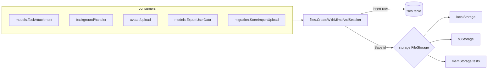

# Files and storage

`pkg/files` is the single blob store for everything Vikunja persists outside the database: task attachments, project backgrounds, uploaded avatars, user data exports, and import uploads. It sits below `pkg/models` in the [backend layering](../../03-backend-architecture.md#package-layering-and-dependency-direction): models import `files`, never the reverse.

## Responsibility

- Owns the `files` table (`pkg/files/files.go` → `File`), the `FileStorage` backend abstraction, size enforcement, mime detection, and the startup validation of the storage location.
- Does **not** own permissions. Every consumer (attachment, background, avatar, export) checks `Can*` on its own model before touching a file; `pkg/files` trusts its callers.
- Does **not** know about HTTP. Streaming responses live in `pkg/web/files/` (`WriteFileDownload`, `WriteAttachmentDownload`, `WriteProjectBackground`).

## Entry points and public API

| Entry | Where | Called by |
|---|---|---|
| `InitFileHandler(ctx)` | `pkg/files/filehandling.go` | `pkg/initialize/init.go` → `FullInitWithoutAsync` |
| `InitStorageBackend(ctx)` | `filehandling.go` | `InitFileHandler`; `pkg/doctor/files.go` (without creating anything) |
| `Create`, `CreateWithSession`, `CreateWithMime`, `CreateWithMimeAndSession` | `files.go` | attachments, backgrounds, avatars, exports, import uploads |
| `(*File).LoadFileByID`, `LoadFileMetaByID`, `Save`, `Delete` | `files.go` | all consumers |
| `DeleteBlob(id)` | `files.go` | `pkg/modules/migration/import_upload.go` (orphan cleanup after rollback) |
| `FileStat(f)` | `filehandling.go` | `pkg/modules/background/handler/background.go` → `LoadProjectBackgroundForDownload` |
| `Dump()` | `dump.go` | `vikunja dump` (see [cli-commands](./cli-commands.md)) |
| `RepairFileMimeTypes(s, dryRun)` | `repair.go` | `vikunja repair file-mime-types` (`pkg/cmd/repair_file_mime_types.go`) |
| `InitTests`, `InitTestFileHandler`, `InitTestFileFixtures` | `filehandling.go` | `TestMain` in `pkg/files`, `pkg/models`, `pkg/webtests` |

## Key types and functions

| Name | File | Notes |
|---|---|---|
| `File` | `files.go` | Columns `id`, `name`, `mime` (nullable), `size` (uint64), `created`, `created_by_id`. `File io.ReadCloser` and `FileContent []byte` are `xorm:"-"`; `FileContent` exists only for the vikunja-file importer. The blob is stored under the decimal string of `ID`, so `Save` can only run after the row is inserted. |
| `CreateWithMimeAndSession(s, r, name, size, auth, mime, checkLimit)` | `files.go` | The real implementation; the other `Create*` wrappers sniff the mime with `mimetype.DetectReader` and/or open their own session. Measures the reader itself (`measureReaderSize`) and ignores the caller's `realsize` except to log a mismatch (GHSA-qh78-rvg3-cv54). With `checkLimit` true, anything over `config.GetMaxFileSizeInMBytes()` MB returns `ErrFileIsTooLarge`. Row is inserted first, then `Save` writes the blob; on write failure the row stays in the caller's transaction, so callers must roll back. |
| `(*File).Delete(s)` | `files.go` | Deletes the row (0 rows → `ErrFileDoesNotExist`), then the blob. A `*os.PathError` from the blob removal is logged and swallowed; other storage errors are returned. |
| `LoadFileByID` vs `LoadFileMetaByID(s)` | `files.go` | The first opens the blob (`fs.ErrNotExist` → `ErrFileDoesNotExist`, i.e. 404, not 500); the second loads the DB row in the caller's session. `LoadFileMetaByID` takes the session on purpose: it used to open its own and deadlocked the pool (commit `044106508`). |
| `FileStorage` | `storage.go` | `Open`, `Write`, `Stat`, `Remove`, `MkdirAll`, `Ensure` (the only place allowed to create storage), `ValidateBasePath`. `contextStorage` is an optional extra interface (`writeContext`, `removeContext`) implemented by S3 so startup validation honours the caller's context. |
| `localStorage` | `storage_local.go` | Files under `files.basepath`; `Ensure` only calls `MkdirAll` when the path does not exist. |
| `s3Storage` | `storage_s3.go` | AWS SDK v2; keys are `path.Join(basePath, id)`. 404s are translated to `*os.PathError{Err: os.ErrNotExist}` by `s3ToPathError` so `errors.Is(err, fs.ErrNotExist)` works across backends. `Remove` does a `HeadObject` first so missing files error consistently. `Ensure`/`ValidateBasePath` are no-ops. |
| `memStorage` | `storage_mem.go` | Map-backed, mutex-guarded; used by every Go test via `InitTestFileHandler`. |
| `gcsHTTPSigner` | `filehandling.go` | When `files.s3.endpoint` is exactly `https://storage.googleapis.com`, wraps the V4 signer to drop `Accept-Encoding` before signing and sets `RequestChecksumCalculationWhenRequired` (commit `7ae80c073`, issue #2920). |
| `ValidateFileStorage(ctx)` | `filehandling.go` | Writes and removes `.vikunja-check-<nanos>`; error text is suffixed with `storageDiagnosticInfo` (uid/gid, dir owner, user-namespace hint for rootless Docker) on Unix (`diagnostics_unix.go`); Windows returns an empty string. |
| `Dump()` | `dump.go` | Returns `map[fileID]io.ReadCloser` for every row; rows whose blob is missing are skipped silently. |
| `RepairFileMimeTypes` | `repair.go` | Re-sniffs every row with `mime = '' OR mime IS NULL`, with a progress bar; per-file failures are collected in `RepairMimeTypesResult.Errors`, not fatal. |

## Internal structure

Package-level state: `storage` (the active backend) and `x` (a dedicated `*xorm.Engine` set by `SetEngine`, used only by `Dump`). Everything else takes the caller's session.

### How each consumer uses it

| Consumer | Create path | Size limit? | Read path | Delete path |
|---|---|---|---|---|
| Task attachments (`pkg/models/task_attachment.go`) | `NewAttachment` → `files.CreateWithSession` (same session, no nested tx). `ErrFileIsTooLarge` is re-wrapped as `ErrTaskAttachmentIsTooLarge`. `UploadTaskAttachments` checks `CanCreate` once, then processes each file independently and returns `success`/`failures`; the HTTP layer answers 200/201 even on partial failure (`pkg/web/files/task_attachment.go` → `BuildUploadResult`). | yes | `GetTaskAttachmentForDownload` commits the DB session **before** opening the blob; image previews (`?preview_size=sm|md|lg|xl` → 100/200/400/800 px) are built by `GetPreview`, validated with `imageutils.ValidateConfig` against decompression bombs, PNG-encoded, and cached in keyvalue under `task_attachment_preview_<id>_size_<size>`. | `Delete` tolerates a missing blob (`IsErrFileDoesNotExist` → nil). Cover image: `Task.CoverImageAttachmentID` (`tasks.go:130`) must reference an attachment of the same task (checked around `tasks.go:1541`). |
| Project backgrounds (`pkg/modules/background/`) | `handler.SaveBackgroundFile`: sniff mime, `imageutils.ValidateReader` (GHSA-4vh2-39rq-rq8j), decode, `imaging.Fit` to `background.MaxBackgroundImageHeight` (3840) on both axes, re-encode as JPEG q80, `files.CreateWithSession`, then `CreateBlurHashFromImage` (4x3 components via `go-blurhash`) and `upload.Provider.Set` → `models.SetProjectBackground`. `ValidateAndSaveBackgroundUpload` additionally restricts to `allowedImageMimes`. | yes (after resize) | `LoadProjectBackgroundForDownload` → `LoadFileByID` + `FileStat`; fires `unsplash.Pingback` for Unsplash-sourced files (required by Unsplash guidelines). | `upload.Provider.Set` deletes the previous background file first; `RemoveProjectBackground` clears it. |
| Unsplash backgrounds (`background/unsplash/`) | `Provider.Set` downloads the photo and stores it as a file; photo metadata cached in keyvalue under `unsplash_photo_<id>`; the empty-search "wallpaper topic" result is cached in memory for one hour. `proxy.go` streams full/thumb images through the API so the browser never talks to Unsplash. | | | |
| Avatars (`pkg/modules/avatar/`) | `StoreUploadedAvatar`: mime must start with `image`, `image.DecodeConfig` must succeed (SVG/WebP are rejected with `ErrNotAnImage`, mapped to 400), `imageutils.ValidateConfig`, then `upload.StoreAvatarFile` fits to 1024x1024 and writes a file, deleting the user's previous `AvatarFileID`. | yes: `StoreAvatarFile` stores the resized PNG via `files.CreateWithMimeAndSession(..., "image/png", true)` | `GetAvatarForUsername` picks the provider from `user.AvatarProvider` (`gravatar`, `initials`, `upload`, `marble`, `ldap`, `openid`, else `empty`), forces `botmarble` for bots and `empty` for unknown users, and clamps `size` to `service.maxavatarsize`. `upload` and `gravatar` cache per user+size in keyvalue (`avatar_upload_<uid>_<size>`, gravatar keyed by username with `avatar.gravatarexpiration` TTL and singleflight). `AsDataURI(u, 20)` is used for inline avatars in notification mails and mentions. | `FlushAllCaches(u)` iterates every provider's `FlushCache`; called from `user_settings.go`, LDAP and OpenID sync. |
| User data export (`pkg/models/export.go`) | `ExportUserData` writes a temp zip (`data.json`, `filters.json`, `VERSION`, attachment blobs, background blobs), then `files.CreateWithMimeAndSession(..., "application/zip", false)` – **no size limit** – sets `user.ExportFileID`, deletes the temp file, and sends `DataExportReadyNotification`. | no | `GetUserDataExportFile` (metadata, in session) then `OpenUserDataExportFile` (blob, after commit); v2 `POST /user/export/download` streams via `WriteFileDownload`. `GetUserDataExportStatus` reports a 7-day expiry. | `RegisterOldExportCleanupCron` (hourly) deletes export files older than 7 days and clears `export_file_id`. |
| Import uploads (`pkg/modules/migration/import_upload.go`) | `StoreImportUpload` stores the raw upload as `<migrator>-import` with mime `application/octet-stream` and no limit, records `migration_status.upload_file_id`; blob orphaned by a rollback is removed with `DeleteBlob`. | no | `OpenImportUpload` copies the blob to a local temp file so importers get an `io.ReaderAt`. | `RegisterImportUploadCleanupCron` (hourly) removes uploads of unclaimed or stale-claimed rows. Details in [importers](./importers.md). |

### HTTP surface

| Route | Handler | Notes |
|---|---|---|
| v1 `PUT /tasks/:task/attachments`, `GET .../:attachment`, `GET`, `DELETE` | `pkg/routes/api/v1/task_attachment.go`, `WebHandler` for list/delete | Multipart field `files`; `Bind` fails → 400 |
| v2 `POST /tasks/{task}/attachments` and siblings | `pkg/routes/api/v2/task_attachments.go` | Uses `huma.MultipartFormFiles`; upload/download own their session because no `handler.Do*` fits |
| v2 `PUT /projects/{project}/backgrounds/upload`, unsplash search/set/proxy | `pkg/routes/api/v2/backgrounds.go` | Registered only when the matching `backgrounds.*` flags are on (same for v1 in `routes.go:894-916`) |
| v2 `PUT /user/settings/avatar`, `GET /avatar/{username}` | `pkg/routes/api/v2/avatar_upload.go`, `avatar.go` | `GET /avatar/:username` is unauthenticated |
| v2 `POST /user/export/request`, `POST /user/export/download`, `GET /user/export` | `pkg/routes/api/v2/user_export.go` | Download is a POST because the password travels in the body |

Body limits: Echo's global `BodyLimit((maxFileSize+2) MB)` (`pkg/routes/routes.go:206-208`) and, for v2 multipart operations, `withUploadLimits` (`pkg/routes/api/v2/huma.go:191-197`) sets `op.MaxBodyBytes` to the same value and `BodyReadTimeout` to 15 min (Huma's default 5 s deadline spans the whole body). The +2 MB is headroom for multipart boundaries and headers.

## Dependencies

- **Uses:** `pkg/config`, `pkg/db`, `pkg/log`, `pkg/web` (error interface), `pkg/modules/keyvalue` (tests only, via `InitTests`), `pkg/utils` (user-namespace helpers), `github.com/gabriel-vasile/mimetype`, AWS SDK v2, `progressbar`.
- **Used by:** `pkg/models` (attachments, export, project background), `pkg/modules/background`, `pkg/modules/avatar/upload`, `pkg/modules/migration`, `pkg/cmd` (dump/restore/repair), `pkg/doctor`, `pkg/web/files`.

## Invariants and assumptions

- The blob name is always `strconv.FormatInt(f.ID, 10)`; nothing else may write to storage. `Dump`, `Delete`, `LoadFileByID`, `repair.go` all rely on it.
- `storage.Ensure()` is the only code allowed to create the base directory (`storage.go` comment, tests `TestInitStorageBackend_DoesNotCreateBasePath`, `pkg/doctor/files.go` after commit `5d27f57cc`).
- Every backend returns `os.ErrNotExist`-compatible errors for missing blobs; `LoadFileByID`, `DeleteBlob` callers and `Dump` check `errors.Is(err, fs.ErrNotExist)`.
- Size is measured, never trusted. `TestCreate_HardenedAgainstLyingCaller` (`files_test.go`) pins this.
- Consumers that read a blob after DB work commit first (`GetTaskAttachmentForDownload`, `OpenUserDataExportFile` comment) so an S3 round trip never holds a DB connection.
- Tests reset the limit to 20 MB via `initFixtures` → `config.SetMaxFileSizeMBytesFromString("20MB")`.

## Configuration

| Key (`config.yml`) | Env var | Effect |
|---|---|---|
| `files.basepath` (default `./files`) | `VIKUNJA_FILES_BASEPATH` | Local directory, or the key prefix inside the S3 bucket; resolved with `config.ResolvePath` for local |
| `files.maxsize` (default `20MB`) | `VIKUNJA_FILES_MAXSIZE` | Parsed by `config.SetMaxFileSizeMBytesFromString` → `GetMaxFileSizeInMBytes`; feeds both the Echo body limit and `CreateWithMimeAndSession`. There is **no** `service.maxfilesize` key. |
| `files.type` (`local` \| `s3`) | `VIKUNJA_FILES_TYPE` | Anything else fails startup in `InitStorageBackend` |
| `files.s3.endpoint`, `.bucket`, `.region`, `.accesskey`, `.secretkey` | `VIKUNJA_FILES_S3_*` | All but region are required when type is `s3` |
| `files.s3.usepathstyle` | | Needed for MinIO and most non-AWS providers |
| `files.s3.disablesigning` | | Swaps in the unsigned-payload middleware |
| `files.s3.tempdir` | | Declared in `config.go` with default `""` but no reader anywhere in `pkg/` (grep on 2026-09-16); dead key |
| `service.maxavatarsize` (default 1024) | | Clamp for requested avatar sizes |
| `avatar.gravatarexpiration` (3600 s), `avatar.gravatarbaseurl` | | Gravatar cache TTL and Libravatar-style base URL (trailing slash trimmed at init) |
| `backgrounds.enabled`, `backgrounds.providers.upload.enabled`, `backgrounds.providers.unsplash.enabled`, `.accesstoken`, `.applicationid` | | Route registration gates; Unsplash needs both credentials |
| `migration.vikunjafile.maxsize` (256MB), `.maxfiles` (10000), `.maxuserstorage` (1GB) | | Bounds for re-importing exports; see [importers](./importers.md) |

## Error handling

| Error | Code | HTTP | Raised by |
|---|---|---|---|
| `ErrFileDoesNotExist` | 4034 | 404 | `LoadFileByID`, `LoadFileMetaByID`, `Delete` |
| `ErrFileIsTooLarge` | 4035 | 413 | `CreateWithMimeAndSession`; also synthesised by `pkg/routes/error_handler.go:91-98` whenever Echo's body limit trips (413 or `errors.Is(err, echo.ErrStatusRequestEntityTooLarge)`), so oversized multipart bodies get a domain error instead of a bare 413 |
| `ErrFileIsNotUnsplashFile` | none | n/a | Has no `HTTPError`; internal to `unsplash.Pingback` |
| `handler.ErrFileIsNoImage`, `ErrFileUnsupportedImageFormat` | `pkg/modules/background/handler/errors.go` | 400 | Background upload validation |
| `avatar.ErrNotAnImage` | sentinel | 400 in the avatar route | `StoreUploadedAvatar` |

Code 4035 moved off a colliding task-sort code in commit `e3b56634b` (breaking change flagged with `!`). Storage failures during `Delete` of the blob are logged, not returned; `Dump` skips missing blobs silently.

## Tests

| Test | Covers |
|---|---|
| `pkg/files/files_test.go` | `Create` normal/too large/lying caller/mime detection, `Delete`, `LoadFileByID`, `LoadFileMetaByID`, `Save` goes through storage |
| `storage_local_test.go`, `storage_mem_test.go` | Each backend's `Ensure`/`ValidateBasePath`/CRUD semantics |
| `filehandling_init_test.go` | `InitStorageBackend` does not create the dir, `InitFileHandler` does, validation failures |
| `s3_test.go` → `TestFileStorageIntegration` | Skips unless `VIKUNJA_FILES_TYPE=s3`; CI job in `.github/workflows/test.yml` (around line 346) runs a `bitnamilegacy/minio` service with bucket `vikunja-test` and `./mage-static test:filter "TestFileStorageIntegration"`. Also unit tests for S3 config validation and context propagation that run everywhere. |
| `pkg/web/files/task_attachment_test.go` | `BuildUploadResult` shape |
| `pkg/modules/avatar/*/*_test.go`, `inline_profile_picture_test.go` | Provider output and data URIs |
| `pkg/webtests` | `task_attachment_upload_test.go`, `task_attachment_idor_test.go`, `huma_task_attachment_test.go`, `huma_background_{,upload_,download_}test.go`, `background_test.go`, `huma_avatar{,_upload}_test.go`, `link_share_avatar_test.go`, `user_export_{download,status}_test.go`, `huma_user_export_test.go` |

Run: `mage test:filter TestCreate` (package tests use the in-memory backend and the `files` fixture). Local S3 run needs the CI env block above plus a MinIO on `:9000`.

## Gotchas and tech debt

- `files.s3.tempdir` is configured but unused.
- `File.FileContent` is a migration-only escape hatch ("Use with care!", `files.go:50-52`).
- `File.Delete` swallows `*os.PathError` from the storage layer, so a permission problem on the files directory leaves orphaned blobs without failing the request.
- `Dump()` uses the package engine `x`, not a session, and silently drops rows whose blob is gone; `vikunja dump` therefore never fails on a half-broken files directory.
- `WriteFileDownload` (`pkg/web/files/file.go`) only gets `Range` support when the reader is seekable (local `*os.File`); S3 and mem readers fall back to a manual `If-Modified-Since` + `io.Copy`.
- Export and import uploads bypass the size limit by design (`checkFileSizeLimit=false`); the export path can therefore exceed `files.maxsize`.
- The 2 MB multipart headroom is duplicated in `routes.go` and `huma.go`; change both.
- Security history: GHSA-qh78-rvg3-cv54 (attacker-controlled size metadata on import), GHSA-4vh2-39rq-rq8j (decompression bombs in avatars/backgrounds/previews). Recent hotspot commits: `fe52d4e23`/`cb813c46a` (404 on missing blob), `bf5f91561` (S3 calls bound to context), `2d0139915` (base path handling moved onto `FileStorage`).

## Related pages

- [models-tasks](./models-tasks.md) for attachment permissions and the cover image field
- [models-projects-and-permissions](./models-projects-and-permissions.md) for `SetProjectBackground`
- [importers](./importers.md), [cron-and-background-jobs](./cron-and-background-jobs.md), [cli-commands](./cli-commands.md) (dump/restore/repair)
- [operations-subsystems](./operations-subsystems.md#keyvalue) for the caches used by previews and avatars
- [http-routing-and-middleware](./http-routing-and-middleware.md) for the body limit and error handler
- [config-and-logging](./config-and-logging.md), [06 Data model](../../06-data-model.md)
