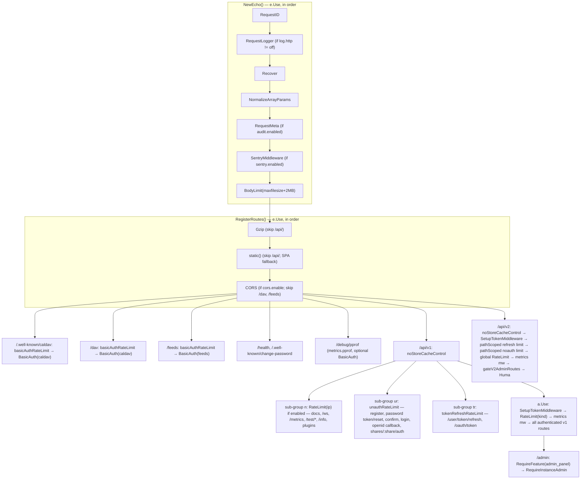

# HTTP routing and middleware

The Echo layer that turns a TCP connection into a call on a v1 `WebHandler` or a v2 Huma handler: server construction, the global middleware chain, route groups, rate limiting, CORS, static frontend serving, the v1 error handler, feature and admin gates, metrics and pprof. Everything here lives in `pkg/routes/` (not `pkg/routes/api/`). See [Backend architecture, request pipeline](../../03-backend-architecture.md#request-pipeline) for where this sits.

## Responsibility

- Owns: `NewEcho()` and `RegisterRoutes()`, every `echo.MiddlewareFunc` in `pkg/routes/*.go` and `pkg/routes/middleware/`, the four rate limiters, CORS origin matching, the embedded SPA handler, the centralised v1 error handler, `/health`, `/api/v1/metrics`, `/debug/pprof`, and the startup walk that feeds the API-token permission table.
- Does not own: what the JWT/API-token middleware accepts (`./auth-and-sessions.md`), the v1 handler bodies (`./api-v1.md`), Huma setup and error translation (`./api-v2-huma.md`), CalDAV and feed handlers (`./caldav.md`, `./notifications-and-mail.md`), the token permission derivation itself (`pkg/models/api_routes.go`, documented in `./auth-and-sessions.md`).

## Entry points and public API

| Entry | Where | Called by |
|---|---|---|
| `NewEcho()` | `pkg/routes/routes.go` | `pkg/cmd/web.go`, `pkg/webtests/integrations.go` → `setupTestEnv` |
| `RegisterRoutes(e)` | `pkg/routes/routes.go` | same |
| `SetupTokenMiddleware()` | `pkg/routes/api_tokens.go` | `registerAPIRoutes`, `registerAPIRoutesV2` |
| `RateLimit(limiter, kind)`, `setupRateLimit`, `unauthRateLimit`, `tokenRefreshRateLimit`, `basicAuthRateLimit` | `pkg/routes/rate_limit.go` | `RegisterRoutes`, both `registerAPIRoutes*` |
| `RequireFeature(f)`, `RequireInstanceAdmin()` | `pkg/routes/feature_gate.go`, `pkg/routes/admin_gate.go` | v1 `/admin` group (`routes.go:973`), `gateV2AdminRoutes` |
| `ResolveProjectIdentifier()` | `pkg/routes/resolve_project.go` | only `GET /api/v1/projects/:project/tasks/by-index/:index` (`routes.go:710`) |
| `CreateHTTPErrorHandler(e, sentry)` | `pkg/routes/error_handler.go` | `NewEcho` |
| `SentryMiddleware`, `GetSentryHubFromContext`, `GetSentryHubFromRequest` | `pkg/routes/sentry_middleware.go` | `setupSentry`, `reportToSentry`, v2 error bridge |
| `CustomValidator` | `pkg/routes/validation.go` | `e.Validator`; the v2 `Register` wrapper runs govalidator too (`pkg/routes/api/v2/huma.go` comment) |
| `HealthcheckHandler`, `ChangePasswordRedirect` | `pkg/routes/healthcheck.go`, `pkg/routes/change_password.go` | `/health`, `/.well-known/change-password` |
| `NormalizeArrayParams()`, `RequestMeta()` | `pkg/routes/middleware/` | `NewEcho` |
| `corsOriginAllowed(origin)` | `pkg/routes/routes.go` | `mcpmodule.New` (MCP origin check) |

## Key types and functions

| Name | File | What it does |
|---|---|---|
| `matchCORSOrigin` | `routes.go` | Exact match, `*`, or `http://host:*` port wildcard (also matches the origin without a port). Echo v5's CORS rejects port wildcards, hence `UnsafeAllowOriginFunc` |
| `unauthenticatedAPIPaths` | `routes.go` | One map of route templates (v1 and v2) that skip the JWT middleware. Also feeds `collectRoutesForAPITokens` (`requiresJWT`) |
| `unauthenticatedPathSet`, `v2CredentialPaths`, `v2SessionRenewalPaths` | `routes.go` | Package-level sets built at init; **panic** if a path is not in `unauthenticatedAPIPaths` (a typo would silently mean no rate limit) |
| `pathScoped(match, mw)` | `routes.go` | Applies `mw` only when `c.Path()` (the matched **route template**, not the URL) satisfies `match`. Exists because v2 cannot use sub-groups: a second Echo group would split the Huma API and drop ops from the spec |
| `gateV2AdminRoutes` | `routes.go` | For `/api/v2/admin*`: `RequireFeature(FeatureAdminPanel)` → `RequireInstanceAdmin` → `RequireFeature(FeatureUserInvites)` on `/admin/teams` and `/admin/invite-links*` |
| `noStoreCacheControl` | `routes.go` | `Cache-Control: no-store` on every `/api/v1` and `/api/v2` response (browsers otherwise heuristically cache JSON). File downloads override it with `no-cache` (`pkg/web/files/`) |
| `collectRoutesForAPITokens` | `routes.go` | After all registration: `e.Router().Routes()` → `models.CollectRoutesForAPITokenUsage(route, requiresJWT)` for `/api/v1*` and `/api/v2*` |
| `httpLogLevel` | `routes.go` | ≥500 error, ≥400 warn, else info, so `log.httplevel` can hide successes |
| `newIPExtractor`, `withUnixSocketPeer`, `parseTrustedProxies` | `ip.go` | `service.ipextractionmethod` = `xff` / `realip` / anything else = direct; trusted CIDRs from `service.trustedproxies` (invalid entries warn and are skipped). Unix-socket peers (`RemoteAddr == "@"`) are rewritten to `127.0.0.1:0` so proxy headers still get evaluated |
| `basicAuthRateLimitWithClock` | `rate_limit.go` | The reserve-then-refund limiter, see below |
| `static()`, `serveIndexFile`, `generateEtag`, `getCacheControlHeader` | `static.go` | Embedded SPA serving, see below |
| `CreateHTTPErrorHandler` | `error_handler.go` | v1 error → JSON mapping, see below |
| `setupMetrics`, `setupPprof`, `setupMetricsMiddleware`, `metricsBasicAuth` | `metrics.go` | Prometheus at `/api/v1/metrics`, pprof at `/debug/pprof/*`, active-user gauge per request |

## Internal structure

Order facts that matter (all `pkg/routes/routes.go` unless noted):

- `RequestID` is first so logging and audit see the same id; `RequestMeta` must run after it (`middleware/request_meta.go` comment).
- Echo is built with `UnescapePathParamValues: true` (usernames with spaces, issue 1224) and `NoGroupAutoRegister404Routes: true` (multiple groups share `/api/v1`; Echo ≥5.3.0 would panic on duplicate 404 routes).
- The three pre-auth limiters are created **once** in `RegisterRoutes` and shared: CalDAV, feeds and `/api/v2/notifications.atom` draw on the same BasicAuth failure budget.
- v1 keeps credential routes public by registering them in sub-groups (`n`, `ur`, `tr`) **before** `a.Use(SetupTokenMiddleware())`; v2 attaches the token middleware to the whole group and relies on the `unauthenticatedAPIPaths` skipper. Both mechanisms are consulted for v1 (the skipper checks the map too), so a v1 public route must appear in the map to stay out of the token table.
- On both versions the token middleware runs **before** the global `RateLimit`, so `ratelimit.kind = user` can key by user id; unauthenticated requests through the same group are keyed `ip_<ip>` (`rate_limit.go` → `RateLimit`).
- `gateV2AdminRoutes` is attached after rate limiting on purpose: `RequireInstanceAdmin` does a DB read per request.
- `collectRoutesForAPITokens` must be the last call; routes registered later (plugins are registered inside `registerAPIRoutes`, so they are included) would be invisible to API tokens.

### Rate limiters (`pkg/routes/rate_limit.go`)

| Limiter | Prefix | Key | Budget | Applies to | Honors `ratelimit.enabled`? |
|---|---|---|---|---|---|
| `setupRateLimit(group, kind)` | `global` | `ip` → `RealIP()`; `user` → `user_<id>` or `ip_<ip>`; unknown kind → logs error, uses ip | `ratelimit.limit` per `ratelimit.period` s (100/60) | v1 `n` sub-group (always `ip`), v1 authenticated group, whole v2 group | yes (off by default) |
| `unauthRateLimit` | `noauth` | ip | `ratelimit.noauthlimit`/min (10) | v1 `ur`, v1 and v2 `/ws`, `v2CredentialPaths` | **no** (`perMinuteIPRateLimit` comment: pre-auth routes need a floor) |
| `tokenRefreshRateLimit` | `tokenrefresh` | ip | `ratelimit.tokenrefreshlimit`/min (60) | v1 `tr`, `v2SessionRenewalPaths` (`/user/token/refresh`, `/oauth/token`) | no |
| `basicAuthRateLimit` | `basicauth` | `ip:<window>` | `ratelimit.basicauthlimit`/min (10) | `/.well-known/caldav`, `/dav`, `/feeds`, `/api/v2/notifications.atom` | no |

`createRateLimiter` namespaces counters by prefix (`limiter.DefaultPrefix + ":" + prefix`); before commit `bb6318b1a` every limiter shared one Redis budget. Store is `ratelimit.store` = `memory` or `redis` (fatal if Redis is configured but `redis.enabled` is false); `keyvalue` is rewritten to the keyvalue type at config load (`pkg/config/config.go:785`). Every limiter sets `X-RateLimit-Limit/Remaining/Reset`, returns 429 `Too Many Requests` when reached, and 500 on a store error.

**Reserve-then-refund BasicAuth limiter** (`basicAuthRateLimitWithClock`, fixes GHSA-m469-88xx-8rx2 "limit failed bcrypt checks without throttling successful CalDAV syncs"):

1. No `Authorization: Basic` header → pass through; the 401 challenge is not a guess.
2. Key is `ip:<window index>` (`basicAuthRateLimitKey`, `UnixNano / period`), so a refund that lands after the window rolled over can never decrement a newer window.
3. `Increment(+1)` **before** the handler runs, so concurrent guesses cannot all pass the check. If the budget is already reached, the reservation is refunded and 429 returned.
4. After `next(c)`: failure = returned error with status 401 **or** an already-committed 401 response (the BasicAuth middleware writes its own). Success refunds the reservation with `Increment(-1)` on a fresh 1 s context (`refundBasicAuthReservation`), skipped when `now > reset`.

### Static frontend (`pkg/routes/static.go`)

- `setupStaticFrontendFilesHandler`: Gzip (level 6, min 256 bytes, skipped for `/api/`), then `static()` as a global middleware. Anything under `/api/` is passed through untouched.
- `static()`: `path.Join("dist/", path.Clean("/"+p))` on the **already decoded** path (decoding again 500s on a literal `%` and promotes `%2f` to a separator, `TestStaticEncodedPath`). Missing file → call `next`; if that yields a 404 (`echo.HTTPStatusCoder`) the index is served (SPA fallback). Directories serve the index.
- `serveIndexFile`: renders `index.html` **once per process** into `scriptConfigString`: injects a `<script>` after `

` with `window.SENTRY_ENABLED`, `SENTRY_DSN`, `CUSTOM_LOGO_URL`, `CUSTOM_LOGO_URL_DARK`, and rewrites the literal `'/api/v1'` to `'<service.publicurl>api/v1'`. Changing these config keys needs a restart. The index is served without an ETag.
- `generateEtag`: per-file ETag cached forever in `etagCache` (files are embedded, so they cannot change).
- `getCacheControlHeader`: `robots.txt`, `sw.js`, `manifest.webmanifest` → `must-revalidate`; `workbox-*` and asset content types (images, fonts, css, js, svg, ico, wav) → 1 year `immutable`; everything else `must-revalidate`. Every response carries `Server: Vikunja` and `Vary: Accept-Encoding`.

### v1 error handler (`pkg/routes/error_handler.go` → `CreateHTTPErrorHandler`)

Returns early if the response is already committed. Then, on the original error: (1) `echo.HTTPStatusCoder` via `errors.As` (Echo v5's `ErrForbidden` etc. are unexported types), (2) `*echo.HTTPError` message, (3) 413 or `errors.Is(err, echo.ErrStatusRequestEntityTooLarge)` → `files.ErrFileIsTooLarge`, (4) `json.Marshaler` (keeps `ValidationHTTPError.InvalidFields`; status from `GetHTTPCode()`), (5) `web.HTTPErrorProcessor` → `HTTPError()`, (6) else 500. Steps 4 and 5 use `errors.As`, so wrapped domain errors still map. ≥500 goes to Sentry with the request URL and `errorreport.Apply` fingerprints. `HEAD` gets `NoContent`; plain strings are wrapped as `{"message": ...}`.

### Other middleware

- `SentryMiddleware` (`sentry_middleware.go`): clones the hub per request, `scope.SetRequestBody(nil)` (bodies are never sent), stores the hub under `sentryHubKey`, recovers panics into Sentry and re-panics when `Repanic` is set so Echo's `Recover` (earlier in the chain) still produces the 500.
- `NormalizeArrayParams` (`middleware/array_param_normalizer.go`): rewrites `foo[]=x` to `foo=x` in the raw query, preserving order (needed for `sort_by`/`order_by`); fast path skips requests without `[]`.
- `RequestMeta` (`middleware/request_meta.go`): only when `audit.enabled`; stashes IP, User-Agent and `X-Request-Id` via `events.WithRequestMeta` so `DispatchWithContext` carries them.
- `CustomValidator` (`validation.go`): govalidator; failures become `models.InvalidFieldError` (412, code 2002, `invalid_fields`). Custom tags: `time` (`15:04`), `dbtext` (65 000 chars on MySQL/unknown, 1 MiB on postgres/sqlite3).
- `RequireFeature` returns `echo.ErrNotFound` (404, not 403) so gated routes are indistinguishable from unregistered ones. `RequireInstanceAdmin` also 404s, re-reads `is_admin` from the DB (a demoted admin's JWT still says `is_admin: true`), closes the session before `next()` (SQLite deadlock), and dispatches `models.AdminAccessDeniedEvent` only for a confirmed non-admin user (not for link shares or missing claims).
- `ResolveProjectIdentifier`: `:project` that is not all digits is looked up by upper-cased `identifier` and rewritten to the numeric id; digit-only identifiers are therefore unreachable through this route (documented in the code). v2 handles the same case inside `pkg/routes/api/v2/tasks.go` (comment at line 302).
- `HealthcheckHandler`: `health.Check()` pings the DB and, when `redis.enabled`, Redis; returns `OK` or 500.
- `setupMetrics`: `/api/v1/metrics` in the unauthenticated `n` sub-group when `metrics.enabled`; BasicAuth with constant-time compare only if both `metrics.username` and `metrics.password` are set. `setupPprof`: `/debug/pprof/{cmdline,profile,symbol,trace,/,*}` on the root Echo when `metrics.enabled && metrics.pprof`, same optional BasicAuth, explicit handlers rather than the `net/http/pprof` blank import (which would register on `DefaultServeMux`). `setupMetricsMiddleware` bumps the active-user/link-share gauges when `auth2.HasAuthInContext`.
- `/.well-known/change-password` → 302 to `<publicurl>user/settings/password-update` (W3C change-password URL).

## Dependencies

- **Uses:** `pkg/config`, `pkg/log`, `pkg/license`, `pkg/health`, `pkg/metrics`, `pkg/red`, `pkg/events`, `pkg/errorreport`, `pkg/models` (route collection, `AdminAccessDeniedEvent`, `Project` lookup), `pkg/modules/auth` (`HasAuthInContext`, `GetAuthFromClaims`), `pkg/modules/humabridge`, `pkg/modules/mcp`, `pkg/web` (`HTTPErrorProcessor`), `frontend` (embedded `dist/`), `github.com/ulule/limiter/v3`, `github.com/labstack/echo/v5`, `github.com/labstack/echo-jwt/v5`, `github.com/getsentry/sentry-go`, `github.com/hhsnopek/etag`.
- **Used by:** `pkg/cmd/web.go` (serves), `pkg/webtests/integrations.go` (`setupTestEnv` builds the real Echo), `pkg/routes/api/v2/errors.go` (Sentry hub from request).

## Invariants and assumptions

- Every path in `v2CredentialPaths` and `v2SessionRenewalPaths` is in `unauthenticatedAPIPaths`; `unauthenticatedPathSet` panics at package init otherwise.
- `pathScoped` matchers compare against the Echo route template (`/api/v2/shares/:share/auth`), never a concrete URL; the map keys use the same template form.
- A route is invisible to API tokens unless it is registered before `collectRoutesForAPITokens(e)` and is **not** in `unauthenticatedAPIPaths` (`requiresJWT`).
- `static()` never handles `/api/` paths; the SPA fallback therefore cannot mask an API 404.
- `RateLimit` assumes the token middleware already ran when `kind == "user"`; putting it earlier silently degrades to per-IP keys.
- `RequireInstanceAdmin` assumes `auth2.GetAuthFromClaims` returns a `*user.User`; link shares are rejected with 404.
- The BasicAuth limiter assumes failures surface as HTTP 401 (returned or committed); a handler that fails auth with another status is never charged.

## Configuration

| Key (`config.yml`) | Env var | Effect |
|---|---|---|
| `service.ipextractionmethod` (`direct`) / `service.trustedproxies` | `VIKUNJA_SERVICE_IPEXTRACTIONMETHOD` / `..._TRUSTEDPROXIES` | `xff`, `realip` or direct; comma-separated CIDRs trusted for proxy headers |
| `service.publicurl` | `VIKUNJA_SERVICE_PUBLICURL` | Injected into `index.html` as the API base; appended to CORS origins at config load (`config.go:830`); change-password redirect target |
| `service.maxfilesize` | `VIKUNJA_SERVICE_MAXFILESIZE` | `BodyLimit` = value + 2 MB |
| `service.customlogourl`, `service.customlogourldark`, `sentry.frontendenabled`, `sentry.frontenddsn` | `VIKUNJA_SERVICE_CUSTOMLOGOURL` … | Values injected into the index script tag (read once) |
| `sentry.enabled`, `sentry.dsn` | `VIKUNJA_SENTRY_ENABLED`, `VIKUNJA_SENTRY_DSN` | Sentry middleware and 5xx reporting |
| `log.http` (`off` disables), `log.httplevel`, `log.enabled`, `log.format` | `VIKUNJA_LOG_HTTP` … | Request logger |
| `audit.enabled` | `VIKUNJA_AUDIT_ENABLED` | Adds `RequestMeta` |
| `cors.enable`, `cors.origins` (`http://127.0.0.1:*`, `http://localhost:*` + public URL), `cors.maxage` (0) | `VIKUNJA_CORS_ENABLE` … | CORS middleware with credentials |
| `ratelimit.enabled` (false), `ratelimit.kind` (`user`), `ratelimit.limit` (100), `ratelimit.period` (60), `ratelimit.store` (`memory`) | `VIKUNJA_RATELIMIT_*` | Global limiter |
| `ratelimit.noauthlimit` (10), `ratelimit.tokenrefreshlimit` (60), `ratelimit.basicauthlimit` (10) | `VIKUNJA_RATELIMIT_NOAUTHLIMIT` … | Always-on per-minute floors |
| `metrics.enabled`, `metrics.username`, `metrics.password`, `metrics.pprof` (false) | `VIKUNJA_METRICS_*` | Prometheus endpoint, its BasicAuth, pprof |
| `service.enablecaldav`, `service.enablelinksharing`, `service.enabletotp`, `service.testingtoken`, `auth.local.enabled`, `auth.ldap.enabled`, `auth.openid.enabled`, `plugins.enabled`, `webhooks.enabled`, `service.enableuserdeletion`, `migration.*.enable` | | Gate whole route blocks in `registerAPIRoutes`; v2 registrars check the same flags themselves |

## Error handling

- Middleware-level auth failure: 401 `{"code":11,"message":"missing, malformed, expired or otherwise invalid token provided"}` (`pkg/routes/api_tokens.go` → `ErrCodeInvalidToken`), identical on both versions.
- Rate limit: 429 `Too Many Requests` (Echo `HTTPError`, so v1 renders `{"message":"Too Many Requests"}`); store failure 500, logged with the key and URL.
- Feature/admin gates: 404 via `echo.ErrNotFound`; never 403.
- Validation: 412 `ValidationHTTPError` code 2002 (`pkg/models/error.go` → `InvalidFieldErrorWithMessage`).
- Body too large: 413 → `files.ErrFileIsTooLarge`.
- Panics: `Recover` → 500; with Sentry enabled the Sentry middleware captures first and re-panics.
- Static: an unreadable embedded file returns the raw error (500); missing files fall back to the SPA index.
- 5xx from any v1 handler → Sentry via `reportToSentry`; log line at error level by `httpLogLevel`.

## Tests

| What | Where | Run |
|---|---|---|
| Rate limiter keys, unknown kind, BasicAuth reserve/refund concurrency, expired reservation, canceled context | `pkg/routes/rate_limit_test.go` | `mage test:filter TestRateLimit`, `mage test:filter TestBasicAuthRateLimit` |
| IP extractor modes and unix-socket peer | `pkg/routes/ip_test.go` → `TestNewIPExtractor` | `mage test:filter TestNewIPExtractor` |
| Static encoded paths, existing file, `/api` passthrough | `pkg/routes/static_test.go` | `mage test:filter TestStatic` |
| Error handler mapping | `pkg/routes/error_handler_test.go` → `TestCreateHTTPErrorHandler` | `mage test:filter TestCreateHTTPErrorHandler` |
| pprof gating, change-password redirect | `pkg/routes/pprof_test.go`, `pkg/routes/change_password_test.go` | |
| `foo[]` normalisation and order | `pkg/routes/middleware/array_param_normalizer_test.go` | `mage test:filter TestNormalizeArrayParams` |
| End-to-end limits through the real router (v2 unauth, BasicAuth budget, token refresh, `/ws`) | `pkg/webtests/unauth_rate_limit_test.go`, `huma_rate_limit_test.go`, `token_refresh_rate_limit_test.go`, `ws_rate_limit_test.go` | `go test -run TestV2UnauthRateLimit ./pkg/webtests/` (webtests skip under `mage test:filter` because it passes `-short`; see the `api-v2-routes` skill) |
| Expand-scope route list matches registered routes | `pkg/webtests/expand_scope_routes_test.go` | |

Not covered: `matchCORSOrigin` has no test in `pkg/routes` (grep found it only in `routes.go`); `RequireInstanceAdmin` and `gateV2AdminRoutes` are exercised only indirectly through admin webtests (Unverified: which ones).

## Gotchas and tech debt

- `pkg/routes/routes.go` is a hotspot: 241 commits, 1096 lines, and every v1 route lives there. New routes must not touch it (v2 self-registers via `init()`; see [api-v2-routes skill](../../../skills/api-v2-routes/SKILL.md)).
- No `TODO`/`FIXME` markers exist in `pkg/routes/*.go` or `pkg/routes/middleware/` (grep on 2026-09-16). Security history in comments: GHSA-m469-88xx-8rx2 (`rate_limit.go:129`).
- `setupSentry` runs `defer sentry.Flush(5 * time.Second)` inside the setup function (`routes.go:228`), so the flush happens right after init. It is the only `sentry.Flush` call under `pkg/` (grep 2026-09-16), so events buffered at shutdown are not flushed explicitly.
- `serveIndexFile` checks `scriptConfigString == ""` before taking `scriptConfigStringLock` and does not re-check after; two first requests may render twice (idempotent, so harmless).
- The frontend's `window.API_URL` rewrite depends on the literal `'/api/v1'` in `frontend/index.html`; renaming it there silently breaks split-host deployments.
- `ratelimit.kind = user` keys API-token requests by the token owner's id (`GetAuthFromClaims` returns `api_user`), so one busy bot shares its owner's budget.
- `pprof` is mounted on the root Echo, outside `/api/`, so it is subject to the static middleware (harmless, falls through) and to CORS (not skipped).
- `/api/v1/metrics` sits in the `n` sub-group, which gets the global `RateLimit(ip)` when `ratelimit.enabled`; a scraper on a shared IP can be throttled.
- v1 unauthenticated plugin routes hang off `n`, which has no `unauthRateLimit` floor, only the optional global limiter.
- The comment in `NewEcho` about `NoGroupAutoRegister404Routes` documents why several groups share `/api/v1`; removing that option panics at startup.

## Related pages

- [auth-and-sessions](./auth-and-sessions.md) — what `SetupTokenMiddleware` accepts and how token scopes are derived from the routes collected here
- [api-v1](./api-v1.md), [api-v2-huma](./api-v2-huma.md) — the handlers these groups dispatch to
- [crud-framework](./crud-framework.md) — the `Do*` pipeline behind `WebHandler`
- [caldav](./caldav.md), [websocket](./websocket.md), [mcp](./mcp.md), [operations-subsystems](./operations-subsystems.md) (license gates, metrics, health), [config-and-logging](./config-and-logging.md), [plugins](./plugins.md)
- [Backend architecture](../../03-backend-architecture.md), [API contract](../../05-api-contract.md), [Debugging](../../12-debugging.md)
- Playbooks: [add-api-endpoint](../../playbooks/add-api-endpoint.md), [fix-a-bug](../../playbooks/fix-a-bug.md)
