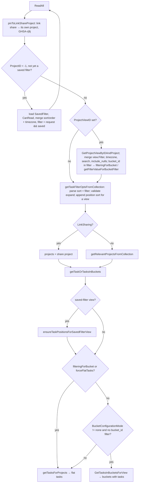

# Models: filtering and search

How a task list request becomes SQL: the `TaskCollection` DTO, the filter DSL parser, sorting rules, the `dbTaskSearcher` query builder, saved filters (pseudo projects `-(id+1)`) and the machinery that keeps their kanban views populated. Everything lives in `pkg/models`; the frontend half of the DSL is `frontend/src/helpers/filters.ts`. Read [models-tasks](./models-tasks.md) for the `Task` struct and [models-views-and-kanban](./models-views-and-kanban.md) for what happens when the view is a kanban.

## Responsibility

- Owns: parsing and validating filter strings (`task_collection_filter.go`), sort parameters (`task_collection_sort.go`), turning both into `xorm.io/builder` conditions and running them (`task_search.go`), the request-level orchestration (`task_collection.go`), saved filters and their views (`saved_filters.go`), and the sibling time-entry parser (`time_tracking_filter.go`).
- Does not own: full-text infrastructure (`pkg/db/helpers.go`, ParadeDB detection in `pkg/db`), bucket resolution for kanban views (`kanban.go` → `GetTasksInBucketsForView`), project access resolution (`project_access.go` → `accessibleProjectIDsCond`, `getRawProjectsForUser`).

## Entry points and public API

| Entry | Where | Called by |
|---|---|---|
| `TaskCollection.ReadAll` | `task_collection.go` | v1 `GET /tasks/all`, `/projects/:project/tasks`, `/projects/:project/views/:view/tasks`; v2 `pkg/routes/api/v2/task_collection.go` → `tasks-list`, `project-tasks-list`, `project-view-tasks-list` (flat, `SetForceFlatTasks`), `project-view-buckets-tasks-list` (buckets) |
| `getTaskFiltersFromFilterString`, `prepareFilterForParsing`, `preprocessFilterString` | `task_collection_filter.go` | collections, `SavedFilter.Create/Update`, `validateProjectViewFilters`, `RecalculateTaskPositions`, `GetTasksInBucketsForView` |
| `parseFilterCond` | `saved_filters.go` | positions healing, saved-filter matching, `filteredTasksWithoutBucketInView` |
| `convertFiltersToDBFilterCond(WithAlias)` | `task_search.go` | `dbTaskSearcher.Search`, subtask root condition |
| `getRawTasksForProjects`, `getTasksForProjects` | `tasks.go` | collections, buckets, `RecalculateTaskPositions` |
| `SavedFilter.Create/ReadOne/Update/Delete`, `GetSavedFilterSimpleByID`, `GetSavedFilterIDFromProjectID` | `saved_filters.go` | v2 `filters-*` routes (`saved_filters.go`), projects listing (`ToProject`), views, positions |
| `RegisterAddTaskToFilterViewCron` | `saved_filters.go` | `pkg/initialize/init.go` |
| `UpdateTaskInSavedFilterViews`, `UpdateTasksBatchInSavedFilterViews` | `listeners.go` | `task.updated`, `tasks batch created` events |
| `timeEntryFilterCond` | `time_tracking_filter.go` | `time_tracking.go` listing |

## Key types and functions

| Name | File | What it does |
|---|---|---|
| `TaskCollection` | `task_collection.go` | Request DTO: `ProjectID`, `ProjectViewID` (path), `Search` (`s`), `SortBy[]`, `OrderBy[]`, `Filter`, `FilterTimezone`, `FilterIncludeNulls`, `Expand[]`; private `isSavedFilter`, `forceFlatTasks`. Also the JSON shape stored in `saved_filters.filters` and `project_views.filter` |
| `TaskCollectionExpandable` | `task_collection.go` | `subtasks, buckets, reactions, comments, comment_count, time_entries_count, is_unread`; `Validate()` |
| `taskFilter` | `task_collection_filter.go` | `field`, typed `value`, `comparator`, `isNumeric`, `join` (and/or); nested groups store `[]*taskFilter` in `value` |
| `taskFilterComparator` | same | `= > >= < <= != like in "not in"`; `getFilterComparatorFromOp` maps fexpr sigils (`~` like, `?=` in, `?!=` not in) |
| `taskSearchOptions` | `tasks.go` | Everything the searcher needs: search, page, sort, parsed filters, timezone, nulls, project ids, view id, expand, `userProvidedSort` |
| `sortParam`, `taskProperty*` constants | `task_collection_sort.go` | Sortable columns and validation |
| `dbTaskSearcher` (implements `taskSearcher`) | `task_search.go` | Builds and runs the query, count, subtask expansion |
| `SubTableFilter`, `subTableFilters` | `task_search.go` | `EXISTS` subqueries for `labels`, `label_id`, `reminders`, `assignees`, `created_by`, `parent_project(_id)` |
| `SavedFilter` | `saved_filters.go` | `Filters *TaskCollection` as JSON column, `Title`, `Description`, `OwnerID`, `IsFavorite`; `ToProject()` renders the pseudo project |
| `filterView`, `filterViewState`, `matchTasksToViewsOfFilter`, `addTaskToFilterViews` | `saved_filters.go` | Keeping `task_buckets`/`task_positions` of saved-filter kanban views in sync |
| `MultiFieldSearchWithBoosts`, `ILIKE`, `ParadeDBAvailable` | `pkg/db/helpers.go` | Search condition per DB |

## Internal structure

### Request flow (`TaskCollection.ReadAll`)

- `getRelevantProjectsFromCollection`: `ProjectID == 0` or saved filter → every project the user can read (`getRawProjectsForUser`, `page: -1`); otherwise `Project.CanRead` or `ErrUserDoesNotHaveAccessToProject` (7003). Favorites pseudo project `-1` is passed through and handled in the searcher (`hasFavoritesProject`).
- Saved filter recursion: the request's `sort_by`/`order_by` are prepended to the stored ones so they win; the request filter is combined as `(request) && (saved)`; `FilterTimezone` falls back to the caller's user timezone.
- Sorting: `getRawTasksForProjects` always appends `id asc` unless it is already last; `ReadAll` appends `position asc` for the view unless present. `position` sorting is skipped for pseudo views (`projectView.ID < 0`) and requires a view id (`ErrMustHaveProjectViewToSortByPosition` 4026).

### Filter grammar and parsing

Pipeline in `getTaskFiltersFromFilterString(filter, timezone)`:

1. `prepareFilterForParsing`: `validateFilterComplexity` (max 16 KiB, max 100 nested parentheses, stray `)` → `ErrInvalidFilterExpression`), `preprocessFilterString`, then the complexity check again (preprocessing can grow the string). These caps are the fix for GHSA-xxc3-xpmc-vmvr; `ErrFilterTooComplex` (4033) deliberately omits the expression.
2. `preprocessFilterString` = `replaceFilterOperators` (` not in ` → ` ?!= `, ` in ` → ` ?= `, ` like ` → ` ~ `, longest first, skipping quoted runs found by `quotedRunEnd`; an unclosed quote is an ordinary character so `it's` works) then a regex that quotes every bare value: `(\w+)\s*(>=|<=|!=|~|\?=|\?!=|=|>|<)\s*([^&|()]+)` → `field op 'value'` with inner `'` escaped.
3. `fexpr.Parse` (`github.com/ganigeorgiev/fexpr`); failure → `ErrInvalidFilterExpression` (4024).
4. `parseFilterFromExpression` per group: `project` is aliased to `project_id`; `validateTaskField` allows `assignees, labels, reminders, created_by` plus every sortable column (`id, title, description, done, done_at, due_date, created_by_id, project_id, repeat_after, priority, start_date, end_date, hex_color, percent_done, uid, created, updated, position, bucket_id, index`); unknown → `ErrInvalidTaskField` (4016).
5. `getNativeValueForTaskField`: field name → `strcase.ToCamel` with `Id`→`ID` → reflect on `Task` (or `TaskReminder.Reminder` for `reminders`). `assignees`/`created_by` become `[]string` usernames. `in`/`not in` split on `,` and convert each. `getValueForField` by kind: `int64`, `float64`, `string`, `bool`, `time.Time` (datemath via `safeDatemathParse` with the timezone, else `parseTimeFromUserInput`: RFC 3339, `2006-01-02 15:04`, `2006-01-02`, then a manual `y-m-d` split), slice-of-pointer (`labels`) → int64 id. Times are converted to UTC and `clampDateToDriverRange` keeps year ≥ 1 for the MySQL driver. Anything else panics ("unrecognized filter type").
6. Conversion failures become `ErrInvalidTaskFilterValue` (4019); a bad `filter_timezone` is `ErrInvalidTimezone` (2003).

### Worked example

Input (from the frontend after `transformFilterStringForApi`): `done = false && labels in 12, 13 && due_date < now+7d`

- After `replaceFilterOperators`: `done = false && labels ?= 12, 13 && due_date < now+7d`
- After the quoting regex: `done = 'false' && labels ?= '12, 13' && due_date < 'now+7d'`
- Parsed `[]*taskFilter`: `{done, =, false(bool), and}`, `{labels, in, []interface{}{12,13}, and}`, `{due_date, <, <UTC time of now+7d rounded in filter_timezone>, and}`
- `convertFiltersToDBFilterCond` (`task_search.go`): `tasks.`done` = false` AND `EXISTS (SELECT 1 FROM label_tasks WHERE tasks.id = task_id AND label_id IN (12,13))` AND `tasks.`due_date` < ?`. With `filter_include_nulls=true` the first becomes `(done = false OR done IS NULL)`, the second gets `OR NOT EXISTS (SELECT 1 FROM label_tasks WHERE tasks.id = task_id)`, and numeric fields also get `OR field = 0` (`getFilterCond` in `tasks.go`).

### Condition building (`task_search.go`)

- Field names are rewritten **in place** to `tasks.`col`` (or `task_buckets.`bucket_id``, or the alias passed for the parent scope). Any second use of the same parsed filters must clone first (`cloneTaskFilters`) or re-parse (`parseFilterCond`, `ensureTaskPositionsForSavedFilterView`).
- Sub-table fields become `EXISTS`/`NOT EXISTS` subqueries (`SubTableFilter.ToBaseSubQuery`, with an inner `users` join for assignees). `=`/`!=`/`in`/`not in` are all evaluated as `IN` inside the subquery; `!=`/`not in` wrap it in `NOT EXISTS`. Consecutive AND-joined range comparators on the same table are merged into one subquery (`reminder > X && reminder < Y`); equality ones are not (`labels = 4 && labels = 5` needs two rows). `like` on `assignees`/`created_by` is silently dropped (`continue` at `task_search.go:214`).
- Joins: `bucket_id` anywhere in the parsed tree (`hasBucketIDInParsedFilter`) adds `LEFT JOIN task_buckets`, pinned to `project_view_id` when a view is known; without a view the query needs `DISTINCT` (`needsDistinct`), which also changes the count to `count(DISTINCT tasks.id)` and, on Postgres, forces `task_positions.position` into the select list when sorting by position.
- Search: `db.MultiFieldSearchWithBoosts([title, description], [1.5, 1], search, "tasks")`; on ParadeDB this is `field ||| ?::pdb.fuzzy(1, t)` (with `::pdb.boost`), elsewhere `ILIKE`/`LIKE` `%search%` ORed. `#12` in the search adds `OR tasks.index = 12`.
- Relevance: `wantsRelevanceRanking` = ParadeDB available AND search non-empty AND no `#index` AND (no user sort OR `sort_by=relevance`). The favorites arm (`tasks.id IN (SELECT entity_id FROM favorites …)`, always AND-ed with `accessibleProjectIDsCond`, GHSA-jp29-jrxc-92vf) is unsupported by `pdb.score`, so on an all-projects query it is dropped when no out-of-scope favorites exist; otherwise ranking is disabled and a requested `relevance` sort is stripped. When ranking is on, `relevance desc` is prepended to the sort list and rendered as `pdb.score(tasks.id) DESC`.
- Ordering (`getOrderByDBStatement`): validates every param, prefixes `tasks.`/`task_positions.`/`task_buckets.`, MySQL gets `col IS NULL, col asc` (no `NULLS LAST`), Postgres/SQLite get `NULLS LAST`.
- `expand=subtasks`: `buildSubtaskRootCondition` adds `NOT EXISTS (parent relation whose parent is not deleted, is in the same project/favorites scope, and satisfies the filter and search built against alias `parent_tasks` with `bucket_id` filters stripped)`; roots are paginated, then `fetchAccessibleSubtasks` walks `subtask` relations breadth-first in chunks of 1000, only through accessible, non-deleted tasks (GHSA-3hc7-r24j-rpwc). The result can exceed `per_page`.

### Saved filters

- Id arithmetic: filter `n` ↔ project `-(n+1)` (`GetSavedFilterIDFromProjectID` returns 0 for anything not < -1; `getProjectIDFromSavedFilterID`). `ToProject` fills `Project` fields for the sidebar.
- `Create` validates the filter string, inserts, then `CreateDefaultViewsForProject(pseudoProject, auth, createBacklogBucket=true, createDefaultListFilter=false)`, so every saved filter gets List/Gantt/Table/Kanban views and a manual kanban with To-Do/Doing/Done.
- `Update` re-validates, writes `title, description, filters, is_favorite`, then for each manual kanban view of the filter: lock views, `filteredTasksWithoutBucketInView` → `insertTaskBuckets` into the default bucket → `RecalculateTaskPositions` as the owner.
- `Delete` only deletes the `saved_filters` row. Its views, buckets, `task_buckets` and `task_positions` are not removed in this method (checked `saved_filters.go:287-292`); Unverified: whether another path or the orphan repair command cleans them.
- Permissions (`saved_filters_permissions.go`): owner only; link shares get `ErrSavedFilterNotAvailableForLinkShare` (11002); `CanRead` reports `PermissionAdmin`; `CanUpdate` checks a copy so the incoming struct is not overwritten.
- Keeping kanban views of saved filters populated, three mechanisms:
  1. On read: `ensureTaskPositionsForSavedFilterView` (`task_position.go`) creates missing position rows before the fetch so new matches do not sort last.
  2. On write: listeners `UpdateTaskInSavedFilterViews` (`task.updated`) and `UpdateTasksBatchInSavedFilterViews` (batch create) → `updateTasksInSavedFilterViews` (`listeners.go:1061`): `getProjectAccessForTasks` → filters owned by users who can see the task's project (`getActiveSavedFiltersOwnedBy`, dropping disabled/locked owners) → manual kanban views → `matchTasksToViewsOfFilter` (re-parses each filter in the owner's timezone; unparsable filters are skipped with a warning) → `preloadFilterViewState` → one `lockViewsForPositionUpdate` → `addTaskToFilterViews` (bucket rows via `insertTaskBuckets`, positions via `bulkInsertTaskPositions(false)`).
  3. Cron `RegisterAddTaskToFilterViewCron` (`* * * * *`): filters whose JSON mentions `_date` (Postgres: `filters::jsonb ?| array['due_date','start_date','end_date']`), evaluated with `TaskCollection.ReadAll` as the owner; adds missing `task_buckets`, marks views for `RecalculateTaskPositions`, deletes stale bucket/position rows (`staleFilterTaskIDs`, `deleteStaleFilterTasks`), locks only the views it writes.

### Time entries

`timeEntryFilterCond` shares `prepareFilterForParsing`, `getFilterComparatorFromOp`, `getFilterCond`, `safeDatemathParse` and `parseTimeFromUserInput` but has its own field resolver: `user_id`, `task_id`, `project`/`project_id` (membership through `entriesForProjectCond`, negated as a whole for `!=`/`not in`), `start_time`/`end_time` (dates, datemath, or literal `null`). Errors: `ErrInvalidTimeEntryFilterField` (18003), `ErrInvalidTimeEntryFilterValue` (18004).

### Frontend counterpart

`frontend/src/helpers/filters.ts`: `AVAILABLE_FILTER_FIELDS` (camelCase: `dueDate, startDate, endDate, doneAt, reminders, created, updated, assignees, createdBy, labels, project, done, priority, percentDone`), `FILTER_OPERATORS` (`!=, =, >, >=, <, <=, like, not in, in, ?=`), `FILTER_JOIN_OPERATOR`. `transformFilterStringForApi` resolves label and project titles to ids and snake-cases field names; `transformFilterStringFromApi` reverses it. Adding a field or operator on the Go side needs matching entries here and in `AUTOCOMPLETE_FIELDS`/`DATE_FIELDS` for the input to highlight it; see [filters-and-quick-add](../frontend/filters-and-quick-add.md).

## Dependencies

- **Uses:** `fexpr`, `go-datemath`, `strcase`, `xorm.io/builder`, `pkg/db` (`ILIKE`, `MultiFieldSearch*`, `ParadeDBAvailable`, `GetDialect`), `pkg/config` (`GetTimeZone`), `pkg/user` (owner timezones), `pkg/cron`, `pkg/log`.
- **Used by:** `pkg/routes/api/v1` and `v2` task listing, `kanban.go` (`GetTasksInBucketsForView`, `checkBucketLimit`), `project_view.go` (`validateProjectViewFilters`, `filteredTasksWithoutBucketInView`), `task_position.go`, MCP task search, CalDAV listing (Unverified: CalDAV uses `TaskCollection`).

## Invariants and assumptions

- Filter strings are validated wherever they are stored (`SavedFilter.Create/Update`, `validateProjectViewFilters` for views and per-bucket filters) so `RecalculateTaskPositions` and the cron can assume they parse; `matchTasksToViewsOfFilter` still guards against legacy garbage.
- Parsed filters are single-use because conversion mutates field names (`task_search.go:335-337`, `task_position.go:734-736`).
- Dates are compared in UTC against naive UTC columns; `filter_timezone` only affects how datemath rounds (`getValueForField` comment).
- Sorting is whitelisted (`validateTaskFieldForSorting`) because xorm does not parameterize `ORDER BY` (`getOrderByDBStatement` comment). `relevance` is sortable but not filterable.
- Link shares are pinned to their project and cannot use saved filters.
- The favorites pseudo project is a `hasFavoritesProject` flag, never a real project id in `projectIDs`.
- `bucket_id` filters are only meaningful with a view; without one the join multiplies rows and `DISTINCT` is required.

## Configuration

| Key (`config.yml`) | Env var | Effect |
|---|---|---|
| `service.timezone` | `VIKUNJA_SERVICE_TIMEZONE` | Default location for datemath when `filter_timezone` is empty |
| `service.maxitemsperpage` (default 50) | `VIKUNJA_SERVICE_MAXITEMSPERPAGE` | Caps `per_page` via `getLimitFromPageIndex` (`pkg/models/models.go:101`); also the per-bucket page size on kanban views |
| `database.type` (+ ParadeDB extension) | `VIKUNJA_DATABASE_TYPE` | Chooses `ILIKE` vs `|||` search and whether relevance ranking exists |

## Error handling

| Code | Error | HTTP | Raised by |
|---|---|---|---|
| 2003 | `ErrInvalidTimezone` | 400 | bad `filter_timezone` |
| 4013 / 4014 | `ErrInvalidSortParam` / `ErrInvalidSortOrder` | 400 | `sortParam.validate` |
| 4016 | `ErrInvalidTaskField` | 400 | unknown filter or sort field |
| 4017 / 4018 / 4019 | invalid comparator / concatinator / value | 400 | parser |
| 4024 | `ErrInvalidFilterExpression` | 400 | fexpr parse failure, stray `)` |
| 4026 | `ErrMustHaveProjectViewToSortByPosition` | 400 | position sort without view |
| 4033 | `ErrFilterTooComplex` (pointer type, `errors.As`) | 400 | size/depth caps |
| 7003 | `ErrUserDoesNotHaveAccessToProject` | 403 | `getRelevantProjectsFromCollection` |
| 11001 / 11002 | saved filter missing / not for link shares | 404 / 412 | saved filters |
| 18003 / 18004 | time entry filter field / value | 400 | `time_tracking_filter.go` |

`isErrInvalidFilter` groups the parser errors so background code can skip a broken filter instead of failing the batch. Search SQL failures are wrapped with the SQL and values (`could not fetch tasks, error was …`) and surface as 500.

## Tests

- `task_collection_test.go` (2561 lines): `TestTaskCollection_ReadAll` is a table of ~100 filter/sort/search cases against the fixtures plus subtask-expansion cases (pagination of roots, filter on child only/parent only, soft-deleted parents, search mirroring, multi-parent). `mage test:filter TestTaskCollection`.
- `task_collection_filter_test.go`: `TestParseFilter`, `TestReplaceFilterOperators`, `TestDateFilterTimezone`, `TestZeroDateFilterBoundary`. `filter_complexity_test.go`: caps, HTTP code, `isErrInvalidFilter`, cron skip. `task_collection_sort_test.go`: `TestSortParamValidation`.
- `task_search_test.go` (bucket filtering, relevance ranking, title boost; ParadeDB cases only run when the extension is present), `task_search_subtask_access_test.go`, `task_search_favorites_access_test.go`, `task_search_bench_test.go`.
- `saved_filters_test.go` (id arithmetic, CRUD, permissions) and `saved_filter_positions_test.go` (positions created by update, cron, first fetch, heal beyond the page, #724 sorting).
- Fixtures: `pkg/db/fixtures/saved_filters.yml` (one filter, owner 1, date-based), `tasks.yml`, `label_tasks.yml`, `task_assignees.yml`, `task_reminders.yml`, `project_views.yml` (no fixture view carries a negative `project_id`, so saved filter 1 has no views in the fixtures; tests that need them create their own filter, e.g. `saved_filter_positions_test.go`).
- Known gaps, from the test file: `task_collection_test.go:1660` `TODO filter parent project?`, `:1825-1826` `TODO unix dates`, `TODO date magic`.

## Gotchas and tech debt

- `subTableFilters` has `label_id`, `parent_project`, `parent_project_id` entries, but `validateTaskField` never accepts those names, so they are unreachable from a filter string (the parent-project TODO above).
- `like` on `assignees`/`created_by` is dropped without an error; users get an unfiltered list.
- `!=` on a sub-table field means "no row with that value", `=` with `include_nulls` means "has it or has none"; both differ from column semantics.
- The quoting regex in `preprocessFilterString` stops a value at `&`, `|`, `(`, `)`; a title containing `&` must be quoted by the client. Values with a trailing `'` are re-quoted only when both ends are quotes.
- MySQL has no `NULLS LAST`; the `IS NULL,` prefix trick means `order_by=desc` still puts nulls last, unlike a plain MySQL sort.
- `getValueForField` panics on an unsupported struct type; adding a new `Task` field of an unusual type makes filtering on it a 500 rather than a 400.
- `RegisterAddTaskToFilterViewCron` declares `newTaskPositions` and passes it to `upsertRelatedTaskProperties`, but nothing appends to it; positions come from the recalculation instead.
- Saved-filter matching evaluates every candidate filter per task update; the owner-access pre-filter (`getProjectAccessForTasks`) is what keeps it O(relevant users) rather than O(users).
- Duplicated knowledge: field list and operators live in Go (`task_collection_filter.go`, `task_collection_sort.go`) and TypeScript (`filters.ts`); no generator links them ([Conventions](../../08-conventions.md#if-you-change-x-you-must-also-change-y)).
- Security history: GHSA-xxc3-xpmc-vmvr (filter complexity), GHSA-rj9j (link share pinned to its project), GHSA-3hc7-r24j-rpwc (subtask traversal), GHSA-jp29-jrxc-92vf (favorites after access loss).
- Hotspots: `task_collection*.go` 56 fix commits, `task_search.go` 40, `saved_filters.go` 27.

## Related pages

- [models-tasks](./models-tasks.md), [models-views-and-kanban](./models-views-and-kanban.md), [models-projects-and-permissions](./models-projects-and-permissions.md), [models-sharing-teams-labels](./models-sharing-teams-labels.md)
- [db-and-migrations](./db-and-migrations.md) (ParadeDB, dialects), [events-and-listeners](./events-and-listeners.md), [cron-and-background-jobs](./cron-and-background-jobs.md), [api-v2-huma](./api-v2-huma.md), [mcp](./mcp.md)
- Frontend: [filters-and-quick-add](../frontend/filters-and-quick-add.md), [project-views](../frontend/project-views.md)
- [Data model](../../06-data-model.md#pseudo-projects-and-derived-ids), [Debugging](../../12-debugging.md), [playbooks/fix-a-bug](../../playbooks/fix-a-bug.md)
