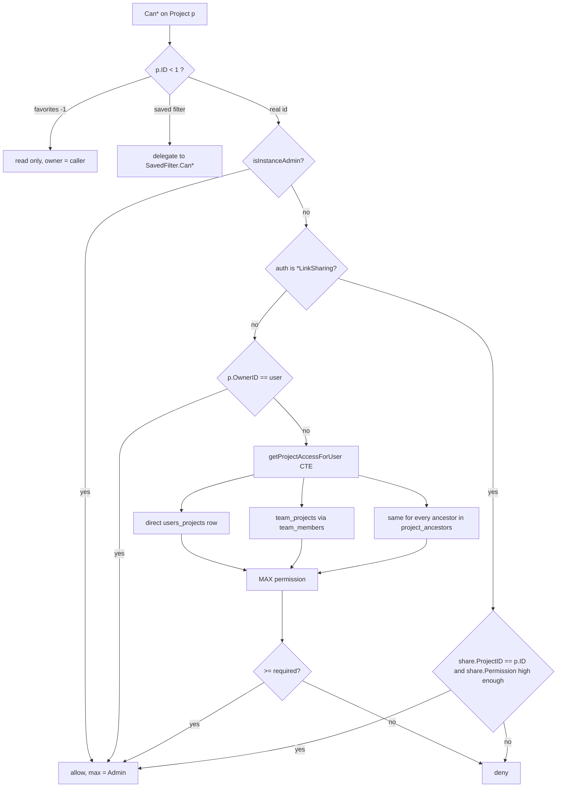

# Models: projects and permissions

The `Project` model, its parent tree (closure table), the share rows that grant access, and the permission resolution every other model delegates to. Sits in `pkg/models` under the [CRUD framework](./crud-framework.md); see [Data model](../../06-data-model.md) for the ER view and [Backend architecture](../../03-backend-architecture.md#sessions-and-transactions) for session rules.

## Responsibility

- Owns: `projects`, `project_ancestors`, `users_projects`, `team_projects` tables; the `Permission` enum; project create/update/delete/archive/duplicate/repair; the single "what may this auth do to project N" answer.
- Does not own: views and buckets created on project creation ([models-views-and-kanban](./models-views-and-kanban.md)), tasks deleted with the project ([models-tasks](./models-tasks.md)), link-share auth itself and teams ([models-sharing-teams-labels](./models-sharing-teams-labels.md)), background file storage ([files-and-storage](./files-and-storage.md)), the admin panel routes ([api-v2-huma](./api-v2-huma.md)).

## Entry points and public API

| Entry | Where | Called by |
|---|---|---|
| `Project.Create/ReadOne/ReadAll/Update/Delete` + `Can*` | `pkg/models/project.go`, `project_permissions.go` | `handler.Do*` from `pkg/routes/api/v1` and `pkg/routes/api/v2/projects.go` |
| `CreateProject(s, p, auth, createBacklogBucket, createDefaultViews)` | `project.go` | `Project.Create`, `ProjectDuplicate.Create`, importers |
| `UpdateProject(s, p, auth, updateProjectBackground)` | `project.go` | `Project.Update`, background upload/removal routes |
| `RegisterUser`, `CreateNewProjectForUser`, `CreateDefaultSavedFiltersForUser` | `project.go` | `/register`, admin create-user, invite links |
| `GetProjectSimpleByID`, `GetProjectsMapByIDs`, `GetProjectSimpleByTaskID`, `GetProjectSimpleByIdentifier`, `GetAllParentProjects` | `project.go`, `project_access.go` | almost every other model |
| `checkReadPermissionsForProjects`, `checkPermissionsForProjects`, `accessibleProjectIDsCond` | `project_permissions.go`, `project_access.go` | tasks, labels, subscriptions, task collections |
| `ProjectUser`, `TeamProject` CRUD + `Can*` | `project_users.go`, `project_team.go`, `*_permissions.go` | v2 `project_users.go`, `project_teams.go` |
| `ProjectDuplicate.Create/CanCreate` | `project_duplicate.go` | v2 `project_duplicate.go`, v1 `PUT /projects/{id}/duplicate` |
| `RebuildProjectAncestors`, `RepairOrphanedProjects` | `project_ancestor.go`, `project_repair.go` | repair CLI ([cli-commands](./cli-commands.md)), testing reset endpoint |
| `ListAllProjects`, `AdminProjectList.ReadAll`, `ReassignProjectOwner` | `project.go`, `admin_project_list.go` | v2 `admin_projects.go` (admin gate) |
| `isInstanceAdmin(s, a)` | `admin_bypass.go` | every `Can*` in this page and the sharing page |
| `SetArchiveStateForProjectDescendants`, `SetProjectBackground`, `ClearProjectBackground` | `project.go` | `UpdateProject`, background routes |

## Key types and functions

| Name | File | Notes |
|---|---|---|
| `Project` | `project.go` | `ParentProjectID *int64` (nil = omitted on write; explicit 0 = detach), `Identifier` max 10, stored uppercase; `IsFavorite`, `Subscription`, `MaxPermission`, `Views` are per-caller and `xorm:"-"` |
| `Ptr`, `parentID()`, `noParentProjectID()`, `AfterLoad()` | `project.go` | NULL in DB for top level (index covers only real children); `AfterLoad` normalizes NULL to `0` so JSON always carries a number (go-vikunja/app#295); writes use `s.Nullable("parent_project_id")` to map 0 back to NULL |
| `FavoritesPseudoProjectID = -1`, `FavoritesPseudoProject`, `IsPseudoProjectID` | `project.go` | Favorites has hard-coded views `-1` list (filter `done = false`), `-2` gantt, `-3` table. Saved filter `n` is project `-(n+1)` (`GetSavedFilterIDFromProjectID`) |
| `ProjectExpandableRights = "permissions"` | `project.go` | `?expand=permissions` fills `MaxPermission` via `addMaxPermissionToProjects` |
| `Permission` (`Unknown -1`, `Read 0`, `Write 1`, `Admin 2`) | `permissions.go` | `MarshalJSON` writes `null` for Unknown; `UnmarshalJSON` maps `null` to Unknown (otherwise Go would silently decode to Read); `isValid()` rejects Unknown → `ErrInvalidPermission` 9001 |
| `ProjectAncestor{AncestorID, ProjectID, Depth}` | `project_ancestor.go` | Closure table incl. self row (depth 0). Field order sets the composite pk so the access join is covered |
| `projectAccess`, `getProjectAccessForUser` | `project_access.go` | One CTE query per user per session: grants = owner (2) ∪ `users_projects` ∪ `team_projects` via `team_members`, `MAX` per project, then joined with `project_ancestors` so a grant on any ancestor propagates as the max. Memoized as `project-access-<uid>`; out-of-enum rows ignored |
| `projectAccess.cond(column)` | `project_access.go` | `builder.In(column, ids)` with an always-typed slice (empty slice renders `0=1`); over `maxInListSize = 1000` ids it falls back to the CTE as a subquery |
| `ProjectUser` (`users_projects`), `UserWithPermission` | `project_users.go` | Keyed by `Username` from the URL; emails stripped on list |
| `TeamProject` (`team_projects`), `TeamWithPermission` | `project_team.go` | List scrubs teams the caller cannot read to `{id, permission}` unless `service.enablepublicteams` and `is_public` |
| `ProjectDuplicate` | `project_duplicate.go` | Copies tasks (+ attachment files), label links, assignees with access, comments, in-project relations, views/buckets (remapped), background; shares only with `duplicate_shares: true` |
| `isInstanceAdmin` | `admin_bypass.go` | True only when `license.FeatureAdminPanel` is enabled, auth is a `*user.User`, and the **fresh DB row** has `is_admin` (a stale JWT cannot keep admin) |

## Internal structure

### Permission resolution

Order matters: pseudo ids are resolved **before** the admin bypass (`CanUpdate` on a saved filter is owner-only even for admins), and `CanWrite`/`IsAdmin` return `false` for `p.ID < 1` unconditionally. `CanRead` also copies the loaded row into `*p`, so `ReadOne` never re-queries.

### Write paths

- **Create** (`CreateProject`): `CheckIsArchived` (checks the parent row when `ID == 0`) → doer; a bot's project is owned by `BotOwnerID` and the bot gets an admin `ProjectUser` share back → `checkProjectBeforeUpdateOrDelete` (pseudo parent 3009, self parent 3010, missing parent 3001, cycle 3011, identifier uppercased and unique 3007) → insert with `Nullable` → `ProjectTaskCounter` row → `insertProjectAncestors` → `calculateDefaultPosition` → favorites → `CreateDefaultViewsForProject` (`project_view.go:816`) → `ProjectCreatedEvent` on commit.
- **Update** (`UpdateProject`): same pre-check → `checkProjectParentBeforeUpdate` → default-project archive guard (3013) → cascade `is_archived` to descendants only on a state change (batches of 500 via the closure table) → column-limited update (`title, is_archived, identifier, hex_color, position`, plus `parent_project_id` only when sent, `description` only when non-empty, background columns only via the background routes) → favorites toggle → `moveProjectAncestors` when the parent changed → `ProjectUpdatedEvent` → if `position < 0.1`, `recalculateProjectPositions` spreads siblings over `2^32` (treats NULL and 0 parent alike) → `ReadOne`.
- **Reparent gate** (`checkProjectParentBeforeUpdate`, GHSA-2vq4-854f-5c72 / CVE-2026-35595 and GHSA-44v6-7fxq-vgf4 / CVE-2026-55064): any reparent, including detaching to top level with an explicit `0`, requires `IsAdmin` on the moved project; attaching under a new parent also requires `IsAdmin` on that parent and the parent must not be archived (3016). This lives in `UpdateProject`, not `CanUpdate`, because `CanUpdate` is reused by bucket/webhook/task checks with stub `&Project{ID}` values and is skipped for instance admins. `CanUpdate` only adds a `CanWrite` check on a new parent `> 0`.
- **Un-archive**: `CanUpdate` swallows `ErrProjectIsArchived` when the request sets `is_archived: false` for that same project; `UpdateProject` then rejects it if the parent is still archived (3016) and tolerates an orphaned stored parent (`echoesStoredParent`).
- **Delete** (`Project.Delete`): default project only by its owner (3012) → lock views → hard-delete every task including soft-deleted (`hardDeleteTask`) → background file → clear `users.default_project_id` → buckets, views, favorites, link shares, user and team shares, ancestors, index aliases, counter, row → `ProjectDeletedEvent` → recurse into children by `parent_project_id`.
- **ReadAll**: link share gets exactly its project with parent forced to 0. Users get `getAllProjectsForUser` (`access.cond("id")`, archived filter, search by comma-separated ids or `title/description/identifier`, ordered by `position`, paginated) plus the favorites pseudo project when they have any favorite task, plus every saved filter as a pseudo project; then `addProjectDetails` (owners, favorite flags, subscriptions, views, Unsplash info).

## Dependencies

- **Uses:** `pkg/user` (owner, bot ownership, `GetFromAuth`), `pkg/db` (`Remember`, `RememberEach`, `MultiFieldSearch`), `pkg/events`, `pkg/files` (background), `pkg/license` (admin bypass), `pkg/config` (`service.enablepublicteams`), `pkg/utils` (`NormalizeHex`).
- **Used by:** every model with a project id (`tasks_permissions.go`, `label_permissions.go` via `accessibleProjectIDsCond`, `subscription.go`, `kanban_permissions.go`, `webhooks_permissions.go`, `link_sharing_permissions.go`), `user_delete.go`, importers, MCP, CalDAV.

## Invariants and assumptions

- `project_ancestors` must contain a self row (depth 0) for every project and one row per real ancestor. `lockSubtreeOf` errors on a missing self row; `RebuildProjectAncestors` repairs; `TestProjectAncestorsFixtureMatchesProjects` pins the fixture.
- Top-level projects store `parent_project_id` NULL; code must treat NULL and 0 alike (`recalculateProjectPositions`, `RepairOrphanedProjects`, `AfterLoad`). Never insert/update the column without `Nullable`.
- `Identifier` is uppercase and globally unique among non-empty values (`checkProjectBeforeUpdateOrDelete`); task human ids depend on it ([models-tasks](./models-tasks.md)).
- `is_archived` is materialized down the tree, so a project's own row is authoritative (`CheckIsArchived`, fixture projects 21/22/40).
- Owner is always admin; a lower direct or team grant never lowers an inherited permission (`TestGetProjectAccessForUser_GrantsAreGreatestOf`, `project_permissions_multiple_teams_test.go`).
- The per-session memo (`project-<id>`, `parent-projects-<id>`, `project-access-<uid>`) is invalidated by the write hook; `TestProjectAccess_InvalidatedByShareInSameSession` and `TestSessionMemoStopsAfterWrite` rely on it. Loaders hand out copies (`memoCopy`), so mutating a returned project never corrupts the memo.
- Link shares live in a negative id space (`LinkSharing.GetID() = -ID`); every check here type-asserts `a.(*LinkSharing)` before touching `a.GetID()`.

## Configuration

| Key (`config.yml`) | Env var | Effect |
|---|---|---|
| `service.enablepublicteams` | `VIKUNJA_SERVICE_ENABLEPUBLICTEAMS` | `TeamProject.CanCreate` and `ReadAll` accept/expose `is_public` teams the caller is not in |
| `service.maxitemsperpage` | `VIKUNJA_SERVICE_MAXITEMSPERPAGE` | Caps `per_page` through `getLimitFromPageIndex` |
| license `admin_panel` feature | n/a | Gates `isInstanceAdmin` ([operations-subsystems](./operations-subsystems.md)) |

## Error handling

| Code | Error | When |
|---|---|---|
| 3001 | `ErrProjectDoesNotExist` (404) | id < 1, missing row, unknown parent |
| 3004 | `ErrNeedToHaveProjectReadAccess` | listing shares without read |
| 3006 | `ErrProjectShareDoesNotExist` | link share lookups |
| 3007 | `ErrProjectIdentifierIsNotUnique` | identifier collision |
| 3008 | `ErrProjectIsArchived` | any write on an archived project; returned by `CanWrite` alongside `true` |
| 3009 / 3010 / 3011 | pseudo parent / child of itself / cyclic parent | parent validation |
| 3012 / 3013 | cannot delete / archive default project | non-owner delete, any archive |
| 3015 | `ErrProjectHasNoBackground` | background routes |
| 3016 | `ErrParentProjectIsArchived` | move under, or un-archive under, an archived parent |
| 7002 / 7003 | user already has access / has no access | `ProjectUser` create/delete (owner counts as "already has access") |
| 6002 / 6004 / 6007 | team missing / already has access / has no access | `TeamProject` |
| 9001 | `ErrInvalidPermission` | permission outside 0–2 or `null` |
| `ErrGenericForbidden` | reparent without admin, non-admin listing link shares | |

`IsErr*` helpers type-assert directly; `CanUpdate` uses `errors.As` for the archived case. HTTP mapping is described in [Backend architecture](../../03-backend-architecture.md#errors).

## Tests

- Unit (`mage test:filter TestProject_`, `TestProjectPermissions_`, `TestGetProjectAccessForUser`, `TestProjectAncestors`, `TestAdminBypass_`, `TestProjectDuplicate`, `TestRepairOrphanedProjects`, `TestProjectUser_`, `TestTeamProject_`, `TestPermissionJSON`):
  `project_test.go` (create/update incl. the two GHSA reparent subtests, archive cascade, delete recursion, ReadAll search/pagination, memo), `project_permissions_multiple_teams_test.go`, `project_permissions_pseudo_test.go`, `project_permissions_subproject_test.go`, `project_access_test.go`, `project_ancestor_test.go`, `project_repair_test.go`, `project_duplicate_test.go`, `admin_bypass_test.go`, `project_users_test.go`, `project_users_permissions_test.go`, `project_team_test.go`, `project_team_foreign_test.go`, `permissions_test.go`, `project_json_test.go`, `user_project_test.go`. There is no `project_permissions_test.go`; the coverage is split across the three `project_permissions_*_test.go` files.
- Webtests (`mage test:web`): `pkg/webtests/project_test.go`, `huma_project_test.go`, `huma_project_user_test.go`, `huma_project_team_test.go`, `huma_project_duplicate_test.go`, `project_pseudo_parent_test.go`, `admin_share_bypass_test.go`.
- Fixture ids tests depend on (`pkg/db/fixtures/projects.yml`, 44 rows; `users_projects.yml`; `team_projects.yml`; `project_ancestors.yml`, derived):

| Project | Owner | Grants | Used for |
|---|---|---|---|
| 1 | 1 | link shares 1, 4 | default "mine" project, background tests use 35 |
| 3 | 3 | user 1 read, user 2 read, team 1 read | shared-read project; child 40 archived individually |
| 6 / 7 / 8 | 6 | team 2 read / team 3 write / team 4 admin | team permission ladder |
| 9 / 10 / 11 | 6 | user 1 read / write / admin | direct share ladder; webhooks 2–4 |
| 12–17 | 6 | children of 27, 28, 29, 32, 33, 34 | inheritance: 27 user 1 read, 28 user 1 write + team 1 read, 29 user 1 admin, 32/33/34 team 1 read/write/admin |
| 18, 19 | 7 | 19 is child of 29 with users 4/5/6 and teams 8/9/10 | `projectUsers`/share listing |
| 20 | 13 | none | "user 1 has no access" |
| 21, 22 | 1 | archived through parent / individually | archive checks |
| 23 | 12 | favorite of users 12 and 1 | favorites |
| 24 | 6 | identifier `TEST6` duplicates 6 | identifier uniqueness |
| 25 → 26 | 6 | 25 child of 12, 26 child of 25 | deep nesting; user 15 read on 26 |
| 39 | 1 | parent 999999 (missing), archived | `RepairOrphanedProjects` |
| 41 → 42 | 6 | team 16 read on 41 | hierarchy test (#2490) |
| 43 | 6 | child of 10 | reparent escalation regression; do not reuse |
| 44 | 21 | bot 23 admin share | bot-created project |

## Gotchas and tech debt

- `UpdateProject` only writes `description` when it is non-empty, so a description cannot be cleared through `Project.Update` (`project.go`, `colsToUpdate`).
- `ReadAll` `totalItems` counts real projects only; the favorites pseudo project and saved filters are appended to every page and are not in the total (`getRawProjectsForUser`, `getAllRawProjects`).
- `project_access.go`, `project_repair.go`, and `subscription.go` use `s.SQL(...)` with hand-written SQL. This contradicts the "no raw SQL" rule in [Conventions](../../08-conventions.md#data-access); treat those as grandfathered, do not add more.
- `team_projects.yml` comments say team 8 has "Readonly acces on project 19" but the row has `permission: 2`; trust the value, not the comment.
- `ProjectAncestor.Depth` is only read by descendant archiving today; the comment in `project_ancestor.go` says a planned `subscription.go` rewrite will use it to rank notifications by distance.
- `moveProjectAncestors` uses `FOR UPDATE` except on SQLite; concurrent moves on SQLite rely on its single writer.
- `TaskCollection.pinToLinkShareProject` (`task_collection.go:412`) forces a link share's collection to its own project so foreign views/buckets cannot resolve (comment cites a truncated id "GHSA-rj9j").
- Security history in comments: GHSA-2vq4-854f-5c72, GHSA-44v6-7fxq-vgf4 (reparent/detach), GHSA-qfwc-vx6f-3g6g (link share by-id read), GHSA-96q5-xm3p-7m84 (link share claims), GHSA-hj5c-mhh2-g7jq (label visibility through projects).
- No `TODO`/`FIXME` comments in these files as of 2026-09-16.

## Related pages

- [crud-framework](./crud-framework.md), [models-sharing-teams-labels](./models-sharing-teams-labels.md), [models-tasks](./models-tasks.md), [models-views-and-kanban](./models-views-and-kanban.md), [models-filtering-and-search](./models-filtering-and-search.md), [auth-and-sessions](./auth-and-sessions.md), [events-and-listeners](./events-and-listeners.md), [db-and-migrations](./db-and-migrations.md), [api-v2-huma](./api-v2-huma.md), [cli-commands](./cli-commands.md)
- [Data model](../../06-data-model.md), [Conventions](../../08-conventions.md), [Testing guide](../../11-testing-guide.md)
- [playbooks/add-api-endpoint](../../playbooks/add-api-endpoint.md); skill: [crudable](../../../skills/crudable/SKILL.md)
