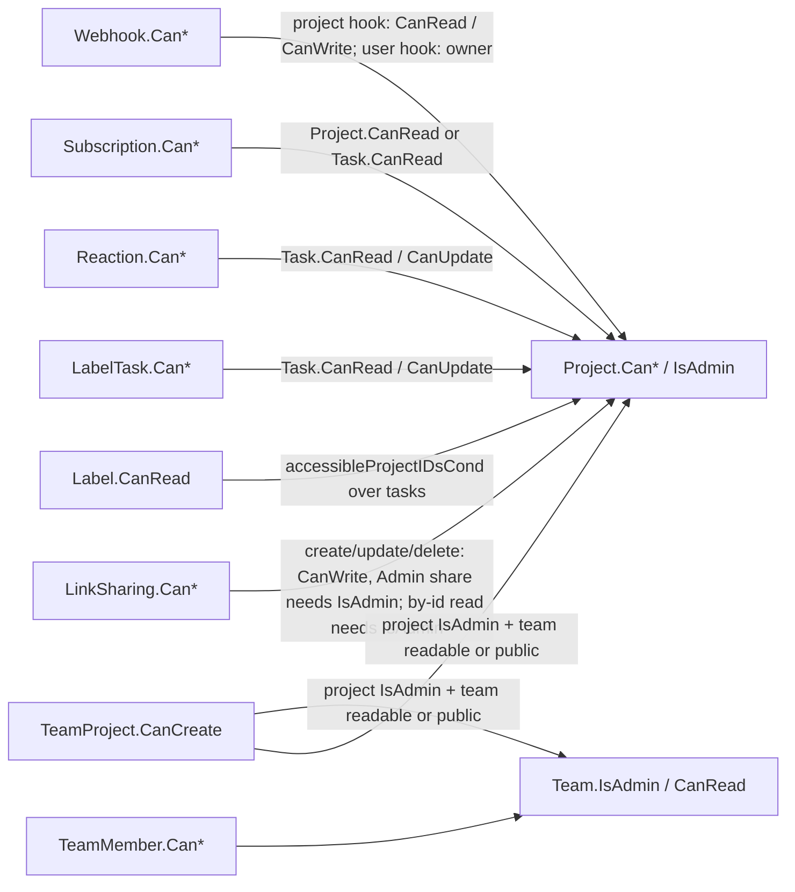

# Models: sharing, teams, labels, and small entities

Everything in `pkg/models` that grants or decorates access without being a project or a task: teams and their OIDC/LDAP sync, link shares, labels, subscriptions, favorites, reactions, webhooks, invite links, and bot users. Project-level share rows (`users_projects`, `team_projects`) and permission resolution are in [models-projects-and-permissions](./models-projects-and-permissions.md); this page assumes that page's `Can*` semantics and admin bypass.

## Responsibility

- Owns the models and `Can*` checks for: `teams`, `team_members`, `link_shares`, `labels`, `label_tasks`, `subscriptions`, `favorites`, `reactions`, `webhooks`, `user_invite_links(+_teams)`, and the `BotUser` wrapper over `users`.
- Does not own: link-share JWT issuance and password login ([auth-and-sessions](./auth-and-sessions.md)), webhook delivery scheduling and payload reload ([events-and-listeners](./events-and-listeners.md)), notification fan-out from subscriptions ([notifications-and-mail](./notifications-and-mail.md)), the `user.User` row itself ([user-package](./user-package.md)).

## Entry points and public API

| Entry | Where | Called by |
|---|---|---|
| `Team`, `TeamMember` CRUD + `Can*`, `GetTeamByID`, `CreateNewTeam` | `teams.go`, `team_members.go`, `teams_permissions.go`, `team_members_permissions.go` | v2 `teams.go`, `team_members.go`, `admin_teams.go`; v1 |
| `SyncExternalTeamsForUser(s, u, teams, issuer, suffix)`, `GetTeamByExternalIDAndIssuer` | `team_sync.go` | `pkg/modules/auth/openid/openid.go:286`, `pkg/modules/auth/ldap/ldap.go:374` |
| `LinkSharing` CRUD + `Can*`, `GetLinkShareFromClaims`, `GetLinkShareByHash`, `VerifyLinkSharePassword` | `link_sharing.go`, `link_sharing_permissions.go` | v2 `link_sharing.go`, `token_meta.go`; v2 `auth_public.go` and v1 `link_sharing_auth.go` via `shared.AuthenticateLinkShare` (`pkg/routes/api/shared/auth.go`); `GetLinkShareFromClaims` from the JWT middleware (`pkg/modules/auth/auth.go:267`) |
| `Label`, `LabelTask`, `LabelTaskBulk`, `GetLabelsForUser`, `GetLabelsByTaskIDs`, `Task.UpdateTaskLabels` | `label.go`, `label_task.go`, `label_permissions.go`, `label_task_permissions.go` | v2 `labels.go`, `label_tasks.go`, `label_task_bulk.go`; tasks, importers |
| `Subscription` CRUD, `GetSubscriptionForUser`, `GetSubscriptionsForEntity`, `GetSubscriptionsForDeletedTask`, `subscribeUserImplicitly` | `subscription.go`, `subscription_permissions.go` | v2 `subscriptions.go`; listeners; `tasks.go:1165`, `task_assignees.go:262` |
| `addToFavorites`, `removeFromFavorite`, `isFavorite`, `getFavorites` | `favorites.go` | project and task read/update paths |
| `Reaction` CRUD + `Can*` | `reaction.go`, `reaction_permissions.go` | v2 `reactions.go` |
| `Webhook` CRUD + `Can*`, `RegisterEventForWebhook`, `RegisterUserDirectedEventForWebhook`, `GetAvailableWebhookEvents` | `webhooks.go`, `webhooks_permissions.go` | v2 `webhooks.go`, `user_webhooks.go`, `webhook_events.go`; `listeners.go:79-81` and `RegisterListeners` |
| `CreateInviteLinkAsAdmin`, `ListInviteLinksAsAdmin`, `DeleteInviteLinkAsAdmin`, `GetInviteLinkByToken`, `RegisterUserViaInviteLink` | `user_invite_link.go` | v2 `admin_invite_links.go`, `invite_links.go` |
| `BotUser` CRUD + `Can*` | `bot_users.go`, `bot_users_permissions.go` | v2 `bot_users.go` |

## Key types and functions

| Name | File | Notes |
|---|---|---|
| `Team` | `teams.go` | `Name` required (6001), `CreatedByID`, `ExternalID`/`Issuer` for synced teams (issuer is `json:"-"`), `IsPublic`, query-only `IncludePublic`; `Members []*TeamUser` with emails stripped, sorted by id |
| `TeamMember` | `teams.go` | `Username` from the URL, `Admin` flag. `Update` **toggles** `admin` (`ttm.Admin = !ttm.Admin`) regardless of the body |
| `Team.IsAdmin` / `TeamMember.IsAdmin` | `*_permissions.go` | link share → false; instance admin → true; else `team_members.admin` row. `TeamMember.CanDelete` allows self-removal without admin |
| `cleanupTaskMembersAfterTeamRemoval` | `teams.go` | Removes assignee rows and subscriptions for projects the removed member can no longer read; called from the `TeamMemberRemovedEvent` listener (`listeners.go:1662`) |
| `SharingType` (`Unknown 0`, `WithoutPassword 1`, `WithPassword 2`) | `link_sharing.go` | Derived from whether a password was set on create; read-only |
| `LinkSharing` | `link_sharing.go` | `Hash` = `utils.CryptoRandomString(40)`, `Password` bcrypt via `user.HashPassword`, cleared from every response; `GetID()` returns `-ID`; `toUser()` builds username `link-share-<id>` (reserved in `pkg/user/validator.go`). `Update` is shadowed to return `ErrGenericForbidden` (immutable, and a promoted method breaks Huma's schema wrapper) |
| `GetLinkShareFromClaims` | `link_sharing.go` | Resolves the JWT against the DB on every call, ignores the `permission`/`sharedByID` claims, requires `hash` to match (GHSA-96q5-xm3p-7m84 / CVE-2026-35594) |
| `Label` | `label.go` | Owned by `CreatedByID`; `Delete` removes only the label row |
| `labelVisibleCond` / `hasAccessToLabel` / `isLabelOwner` | `label_permissions.go` | Visible = attached to a non-deleted task in an accessible project (`accessibleProjectIDsCond`, includes inherited child projects) OR created by the caller's bot identity (`user.SameBotIdentityCond`). Must be a single `builder` cond passed to one `Where` (GHSA-hj5c-mhh2-g7jq); refuses to return an empty cond. Owner (or owner of the creating bot) gets max Admin, others Read |
| `LabelTask`, `LabelTaskBulk` | `label_task.go` | `CanCreate` = label visible && `task.CanUpdate`; `CanDelete` = `task.CanUpdate` && relation exists. Bulk = replace the task's label set through `Task.UpdateTaskLabels`, each added label must be visible (8003); bumps task and project `updated` and fires `TaskUpdatedEvent` |
| `SubscriptionEntityType` (`Unknown 0`, `Namespace 1` kept, `Project 2`, `Task 3`) | `subscription.go` | JSON as `"project"`/`"task"`; `Schema()` for Huma; `Entity` path param mapped in `Can*` |
| `Subscription` | `subscription.go` | Unique `(entity_type, entity_id, user_id)`; `Muted` row = explicit opt-out that outranks inheritance. Create un-mutes an own muted row, else 12002 if an own or inherited subscription exists. Delete removes the own row and, if a parent subscription still applies and the user can read the entity, inserts a muted row |
| `getSubscriptionsForEntitiesAndUser` | `subscription.go` | Raw recursive CTE: task → own task row → project → ancestors, `ROW_NUMBER` by priority; muted rows dropped; then `filterSubscriptionsByReadPermission` drops subscribers without project read (rows are kept, not deleted). `GetSubscriptionsForDeletedTask` skips the deleted-task filter for the task-deleted listener |
| `Favorite{EntityID, UserID, Kind}` (`Task 1`, `Project 2`) | `favorites.go` | No CRUDable; toggled through `is_favorite` on task/project. All helpers silently no-op for link shares |
| `Reaction` (`ReactionKindTask 0`, `Comment 1`) | `reaction.go` | Path kind `tasks`/`comments` (4025 otherwise); `Value` ≤ 20 chars; `ReadAll` returns `ReactionMap` value → users; Create is idempotent; Delete only the caller's own row via `user.GetFromAuth` (GHSA-vvcv-vpph-h844 id collision). `Can*` delegate to the task: read = `task.CanRead`, create/delete = `task.CanUpdate` |
| `Webhook` | `webhooks.go` | Exactly one of `ProjectID`/`UserID`; `Secret`, `BasicAuthUser/Password` write-only and cleared by `maskCredentials()` after the DB write; `Events` validated against `availableWebhookEvents`, user-level hooks only accept user-directed events (`TaskReminderFiredEvent`, `TaskOverdueEvent`, `TasksOverdueEvent`). `Update` writes only `events` |
| `Webhook.sendWebhookPayload` | `webhooks.go` | HMAC-SHA256 of the JSON body with `Secret` → `X-Vikunja-Signature`; optional Basic auth header; `User-Agent: Vikunja/<version>`; SSRF-safe client with `webhooks.timeoutseconds`; status > 399 is an error with the body truncated to 4096 bytes |
| `UserInviteLink`, `UserInviteLinkTeam`, `CreateInviteLinkBody` | `user_invite_link.go` | Pro feature (`license.FeatureUserInvites`). Token = `CryptoRandomString(64)`, stored as `utils.Sha256Hex`, returned once as `ClearTextToken`; `MaxUses`/`ExpiresAt` nullable; external teams rejected (2007). `RegisterUserViaInviteLink` claims a use atomically (`Incr("uses")` under the usable condition), calls `models.RegisterUser` with `SkipEmailConfirm`, inserts `TeamMember` rows and fires `TeamMemberAddedEvent` |
| `BotUser` | `bot_users.go` | Wrapper over `user.User` (no table); `Status` shadowed so it serializes. Create → `user.CreateBotUser` (owner must be a human user); ReadAll = own bots; Update allows `name`, `status` (active/disabled), `username` with `bot-` prefix; Delete → `DeleteUser` cascade. `Can*` = `IsBotOwnedBy(caller)`, `CanCreate` denies bots and link shares |

## Internal structure

Team sync (`team_sync.go`): `SyncExternalTeamsForUser` → if the provider sent no teams, remove the user from every team with that `issuer`; else `getOrCreateTeamsByIssuer` matches on `(external_id, issuer)`, creates missing teams via `CreateNewTeam(firstUserShouldBeAdmin=false)` named `"<name> (<suffix>)"`, updates name/description drift, ensures membership, then removes the user from external teams no longer listed. Members cannot leave external teams (`TeamMember.Delete` → 6010).

Webhook delivery: `RegisterEventForWebhook` registers one `WebhookListener` per event name; `WebhookListener.Handle` (`listeners.go:1505`) collects project-level hooks for the event's project **and all its ancestors**, plus user-level hooks for user-directed events, reloads the payload, and calls `sendWebhookPayload` per hook. Details in [events-and-listeners](./events-and-listeners.md).

## Dependencies

- **Uses:** `pkg/user` (`GetFromAuth`, `HashPassword`, `SameBotIdentityCond`, `CreateBotUser`), `pkg/config`, `pkg/events`, `pkg/license`, `pkg/utils` (`CryptoRandomString`, `Sha256Hex`, `NewSSRFSafeHTTPClient`), `pkg/keyvalue` (none here; TOTP/email cooldowns are in `pkg/user`), `golang.org/x/crypto/bcrypt`.
- **Used by:** OpenID/LDAP auth modules (team sync), JWT auth middleware in `pkg/modules/auth` (link share claims), tasks (labels, subscriptions, favorites), listeners (webhooks, team cleanup), MCP and importers (labels).

## Invariants and assumptions

- A link share is never a user: `GetFromAuth` fails for it, `Reaction`/`Favorite`/`Label` owner paths must treat that as a plain denial. Link-share ids are negated so they cannot collide with user ids in `GetID()`, and fixture link share 21 (`testCollidesWithBotOwner`) exists to prove it (`TestLinkSharing_CannotActAsCollidingUser`).
- Link-share permission is read from the DB row, never from the JWT.
- Label visibility has exactly one definition (`labelVisibleCond`); `Label.ReadAll` and `Label.CanRead` must not drift (`TestLabel_ReadAllMatchesCanRead`, `TestLabelVisibleCondIsValid`).
- Subscription rows outlive access; filtering happens at read time so a subscription resumes when access returns.
- Webhook credentials never leave the DB row: every read path calls `maskCredentials()`; deliveries reload the row.
- Bot usernames start with `bot-`; regular registration rejects that prefix (`pkg/user/user_create.go`).

## Configuration

| Key (`config.yml`) | Env var | Effect |
|---|---|---|
| `service.enablepublicteams` | `VIKUNJA_SERVICE_ENABLEPUBLICTEAMS` | Public teams listable with `include_public`, attachable to projects without membership |
| `service.enablelinksharing` | `VIKUNJA_SERVICE_ENABLELINKSHARING` | Gates link-share routes (checked in routes, not here) |
| `webhooks.enabled` | `VIKUNJA_WEBHOOKS_ENABLED` | Registers webhook listeners/routes (see events page) |
| `webhooks.timeoutseconds`, `webhooks.proxyurl`, `webhooks.proxypassword`, `webhooks.allownonroutableips` | `VIKUNJA_WEBHOOKS_*` | Delivery client timeout, proxy, SSRF allowance |
| license `user_invites` | n/a | `GetInviteLinkByToken` and registration return 2005 when disabled |

## Error handling

| Codes | Meaning |
|---|---|
| 6001 / 6002 / 6004 / 6005 / 6006 / 6007 | team name empty / team missing / team already has access / user already member / cannot delete last member / team has no access |
| 6008 / 6009 / 6010 | external team missing / no external teams for user / cannot leave external team (412) |
| 7002 / 7003 | user already has / does not have project access |
| 8001 / 8002 / 8003 | label already on task / label missing / no access to label |
| 12001 / 12002 / 12003 | unknown subscription entity / already subscribed / user required |
| 13001 / 13002 / 13003 | link share password required / invalid / token invalid (stale or mismatched claims) |
| 3006 | link share does not exist |
| 4025 | invalid reaction entity kind |
| 2005 / 2006 / 2007 | invite link invalid or unavailable / does not exist / external team not allowed |
| `ErrGenericForbidden` | link share listing teams, shares, or webhooks; `Subscription.Can*` for link shares (returned as the error, not just `false`) |
| `InvalidFieldError` | webhook `project_id`/`user_id` exclusivity, `target_url`, unknown `events` |

## Tests

- `teams_test.go`, `teams_permissions_test.go`, `team_members_test.go` (incl. `TestCleanupTaskMembersAfterTeamRemoval`), `project_team_foreign_test.go` (foreign/public team scrubbing); no dedicated `team_sync_test.go` (sync is exercised only through `pkg/modules/auth/openid/openid_test.go`; no ldap test references `SyncExternalTeamsForUser`).
- `link_sharing_test.go` (`TestGetLinkShareFromClaims`, `TestLinkSharing_CanReadAdminOnly`, collision tests); webtests `link_share_consistency_test.go`, `link_share_avatar_test.go`, `huma_user_search_link_share_test.go`.
- `label_test.go`, `label_task_test.go` (`TestLabelTaskBulk_CreateLinkShare`, timestamp bumps); webtests `huma_label_test.go`, `huma_label_task_test.go`, `huma_label_task_bulk_test.go`, `label_task_test.go`.
- `subscription_test.go` (`TestSubscription_Mute`, `TestGetSubscriptionsForEntitySkipsUsersWithoutReadAccess`, `TestSubscription_NoCrossUserProjectInheritance`); webtests `huma_subscription_test.go`, `huma_task_patch_subscription_test.go`.
- `reaction_test.go`, `webhooks_test.go` (`TestWebhookErrorResponseBodyIsTruncated`), `user_invite_link_test.go` (incl. `TestInviteLinkConcurrentClaim`, `TestInviteLinkRollback`), `bot_users_test.go`, `task_search_favorites_access_test.go`; webtests `huma_reaction_test.go`, `huma_webhook_test.go`, `huma_user_webhook_test.go`, `huma_webhook_event_test.go`, `webhook_test.go`, `huma_invite_links_test.go`, `huma_bot_user_test.go`.
- Run with `mage test:filter <TestName>`; webtests with `mage test:web`.
- Fixtures (`pkg/db/fixtures/`):
  - `teams.yml`: 1 (user 1 admin, user 2), 2/3/4 (read/write/admin on projects 6/7/8), 8/9/10 and 11/12/13 (ladders on project 19 and 29), 13 and 15 public, 14/15 external (`issuer https://some.issuer`), 16 hierarchy test. `team_members.yml` puts user 1 in teams 1–8 (user 2 is also in team 1; teams 5–7 have member rows but no `teams.yml` row).
  - `link_shares.yml`: 1 read / 2 write / 3 admin on projects 1/2/3 (hashes `test`, `test2`, `test3`), 4 password-protected (`testWithPassword`, password `12345678`), 21 id collision with user 21.
  - `labels.yml` 1–13 and `label_tasks.yml`: each row's comment names the visibility branch it covers (GHSA-hj5c-mhh2-g7jq regression, bot-owner branch, soft-deleted task 51, child-project inheritance via project 16).
  - `subscriptions.yml`, `favorites.yml` (kind 1 task, 2 project), `reactions.yml` (one 👋 on task 1 by user 1), `webhooks.yml` 1–5 project-level (project 9/10/11 permission matrix, 2 forbidden) and 6–8 user-level; the file comment explains why the event choice matters for the e2e suite.
  - `user_invite_links.yml`: `unlimited`, `last-slot`, `exhausted`, `expired`, each attached to one team.

## Gotchas and tech debt

- `Team.ReadAll` includes public teams in the page when `include_public` is set, but the total count query only counts membership teams (`teams.go`, `numberOfTotalItems`).
- `LinkSharing.ReadAll` searches `name` with ILIKE but counts with `hash LIKE '%search%'`, so `totalItems` is wrong for non-empty searches.
- `TeamMember.Update` toggles admin rather than setting it; two concurrent "make admin" calls cancel out.
- `Label.Delete` leaves `label_tasks` rows behind. Reads join from `labels`, so orphans are invisible; nothing deletes them by `label_id` (only `hardDeleteTask` in `tasks.go` removes `label_tasks` rows, by `task_id`).
- `Subscription.Can*` return `ErrGenericForbidden` as the error for link shares instead of `(false, nil)`; the v2 error bridge maps it to 403 either way.
- `subscription.go` uses hand-written SQL (`s.SQL`) and `team_sync.go` an xorm `Join("RIGHT", ...)`; the subscription CTE is the largest raw query in the package and depends on `parent_project_id` rather than `project_ancestors`.
- Real TODOs: `subscription_test.go:194` "Add tests to test triggering of notifications for subscribed things"; `subscription_test.go:317` commented assertion on `sub.ID`.
- Security history in comments: GHSA-96q5-xm3p-7m84 (link share claims), GHSA-qfwc-vx6f-3g6g (link share by-id read), GHSA-hj5c-mhh2-g7jq (label leak via chained `Where`), GHSA-vvcv-vpph-h844 (reaction id collision).

## Related pages

- [models-projects-and-permissions](./models-projects-and-permissions.md), [models-tasks](./models-tasks.md), [user-package](./user-package.md), [auth-and-sessions](./auth-and-sessions.md), [events-and-listeners](./events-and-listeners.md), [notifications-and-mail](./notifications-and-mail.md), [api-v2-huma](./api-v2-huma.md), [operations-subsystems](./operations-subsystems.md)
- Frontend counterpart: [sharing-teams-labels-notifications](../frontend/sharing-teams-labels-notifications.md)
- [Data model](../../06-data-model.md), [Conventions](../../08-conventions.md); [playbooks/add-api-endpoint](../../playbooks/add-api-endpoint.md); skill: [crudable](../../../skills/crudable/SKILL.md)
