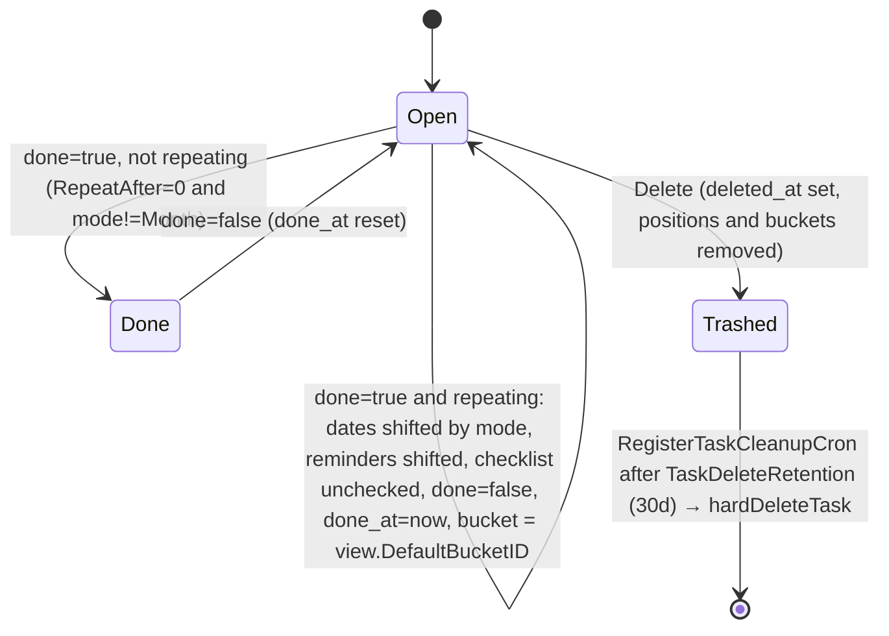

# Models: tasks

The `Task` aggregate in `pkg/models`: the row itself plus everything hung off it (reminders, assignees, relations, comments, attachments, per-view positions and bucket membership, unread flags, bulk and duplicate operations, the soft-delete cron). It sits in the model layer described in [Backend architecture](../../03-backend-architecture.md); entity shapes and the done/repeat lifecycle are summarized in [Data model](../../06-data-model.md#task-done-and-repeating). This is the most bug-dense area of the repo (`git log`: `tasks.go` 77 fix commits, `task_position.go` 29), so the invariants section is the part to read before changing anything.

## Responsibility

- Owns: task CRUD, index/identifier assignment, done and repeat handling, reminders and their crons, assignees, relations, comments, attachments and cover images, unread status, per-view positions (`task_positions`) and the machinery that keeps them unique, bulk update and bulk create, duplication, soft delete and permanent cleanup.
- Does not own: listing and filtering (`TaskCollection`, `task_search.go`, see [models-filtering-and-search](./models-filtering-and-search.md)); buckets and views themselves ([models-views-and-kanban](./models-views-and-kanban.md)); labels on tasks (`label_task.go`, [models-sharing-teams-labels](./models-sharing-teams-labels.md)); notification and webhook fan-out (listeners in `pkg/models/listeners.go`, [events-and-listeners](./events-and-listeners.md)).

## Entry points and public API

| Entry | Where | Called by |
|---|---|---|
| `Task.Create/ReadOne/Update/Delete`, `Task.Can*` | `pkg/models/tasks.go`, `tasks_permissions.go` | v1 `WebHandler` for `/tasks/*`, v2 `pkg/routes/api/v2/tasks.go` (`tasks-create`, `tasks-read`, `tasks-read-by-index`, `tasks-update`, `tasks-delete`) |
| `Task.ReadAll` | `tasks.go` | Dummy: returns `nil, 0, 0, nil`; real listing is `TaskCollection.ReadAll` |
| `CreateTasksForImport` | `tasks.go` | `pkg/modules/migration` (preserves preset indexes) |
| `GetTaskByIDSimple`, `GetTaskSimple`, `GetTasksSimpleByIDs`, `GetTaskByProjectAndIndex`, `GetTasksByUIDs`, `GetTaskSimpleByUUID`, `GetDeletedTasksSince` | `tasks.go` | CalDAV, listeners, other models |
| `TaskPosition.Update`, `RecalculateTaskPositions`, `RepairTaskPositions`, `DeleteOrphanedTaskPositions` | `task_position.go` | v1 `POST /tasks/:task/position`, v2 `tasks-position-update` (`PUT /tasks/{task}/position`); `pkg/cmd/repair_task_positions.go`, `repair_orphan_positions.go` |
| `TaskAssginee.Create/Delete/ReadAll`, `BulkAssignees.Create` | `task_assignees.go` | v1/v2 assignee routes (`pkg/routes/api/v2/task_assignees.go`, `task_assignees_bulk.go`) |
| `TaskRelation.Create/ReadOne/Delete` | `task_relation.go` | `pkg/routes/api/v2/task_relations.go` |
| `TaskComment.*`, `TaskAttachment.*`, `UploadTaskAttachments`, `GetTaskAttachmentForDownload` | `task_comments.go`, `task_attachment.go` | comment and attachment routes |
| `TaskUnreadStatus.Update` | `task_unread_statuses.go` | v1 `POST /tasks/:projecttask/read`, v2 `tasks-mark-read` (`PUT /tasks/{task}/read`, `task_unread_status.go`) |
| `BulkTask.Update`, `BulkTaskCreation.Create`, `TaskDuplicate.Create` | `bulk_task.go`, `bulk_task_create.go`, `task_duplicate.go` | `tasks-bulk-update` (`PUT /tasks/bulk`), `tasks-bulk-create` (`POST /projects/{project}/tasks/bulk`), `task_duplicate.go` |
| `RegisterReminderCron`, `RegisterOverdueReminderCron`, `RegisterTaskCleanupCron` | `task_reminder.go`, `task_overdue_reminder.go`, `task_delete_cron.go` | `pkg/initialize/init.go` → `FullInit` |

## Key types and functions

| Name | File | What it does |
|---|---|---|
| `Task` | `tasks.go` | The row. `xorm:"-"` computed fields: `Reminders`, `Assignees`, `Labels`, `Identifier`, `RelatedTasks`, `Attachments`, `IsFavorite`, `IsUnread`, `Subscription`, `BucketID`, `Buckets`, `Comments`, `CommentCount`, `TimeEntriesCount`, `Expand`, `Position`, `Reactions`, `CreatedBy`. `UID` is `json:"-"` (CalDAV only). `DeletedAt` has the xorm `deleted` tag and `json:"deleted_at,omitzero"` |
| `TaskRepeatMode` | `tasks.go` | `Default 0`, `Month 1`, `FromCurrentDate 2`; `MaxTaskRepeatAfterSeconds` = 10 years; `validateRepeatAfter` → `ErrInvalidTaskRepeatInterval` (4029) |
| `taskNotDeletedCond(table)` | `tasks.go` | `deleted_at IS NULL` for raw/joined queries where the bean tag does not apply |
| `lockingSession(s)` | `tasks.go` | `FOR UPDATE` on MySQL/Postgres, no-op on SQLite |
| `addMoreInfoToTasks` | `tasks.go` | Hydrates a `map[int64]*Task`: assignees (emails blanked), labels, attachments, creators, reminders, favorites, identifiers, positions (when a view is given), the `expand` extras, then related tasks (access-filtered, copied with `copier` and `RelatedTasks` nil'd to avoid JSON cycles) |
| `createTasks` | `tasks.go` | The single implementation behind `Create`, bulk create, import and duplicate |
| `updateSingleTask`, `updateTasks` | `tasks.go` | Update of one task with optional column whitelist; bulk wrapper that locks all affected projects' views first |
| `updateDone`, `setTaskDatesDefault`, `setTaskDatesMonthRepeat`, `setTaskDatesFromCurrentDateRepeat`, `addRepeatIntervalToTime`, `shiftTime`, `resetDescriptionChecklist` | `tasks.go` | Repeat logic (see state diagram) |
| `moveTaskToDoneBuckets`, `moveTaskToDefaultBuckets`, `checkBucketLimit`, `setTasksInBucketInViews`, `resolveProvidedBuckets` | `tasks.go` | Kanban side effects of create/update; details in [models-views-and-kanban](./models-views-and-kanban.md) |
| `hardDeleteTask` | `tasks.go` | Cascade used by the cleanup cron and project deletion |
| `ProjectTaskCounter`, `reserveTaskIndexes`, `setNewTaskIndexes`, `TaskIndexAlias`, `GetTaskIDByIndexAlias` | `task_index.go`, `tasks.go` | Per-project index counter and retired-address aliases |
| `TaskPosition` and friends | `task_position.go` | See "Positions" below |
| `TaskReminder`, `ReminderRelation`, `updateReminders`, `updateRelativeReminderDates` | `task_reminder.go`, `tasks.go` | Absolute or relative reminders |
| `TaskAssginee` (sic), `TaskAssigneeWithUser`, `BulkAssignees` | `task_assignees.go` | Assignment rows; the type name typo is exported and load-bearing |
| `TaskRelation`, `RelationKind`, `getInverseRelation`, `checkTaskRelationCycle` | `task_relation.go` | Bidirectional relations |
| `TaskComment`, `getAllCommentsForTasksWithoutPermissionCheck` | `task_comments.go` | Comments; `FindMentionedUsersInText`/`formatMentionsForEmail` (`mentions.go`) and `findQuotedCommentAuthors` (`comment_quotes.go`) feed the notification listeners |
| `TaskAttachment`, `PreviewSize` | `task_attachment.go` | Files via `pkg/files`; cached image previews |
| `TaskUnreadStatus` | `task_unread_statuses.go` | One row per `(task_id, user_id)` means unread; `Update` deletes it |
| `BulkTask`, `BulkTaskCreation` (`MaxTasksPerBulkCreation` = 100), `TaskDuplicate` | `bulk_task*.go`, `task_duplicate.go` | Batch operations |

## Internal structure

### Create (`createTasks`)

1. `validateTaskForCreation` (title non-empty, repeat cap); `ProjectID` forced from the route, `ID` zeroed, `Index` zeroed unless `preserveIndexes` (import).
2. `GetProjectSimpleByID`, `GetUserOrLinkShareUser`, then `setNewTaskIndexes`: `reserveTaskIndexes` does one `Incr("last_index", n)` on `project_task_counters`; if the project has no counter row (fixtures, tests) it seeds one from `max(highest task index, highest alias index)`. Presets above the old high-water mark are kept; the rest get fresh indexes.
3. Insert row by row (autoincrement ids are not reliable for multi-row inserts on every DB). `UID` defaults to a new UUID; `HexColor` normalized.
4. `resolveProvidedBuckets`: an explicit `bucket_id` must belong to a view of the target project (else `ErrBucketDoesNotExist`), and the bucket limit is checked once per bucket with the batch's own members counted as pending.
5. `lockProjectViewsForPositionUpdate(projectID)`, then `setTasksInBucketInViews`: for every manual kanban view pick done bucket / provided bucket / default bucket; a task created directly into the done bucket is flipped to `done = true` and routed through `moveTaskToDoneBuckets`. `calculateNewPositionsForTasks` per view.
6. `filterNewTaskPositions` (drop rows a recalculation already wrote) → `bulkInsertTaskPositions(…, false)` → `resolvePositionConflictsAfterInsert`. `task_buckets` inserted in chunks of 100.
7. Per task: assignees, reminders, identifier, favorite, implicit subscription (users only, not link shares), `TaskCreatedEvent`; then one `TasksBatchCreatedEvent`; `updateProjectLastUpdated`.

### Update (`updateSingleTask`)

- Loads the old row under `lockingSession` (bypasses the session memo on purpose), loads stored reminders onto it, applies assignees first.
- Column whitelist `colsToUpdate` (14 columns: title, description, done, due_date, repeat_after, priority, start_date, end_date, hex_color, percent_done, project_id, bucket_id, repeat_mode, cover_image_attachment_id). When `fields` is given (bulk update), unknown names raise `ErrInvalidTaskColumn` (4027) and every non-listed field is copied back from the old row so the merge below cannot clobber it.
- Project move (`t.ProjectID != ot.ProjectID`): write a `TaskIndexAlias` for the old `(project, index)` (latest holder wins), reset `Index` and reserve a new one, zero `BucketID`, append `"index"` to the columns, lock views of both projects, delete all `task_buckets` and `task_positions` rows for the task, then re-add one bucket (done bucket if done, else default) and one position per manual kanban view of the new project.
- Done change, same project: non-repeating → `moveTaskToDoneBuckets`; repeating and newly done → `moveTaskToDefaultBuckets` (#2573).
- `updateDone` (may rewrite dates, reminders, description); when `fields` is set, any date/description it rewrote is appended to the column list or it would be computed and thrown away.
- `updateReminders`, cover-image ownership check (`ErrAttachmentDoesNotBelongToTask` 4020), favorite add/remove. Labels are deliberately not updated here (see the `Maybe FIXME` at `tasks.go:1575`).
- `mergo.Merge(&ot, t, WithOverride)` then a block of explicit zero-value resets (mergo ignores zero values), `s.ID(t.ID).Cols(colsToUpdate...).Update(&ot)`, re-read `Updated`, `TaskUpdatedEvent`, `updateProjectLastUpdated`.

### Done and repeat

`isRepeating()` is `RepeatAfter > 0 || RepeatMode == Month`. `updateDone` runs only on `!old.Done && new.Done`: `Default` → `setTaskDatesDefault` (needs `RepeatAfter > 0`; each date advanced by whole intervals until after now via constant-time `addRepeatIntervalToTime`, GHSA-r4fg-73rc-hhh7), `Month` → `addOneMonthToDate` in `config.GetTimeZone()` (ignores `RepeatAfter`), `FromCurrentDate` → due date = now + interval, other dates and reminders keep their offset via `shiftTime` (handles spans over 292 years). Mode `FromCurrentDate` with `RepeatAfter = 0` is not repeating and the task simply becomes done. `done_at` is set by the server on every done transition, including repeating ones.

### Delete

`Task.Delete` reads the full task for the event, locks the project's views, deletes `task_positions` and `task_buckets` immediately (bucket counts do not join `tasks` and would otherwise leak trashed tasks), then `s.ID(t.ID).Delete(&Task{})`, which the `deleted` tag turns into `UPDATE … SET deleted_at` (the bean must be a pointer; see the comment at `tasks.go:2161`). Everything else stays until `deleteExpiredTasks` runs hourly (`"0 * * * *"`) and calls `hardDeleteTask` in a per-task session: assignees, favorites of all users, label links, attachment files and rows, reactions on task and comments, comments, unread rows, relations in both directions, reminders, subscriptions, positions, buckets, index aliases, then `Unscoped().Delete`. `GetDeletedTasksSince` feeds CalDAV sync-collection 404 entries ([caldav](./caldav.md)).

### Positions (`task_position.go`)

- One row per `(task_id, project_view_id)` (`unique(task_view)`), `position float64`, `MinPositionSpacing = 0.01`. New tasks get `index * 2^16` (`calculateDefaultPosition`) on an empty view, otherwise evenly spaced below the current lowest position (`calculateNewPositionsForTasks`); explicit positions from the importer are kept (#3297).
- Writes: `upsertTaskPosition` (native `ON CONFLICT … DO UPDATE` / `ON DUPLICATE KEY UPDATE`, raw SQL with `s.Engine().TableName(…, true)` so a Postgres schema is honored), `bulkInsertTaskPositions(positions, overwrite)` in batches of 100: `overwrite=false` keeps an existing row (healing paths, listeners), `overwrite=true` wins (recalculation).
- `updateTaskPosition`: lock view → upsert → if `position < MinPositionSpacing` full `RecalculateTaskPositions` → else `findPositionConflicts` and `resolveTaskPositionConflicts` (respread between the nearest neighbours, sorted by task id; `ErrNeedsFullRecalculation` 4028 when the gap is under spacing) with fallback `recalculateTaskPositionsForRepair`. `TaskPosition.Update` then fires a `TaskUpdatedEvent`.
- `RecalculateTaskPositions(view)`: runs the searcher over the whole view (saved-filter views included, via `getTaskFiltersFromFilterString` on the stored filter), spaces tasks over `2^32`, deletes and re-inserts with `overwrite=true`, dispatches `TaskPositionsRecalculatedEvent` (no listener consumes it today; only the yaegi symbol table references it).
- Locking: every transaction that writes positions must call `lockViewsForPositionUpdate` / `lockProjectViewsForPositionUpdate` before its first write, and the lock order is ascending view id (`viewLockOrder`). Inverting it deadlocks against a concurrent recalculation (Sentry API-CLOUD-48, comment at `task_position.go:241`). SQLite takes no lock.
- Permissions: `TaskPosition.CanUpdate` needs task write, the view must belong to the task's project, and for saved-filter views the task must match the filter evaluated in the owner's timezone (`canPositionTaskInSavedFilterView`, GHSA-w39f-h553-h2mx).
- Repair: `RepairTaskPositions(dryRun)` groups duplicates per view and respaces or recalculates; `DeleteOrphanedTaskPositions` removes rows whose task or view is gone. Both are behind `vikunja repair` commands ([cli-commands](./cli-commands.md)).

### Reminders and crons

- `TaskReminder` is either absolute (`reminder`) or relative (`relative_period` seconds from `relative_to` ∈ `due_date|start_date|end_date`). `updateReminders` deletes every reminder of the task and re-inserts the new set after `updateRelativeReminderDates` computed absolute times; a relative period without `relative_to` is `ErrReminderRelativeToMissing` (4022); duplicates are collapsed by Unix second.
- `RegisterReminderCron` (`* * * * *`) is skipped entirely unless email reminders or webhooks are enabled. It loads reminders in a −12 h/+14 h window, resolves recipients with `getTaskUsersForTasks` (assignees first, then creator, then subscribers; each must be an active user with read access to the project), and sends when the reminder falls in the current minute in the user's timezone. Mail via `notifications.Notify`, webhooks via `TaskReminderFiredEvent`.
- `RegisterOverdueReminderCron` (`* * * * *`, despite the doc comment saying daily) selects undone tasks with `due_date` before now+14 h in non-archived projects and delivers once per user per day at `overdue_tasks_reminders_time`, either `UndoneTaskOverdueNotification` (one task) or `UndoneTasksOverdueNotification`, plus `TaskOverdueEvent` per task and one `TasksOverdueEvent`.

### Relations, comments, attachments, unread

- Relations are stored twice, `task_id → other_task_id` with the kind and the inverse (`getInverseRelation`); `Create` inserts both, `Delete` removes both. Cycle detection only for `subtask`/`parenttask` (`ErrTaskRelationCycle` 4023). Valid kinds: `subtask, parenttask, related, duplicateof, duplicates, blocking, blocked, precedes, follows, copiedfrom, copiedto` (the Go constant for `precedes` is misspelled `RelationKindPreceeds`).
- Comments: `CreateWithTimestamps` uses `NoAutoTime` for imports; `getTaskCommentSimple` adds `task_id` to the lookup when the route supplies it (IDOR guard); `expand=comments` loads only the first 50 (`addCommentsToTasks`). Mentions are `<mention-user data-id="username">` elements parsed with `golang.org/x/net/html`; quoted comments are `<blockquote data-comment-id>`.
- Attachments: `NewAttachment` writes through `files.CreateWithSession` on the request session; `UploadTaskAttachments` collects per-file failures instead of aborting; `GetTaskAttachmentForDownload` opens and commits its own session before touching storage. Previews (`sm/md/lg/xl` → 100/200/400/800 px) are cached in `keyvalue` and guarded by `imageutils.ValidateConfig` against decompression bombs. `cover_image_attachment_id` is validated on update and remapped by `TaskDuplicate`.
- `TaskUnreadStatus.CanUpdate` returns `true` unconditionally; `Update` deletes the caller's own row, so there is nothing to protect. Rows are created by the `MarkTaskUnreadOnComment` listener; `expand=is_unread` sets `IsUnread` only when a row exists (`addIsUnreadToTasks`).

### Bulk and duplicate

- `BulkTask.CanUpdate` requires write on every source project and on `values.project_id`; `Update` → `updateTasks` locks the views of all involved projects in one call, then runs `updateSingleTask(fields)` per id on a clone of `Values`. `BulkTaskCreation.Create` rejects 0 or >100 tasks (4030), zeroes `Position`, and is atomic (`ErrInvalidTaskInBulkCreation` 4031 names the failing index; `unwrapBulkCreateError` strips the wrapper for single creates).
- `TaskDuplicate.Create` copies scalar fields, assignees and reminders through `createTask`, inserts label links directly, re-uploads each attachment's bytes, remaps the cover image, and creates a `copiedfrom` relation.

## Dependencies

- **Uses:** `pkg/db` (`Remember`, `Type`, `ILIKE`), `pkg/events` (`DispatchOnCommit`; the crons use `events.Dispatch`), `pkg/files`, `pkg/user`, `pkg/notifications`, `pkg/cron`, `pkg/config` (`GetTimeZone`, reminder flags), `pkg/modules/keyvalue` and `imageutils` (previews), `pkg/richtext` indirectly through v2 markdown conversion, `mergo`, `copier`, `go-clone`.
- **Used by:** `pkg/routes/api/v1` and `v2`, `pkg/caldav`, `pkg/modules/migration`, `pkg/models/listeners.go`, `pkg/models/project.go` (project deletion → `hardDeleteTask`), MCP tools.

## Invariants and assumptions

- **Struct field order defines composite indexes.** xorm builds `index(project_done_due_date)` from field order, so `Task.ProjectID` must stay before `Done` and `DueDate` (`tasks.go:86`). `(project_id, index)` is `unique(tasks_project_index)`.
- **Indexes are never reused.** `project_task_counters.last_index` only grows; a moved task leaves a `task_index_aliases` row so `PROJ-12` keeps resolving (`GetTaskIDByIndexAlias`); `reserveTaskIndexes` seeds a missing counter above both tasks and aliases. Test: `TestTaskIndexesAreNeverReused`.
- **One position and one bucket row per `(task_id, project_view_id)`.** Every insert path is upsert/ignore-on-conflict, and `filterNewTaskPositions` runs before the create-path bulk insert.
- **Lock views before writing positions, ascending by id, once per transaction.** `updateTasks`, `createTasks`, `Task.Delete`, `SavedFilter.Update`, the saved-filter listener and cron all do this up front.
- **Soft-deleted tasks must be excluded from raw queries by hand** with `taskNotDeletedCond`; the bean tag only covers `Find`/`Get` on `*Task`. Bucket and position rows are removed on soft delete so counts stay correct; restore must re-create them (comment at `tasks.go:2147`).
- **`done_at` is server-controlled**; clients cannot set it (`TestTask_Update` "don't allow done_at change when passing fields").
- **`Task.BucketID`/`Position` are per-view and only populated when read through a view** (`addMoreInfoToTasks` takes the view; `GetTasksInBucketsForView` sets `BucketID`).
- **Assignees must be able to read the project** (`addNewAssigneeByID`), and assignee emails are blanked everywhere they are returned (`addAssigneesToTasks`, `ReadAll` via `user.GetUsersByIDs`; GHSA-8wvg-r2j4-3737).
- **Creating a relation requires update on the base task and read on the other** (route docs; `task_relation_authz_test.go`).

## Configuration

| Key (`config.yml`) | Env var | Effect |
|---|---|---|
| `service.enableemailreminders` + `mailer.enabled` | `VIKUNJA_SERVICE_ENABLEEMAILREMINDERS`, `VIKUNJA_MAILER_ENABLED` | Both true → reminder and overdue crons send mail |
| `webhooks.enabled` | `VIKUNJA_WEBHOOKS_ENABLED` | Crons dispatch `TaskReminderFiredEvent`/`TaskOverdueEvent`; also widens the recipient query to all users |
| `service.timezone` | `VIKUNJA_SERVICE_TIMEZONE` | Fallback timezone for users without one and for monthly repeat arithmetic |
| `service.publicurl` | `VIKUNJA_SERVICE_PUBLICURL` | `Task.GetFrontendURL` in notifications |

## Error handling

| Code | Error | HTTP | Raised by |
|---|---|---|---|
| 4001 | `ErrTaskCannotBeEmpty` | 400 | empty title on create |
| 4002 | `ErrTaskDoesNotExist` | 404 | any lookup |
| 4004 | `ErrBulkTasksNeedAtLeastOne` | 400 | `BulkTask.CanUpdate` |
| 4008 / 4009 / 4010 / 4023 | relation exists / missing / same task / cycle | 409 / 404 / 400 / 409 | `TaskRelation` |
| 4011 / 4012 / 4020 | attachment missing / too large / not on this task | 404 / 400 / 400 | `TaskAttachment`, cover image check |
| 4015 | `ErrTaskCommentDoesNotExist` | 404 | comments |
| 4021 | `ErrUserAlreadyAssigned` | 400 | `addNewAssigneeByID` |
| 4022 | `ErrReminderRelativeToMissing` | 400 | `updateRelativeReminderDates` |
| 4027 | `ErrInvalidTaskColumn` | 400 | bulk `fields` |
| 4028 | `ErrNeedsFullRecalculation` | 500 | internal signal; callers fall back to repair recalculation |
| 4029 / 4030 / 4031 | repeat interval / bulk count / invalid task in batch (400 with the inner error's message and the failing index) | 400 / 400 / 400 | create and update paths |
| 10001 / 10002 / 10004 | bucket missing / wrong view / limit exceeded | 404 / 400 / 412 | `resolveProvidedBuckets`, `updateTaskBucket`, `checkBucketLimit` |

4003, 4005, 4006, 4007 exist for older paths; 4032 is unused; 4034/4035 live in `pkg/files/error.go` inside the task block. HTTP codes come from each `HTTPError()` in `pkg/models/error.go`. Cron failures are only logged (`log.Errorf`), never retried.

## Tests

- `mage test:filter 'TestTask_|TestUpdateDone|TestAddRepeatIntervalToTime|TestHardDeleteTask|TestSetNewTaskIndexes|TestTaskIndex'` covers `tasks_test.go` (1676 lines: create with reminders/subscriptions, update subtests for buckets, project moves, repeat modes incl. month, from-current-date, 292-year spans, checklist reset, `fields` restriction, repeat cap, the DoS regression) and `task_index_test.go`.
- Positions: `task_position_test.go` (conflict detection/resolution, repair, upsert, bulk insert, `TestViewLockOrder`) and `task_position_view_test.go` (permission matrix incl. saved filters). `mage test:filter 'TestTaskPosition|TestResolveTaskPositionConflicts|TestRepairTaskPositions|TestUpsertTaskPosition|TestBulkInsertTaskPositions|TestViewLockOrder'`.
- Also: `task_reminder_test.go`, `task_overdue_reminder_test.go`, `task_relation_test.go`, `task_relation_authz_test.go`, `task_assignees_test.go`, `task_comments_test.go`, `task_attachment_test.go`, `task_duplicate_test.go`, `task_delete_cron_test.go`, `bulk_task_test.go`, `bulk_task_create_test.go`.
- Fixtures: `pkg/db/fixtures/tasks.yml` (52 tasks; ids and `index` are relied on by tests), `task_positions.yml` (11 rows: tasks 1 and 2 in view 1 plus tasks 35 and 39–46 in views 21/25/36/38; task 3's row is commented out so "no position" paths are exercised), `task_reminders.yml`, `task_relations.yml`, `task_assignees.yml`, `task_attachments.yml`, `task_comments.yml`, `project_task_counters.yml`, `task_index_aliases.yml`.
- Not covered: `formatMentionsForEmail` avatar path, `GetPreview` resizing, the overdue cron's per-minute delivery loop end to end.

## Gotchas and tech debt

- `tasks.go:1575` `Maybe FIXME`: labels sent in a task update are ignored; use the label-task endpoints.
- `task_relation.go:213-215`: the "already exists" check ORs two identical conditions, so only the forward direction is checked; the inverse row is not (creating `A subtask B` after `B parenttask A` is not caught here, only by the unique data shape of both inserts). Unverified: whether a DB constraint catches it.
- `task_comments.go:369` searches with `db.ILIKE` but the total count at `:410` uses `comment like`, so on Postgres the count can be lower than the page.
- `task_reminder.go:320` comment: "I think this will break once there's more reminders than what we can handle in one minute".
- `RegisterOverdueReminderCron` doc says "once a day"; the schedule is every minute and the per-user time check makes it daily.
- `updateSingleTask` resets `Priority`, `Description`, dates, `HexColor`, `PercentDone`, `RepeatMode`, `CoverImageAttachmentID` to zero when the request sends zero values (mergo work-around). A partial JSON body without `fields` therefore clears fields; v2 relies on AutoPatch echoing the full object ([api-v2-huma](./api-v2-huma.md)).
- `getTaskUsersForTasks` deduplicates per `(task, user)` with first-hit-wins, so assignees must be appended before creators and subscribers (comment at `task_reminder.go:99`); reorder and the `IsAssignee` flag in overdue mails flips.
- `TaskPositionsRecalculatedEvent` is dispatched but nothing listens; the frontend learns about respaced positions only by refetching.
- Security history in tests: GHSA-r4fg-73rc-hhh7 (repeat DoS), GHSA-8wvg-r2j4-3737 (assignee email disclosure), GHSA-w39f-h553-h2mx (positions in foreign views), GHSA-3hc7-r24j-rpwc and GHSA-jp29-jrxc-92vf (in the search page).
- Hotspots: `tasks.go` (77 fix commits), `task_position.go` (29). Expect concurrency bugs around positions and buckets; reproduce with two sessions before "fixing" by adding a lock.

## Related pages

- [models-filtering-and-search](./models-filtering-and-search.md), [models-views-and-kanban](./models-views-and-kanban.md), [models-projects-and-permissions](./models-projects-and-permissions.md), [models-sharing-teams-labels](./models-sharing-teams-labels.md)
- [crud-framework](./crud-framework.md), [events-and-listeners](./events-and-listeners.md), [notifications-and-mail](./notifications-and-mail.md), [cron-and-background-jobs](./cron-and-background-jobs.md), [db-and-migrations](./db-and-migrations.md), [files-and-storage](./files-and-storage.md), [caldav](./caldav.md), [cli-commands](./cli-commands.md)
- Frontend: [task-detail](../frontend/task-detail.md), [project-views](../frontend/project-views.md)
- [Data model](../../06-data-model.md), [Conventions](../../08-conventions.md), [playbooks/fix-a-bug](../../playbooks/fix-a-bug.md)
