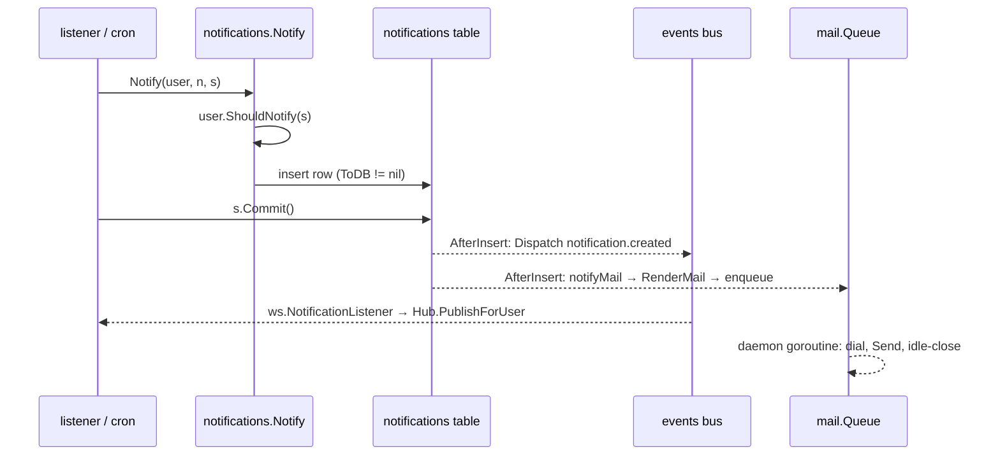

# Notifications and mail

`pkg/notifications` turns a typed notification into a database row (the in-app bell, the Atom feed, the websocket push) and/or a rendered e-mail; `pkg/mail` is the SMTP queue underneath. Notification types live next to the code that sends them (`pkg/models`, `pkg/user`, `pkg/modules/migration/handler`). Context: [Backend architecture → Events and background work](../../03-backend-architecture.md#events-and-background-work); the listeners that call `Notify` are catalogued in [events-and-listeners](./events-and-listeners.md).

## Responsibility

- **Owns:** the `Notification`/`Notifiable` contracts, `Notify` and its DB-then-mail ordering, the `Mail` builder and its templates, Markdown escaping, the `notifications` table and its query helpers, the type registry used to rehydrate rows, the mail daemon and SMTP client.
- **Does not own:** deciding *who* is notified (listeners in `pkg/models/listeners.go`, crons), read permissions on rows (`pkg/models/notifications_permissions.go`), the HTTP routes (`pkg/routes/api/v1`, `pkg/routes/api/v2/notifications*.go`, `pkg/routes/feeds`), the websocket push (`pkg/websocket/listener.go`), or translations (`pkg/i18n`).

## Entry points and public API

| Entry | Where | Called by |
|---|---|---|
| `Notify(notifiable, notification, sessions...)` | `pkg/notifications/notification.go` | listeners, crons, `pkg/user` (password reset, TOTP, deletion), migration handler |
| `Notification` (`ToMail(lang) *Mail`, `ToDB() any`, `Name() string`), optional `SubjectID`, `ThreadID`, `Titler`, `ProjectID`; `PersistedNotification` = `Notification` + `ProjectID` | `pkg/notifications/notification.go` | every notification type |
| `Notifiable` (`RouteForMail`, `RouteForDB`, `ShouldNotify(sessions...)`, `Lang`) | `pkg/notifications/notification.go` | `*user.User` (`pkg/user/user.go:141-184`) |
| `Register(factory)`, `Lookup(name)`, `RegisteredNames()` | `pkg/notifications/notification.go` | `init()` in `pkg/models/notifications.go` and `api_tokens_expiry_notification.go`; `pkg/models/notifications_refresh.go`, `pkg/routes/feeds/handler.go` |
| `NewMail()` builder, `SendMail(m, lang)`, `RenderMail`, `CreateConversationalHeader`, `EscapeMarkdown` | `pkg/notifications/mail.go`, `mail_render.go`, `markdown_escape.go` | `ToMail` implementations, `notifyMail` |
| `DatabaseNotification`, `GetNotificationsForUser`, `GetNotificationByID`, `GetNotificationsForNameAndUser`, `CanMarkNotificationAsRead`, `MarkNotificationAsRead`, `MarkAllNotificationsAsRead`, `DeleteAllNotificationsForUser` | `pkg/notifications/database.go` | `pkg/models/notifications_database.go`, v1/v2 handlers, `pkg/websocket/listener.go`, dedupe checks in listeners |
| `NotificationCreatedEvent` (`notification.created`) | `pkg/notifications/events.go` | dispatched from `DatabaseNotification.AfterInsert` |
| `mail.StartMailDaemon()`, `StopMailDaemon()`, `SendMail(opts)`, `SendTestMail(opts)`, `GetMailDomain()` | `pkg/mail/mail.go`, `send_mail.go`, `domain.go` | `pkg/initialize/init.go` → `FullInitWithoutAsync`, `pkg/cmd/user.go`, `notifications.SendMail`, the settings "send test mail" route |
| `Fake()`, `AssertSent`, `AssertNotSent` / `mail.Fake()`, `LastSent`, `SentMails`, `ResetSent` | `pkg/notifications/testing.go`, `pkg/mail/testing.go` | tests |

## Key types and functions

- `Notify` (`notification.go`): under `Fake()` records and returns. Otherwise `ShouldNotify` (bots and disabled/deleted users are skipped via `getUser(..., true)` → `IsErrUserStatusError`), then `notifyDB`; if a row was inserted the mail is **deferred** to `DatabaseNotification.AfterInsert`, otherwise `notifyMail` runs immediately. With a caller-owned session the insert joins that transaction and `AfterInsert` fires during `Commit()`; a rollback sends nothing (#2971).
- `notifyDB`: `ToDB() == nil` means mail-only. Row fields: `NotifiableID`, JSON `Notification`, `Name`, `SubjectID` (if `SubjectID` implemented), `ProjectID` via `ProjectIDOf` (0 = account-scoped, `ProjectIDUnresolved = -1` = visible to nobody).
- `DatabaseNotification.AfterInsert` (`database.go`): dispatches `notification.created` (consumed by the websocket bridge) and calls `notifyMail` with the in-memory `notification`/`notifiable` it carried.
- `notifyMail`: `ToMail(lang)`; nil means no mail. Subject falls back to `Titler.ToTitle(lang)`; `To` from `RouteForMail`; `ThreadID` → `In-Reply-To`/`References` headers; then `SendMail` → `RenderMail` → `mail.SendMail`.
- `Mail` builder (`mail.go`): `From`, `To`, `Subject`, `Greeting`, `Action(text, url)`, `Line` (Markdown), `HTML`, `FooterLine`, `IncludeLinkToSettings(lang)`, `HeaderLine`, `ThreadID`, `Conversational`. Lines added before `Action` are intro lines, after it outro lines (`appendLine`).
- `RenderMail` (`mail_render.go`): picks the formal or conversational plain/HTML template pair, renders Markdown lines with goldmark and sanitizes with a bluemonday UGC policy (`newNotificationSanitizer`, remote images stripped), produces `mail.Opts{ContentType: ContentTypeMultipart}` with the embedded `logo.png` for formal mails.
- `EscapeMarkdown` (`markdown_escape.go`): escapes the CommonMark special set plus `<`; every user-controlled string passed to `Line` must go through it (GHSA-45q4-x4r9-8fqj).
- `pkg/mail/mail.go` → `getClient`: go-mail client from `mailer.*` keys; `StartMailDaemon` creates `Queue` (buffered `mailer.queuelength`), dials lazily on the first message, closes the SMTP connection after `mailer.queuetimeout` seconds idle, and only logs send errors. `SendMail(opts)` is a non-blocking enqueue that silently returns when the mailer is disabled or `Queue == nil`; `SendTestMail` dials synchronously and returns the error.
- `getMessage` (`send_mail.go`): sets `Message-ID: <random>@<GetMailDomain()>` (host of `service.publicurl`, else hostname, else `vikunja`), `User-Agent: Vikunja <version>`, default `From: Vikunja <mailer.fromemail>`.

## Internal structure

### Notification catalog

| Type (file) | `Name()` | DB row | Mail | Thread | Sent by |
|---|---|---|---|---|---|
| `ReminderDueNotification` (`pkg/models/notifications.go`) | `task.reminder` | yes (Task, Project only) | yes | `<task-ID@domain>` | reminder cron |
| `TaskCommentNotification` | `task.comment` | yes, `SubjectID` = comment id | conversational, `From` doer | task | `SendTaskCommentNotification`, `HandleTaskCommentEditMentions` |
| `TaskAssignedNotification` | `task.assigned` | yes | three subject variants (assignee / others / self-assign) | task | `SendTaskAssignedNotification` |
| `TaskDeletedNotification` | `task.deleted` | yes | yes | task | `SendTaskDeletedNotification` |
| `TaskCreatedNotification` | `task.created` | yes | yes | task | `SendTaskCreatedNotification` |
| `ProjectCreatedNotification` | `project.created` | yes | yes | – | `SendProjectCreatedNotification` |
| `TeamMemberAddedNotification` | `team.member.added` | yes (`ProjectID` 0) | yes | – | `SendTeamMemberAddedNotification` |
| `UserMentionedInTaskNotification` | `task.mentioned` | yes, `SubjectID` = task id | conversational | task | `HandleTaskCreateMentions`, `HandleTaskUpdatedMentions` |
| `UndoneTaskOverdueNotification`, `UndoneTasksOverdueNotification` | `task.undone.overdue` (both) | no | yes | task (single only) | overdue cron |
| `DataExportReadyNotification` | `data.export.ready` | no | yes | – | `ExportUserData` |
| `APITokenExpiringWeekNotification`, `APITokenExpiringDayNotification` (`api_tokens_expiry_notification.go`) | `api_token.expiring.week` / `.day` | yes, `SubjectID` = token id | yes | – | API token expiry cron |
| `pkg/user/notifications.go` (10 types: email confirm, password changed, email change, reset password, invalid TOTP, account locked, failed login, deletion confirm/scheduled/deleted) | `""` or `totp.invalid`, `password.account.locked.after.invalid.totp`, `failed.login.attempt`, `user.deletion.confirm`, `user.deletion`, `user.deleted` | no | yes | – | `pkg/user` flows, deletion cron |
| `pkg/modules/migration/handler/notifications.go` (`MigrationDone`, `MigrationFailedReported`, `MigrationFailed`) | `migration.done`, `migration.failed.reported`, `migration.failed` | no | yes | – | migration listeners |

Only the ten persisted types are `Register`ed (`init()` in `pkg/models/notifications.go` and `api_tokens_expiry_notification.go`) and implement `ProjectID()` (`pkg/models/notifications_permissions.go`). `notificationUsers` in `pkg/models/notifications_refresh.go` lists which user fields get reloaded at read time (#2720); a new persisted type carrying a user must be added there.

### Reading rows

- v1 (`pkg/routes/routes.go:880-888`): `GET /notifications` (`DatabaseNotifications.ReadAll`, applies `NotificationProjectFilter`, forbidden for link shares), `POST /notifications/:notificationid` (mark read/unread via `Read` field), `POST /notifications` (`apiv1.MarkAllNotificationsAsRead`), `DELETE /notifications`.
- v2 (`pkg/routes/api/v2/notifications.go`): `notifications-list` GET, `notifications-mark-read` PUT `/notifications/{notificationid}`, `notifications-mark-all-read` POST, `notifications-delete-all` DELETE; `notifications_feed.go` serves `/api/v2/notifications.atom` (Basic-auth API token, listed in `unauthenticatedAPIPaths`); the legacy feed is `/feeds/notifications.atom` (`pkg/routes/feeds/handler.go`). Both feeds only render types that implement `Titler`.
- Websocket: `notification.created` → `ws.NotificationListener` reloads the row, re-checks `models.CanReadNotification`, pushes `{"event":"notification.created","data":<row>}` (see [websocket](./websocket.md)).
- Frontend: `frontend/src/components/notifications/Notifications.vue` loads via the legacy `NotificationService`, subscribes to `notification.created`, dedupes by id, and polls every 10 s only while the socket is disconnected and the tab is visible. See [../frontend/sharing-teams-labels-notifications.md](../frontend/sharing-teams-labels-notifications.md).

## Dependencies

- **Uses:** `pkg/db` (session, `RegisterTables` in `db.go`), `pkg/events`, `pkg/mail`, `pkg/config`, `pkg/i18n`, `pkg/log`, goldmark, bluemonday, `github.com/wneessen/go-mail`.
- **Used by:** `pkg/models`, `pkg/user`, `pkg/modules/migration/handler`, `pkg/websocket`, `pkg/routes/feeds`, `pkg/routes/api/v1|v2`. `pkg/notifications` must not import `pkg/user` or `pkg/models` (import cycle; `GetNotificationsForUser` takes an id and a prebuilt `builder.Cond` for that reason).

## Invariants and assumptions

- Mail for a persisted notification is sent from `AfterInsert`, never from `Notify` directly; listeners that pass a session and then `Rollback` send nothing. Do not "fix" a missing mail by calling `notifyMail` yourself.
- `Name()` is the persistence key: rename one and every existing row stops rehydrating (`Lookup` fails, feed skips it, `refreshNotificationUsers` skips it). Two types may share a name only if neither persists (`task.undone.overdue`).
- Dedupe by `(notifiable_id, name, subject_id)` via `GetNotificationsForNameAndUser`; only types with `SubjectID` are deduped, and only where the caller checks.
- `ProjectID()` must return the real project or `ProjectIDUnresolved`; returning 0 for a project-scoped notification leaks it to users who lost access (`notificationProjectID`).
- Titles and lines are translated with `i18n.T(lang, key, params...)` from `pkg/i18n/lang/en.json` under `notifications.*` (namespaces: `greeting`, `common.actions.*`, `task.*`, `project`, `team`, `data_export`, `migration`, `api_token`, plus the `pkg/user` ones). Only edit `en.json`; Crowdin syncs the rest ([Conventions → Translations](../../08-conventions.md)).
- Anything user-typed that ends up in a Markdown `Line` goes through `EscapeMarkdown`; HTML comment bodies go through `HTML` and are sanitized at render time.

## Configuration

| Key (`config.yml`) | Env var | Effect |
|---|---|---|
| `mailer.enabled` (false) | `VIKUNJA_MAILER_ENABLED` | Off: `Queue` is nil, `SendMail` drops silently, reminder/expiry crons that need mail are not registered |
| `mailer.host`, `mailer.port` (587), `mailer.username`, `mailer.password`, `mailer.authtype` (`plain`/`login`/`cram-md5`), `mailer.forcessl`, `mailer.skiptlsverify` | `VIKUNJA_MAILER_*` | SMTP client (`getClient`); empty host logs a warning and never starts the daemon |
| `mailer.fromemail` (`mail@vikunja`) | `VIKUNJA_MAILER_FROMEMAIL` | Default sender; conversational mails override with the doer's display name |
| `mailer.queuelength` (100), `mailer.queuetimeout` (30 s) | | Channel capacity; idle-close and dial timeout (+3 s) |
| `service.enableemailreminders` (true) | `VIKUNJA_SERVICE_ENABLEEMAILREMINDERS` | Gates reminder and overdue mails together with `mailer.enabled` |
| `service.publicurl` | | Links in mails, `Message-ID` domain, settings footer link |
| `log.mail`, `log.maillevel` | | go-mail debug logging |

Per-user gates (`pkg/user/user.go`): `EmailRemindersEnabled` and `OverdueTasksRemindersEnabled` are read by the two reminder crons; `ShouldNotify` blocks bots and non-active users. There is no per-type opt-out; `IncludeLinkToSettings` points users at the general settings page.

## Error handling

- `Notify` returns DB errors (listeners turn them into retries) but mail errors from `AfterInsert` are only logged (`Failed to send mail for notification`).
- The daemon logs `Error during connect to smtp server` / `Error when sending mail` and drops that message; there is no retry, dead-letter, or metric for failed mails. Once `mailer.queuelength` messages are buffered, `Queue <- m` blocks the caller (a listener or cron goroutine) until the daemon drains.
- `SendTestMail` surfaces the SMTP error to the settings UI.
- Rendering errors (`RenderMail`) return from `SendMail` and, for persisted notifications, are logged from `AfterInsert`.

## Tests

- `pkg/notifications`: `TestNotify` (row + deferred mail), `TestRegistry`, `TestRenderMail` (XSS and Markdown cases), `TestConversationalMail`, `TestNotificationEmailStripsRemoteImages`, `TestEscapeMarkdown*`, `TestNotifyDoesNotBlockWhenMailerDisabled`. `main_test.go` builds a test engine with just the `notifications` table and calls `mail.Fake()` and `events.Fake()`. Run: `mage test:filter TestRenderMail`.
- `pkg/mail`: `TestStopMailDaemon*`, `TestGetMessageSetsMessageID`, `TestGetMailDomain`.
- Type-specific: `pkg/models/notifications_test.go`, `api_tokens_expiry_notification_test.go`, `task_created_notification_test.go`, `notifications_task_identifier_test.go`; listener tests assert with `notifications.AssertSent`.
- Not covered: a real SMTP round trip, the `/feeds` rendering of every type, `refreshNotificationUsers` for all types.

## Gotchas and tech debt

- `mail.SendMail` under `mail.Fake()` records `Opts`, but `notifications.Notify` under `notifications.Fake()` short-circuits before rendering, so a test that wants rendered output must not fake notifications.
- `UndoneTasksOverdueNotification.ToMail` builds Markdown lists by string concatenation (`overdueSection`); escaping there is manual.
- `TaskCommentNotification.ToMail` opens its own `db.NewSession()` to format mentions, so rendering a comment mail hits the database.
- `AccountDeletionNotification` and friends have `Name() == ""`; harmless because they never persist, but `AssertSent` matches on name, so all four empty-name types look identical to it.
- No TODO/FIXME comments in `pkg/notifications` or `pkg/mail` as of 2026-09-16.

## How to add a notification type

1. `mage dev:make-notification <Name> <module>` appends a struct with `ToMail`, `ToDB`, `Name` to `pkg/<module>/notifications.go`. Pick a stable dotted `Name()`.
2. Add i18n keys under `notifications.<area>.*` in `pkg/i18n/lang/en.json` and use `i18n.T(lang, key, ...)`; wrap user strings in `notifications.EscapeMarkdown`. Implement `Titler` so the feed and the mail subject work.
3. Persisted? Return `n` from `ToDB`, implement `ProjectID()` in `pkg/models/notifications_permissions.go`, `SubjectID()` if it must dedupe, `ThreadID()` if it belongs to a task thread, register it in the `init()` of `pkg/models/notifications.go`, and extend `notificationUsers` if it embeds users. Add the name to `NOTIFICATION_NAMES` in `frontend/src/modelTypes/INotification.ts` and a renderer in `Notifications.vue`.
4. Send it from a listener or cron with `notifications.Notify(user, n, s)`; pass the session when you are inside a transaction.
5. Tests: `notifications.AssertSent` in the listener test, a `ToMail` rendering test if the layout is non-trivial.

## Related pages

[events-and-listeners](./events-and-listeners.md), [cron-and-background-jobs](./cron-and-background-jobs.md), [websocket](./websocket.md), [user-package](./user-package.md), [importers](./importers.md), [config-and-logging](./config-and-logging.md), [operations-subsystems](./operations-subsystems.md) (i18n), [../frontend/sharing-teams-labels-notifications.md](../frontend/sharing-teams-labels-notifications.md), [Data model → Notification](../../06-data-model.md), [Data flows → comment to notification](../../10-data-flows.md), [playbooks/background-job](../../playbooks/background-job.md).
