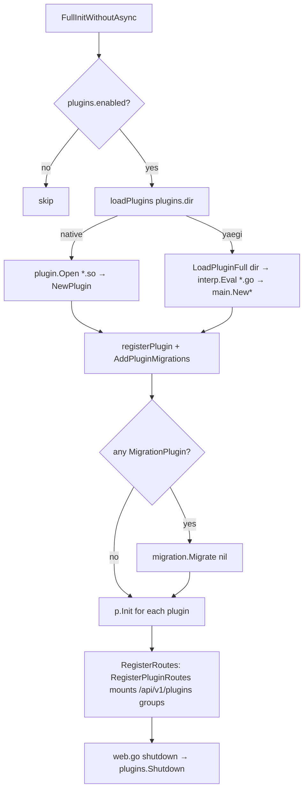

# Plugins

`pkg/plugins` lets an operator extend the API binary with Go code that runs in-process: either compiled `.so` files (Go's `plugin` package, deprecated in the config docs) or directories of Go source interpreted at startup by [yaegi](https://github.com/traefik/yaegi). Plugins can hook `Init`/`Shutdown`, add xormigrate migrations, and mount Echo routes under `/api/v1/plugins`. The system is off by default. See [03 Backend architecture](../../03-backend-architecture.md#startup) for where it sits in startup.

## Responsibility

- Owns: the plugin interfaces, discovery and loading (`Manager`), route mounting, plugin migration registration, and the yaegi symbol tables (`pkg/yaegi_symbols`) that decide what interpreted plugins can import.
- Does not own: auth for plugin routes (inherits the group middlewares from `pkg/routes/routes.go`), the migration runner (`pkg/migration`), or any sandboxing; plugins run with the API's full privileges.

## Entry points and public API

| Entry | Where | Called by |
|---|---|---|
| `Plugin`, `MigrationPlugin`, `AuthenticatedRouterPlugin`, `UnauthenticatedRouterPlugin` | `pkg/plugins/interfaces.go` | plugin authors |
| `plugins.Initialize()` | `pkg/plugins/manager.go` | `pkg/initialize/init.go:129` (`FullInitWithoutAsync`, after `migration.Migrate`) |
| `plugins.Shutdown()` | `manager.go` | `pkg/cmd/web.go:200` on graceful shutdown |
| `plugins.RegisterPluginRoutes(auth, unauth *echo.Group)` | `manager.go` | `pkg/routes/routes.go:996-1005` |
| `plugins.YaegiPluginLoader` (function var), `LoadedYaegiPlugin` | `manager.go` | set by `pkg/plugins/yaegi` `init()`; `pkg/initialize/init.go:41` blank-imports the package to register it |
| `yaegi.LoadPlugin(dir)`, `yaegi.LoadPluginFull(dir)` | `pkg/plugins/yaegi/loader.go` | `Manager.loadYaegiPlugin`, tests |
| `yaegi_symbols.Symbols` | `pkg/yaegi_symbols/symbols.go` | `LoadPluginFull` → `interp.Use` |
| `migration.AddPluginMigrations(ms)` | `pkg/migration/migration.go:44` | `Manager.loadNativePlugin`, `loadYaegiPlugin` |
| `Registry` (`NewRegistry`, `Add`, `All`) | `pkg/plugins/registry.go` | No caller in `pkg/` (grep 2026-09-16); only exported into `yaegi_symbols`. `Manager` keeps its own slices |

## Key types and functions

| Name | Notes |
|---|---|
| `Plugin` | `Name()`, `Version()`, `Init() error`, `Shutdown() error`. `Init` errors are logged, not fatal; loading errors (bad `.so`, eval failure) are logged per plugin, but an unreadable plugins directory other than "not exist" is `log.Fatalf`. |
| `MigrationPlugin` | `Migrations() []*xormigrate.Migration`; appended to the global list via `AddPluginMigrations`, then `Initialize` runs `migration.Migrate(nil)` a second time so plugin tables exist before `Init`. Plugin migration IDs share the namespace with core ones (`pkg/plugins/yaegi/testdata/migrationplugin/main.go` uses `20260101000000-create-plugin-migration-test`). |
| `AuthenticatedRouterPlugin` / `UnauthenticatedRouterPlugin` | Receive an `*echo.Group`. Authenticated group is `a.Group("/plugins")` (JWT/API-token middleware already applied); unauthenticated is `n.Group("/plugins")` with the IP rate limiter (`routes.go:1001-1002`). |
| `Manager` | Package singleton `manager`; `loadPlugins` reads `plugins.dir` once, branching on `plugins.loader`: `native` picks `*.so` files, `yaegi` picks subdirectories. |
| `loadNativePlugin` | `plugin.Open` → `Lookup("NewPlugin")` → must be `func() Plugin`; then ordinary Go type assertions for the optional interfaces. |
| `LoadPluginFull` (yaegi) | New interpreter with `stdlib.Symbols` + `yaegi_symbols.Symbols`; evaluates every top-level `.go` file in the directory (no subdirectories), then evaluates `main.NewPlugin` (required) and `main.NewAuthenticatedRouterPlugin`, `main.NewUnauthenticatedRouterPlugin`, `main.NewMigrationPlugin` (optional). Typed factories are required because yaegi wraps interpreted values per return type and sub-interface assertions fail (`loader.go:44-53`). |
| `yaegi_symbols` | One generated file per package in `magefile.go` → `yaegiSymbolPackages`: `pkg/config`, `pkg/db`, `pkg/events`, `pkg/log`, `pkg/models`, `pkg/plugins`, `pkg/user`, `echo/v5`, `watermill/message`, `viper`, `xormigrate`, `xorm`. `symbols.go` is hand-written: it declares the `Symbols` map and `logFatal`/`logFatalf` wrappers because `yaegi extract` treats `Fatal*` in any package named `log` as restricted and emits references to those local names (`symbols.go:12-16`, used by `vikunja_log.go:20-21`). |
| `mage generate:yaegi-symbols` | Runs `go run github.com/traefik/yaegi/cmd/yaegi extract <pkg>` with `GOPACKAGE=yaegi_symbols` and renames the output. `mage check:yaegi-symbols` (`magefile.go:734`, compares sha256 hashes) fails when a regeneration changes any file. `.github/workflows/release.yml:507-527` regenerates and auto-commits `[skip ci] Updated yaegi symbols` as "Frederick [Bot]". |
| `mage plugins:build <path>` | `go build -buildmode=plugin -tags <Tags> -o plugins/<basename>.so <path>` (`magefile.go:2330`). Native plugins must be built with the exact same Go version, module versions and build tags as the API binary or `plugin.Open` fails. |

## Internal structure

Example: `examples/plugins/example/main.go` (marked `//go:build ignore`, verified by `TestExamplePluginIsExcludedFromModuleBuild`) registers a `TaskCreatedEvent` listener in `Init`, serves `GET /api/v1/plugins/user-info` (authenticated; reads the user with `user.GetCurrentUserFromDB`) and `GET /api/v1/plugins/status` (unauthenticated), and exports `NewPlugin`, `NewAuthenticatedRouterPlugin`, `NewUnauthenticatedRouterPlugin` returning one singleton.

## Dependencies

- **Uses:** `pkg/config`, `pkg/log`, `pkg/migration`, `github.com/traefik/yaegi` (`interp`, `stdlib`), Go `plugin`, Echo, xormigrate.
- **Used by:** `pkg/initialize`, `pkg/routes`, `pkg/cmd/web.go`. `pkg/yaegi_symbols` is imported only by `pkg/plugins/yaegi`.

## What plugins can and cannot do

| Can | Because |
|---|---|
| Register event listeners (`events.RegisterListener`) and dispatch events | `pkg/events` is exported to yaegi and the example does it |
| Open DB sessions and use models (`db.NewSession`, `models.*`, `user.*`) | `pkg/db`, `pkg/models`, `pkg/user`, `xorm` symbols are exported |
| Read config (`config.*`, `viper`) and log through `pkg/log` | exported |
| Add tables via xormigrate migrations | `MigrationPlugin` |
| Mount Echo routes under `/api/v1/plugins` (auth and unauth) | `RegisterPluginRoutes` |

| Cannot (as the code stands) | Because |
|---|---|
| Mount `/api/v2` (Huma) routes | Only Echo groups are passed; no Huma API handle is exposed |
| Import any Vikunja package outside the 12 extracted ones (e.g. `pkg/notifications`, `pkg/files`, `pkg/web`) from a yaegi plugin | `yaegi_symbols` only has those; native plugins can import anything but must match the build exactly |
| Be enabled/disabled individually or listed via an API | No such code. Note that `collectRoutesForAPITokens` (`routes.go:367-380`) walks every Echo route with an `/api/v1` or `/api/v2` prefix, so `/api/v1/plugins/*` routes do land in the API-token permission table under whatever group name `CollectRoutesForAPITokenUsage` derives (Unverified: the derived group name) |
| Be sandboxed or versioned against the API | No isolation; `Version()` is only logged |

## Configuration

| Key (`config.yml`) | Default | Effect |
|---|---|---|
| `plugins.enabled` | `false` | Gates `Initialize` and the route groups |
| `plugins.dir` | `<rootpath>/plugins` (`config.ResolvePath("plugins")`) | Scanned non-recursively |
| `plugins.loader` | `native` | `native` or `yaegi`; anything else is fatal at config load (`config.go:789-791`). The `config-raw.json` comment marks `native` as deprecated. |

## Error handling

Load and `Init` failures are logged with `log.Errorf` and the server keeps starting without that plugin. A missing `YaegiPluginLoader` (yaegi package not imported) errors per plugin with "yaegi plugin loader not registered". Plugin route handlers are ordinary Echo handlers, so their errors go through `CreateHTTPErrorHandler` like everything else.

## Tests

| Test | Covers |
|---|---|
| `pkg/plugins/yaegi/loader_test.go` | `TestLoadPlugin`, `TestLoadPluginFull` against `examples/plugins/example`, `TestExamplePluginIsExcludedFromModuleBuild` |
| `pkg/plugins/yaegi/routes_test.go` | `TestPluginRoutesServeHTTP` |
| `pkg/plugins/yaegi/events_test.go` | `TestPluginEventListener` |
| `pkg/plugins/yaegi/migrations_test.go` | `TestLoadPluginWithMigrations` using `testdata/migrationplugin` |
| `pkg/yaegi_symbols/stdlib_check_test.go` | Interpreter can import `fmt` from `stdlib.Symbols` (guards against a broken yaegi/stdlib pairing) |

Run `mage test:filter TestLoadPluginFull`. `pkg/plugins` itself has no `_test.go`; the native loader and `Manager.loadPlugins` are untested.

## Gotchas and tech debt

- Native plugins are effectively unusable across builds: Go's `plugin` package requires identical toolchain and dependency versions. This is why yaegi exists and why the config comment deprecates `native`.
- Changing the exported surface of any package in `yaegiSymbolPackages` (adding a function to `pkg/models`, bumping Echo) makes the generated files stale; CI regenerates on release and lint excludes `pkg/yaegi_symbols/..*` and `plugins-dev/..*` (`.golangci.yml:222-223`, formatters at 234). `plugins/` and `plugins-dev/` are gitignored.
- `pkg/yaegi_symbols/*.go` are large generated files (`xorm.go` 831 lines, `vikunja_models.go` 687); never hand-edit except `symbols.go`.
- `Registry` in `registry.go` appears unused by `Manager` (which keeps plain slices); treat it as dead code until a caller appears.
- `Initialize` runs `migration.Migrate(nil)` again when any migration plugin is present, which re-opens a DB engine; harmless but slow on large databases (Unverified: cost).
- yaegi evaluates each file separately; a plugin split across files that reference each other must not rely on package-level init order guarantees beyond what yaegi provides (Unverified).
- No plugin has been published by the project; the only reference implementation is the example.

## Related pages

- [http-routing-and-middleware](./http-routing-and-middleware.md) (groups `a` and `n`, rate limiting), [db-and-migrations](./db-and-migrations.md) (xormigrate list), [events-and-listeners](./events-and-listeners.md), [config-and-logging](./config-and-logging.md)
- [build-and-release](../build-and-release.md) for the release workflow that commits symbols
- [02 Repository map](../../02-repository-map.md)
