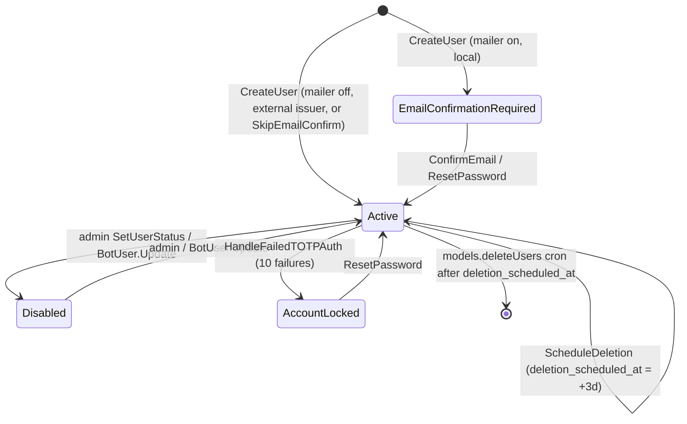

# `pkg/user`

The user account package: the `users`, `user_tokens`, and `totp` tables, credential checks, account lifecycle (create, confirm, change email, reset password, delete), TOTP, CalDAV tokens, and the search used for sharing. It sits below `pkg/models` in the [package layering](../../03-backend-architecture.md#package-layering-and-dependency-direction).

## Responsibility

- Owns: `user.User` (which satisfies `web.Auth`), `Token`, `TOTP`, the `1xxx` error block, user-scoped notifications and events, password hashing, status gating, the token cleanup and deletion-reminder crons.
- Does not own: the actual deletion cascade (`pkg/models/user_delete.go` → `DeleteUser`, hourly `RegisterUserDeletionCron`), inbox project and default saved filter on registration (`pkg/models/project.go` → `RegisterUser`), bot CRUD endpoints (`pkg/models/bot_users.go`, see [models-sharing-teams-labels](./models-sharing-teams-labels.md)), JWT/session issuance and OIDC/LDAP login ([auth-and-sessions](./auth-and-sessions.md)), avatars ([files-and-storage](./files-and-storage.md)), settings DTOs and routes (`pkg/routes/api/v2/user_settings.go`, v1 `user_settings.go`).
- **Why separate:** `pkg/models` imports `pkg/user`; the reverse would be a cycle. Consequences visible in code: `GetFromAuth` detects a link share by the reflected type name string `"*models.LinkSharing"`; `CreateUser` cannot create the inbox project, so `models.RegisterUser` wraps it; `DeleteUser` lives in models. Import counts on 2026-09-16: 53 files in `pkg/models`, 16 in `pkg/routes/api/v2`, 14 in `pkg/routes/api/v1`.

## Entry points and public API

| Entry | Where | Called by |
|---|---|---|
| `GetFromAuth(a)` | `user.go` | every model needing a real user; returns `ErrMustNotBeLinkShare` (1023) for link shares |
| `GetUserByID`, `GetUserByUsername`, `GetUsersByIDs`, `GetUsersByCond`, `GetUserWithEmail`, `GetUsersByUsername` | `user.go` | models, routes, notifications |
| `CheckUserCredentials(ctx, s, *Login)`, `CheckUserPassword` | `user.go` | login routes, `ChangeUserEmail`, password change |
| `GetCurrentUser(c)`, `GetCurrentUserFromDB`, `GetUserFromClaims` | `user.go` | v1 handlers, JWT middleware |
| `CreateUser(s, u, ...CreateUserOptions)`, `CreateBotUser(s, bot, owner)`, `HashPassword` | `user_create.go` | `models.RegisterUser`, admin create, OIDC/LDAP first login, `BotUser.Create` |
| `UpdateUser(s, u, forceOverride)`, `UpdateUserPassword`, `SetUserStatus`, `User.SetStatus`, `GuardLastAdmin` | `user.go` | settings routes, admin actions, avatar routes |
| `ListUsers`, `SearchUsers`, `ListAllUsers` | `users_project.go` | v2 `user_search.go`, v1 `user_list.go`, project share user lookup |
| `RequestUserPasswordResetTokenByEmail`, `RequestUserPasswordResetToken`, `ResetPassword` | `user_password_reset.go` | v1 `user_password_reset.go`, v2 `auth_public.go`; TOTP lockout |
| `ConfirmEmail`, `ChangeUserEmail`, `UpdateEmail`, `CancelEmailUpdate`, `ResendEmailConfirmation` | `user_email_confirm.go`, `update_email.go` | v1 `user_confirm_email.go`, `user_update_email.go`; v2 `user_settings.go` |
| `RequestDeletion`, `ConfirmDeletion`, `ScheduleDeletion`, `CancelDeletion`, `RegisterDeletionNotificationCron` | `delete.go` | v1/v2 `user_deletion.go`; `pkg/initialize` |
| `EnrollTOTP`, `EnableTOTP`, `DisableTOTP`, `ValidateTOTPPasscode`, `TOTPEnabledForUser`, `GetTOTPQrCodeAsJpegForUser`, `HandleFailedTOTPAuth` | `totp.go` | `user_totp.go` (v1/v2), login |
| `GenerateNewCaldavToken`, `GetCaldavTokens(WithSession)`, `DeleteCaldavTokenByID` | `caldav_token.go` | `user_caldav_token.go`, v2 `caldav_tokens.go`, CalDAV basic auth |
| `CleanupOldTokens`, `RegisterTokenCleanupCron` | `token.go` | `pkg/initialize` |
| `IsBotOwnedBy`, `SameBotIdentityCond` | `bot_identity.go` | label/bot permissions |
| `GetTables()` | `db.go` | `db.RegisterTables` in `init()`; `InitTests` |

## Key types and functions

| Name | File | Notes |
|---|---|---|
| `Status` (`Active 0`, `EmailConfirmationRequired 1`, `Disabled 2`, `AccountLocked 3`) | `user.go` | `String()` for logs/admin |
| `User` | `user.go` | JSON exposes only `id`, `name`, `username`, `email` (omitempty), `bot_owner_id`, `created`, `updated`; everything else is `json:"-"` and served through settings DTOs. Fields: `Password` (bcrypt), `PendingEmail`, `Status`, `IsAdmin`, `AvatarProvider`/`AvatarFileID`, `Issuer`/`Subject` (`local`, `ldap`, or the OIDC issuer URL), reminder and discoverability flags, `DefaultProjectID`, `BotOwnerID`, `WeekStart`, `Language`, `Timezone`, `DeletionScheduledAt`/`DeletionLastReminderSent`, `FrontendSettings` (JSON column), `ExtraSettingsLinks`, `ExportFileID` |
| `finishLoadedUser` | `user.go` | Every loader returns the user **and** `ErrAccountDisabled` (1020) / `ErrAccountLocked` (1040) when the status says so; callers that must still see such users write `if err != nil && !IsErrUserStatusError(err)` |
| `GetUserByID` / `GetUsersByIDs` | `user.go` | Per-session memo `user-<id>` (raw row shared, status gate re-run per hit); emails stripped unless `GetUserWithEmail` |
| `GetUserFromClaims` | `user.go` | Requires `type == AuthTypeUser (1)`, `id`, `username`; copies `is_admin` claim (models re-check the DB row via `isInstanceAdmin`) |
| `CheckUserCredentials` | `user.go` | Order: empty → 1004; unknown user → dummy bcrypt then 1011; non-local issuer → 1021; unconfirmed → 1012; wrong password → `handleFailedPassword` (fires `LoginFailedEvent`, keyvalue counter, `FailedLoginAttemptNotification` at exactly 3) → 1011; disabled/locked only after the password matched |
| `UpdateUser` | `user.go` | Username (1001) and email (1002, scoped by issuer/subject) uniqueness, avatar provider whitelist (`default, gravatar, initials, upload, marble, ldap, openid`, else 1018), timezone (1025). Writes `baseUserUpdateColumns` (includes `status`); a direct email change clears `pending_email` and its confirm tokens; `forceOverride` also writes `frontend_settings` (pre-marshalled JSON string) and allows clearing `name` |
| `GuardLastAdmin` | `user.go` | Refuses demoting/deleting the last active, non-scheduled admin (1030); `FOR UPDATE` on MySQL only |
| `CreateUser` | `user_create.go` | Defaults every setting from `defaultsettings.*`; `Issuer` defaults to `local`; local users need username+password+email, external ones need `Subject`; username rules: no spaces (1022), not `link-share-<n>` or `bot-*` (1026); bcrypt with `service.bcryptrounds`; fires `CreatedEvent`; when the mailer is on and not `SkipEmailConfirm`, sets `StatusEmailConfirmationRequired` and mails the confirm token in `s.After(...)` (after commit) |
| `CreateBotUser` | `user_create.go` | Owner must be a human (1033); username must start with `bot-` (1034); no password/email; bypasses the regular validity checks |
| `TokenKind` (`PasswordReset 1`, `EmailConfirm 2`, `AccountDeletion 3`, `CaldavAuth 4`), `Token` | `token.go` | 64-char random; stored as SHA-256 (`generateToken`) except CalDAV tokens which are bcrypt (`generateHashedToken`); `ClearTextToken` returned once |
| `CleanupOldTokens` | `token.go` | Hourly: deletes password-reset and deletion tokens older than 24h, and email-confirm tokens older than 24h **only for users with a pending email**; registration confirm links never expire |
| `TOTP` | `totp.go` | `Enabled` only after a verified passcode; `APICopy()` hides the secret once enabled; QR code refused once enabled (1037); replay guard `totp_used_<uid>_<code>` for 90s (1039); `HandleFailedTOTPAuth` uses its **own session** (GHSA-fgfv-pv97-6cmj): notification at 3 failures, at 10 issues a reset token, notifies, and sets `StatusAccountLocked` |
| Deletion | `delete.go` | `RequestDeletion` mails a token; `ConfirmDeletion` (1028 invalid, 1029 wrong user) → `ScheduleDeletion` = now + 3 days; `CancelDeletion` clears both timestamps; hourly reminder cron sends `AccountDeletionNotification` 3/2/1 with ≥ 24h spacing |
| Email change | `update_email.go`, `user_email_confirm.go` | Mailer off: applied immediately. Mailer on: `pending_email` set, `EmailConfirmNotification` to the new address (1-minute cooldown in keyvalue → 1036), `EmailChangeRequestedNotification` to the old one. `ConfirmEmail` applies a pending email only if the token is < 24h old and the address is still free, and flips `EmailConfirmationRequired` → `Active`; a locked account may confirm registration but not swap its address |
| `ResetPassword` | `user_password_reset.go` | Also reactivates locked or unconfirmed accounts; returns the user id so callers can invalidate sessions; mails `PasswordChangedNotification` |
| `ListUsers` | `users_project.go` | Match rules: exact username (case-insensitive per DB), name only with `discoverable_by_name`, exact email only with `discoverable_by_email`, bypass for users sharing an external team; `service.enableopenidteamusersearch` limits to team co-members; never returns someone else's bot, always may return own bots; emails stripped unless matched exactly |
| Events | `events.go` | `user.created`, `user.login.succeeded`, `user.login.failed`, `user.logout` |
| Notifications | `notifications.go` | `EmailConfirmNotification`, `PasswordChangedNotification`, `EmailChangeRequestedNotification`, `ResetPasswordNotification`, `InvalidTOTPNotification` (`totp.invalid`), `PasswordAccountLockedAfterInvalidTOTPNotification`, `FailedLoginAttemptNotification`, `AccountDeletionConfirmNotification`, `AccountDeletionNotification`, `AccountDeletedNotification` — mail only (`ToDB` returns nil) |
| Validators | `validator.go` | govalidator tags `username` (no whitespace, not a URL, no comma, not `link-share-<n>`), `bcrypt_password` (8 chars … 72 bytes), `language` |

## Internal structure

Disabled and locked users can still be loaded (with a status error) so admins, notifications, and cleanup keep working; `CheckUserCredentials` and `ShouldNotify` refuse them.

## Dependencies

- **Uses:** `pkg/db` (sessions, memo, `ILIKE`), `pkg/config`, `pkg/events`, `pkg/notifications`, `pkg/keyvalue` (failed-attempt counters, TOTP replay, email cooldown), `pkg/cron`, `pkg/i18n`, `pkg/utils`, `pkg/web` (`Auth`, `HTTPError`), `golang.org/x/crypto/bcrypt`, `github.com/pquerna/otp`, `github.com/golang-jwt/jwt`, Echo (only `GetCurrentUser`).
- **Used by:** `pkg/models` (everything), routes v1/v2 and `pkg/routes/api/shared`, CalDAV, feeds, importers, OAuth2 server, license, websocket, richtext, avatar upload.

## Invariants and assumptions

- Humans have `bot_owner_id = 0` (fixture comment in `users.yml`): `SameBotIdentityCond` and the user-search bot filter treat `> 0` as "is a bot"; rows predating migration `20260405194817` are NULL and fixture user 20 keeps that branch alive.
- Usernames are unique and never `link-share-<n>` or `bot-*` for humans; link shares synthesize `link-share-<id>` (`models.LinkSharing.toUser`).
- Loaders strip `Email` unless asked; anything that returns users to clients must not re-add it (`ListUsers` only echoes an email the caller searched for exactly).
- `frontend_settings` is stored as a JSON string produced by `premarshalFrontendSettings`; only `UpdateUser(..., forceOverride=true)` writes it.
- Token lookups hash the presented value (`utils.Sha256Hex`) and never compare clear text; CalDAV tokens are bcrypt and verified elsewhere (Unverified: exact verifier in `pkg/routes/caldav`).
- `CreateUser` callers must not feed the returned `Status` back into `UpdateUser` blindly (comment in `user_create.go`): `status` is in `baseUserUpdateColumns`.

## Configuration

| Key (`config.yml`) | Env var | Effect |
|---|---|---|
| `service.bcryptrounds` | `VIKUNJA_SERVICE_BCRYPTROUNDS` | bcrypt cost for passwords and CalDAV tokens (tests set 4) |
| `service.enabletotp` | `VIKUNJA_SERVICE_ENABLETOTP` | `TOTPEnabledForUser` short-circuits to false when off |
| `service.enableregistration`, `service.enableuserdeletion`, `service.maxavatarsize` | `VIKUNJA_SERVICE_*` | Route-level gates (not read in this package) |
| `service.enableopenidteamusersearch` | `VIKUNJA_SERVICE_ENABLEOPENIDTEAMUSERSEARCH` | Restricts `ListUsers` to team co-members |
| `defaultsettings.avatar_provider`, `avatar_file_id`, `email_reminders_enabled`, `discoverable_by_name`, `discoverable_by_email`, `overdue_tasks_reminders_enabled`, `overdue_tasks_reminders_time`, `default_project_id`, `week_start`, `language`, `timezone` | `VIKUNJA_DEFAULTSETTINGS_*` | Applied by `CreateUser` |
| `mailer.enabled`, `mailer.fromemail`, `service.publicurl` | `VIKUNJA_MAILER_*`, `VIKUNJA_SERVICE_PUBLICURL` | Whether confirmations are mailed; sender name; links in notifications |

## Error handling

Block 1001–1040 in `error.go` (gaps: 1003, 1007, 1032). Note the two prefixes: `ErrorCode*` for 1001, 1002, 1025–1029 and `ErrCode*` for the rest.

| Code | Error | Status | Notes |
|---|---|---|---|
| 1001 / 1002 | `ErrUsernameExists` / `ErrUserEmailExists` | 400 | create, update, email change |
| 1004 | `ErrNoUsernamePassword` | 400 | also used for empty reset password and bot owner missing |
| 1005 | `ErrUserDoesNotExist` | 404 | id < 1, empty username, missing row |
| 1008 / 1009 / 1010 | no / invalid password-reset token, invalid email-confirm token | 400 | |
| 1011 / 1012 | `ErrWrongUsernameOrPassword` / `ErrEmailNotConfirmed` | 403 / 412 | login |
| 1013 / 1014 | empty new / old password | 400 | |
| 1015 / 1016 / 1017 / 1037 / 1039 | TOTP already enabled / not enabled / invalid passcode / QR unavailable / passcode reused | | |
| 1018 | `ErrInvalidAvatarProvider` | | |
| 1019 / 1038 | OpenID: no email / malformed custom scope | | raised by the openid module |
| 1020 / 1040 | `ErrAccountDisabled` / `ErrAccountLocked` | | returned by every loader for such users |
| 1021 | `ErrAccountIsNotLocal` | | password login for OIDC/LDAP users |
| 1022 / 1026 | username with spaces / reserved | 400 | |
| 1023 | `ErrMustNotBeLinkShare` | | `GetFromAuth` on a link share |
| 1024 / 1027 | invalid claim data / invalid user context | 401 for 1027 | JWT parsing |
| 1025 | `ErrInvalidTimezone` | 400 | |
| 1028 / 1029 | invalid deletion token / token belongs to another user | 400 / 403 | |
| 1030 | `ErrLastAdmin` | | `GuardLastAdmin` |
| 1031 / 1033 / 1034 | account is a bot / bot not owned / bot username prefix | | |
| 1035 / 1036 | no pending email / confirmation resend cooldown | | |

HTTP status values not listed above were not checked individually (Unverified). `IsErrUserStatusError` groups 1020 and 1040.

## Tests

- `pkg/user/*_test.go`: `user_test.go` (create incl. bot prefix rejection, `TestGetUser`, `TestCheckUserCredentials`, `TestUpdateUser`, `TestUserPasswordReset`, `TestCleanupOldTokens`, `TestConfirmDeletion`, disabled-user loading and memo/status interplay), `user_create_test.go` (confirmation deferred to after commit), `update_email_test.go`, `user_email_confirm_test.go`, `totp_test.go` (replay, lockout, unlock by reset), `token_test.go`, `user_claims_test.go`, `bot_identity_test.go`, `is_admin_test.go`, `error_test.go`.
- Bootstrap: `main_test.go` → `InitTests()` (`test.go`): test engine, `Sync2(GetTables())`, fixtures `users`, `user_tokens`, `totp` only, `events.Fake()`, `mail.Fake()`, `keyvalue.InitStorage()`, bcrypt cost 4. Run with `mage test:filter TestCreateUser` etc.
- Webtests touching this package: `pkg/webtests/user_*_test.go`, `huma_user_*_test.go` (settings, TOTP, deletion, export, search), `huma_bot_user_test.go`.
- Not covered here: team sync on login (openid/ldap module tests), the deletion cascade (`pkg/models/user_delete_test.go`).
- Fixture `pkg/db/fixtures/users.yml` (25 rows, every password is `12345678` hashed at cost 4):

| id | username | Notes |
|---|---|---|
| 1 | `user1` | default actor in most tests; `export_file_id: 1`; admin in team 1 |
| 2, 3 | `user2`, `user3` | `default_project_id: 4`; user 3 owns projects 2–4 |
| 4, 5 | `user4`, `user5` | `status: 1` (email confirmation required) |
| 6 | `user6` | owns the shared-project ladder (6–17, 27–34, 41–43) |
| 7 | `user7` | `discoverable_by_email`; owns projects 18/19 and teams 8–15 |
| 12 | `user12` | name "Name with spaces", `discoverable_by_name` |
| 13 | `user13` | email `user14@example.com` (deliberate mismatch); owns private project 20 |
| 14 | `user14` | OIDC user (`issuer https://some.service.com`, `subject 12345`) |
| 15, 16 | `user15`, `user16` | CalDAV projects 36/38; 16 has `default_project_id: 37` |
| 17 | `user17` | `status: 2` disabled |
| 18 | `user18` | `status: 3` locked |
| 19 | `user_openid_avatar` | OIDC avatar reset tests |
| 20 | `user20` | scheduled for deletion (2099), the only human with NULL `bot_owner_id` |
| 21, 22 | `user_bot_owner_a/b` | own bots 23+25 and 24 |
| 23, 24, 25 | `bot-owner-a-assistant`, `bot-owner-b-assistant`, `bot-owner-a-scheduler` | bots |

## Gotchas and tech debt

- Status errors are returned together with a populated user; forgetting the `!IsErrUserStatusError(err)` guard hides disabled users from admin flows (see `TestGetUserByID_DisabledUser`).
- `CheckUserCredentials` reports 1011 for a wrong password on a disabled account before it reports 1020; the disabled check only runs after a correct password.
- `RouteForMail` and `ShouldNotify` open their own `db.NewSession()` when no session is passed; on SQLite that can deadlock inside a write transaction (the same reason `GetCaldavTokensWithSession` exists).
- `handleFailedPassword` and `HandleFailedTOTPAuth` read keyvalue counters that come back as `int64` in memory and `string` from Redis; both branches are handled, keep it that way when adding counters.
- `GetFromAuth` returns `&User{}` plus an error for unknown auth types; callers that ignore the error get a zero-id user.
- `ListUsers` builds a large `builder.Or`; the `notSomeoneElsesBot` guard must wrap it, not be OR'ed with it (see `TestListUsersFromProject*`).
- Security history: GHSA-fgfv-pv97-6cmj (TOTP lockout lost on rollback). No `TODO`/`FIXME` in `pkg/user` as of 2026-09-16.

## Related pages

- [auth-and-sessions](./auth-and-sessions.md), [models-sharing-teams-labels](./models-sharing-teams-labels.md) (bots, teams), [models-projects-and-permissions](./models-projects-and-permissions.md) (`RegisterUser`, admin bypass), [notifications-and-mail](./notifications-and-mail.md), [cron-and-background-jobs](./cron-and-background-jobs.md), [caldav](./caldav.md), [files-and-storage](./files-and-storage.md), [db-and-migrations](./db-and-migrations.md), [config-and-logging](./config-and-logging.md)
- Frontend: [user-settings-and-admin](../frontend/user-settings-and-admin.md), [auth-and-session](../frontend/auth-and-session.md)
- [Backend architecture](../../03-backend-architecture.md), [Data model](../../06-data-model.md), [Conventions](../../08-conventions.md); [playbooks/background-job](../../playbooks/background-job.md); skill: [crudable](../../../skills/crudable/SKILL.md)
