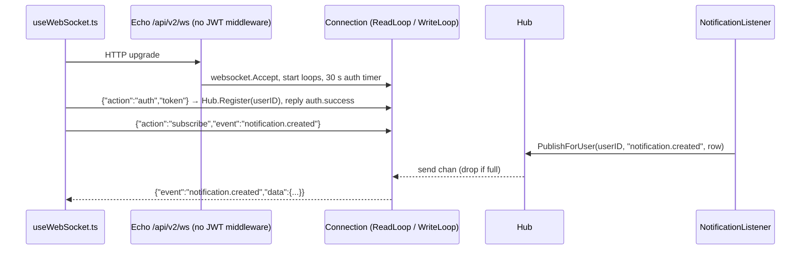

# WebSocket

`pkg/websocket` pushes server events to a logged-in user's browser tabs: a per-process `Hub` of authenticated connections, a tiny JSON protocol (auth, subscribe, unsubscribe), and event-bus listeners that bridge `notification.created` and time-entry events onto it. Context: [Backend architecture → Concurrency model](../../03-backend-architecture.md#concurrency-model), [API contract → realtime channels](../../05-api-contract.md); the bus side is in [events-and-listeners](./events-and-listeners.md).

## Responsibility

- **Owns:** the upgrade handler, connection lifecycle (auth timeout, read/write loops, ping), the subscription allow-list `validEvents`, the hub fan-out, and the two listener bridges.
- **Does not own:** deciding what is pushed (that is a listener decision plus `validEvents`), notification permissions (`pkg/models/notifications_permissions.go` → `CanReadNotification`), JWT validation (`pkg/modules/auth` → `GetUserIDFromToken`), the frontend client (`frontend/src/composables/useWebSocket.ts`, see [../frontend/realtime-and-pwa.md](../frontend/realtime-and-pwa.md)).

## Entry points and public API

| Entry | Where | Called by |
|---|---|---|
| `InitHub()`, `GetHub()` | `pkg/websocket/handler.go` | `pkg/initialize/init.go` → `FullInit` (before the listener goroutine); listeners |
| `UpgradeHandler(c *echo.Context)` | `pkg/websocket/handler.go` | `pkg/routes/routes.go:521` (`/api/v1/ws`, in the unauthenticated group `n`), `routes.go:490` (`/api/v2/ws`, JWT-exempt via `unauthenticatedAPIPaths` at `routes.go:363`); both behind `noAuthRateLimit` |
| `RegisterListeners()` | `pkg/websocket/listener.go` | `FullInit` goroutine, before `events.InitEvents` |
| `Hub.Register/Unregister/PublishForUser(userID, event, data)` | `pkg/websocket/hub.go` | `Connection`, listeners |
| `NewConnection`, `Connection.ReadLoop/WriteLoop/Subscribe/Unsubscribe/IsSubscribed/IsAuthenticated/UserID` | `pkg/websocket/connection.go` | `UpgradeHandler`, tests |
| `IncomingMessage`, `OutgoingMessage`, `Action*` constants | `pkg/websocket/messages.go` | connection, listeners, tests |

The route is JWT-exempt because the upgrade request cannot carry the token in a header from a browser `WebSocket` and Huma cannot model the endpoint (comment at `routes.go:485-490`); authentication is the first message instead.

## Key types and functions

- `UpgradeHandler`: 503 if `globalHub == nil`; `websocket.Accept` (github.com/coder/websocket) with `OriginPatterns: cors.origins`; spawns `WriteLoop` and `ReadLoop` sharing one cancelable context. Returns `nil` after `Accept` failure because the library already wrote the HTTP error.
- `Connection` (`connection.go`): `userID`, `authenticated`, `subscriptions map[string]bool` under an `RWMutex`, and `send chan OutgoingMessage` with `sendBufSize = 64`. Constants: `writeTimeout 10s`, `pingInterval 30s`, `authTimeout 30s`.
- `ReadLoop`: arms a `time.AfterFunc(authTimeout)` that closes the socket with `StatusPolicyViolation` (1008, reason `auth timeout`) if still unauthenticated; loops `ws.Read`, JSON-decodes `IncomingMessage` (invalid JSON is logged and skipped), dispatches to `handleMessage`; on exit cancels the context, unregisters from the hub if authenticated, closes with `StatusNormalClosure`.
- `handleMessage`: `auth` → `handleAuth`; `subscribe`/`unsubscribe` require auth (`auth_required`), `subscribe` also requires `isValidEvent` (`invalid_event`); unknown actions are logged at WARNING and ignored. Only `handleAuth` can return `false` (close).
- `handleAuth`: `already_authenticated` if repeated; `auth.GetUserIDFromToken` parses the JWT with `service.secret` and requires claim `type == AuthTypeUser` (API tokens and link-share tokens are rejected); failure writes `{"error":"invalid_token"}` **directly** (`writeMessageDirect`, bypassing the send channel because the loop closes immediately) and closes; success registers with the hub and queues `{"action":"auth.success","success":true}`.
- `WriteLoop`: drains `send` with a 10 s write timeout per message, pings every 30 s, exits on write/ping error or context cancel. `sendError` and `PublishForUser` use non-blocking sends and **drop** the message with a WARNING when the 64-slot buffer is full.
- `Hub` (`hub.go`): `connections map[int64][]*Connection`; `PublishForUser` takes a read lock, skips connections not subscribed to `event`, and never blocks.
- `validEvents` (`connection.go:265`): `notification.created`, `timer.created`, `timer.updated`, `timer.deleted`.
- `NotificationListener` (`listener.go`): unmarshals `notifications.NotificationCreatedEvent`, loads the row with `notifications.GetNotificationByID` on a fresh session, re-checks `models.CanReadNotification` for `event.UserID`, publishes the `*DatabaseNotification` as `data`. Every failure returns `nil` (logged, not retried).
- `TimeEntryListener{wsEvent}`: gated by `license.IsFeatureEnabled(license.FeatureTimeTracking)`; unmarshals only `time_entry` from the shared `{time_entry, doer}` payload and publishes it to `TimeEntry.UserID` as `timer.created|updated|deleted`. Handler name is `websocket.push.<wsEvent>`.

## Wire protocol

Text frames, one JSON object each. Server → client messages are `OutgoingMessage` with `omitempty` on every field.

| Direction | Message | Notes |
|---|---|---|
| C→S | `{"action":"auth","token":"<user JWT>"}` | must arrive within 30 s of the upgrade |
| S→C | `{"action":"auth.success","success":true}` | connection is now registered in the hub |
| S→C | `{"error":"invalid_token"}` then close | JWT invalid, expired, or not a user token |
| S→C | `{"error":"already_authenticated"}` | second `auth`; connection stays open |
| C→S | `{"action":"subscribe","event":"notification.created"}` | no acknowledgement on success |
| S→C | `{"error":"auth_required"}` | `subscribe`/`unsubscribe` before auth |
| S→C | `{"error":"invalid_event","event":"foo"}` | event not in `validEvents` |
| C→S | `{"action":"unsubscribe","event":"timer.updated"}` | silent on success |
| S→C | `{"event":"notification.created","data":{...DatabaseNotification}}` | push |
| S→C | `{"event":"timer.created","data":{...TimeEntry}}` | push |
| close 1008 `auth timeout` | | unauthenticated after 30 s |

`ActionUnsubscribed` (`"unsubscribed"`) and a `forbidden` error are documented in `messages.go` comments but nothing sends them; the only error strings emitted are the four above. Pings are WebSocket control frames, not JSON.

## Internal structure

## Frontend client (`frontend/src/composables/useWebSocket.ts`)

- Module-level singleton: one `socket`, a `subscriptions: Map<event, Set<callback>>`, `connected`/`authenticated` refs. `connect()` is called from `components/home/ContentAuth.vue:146`; `disconnect()` from the auth store on logout (`stores/auth.ts:565`) and clears all subscriptions.
- URL: `window.API_URL` with `http(s)` swapped for `ws(s)` plus `/ws`, so it follows whichever API base the app discovered (v1 or v2 path both exist server-side).
- On `open` it sends `auth` with `getToken()`; on `auth.success` it replays every subscription (`resubscribeAll`). `subscribe(event, cb)` sends immediately only when already authenticated and returns an unsubscribe function that sends `unsubscribe` once the last callback is gone.
- Reconnect: exponential backoff `1000 ms × 2^attempt` capped at 30 s with ±25 % jitter, reset on `open`. **Terminal errors:** `invalid_token` and `auth_required` set `manuallyDisconnected = true` and close without reconnecting, so a bad token does not hammer the endpoint; callers fall back to polling. `already_authenticated` and `invalid_event` are delivered to nobody (no `event` field match) and only show up in the console if you log them.
- Consumers: `components/notifications/Notifications.vue` subscribes to `notification.created`, prepends unseen ids, reloads via REST when `connected` flips to false, and polls every 10 s only while disconnected and the tab is visible. `stores/timeTracking.ts` → `subscribeToTimerEvents` handles `timer.created|updated` (`applyTimerEvent`) and `timer.deleted` (`applyTimerDeletion`), ignoring messages without `data`.

## Dependencies

- **Uses:** `github.com/coder/websocket`, `pkg/modules/auth` (`GetUserIDFromToken`), `pkg/config` (`cors.origins`), `pkg/events`, `pkg/notifications`, `pkg/models` (`CanReadNotification`, `TimeEntry`, time-entry events), `pkg/license`, `pkg/db`, `pkg/log`.
- **Used by:** `pkg/routes/routes.go`, `pkg/initialize/init.go`. Note `pkg/websocket` imports `pkg/models`; models must never import it back.

## Invariants and assumptions

- `InitHub()` runs before listeners are registered and before routes serve; both listeners and `UpgradeHandler` tolerate a nil hub by logging and skipping, so a missing `InitHub` degrades silently (only `FullInit` calls it; `FullInitWithoutAsync` does not).
- The hub is per process. A push only reaches connections on the instance that ran the listener, which is the instance that dispatched the event (the bus is in-process). Behind a load balancer without sticky sessions a user's tab may be on another instance and miss the push; the frontend's polling and reconnect-reload paths are what keep the UI correct.
- Authorization is re-checked at push time for notifications (`CanReadNotification`, tested by `TestNotificationListener` "does not push once project access is revoked"); time entries are pushed only to their owner (`TimeEntry.UserID`), no extra check.
- A connection is registered only after auth and only unregistered from `ReadLoop`'s defer; `WriteLoop` exiting cancels the context so `ReadLoop` unblocks.
- Subscriptions are per connection, not per user; a user with two tabs must subscribe in each (the client does this automatically).
- Origin checking relies on `cors.origins` including the frontend origin (`config.go:830` appends `service.publicurl`).

## Configuration

| Key (`config.yml`) | Effect |
|---|---|
| `cors.origins` (default `http://127.0.0.1:*`, `http://localhost:*`, plus `service.publicurl`) | `OriginPatterns` for the upgrade |
| `service.secret` | JWT verification in `GetUserIDFromToken` |
| `service.publicurl` | Frontend derives the `ws(s)://` URL from the API URL it discovered |
| `ratelimit.*` | `noAuthRateLimit` applies to the upgrade (`pkg/webtests/ws_rate_limit_test.go`) |

No dedicated websocket config key exists; the feature cannot be disabled short of blocking the route.

## Error handling

- Protocol errors are JSON `error` strings (table above); transport errors are `log.Debugf` only. Buffer overflow is `log.Warningf` and a dropped message, with no signal to the client.
- Listener failures never reach the poison queue: both listeners return `nil` on every error path, so a bad push is a log line at most.
- No Sentry reporting and no metrics (connection count, drops) exist for this package.

## Tests

- Go: `pkg/websocket/hub_test.go` (register/unregister, fan-out, skips unsubscribed and other users), `connection_test.go` (subscribe state, `validEvents`, actions before auth), `messages_test.go` (JSON shapes), `notification_listener_test.go` (DB-backed, permission revocation), `time_entry_listener_test.go`, `pkg/webtests/ws_rate_limit_test.go` → `TestWebsocketUpgradeRateLimit` for both paths. Run: `mage test:filter 'TestHub|TestConnection|TestNotificationListener|TestTimeEntryListener'`. `main_test.go` only initialises logger, config and keyvalue; the notification listener test builds the DB lazily.
- Playwright: `frontend/tests/e2e/websocket/protocol.spec.ts` (auth success/invalid/timeout 1008/double auth, subscribe valid/invalid/unauthenticated, unsubscribe, delivery, doer excluded, multiple connections), `frontend.spec.ts` (badge and dropdown update in real time, disconnect on logout), `comment-notification.spec.ts` (mention in a comment). Helpers in `frontend/tests/support/websocket.ts` connect to `API_URL` (default `http://localhost:3456/api/v1`) + `/ws`. Run through the `run-e2e-tests` skill, never `pnpm test:e2e` directly.
- Not covered: `ReadLoop`/`WriteLoop` timing (ping, write timeout), buffer-full drops, origin rejection, the Vitest side of `useWebSocket.ts` (only mocked in `stores/auth.*.test.ts`).

## Gotchas and tech debt

- `sendBufSize = 64` per connection: a burst of more than 64 unread pushes silently drops the rest; the client compensates only for notifications (reload on reconnect), not for timer events.
- `handleAuth` accepts a token whose user was since disabled or deleted; nothing re-validates the session while the socket is open, and logout of another tab does not close this one (Unverified: whether the JWT `sid` session check applies here; `GetUserIDFromToken` does not consult the sessions table).
- The `TimeEntryListener` license check happens per message, so a license lapse stops pushes without any client-visible signal.
- `ActionUnsubscribed` is dead code; the comment in `messages.go` mentioning `forbidden` describes an error that is never produced.
- Two URLs (`/api/v1/ws`, `/api/v2/ws`) serve the same handler; the frontend chooses by its API base, so removing the v1 route needs the frontend on v2 first ([API contract → sync checklist](../../05-api-contract.md)).
- No TODO/FIXME comments in `pkg/websocket` or `useWebSocket.ts` as of 2026-09-16.

## How to add a pushed event

1. Backend: add the wire name to `validEvents` in `pkg/websocket/connection.go` (and a case in `connection_test.go`).
2. Add a listener in `pkg/websocket/listener.go` that unmarshals the source event, decides the target user id, checks permissions/license as needed, and calls `GetHub().PublishForUser(userID, "<wire name>", payload)`; register it in `RegisterListeners()`. Return `nil` on failure unless a retry is genuinely useful.
3. If the source event does not exist yet, follow [events-and-listeners → How to add an event](./events-and-listeners.md#how-to-add-an-event-and-a-listener).
4. Frontend: `const {subscribe} = useWebSocket(); const off = subscribe('<wire name>', msg => ...)` in a store or component, `off()` on teardown; ignore messages without `data`. Keep a REST reload path for the disconnected case.
5. Tests: a `*_listener_test.go` using `events.TestListener` against a registered fake connection (pattern in `time_entry_listener_test.go`), and a case in `frontend/tests/e2e/websocket/protocol.spec.ts`.
6. Update the coupling row "Add a websocket event" in [Conventions](../../08-conventions.md#if-you-change-x-you-must-also-change-y) if the steps change.

## Related pages

[events-and-listeners](./events-and-listeners.md), [notifications-and-mail](./notifications-and-mail.md), [auth-and-sessions](./auth-and-sessions.md), [http-routing-and-middleware](./http-routing-and-middleware.md), [models-tasks](./models-tasks.md) (time entries), [operations-subsystems](./operations-subsystems.md) (license), [../frontend/realtime-and-pwa.md](../frontend/realtime-and-pwa.md), [../frontend/stores.md](../frontend/stores.md), [API contract](../../05-api-contract.md), [Testing guide](../../11-testing-guide.md).
