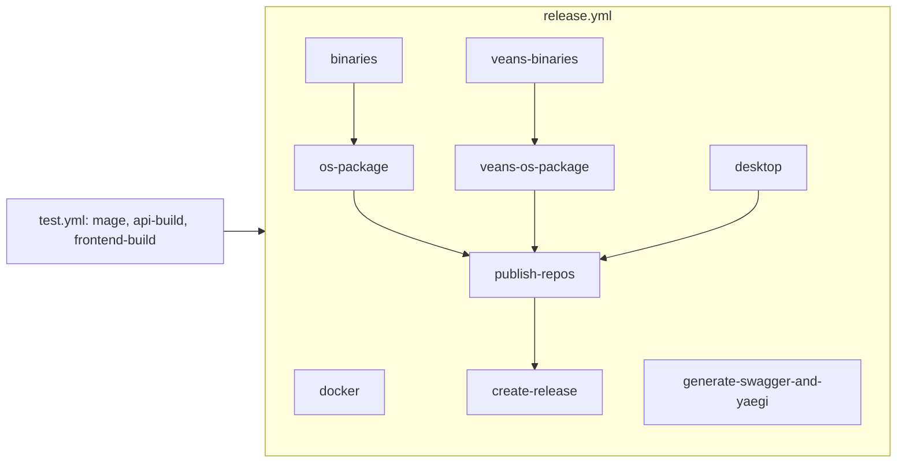

# Build and release

Everything that turns source into artifacts: the root `magefile.go` (build, test, check, generate, dev scaffolds), the separate `build/` module (cross-compile, packaging, repo metadata), the `Dockerfile`, `nfpm.yaml`, and the GitHub workflows and composite actions. Commands were not run for this page; everything below is read from the files named. See [Development workflow](../07-development-workflow.md) for verified runs.

## Responsibility

- `magefile.go` (root, `//go:build mage`): developer-facing targets for the API module. It imports `pkg/routes/api/v2` (`apiv2.NewCanonicalAPI`) for client generation, so it compiles against the whole backend.
- `build/magefile.go` (module `code.vikunja.io/build`): release pipeline for both Go binaries (`vikunja`, `veans`). Depends on stdlib + mage only, so CI can compile it statically and run it inside distro containers without a Go toolchain (`release.yml` → `build-mage`).
- `veans/magefile.go`: covered in [veans](./veans.md).
- Not owned here: frontend build (`frontend/vite.config.ts`, see [Frontend architecture](../04-frontend-architecture.md#build-and-dev-server)) and desktop packaging ([desktop](./desktop.md)).

## Root magefile targets

`Aliases` (`magefile.go:65`) maps kebab-case names; there is **no `test` alias**, so `mage test` fails with an unknown target. Use `mage test:feature`, `test:web`, `test:all`, etc. (namespace methods work without aliases; aliases only exist for kebab-case or bare names).

| Target | Alias | What it does |
|---|---|---|
| `Fmt` | | `gofmt -s -w` over git-tracked and untracked `*.go` |
| `Build.Build` | `build` | `go build -tags <Tags> -ldflags "-s -w <Ldflags>" -o vikunja[.exe]` |
| `Build.Clean` | | `go clean ./...`, removes the binary, `dist/`, `BinLocation` |
| `Build.SaveVersionToFile` | | writes `VersionNumber` to `VERSION` |
| `Test.Feature` | | `go test -p 1 -coverprofile cover.out -timeout 45m -short ./...` |
| `Test.Coverage` | | `Test.Feature` then `go tool cover -html` → `cover.html` |
| `Test.Web` | | `./pkg/webtests` without `-short` |
| `Test.Filter <re>` | | see two-pass logic below |
| `Test.All` | | `mg.Deps(Feature, Web, Caldav, E2EApi)` |
| `Test.Caldav`, `Test.E2EApi` | `test:e2e-api` | `./pkg/caldavtests`, `./pkg/e2etests` |
| `Test.E2E <args>` | `test:e2e` | builds the API, boots it on a temp rootpath with sqlite `memory`, `pnpm build:dev` + `preview:dev`, runs `pnpm test:e2e`, tears down (details in [Development workflow](../07-development-workflow.md#end-to-end-playwright)) |
| `Check.FrontendClient` | `check:frontend-client` | generate twice, compare `frontendClientDirectoryHash`, then `git status --porcelain frontend/src/client/generated` must be empty |
| `Check.GotSwag` | `check:got-swag` | sha256 of `pkg/swagger/swagger.json` before/after `Generate.SwaggerDocs`; leaves regenerated files in place |
| `Check.YaegiSymbols` | `check:yaegi-symbols` | same hash-compare per file in `yaegiSymbolPackages`; leaves files in place |
| `Check.Translations` | | API and frontend key sync, see below |
| `Check.Golangci`, `Check.GolangciFix` | `lint`, `lint:fix` | `golangci-lint run [--fix]`; error text pins v2.13.0 |
| `Check.All` | | Golangci + GotSwag + Translations + YaegiSymbols in parallel |
| `Generate.FrontendClient` | `generate:frontend-client` | `apiv2.NewCanonicalAPI().OpenAPI()` → temp JSON → `pnpm run generate:api-client` with `VIKUNJA_OPENAPI_INPUT` (required by `frontend/openapi-ts.config.ts:3-5`) |
| `Generate.SwaggerDocs` | `generate:swagger-docs` | installs `swag` if missing, `swag init -g ./pkg/routes/routes.go --parseDependency -d . -o ./pkg/swagger` |
| `Generate.YaegiSymbols` | `generate:yaegi-symbols` | `go run github.com/traefik/yaegi/cmd/yaegi extract <pkg>` for the 12 entries in `yaegiSymbolPackages`, renames to the checked-in file names; a missing output surfaces as a rename error because `yaegi extract` exits 0 on failure |
| `Generate.ConfigYAML <bool>` | `generate:config-yaml` | `config-raw.json` → `config.yml.sample` via `convertConfigJSONToYAML`; `true` comments every line out |
| `Generate.ScalarBundle` | | downloads `@scalar/api-reference@1.44.20` standalone JS from unpkg into `pkg/routes/api/v2/scalar/` |
| `Dev.MakeMigration <Name>` | `dev:make-migration` | writes `pkg/migration/<yyyymmddhhmmss>.go` with a `partialSync` skeleton; prompts if no name |
| `Dev.MakeEvent <Name> <module>` | `dev:make-event` | appends a `<Name>Event` struct + `Name()` to `pkg/<module>/events.go` (no import edits) |
| `Dev.MakeListener <Name> <Event> <module>` | `dev:make-listener` | inserts `events.RegisterListener(...)` before the first line that is exactly `}` in `pkg/<module>/listeners.go`, then appends the listener struct with a `Handle(msg *message.Message)` that unmarshals the event |
| `Dev.MakeNotification <Name> <module>` | `dev:make-notification` | appends `<Name>Notification` with `ToMail`, `ToDB`, `Name` to `pkg/<module>/notifications.go` |
| `Dev.PrepareWorktree <name> <plan>` | `dev:prepare-worktree` | see below |
| `Dev.TagRelease <vX.Y.Z>` | `dev:tag-release` | see below |
| `Plugins.Build <path>` | `plugins:build` | `go build -buildmode=plugin -o plugins/<base>.so` |

### Variables, env vars, version resolution

- `initVars` (`magefile.go:183`): `Tags = "osusergo " + $TAGS` (commas → spaces; `osusergo` avoids the glibc `getpwuid_r` crash, issue #2170), then `setVersion`, `setBinLocation`, `setPkgVersion`, `Ldflags = -X code.vikunja.io/api/pkg/version.Version=<VersionNumber> -X main.Tags=<Tags>`.
- `getRawVersionNumber`: `RELEASE_VERSION` → `DRONE_TAG` → `DRONE_BRANCH` (strip `release/v`) → `git describe --tags --always --abbrev=10`. `VersionNumber` replaces the first `-g` with `-`; `Version` becomes `unstable` when the raw value is `main`. `DRONE_*` and `DRONE_WORKSPACE` (in `setBinLocation`) are Drone CI leftovers; GitHub Actions only sets `RELEASE_VERSION`.
- `mg.Verbose()` (`-v` / `MAGEFILE_VERBOSE`) is forwarded to `go test -v`.
- E2E env: `VIKUNJA_E2E_API_PORT`, `VIKUNJA_E2E_FRONTEND_PORT`, `VIKUNJA_E2E_TESTING_TOKEN`, `VIKUNJA_E2E_SKIP_BUILD`.

### `ensureFrontendDistExists`

`frontend/embed.go` embeds `all:dist`, so every `go build`/`go test` in the root module fails to compile without `frontend/dist/index.html`. `ensureFrontendDistExistsIn` creates an empty placeholder; it is an `mg.Deps` of `Fmt`, every `Test.*` except `E2E`, `Build.Build`, `checkGolangCiLintInstalled`, and `PrepareWorktree`. CI jobs that run plain Go (`api-build`, `api-lint`, `test-api`, ...) do `mkdir -p frontend/dist && touch frontend/dist/index.html` by hand.

### `Test.Filter` two-pass logic

`goTestPackagesExcept(ctx, "./pkg/webtests")` lists `go list ./...` minus webtests; pass 1 runs them with `-run <re> -short`; pass 2 runs `./pkg/webtests` with `-run <re>` and **no** `-short`, because its `TestMain` skips the whole package under `-short` and a filter naming a webtest would otherwise report `ok` without running.

### `Check.Translations`

`checkAPITranslations` walks `pkg/**/*.go` for `i18n.T`/`TP` literals plus any dotted string literal that equals a known key (`apiStringLiteralRe`) as a usage hint. `checkFrontendTranslations` walks `frontend/src/**/*.{vue,ts,js}` (skipping `i18n/lang`) with `frontendI18nCallRe{Single,Double}`, `frontendI18nKeypathRe` (unbound `keypath="..."` only), and `frontendI18nTemplateLiteralRe`, whose captured prefix before `${` marks **every** key under that prefix as used; `frontendTemplatePrefixRe` adds prefixes from template literals outside `$t()` too. Blind spot: a key produced at runtime under a dynamic prefix (for example `error.${code}`) is never reported missing, and every unused key under that prefix is never reported dead. Keys assembled without a dotted literal or template prefix in the same file are reported as dead.

### `Dev.PrepareWorktree`

1. `git fetch origin`; 2. `git worktree add ../<name>` reusing a local branch, tracking `origin/<name>`, or creating `-b <name>`; 3. copy `config.yml` with `rootpath:` rewritten to the worktree path (quoted and unquoted forms); 4. copy `.claude/settings.local.json` if present; 5. **move** (`os.Rename`) the plan file into `../<name>/plans/`; 6. `ensureFrontendDistExistsIn`; 7. `pnpm i` in `frontend/`; 8. `bash -ic patch-sass-embedded` (a devenv shell alias, warning only if absent). Invoke through the `prepare-worktree` skill.

### `Dev.TagRelease`

1. Normalise to `vX.Y.Z`; 2. `git describe --tags --abbrev=0` for the last tag and print commit stats; 3. `git cliff <last>..HEAD --tag <v>` (needs git-cliff, config `cliff.toml`), `cleanupChangelog`; 4. `Generate.SwaggerDocs` → `commitPathIfChanged("pkg/swagger", "[skip ci] Updated swagger docs")`; 5. `Generate.YaegiSymbols` → commit `[skip ci] Updated yaegi symbols`; 6. `updateReadmeBadge` (`download-vX.Y.Z-brightgreen`, hyphens stripped); 7. `prependChangelog` after the header of `CHANGELOG.md`; 8. `updateFrontendPackageJSON` (no `v`); 9. `updatePublicCodeYml` (`softwareVersion`, `releaseDate` = today); 10. commit `chore: vX.Y.Z release preparations` with those four files; 11. `git tag -a <v> -m <changelog without # headers>`; prints `git push origin main` and the tag. `desktop/package.json` is not touched.

## The `build/` module

`build/magefile.go` defines a `project` table (`projectByName`): `vikunja` (root `../`, tags `osusergo netgo`, ldflags `pkg/version.Version` + `main.Tags`, extras copy `config.yml.sample` + `LICENSE`) and `veans` (root `../veans/`, `./cmd/veans`, `-X main.version`, extras copy the root `LICENSE`). `releaseVersion` reads `RELEASE_VERSION` or `git describe`; `versionTagOrUnstable` maps `""`/`main` → `unstable`; `XGO_OUT_NAME` overrides the binary base name.

| Target (alias) | What it does |
|---|---|
| `Release.Build <project>` (`release`, `release:build`) | `releaseDirs` → `prepareXgo` (installs `src.techknowlogick.com/xgo@latest`, `docker pull ghcr.io/techknowlogick/xgo:latest`) → `xgoAllOS` (three parallel groups: `windows/*`; `linux/amd64,arm-5,arm-6,arm-7,arm64,mips,mipsle,mips64,mips64le,riscv64`; `darwin-10.15/*`) → `compressBinaries` (`upx -9`, skipping mips/s390x/riscv64/darwin/windows-arm64) → `copyBinaries` → `writeChecksums` (`.sha256`) → `bundleOsPackages` (`<name>-full/` dirs + extras) → `zipBundles` |
| `Release.Xgo <project> <os/arch[/variant]>` (`release:xgo`) | single-target xgo without `prepareXgo`; used by the `Dockerfile` inside the xgo image |
| `Release.PrepareNFPMConfig <project> <arch>` (`release:prepare-nfpm-config`) | replaces `<version>`, `<arch>`, `<binlocation>` (`NFPM_BIN_PATH` or default) **in place** in the project's `nfpm.yaml` |
| `Release.RepoApt` (`release:repo-apt`) | reprepro over `../dist/repo-work/incoming/*.deb` with `build/reprepro-dist-conf` (suites `stable`, `unstable`; amd64 arm64 armhf), signs `Release` → `Release.gpg` + `InRelease` |
| `Release.RepoRpm` (`release:repo-rpm`) | `createrepo_c` per `x86_64|aarch64|armv7`, signs `repomd.xml` |
| `Release.RepoPacman` (`release:repo-pacman`) | `repo-add vikunja.db.tar.gz`, `vikunja.db`/`vikunja.files` symlinks, detached `vikunja.db.sig` |

Env: `REPO_SUITE` (`stable`|`unstable`, anything else → `stable`, `repoSuite`), `RELEASE_GPG_KEY`, `RELEASE_GPG_PASSPHRASE`, `NFPM_BIN_PATH`, `XGO_OUT_NAME`, `RELEASE_VERSION`. Darwin builds drop `-linkmode external -extldflags "-static"` (`runXgo`). There is no `RepoApk` target; `release.yml` does apk indexing in shell.

## Dockerfile and nfpm

`Dockerfile` stages: `frontendbuilder` (`node:24.21.0-alpine`, corepack pnpm, `pnpm install --frozen-lockfile`, writes `src/version.json` from `RELEASE_VERSION`, `pnpm run build`) → `apibuilder` (`ghcr.io/techknowlogick/xgo:go-1.27.x`, `go install mage@latest`, copies `dist`, `mage build:clean`, `cd build && mage release:xgo vikunja $TARGETOS/$TARGETARCH/$TARGETVARIANT`) → `FROM scratch` (labels, `USER 1000`, `EXPOSE 3456`, `ENTRYPOINT /app/vikunja/vikunja`, `VIKUNJA_SERVICE_ROOTPATH=/app/vikunja/`, `VIKUNJA_DATABASE_PATH=/db/vikunja.db`, copies a 1777 `/tmp` and CA certs).

`nfpm.yaml` (server): binary at `/opt/vikunja/vikunja` + symlink `/usr/local/bin/vikunja`, `config.yml.sample` → `/etc/vikunja/config.yml` (`config|noreplace`), `vikunja.service` → systemd, `vikunja.initd` for apk, `depends: systemd` (apk overrides to `openrc`), `postinstall` `build/after-install.sh` (random JWT secret and `/opt/vikunja/` rootpath sed into the config, `systemctl enable`, `try-restart`); apk uses `after-install-openrc.sh`; apk/archlinux also map `postupgrade` because their postinstall runs on fresh installs only. rpm signing via `NFPM_GPG_KEY_FILE`. `veans/nfpm.yaml` is the minimal equivalent.

## Workflows

| File | One line |
|---|---|
| `ci.yml` | on PR, merge queue, push to `main`, tags `v*`: calls `test.yml`, then `release.yml` when ref is `main` or a tag; concurrency cancels older PR runs |
| `test.yml` | all gates, table below |
| `release.yml` | artifacts, table below |
| `crowdin.yml` | nightly: push `en.json` sources, download approved translations, `contrib/clean-translations.js`, commit as "Frederick [Bot]" `chore(i18n): update translations via Crowdin`, push via `SSH_PRIVATE_KEY` |
| `dependency-diff.yml` | on `frontend/pnpm-lock.yaml` or `desktop/pnpm-lock.yaml` changes: dependency diff comment and provenance-downgrade check for both dirs |
| `preview.yml` | `pull_request_target`: builds and pushes `ghcr.io/<owner>/<repo>:pr-N` and `sha-...`, comments preview URLs; fork PRs gated by the `preview-fork` environment |
| `auto-label.yml` (+ `auto-label.prompt.md`) | LLM-classifies new issues/PRs into `area/`, `integration/`, `db/`, `concern/` labels |
| `automerge-label.yml` | keeps the `auto-merge` label in sync with GitHub auto-merge state (events + hourly reconcile) |
| `issue-closed-comment.yml` | comments "fixed in #PR/commit, check the next unstable build" via a GitHub App token |
| `nixpkgs-update.yml` | on published non-prerelease: runs nixpkgs update scripts for `vikunja` and `vikunja-desktop`, opens a PR from the `go-vikunja/nixpkgs` fork |
| `stale-waiting-for-reply.yml` | closes `waiting for reply` issues after 30+30 days and PRs after 30+14; removes the label on PR push |

### `test.yml` jobs (all gate PRs unless noted)

| Job | Needs | Notes |
|---|---|---|
| `mage` | | compiles `mage-static` (cache key on `magefile.go`, `go.mod`, `go.sum`, `pkg/**/*.go`), artifact `mage_bin` |
| `api-build` | mage | `RELEASE_VERSION` from `gh-describe`, `./mage-static build`, artifact `vikunja_bin` |
| `api-lint`, `veans-lint` | | composite `golangci-lint` action (root / `veans`) |
| `veans-test` | | `go install mage@v1.17.2`, `cd veans && mage test` |
| `check-translations`, `check-frontend-client` | mage | `check:translations`; `check:frontend-client` after `setup-frontend` |
| `test-migration-smoke` | api-build | downloads `dl.vikunja.io/vikunja/unstable/...zip`, runs old `migrate` then new `./vikunja migrate` on sqlite/postgres/mariadb/mysql |
| `test-api` | mage | matrix `db` × `test` (`feature`, `web`), `VIKUNJA_TESTS_USE_CONFIG` except sqlite-in-memory, LDAP service, postgres fsync off |
| `test-caldav`, `test-e2e-api`, `test-s3-integration` | mage | `test:caldav`, `test:e2e-api`, `test:filter TestFileStorageIntegration` against minio |
| `frontend-lint`, `frontend-stylelint`, `test-frontend-unit`, `frontend-build` | | `frontend-build` writes `src/version.json` and uploads `frontend_dist` |
| `frontend-typecheck` | | `continue-on-error: true` (does not gate) |
| `test-veans-e2e` | api-build | boots `./vikunja web` in-job, `cd veans && mage test:e2e` |
| `test-frontend-e2e-playwright` | api-build, frontend-build | 6 shards in the Playwright `v1.63.0-jammy` container, Dex + Mailpit services, two API instances (3456 mailer off, 3457 mailer on), injects `window.TESTING=true` |

Not gated on PRs: swagger drift and yaegi symbols (regenerated after merge, see below).

### `release.yml` jobs (run on `main` and tags)

| Job | Needs | Secrets | Output |
|---|---|---|---|
| `build-mage` | | | statically compiled `build/build-mage-static` (artifact `build_mage_bin`) |
| `docker` | | `DOCKER_HUB_USERNAME/PASSWORD`, `GITHUB_TOKEN` | `vikunja/vikunja` + `ghcr.io/go-vikunja/vikunja`, `:unstable` on main, semver tags on tags; platforms amd64, arm/v6, arm/v7, arm64 |
| `binaries`, `veans-binaries` | | `RELEASE_GPG_*`, `S3_*` | `release-binaries` action: `mage release:build`, GPG-signed zips to S3 `/<project>/<tag|unstable>`, artifacts `<project>_bins`, `<project>_bin_packages` (tags) |
| `os-package`, `veans-os-package` | binaries | same | `release-os-package` action, matrix `rpm deb apk archlinux` × `amd64 arm64 arm7`, artifacts `<project>_os_package_*` |
| `publish-repos` | build-mage, os-package, veans-os-package, desktop | `RELEASE_GPG_*`, `APK_SIGNING_KEY`, `S3_*` | apt (ubuntu), rpm (fedora), pacman (archlinux) via `build-mage-static release:repo-*`; apk via shell `apk index` + `abuild-sign`; desktop Linux packages merged in; strips package files and uploads metadata to S3 `/repos` |
| `config-yaml` | | `S3_*` | `generate:config-yaml 1` → S3 `/vikunja/<tag|unstable>/config.yml.sample` |
| `desktop` | | `S3_*` | matrix ubuntu/windows/macos, `node build.js`, S3 `/desktop/...`, artifacts `vikunja_desktop_packages_<os>` |
| `generate-swagger-and-yaegi` | | `SSH_PRIVATE_KEY` | **auto-commits** `[skip ci] Updated swagger docs` / `[skip ci] Updated yaegi symbols` as "Frederick [Bot]" and pushes to the current ref |
| `create-release` | binaries, os-package, veans-*, desktop, publish-repos | `contents: write` | tags only: draft GitHub release with `vikunja*`, `veans*` zips/packages and `Vikunja Desktop*` |

`release.yml` reuses `test.yml` artifacts (`mage_bin`, `frontend_dist`) because `ci.yml` runs both workflows in one run. The `publish-repos` comment says `build-mage` lives in `test.yml`; it is in `release.yml`.

### Composite actions (`.github/actions/`)

| Action | One line |
|---|---|
| `golangci-lint` | setup-go `stable`, explicit cache keyed on Go version + `go.sum` (the lint action's own cache omitted the Go version and produced stale staticcheck facts), runs `golangci-lint-action` with `version` default `v2.13.0` and `working-directory` |
| `setup-frontend` | pnpm from `frontend/package.json`, Node from `frontend/.nvmrc`, `pnpm install --frozen-lockfile --prefer-offline`; skips Cypress/Puppeteer/Playwright downloads unless `install-e2e-binaries` |
| `release-binaries` | per-project paths from `project`, downloads `mage_bin` (+ `frontend_dist` and `generate:config-yaml 1` for vikunja), pinned upx 5.0.0 with checksum, xgo cache, `cd build && mage release:build`, GPG sign, S3 upload, artifacts |
| `release-os-package` | downloads `<project>_bins`, `release:prepare-nfpm-config`, stages exactly one binary matching `<project>-*-<go-name>`, `kolaente/action-gh-nfpm`, rpm signed by nfpm, archlinux detached-signed, S3 + artifact |

## Version pins that must stay in sync

| Tool | Where |
|---|---|
| Go 1.27 | `go.mod`, `veans/go.mod`, `build/go.mod` (`1.27.0`); `mise.toml` (`1.27.1`); `devenv.nix` (`go_1_27`); `Dockerfile` (`xgo:go-1.27.x`); CI uses `go-version: stable` |
| Node 24.21.0 | `frontend/.nvmrc`, `mise.toml`, `Dockerfile` `node:24.21.0-alpine`; CI and Crowdin read `.nvmrc` |
| pnpm 11.26.0 | `frontend/package.json` and `desktop/package.json` `packageManager`, `mise.toml` |
| golangci-lint 2.13.0 | `magefile.go` install hint, `.github/actions/golangci-lint` default, `devenv.nix` override (nixpkgs still ships 2.12.2) |
| mage 1.17.2 | `go.mod` `tool` block, `veans/go.mod`, `build/go.mod`, `go install ...@v1.17.2` in workflows; `Dockerfile` uses `@latest` (unpinned) |
| swag, xgo | `go.mod` `tool` block; `generate-swagger-and-yaegi` job does `go install github.com/swaggo/swag/cmd/swag` unpinned |
| Playwright 1.63.0 | `test.yml` container image; `frontend/package.json` |
| Scalar 1.44.20 | `magefile.go` → `Generate.ScalarBundle` |

Renovate (`renovate.json`): `config:best-practices` + `config:js-app`; groups `node` across `mise`+`nvm` managers and `pnpm` across `mise`+`npm`, so the pins above move together; GitHub Actions Docker service images weekly; dev-dependencies daily; grouped `vueuse`, `histoire`, `tiptap`, `playwright`, `undici`.

## Artifact → source → generator → committed → CI-checked

| Artifact | Source of truth | Generator | Committed | CI-checked |
|---|---|---|---|---|
| `vikunja` binary | `pkg/`, `frontend/dist` | `mage build` / `build: release:build vikunja` | no | `api-build` |
| `frontend/dist` | `frontend/src` | `pnpm build` | no | `frontend-build` |
| `frontend/src/version.json` | git describe | CI `echo` / `Dockerfile` | yes as `{"VERSION":"dev"}` | no |
| `frontend/src/client/generated/` | `apiv2.NewCanonicalAPI()` | `mage generate:frontend-client` | yes | `check-frontend-client` |
| `pkg/swagger/*` | swaggo comments | `mage generate:swagger-docs` | yes | no; auto-committed by `generate-swagger-and-yaegi` and by `dev:tag-release` |
| `pkg/yaegi_symbols/*.go` | `yaegiSymbolPackages` | `mage generate:yaegi-symbols` | yes | no; same auto-commit |
| `config.yml.sample` | `config-raw.json` | `mage generate:config-yaml <bool>` | no (gitignored) | built in `config-yaml`, `release-*` actions |
| `pkg/routes/api/v2/scalar/scalar.standalone.js` | unpkg pin | `mage generate:scalar-bundle` | yes | no |
| `*.json` translations except `en.json` | Crowdin | `crowdin.yml` | yes | `check-translations` (en only) |
| `CHANGELOG.md`, README badge, `publiccode.yml`, `frontend/package.json` version | git history | `mage dev:tag-release` | yes | no |
| Docker images, zips, deb/rpm/apk/archlinux, repo metadata, desktop installers | above | `release.yml` | no | n/a |

## Gotchas and tech debt

- `Check.GotSwag` and `Check.YaegiSymbols` regenerate in place and do not restore the old files; run them on a clean tree.
- `generate:config-yaml 1` in CI produces a fully commented-out sample; `after-install.sh` still seds `<jwt-secret>` and `<rootpath>` in `/etc/vikunja/config.yml`, so those placeholders (the `\u003c...\u003e`-escaped defaults of `service.JWTSecret` and `service.rootpath` in `config-raw.json`) are replaced inside commented-out lines on a fresh package install; the service then runs on its own defaults until the admin uncomments the file.
- `Dev.MakeListener` depends on the first `}` at column 0 in `listeners.go` closing `RegisterListeners`; `MakeEvent`/`MakeNotification` never add imports.
- `Dev.PrepareWorktree` moves the plan with `os.Rename`, which fails across filesystems, and shells out to a devenv-only alias.
- `Test.E2E` hard-codes `VIKUNJA_SERVICE_JWTSECRET` and disables mail/redis; specs that need Dex or Mailpit only pass in CI.
- `release.yml` `publish-repos` lists `mage_target: release:repo-apk` for the apk row although no such target exists and the step is skipped for apk.
- `Dockerfile` installs `mage@latest` while everything else pins 1.17.2.
- No TODO/FIXME comments in `magefile.go`, `build/magefile.go`, `.github/`.

## Related pages

[Development workflow](../07-development-workflow.md), [Repository map](../02-repository-map.md#generated-code), [veans](./veans.md), [desktop](./desktop.md), [backend/plugins](./backend/plugins.md), [backend/config-and-logging](./backend/config-and-logging.md), [frontend/api-client-generated-and-queries](./frontend/api-client-generated-and-queries.md), [Conventions](../08-conventions.md#translations).
