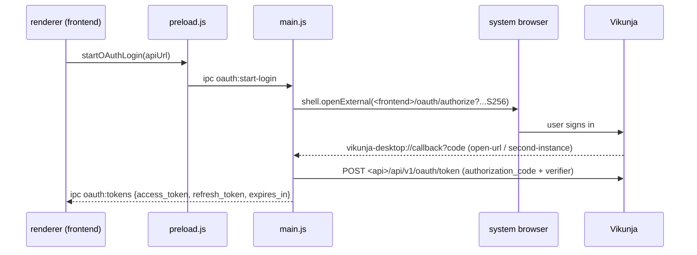

# desktop

`desktop/` wraps the built frontend in Electron: a local Express server serves `frontend/dist`, a hardened `BrowserWindow` loads it, and a few IPC bridges add OAuth login through the system browser, token refresh, a global-shortcut quick-entry window and a tray. It ships its own `package.json` and lockfile. See [Repository map](../02-repository-map.md) and [Frontend architecture](../04-frontend-architecture.md).

## Responsibility

- Owns: window and tray lifecycle, the `vikunja-desktop://` protocol, the OAuth PKCE handshake in the main process, the CSP the local server sends, the quick-entry window, zoom persistence, the release build script and electron-builder targets.
- Does not own: any UI. All views come from `frontend/dist`; desktop-specific frontend branches live in `frontend/src` and are listed below.

## Entry points and public API

| Entry | Where | Called by |
|---|---|---|
| `main.js` (`"main"` in `package.json`) | `desktop/main.js` | Electron |
| `window.vikunjaDesktop` bridge | `desktop/preload.js` | `frontend/src/helpers/desktopAuth.ts`, `frontend/src/stores/auth.ts:185` |
| `window.quickEntry` bridge | `desktop/preload-quick-entry.js` | `frontend/src/components/quick-actions/QuickActions.vue`, `QuickAddOverlay.vue` |
| `node build.js <version> <is-tag>` | `desktop/build.js` | `.github/workflows/release.yml` → `desktop` job |
| `pnpm start` / `pnpm pack` / `pnpm dist` | `desktop/package.json` scripts | developers, `build.js` (`pnpm dist`) |

## Key types and functions

| Name | File | What it does |
|---|---|---|
| `BASE_WEB_PREFERENCES` | `main.js` | `nodeIntegration:false, contextIsolation:true, sandbox:true, webviewTag:false, navigateOnDragDrop:false` for both windows |
| `startServer` | `main.js` | Express static server on `127.0.0.1`, port 45735 or random if taken (`portInUse.js`), sets `Content-Security-Policy` on `index.html` and the SPA fallback |
| `createMainWindow` | `main.js` | 1680×960, `preload.js`, `setWindowOpenHandler` → `safeOpenExternal`, `will-navigate` blocked unless origin is the local server, hide-to-tray on close, flushes a buffered deep link on first `did-finish-load` |
| `createQuickEntryWindow`, `showQuickEntry`, `toggleQuickEntry` | `main.js` | frameless, transparent, always-on-top 680×56 window loading `/?mode=quick-add`, positioned on the cursor's display, hidden on blur (100 ms debounce), reloaded on every show to reset Vue state |
| `setupTray` | `main.js` | tray with "Show Vikunja", "Quick Add Task" (accelerator = current shortcut), "Quit"; icon from `desktop/icon.png`, not `build/` (issue #2668) |
| `registerQuickEntryShortcut` | `main.js` | `globalShortcut` default `CmdOrCtrl+Shift+A`; re-registered via IPC `desktop:update-quick-entry-shortcut` |
| `handleDeepLink` | `main.js` | `vikunja-desktop://callback?code=` → `oauth.exchangeCodeForTokens(pendingApiUrl, code)` → `oauth:tokens` or `oauth:error` to the renderer |
| `registerAppImageProtocolHandler` | `main.js` | Linux AppImage only: writes a `NoDisplay` `.desktop` file and runs `xdg-mime default` so the scheme resolves |
| `wireZoomHandlers`, `loadZoomLevel` | `main.js` | Ctrl +/-/0 and `zoom-changed`, persisted to `<userData>/zoom.json` |
| `startLogin`, `exchangeCodeForTokens`, `refreshAccessToken` | `oauth.js` | PKCE S256, `CLIENT_ID = 'vikunja-desktop'`, `REDIRECT_URI = 'vikunja-desktop://callback'`, requests through Electron `net` |
| `CONTENT_SECURITY_POLICY` | `csp.js` | `script-src 'self'` (no inline), `style-src 'self' 'unsafe-inline'`, `img-src * data: blob:`, `connect-src * ws: wss:`, `frame-src blob:`, `frame-ancestors 'none'` |
| `API_URL_SCRIPT_RE`, `INLINE_SCRIPT_RE` | `build.js` | find the inline `window.API_URL` script in `index.html`; fail if any other inline script remains |

## Internal structure

- Single-instance lock (`app.requestSingleInstanceLock`) so deep links and `--quick-entry` reach the running process; `second-instance` re-shows the hidden window.
- `open-url` before the window exists is buffered in `pendingDeepLinkUrl`; on first launch the URL may also arrive in `process.argv`.
- `oauth.js` → `buildAuthorizationUrl` strips a trailing `/api/v1` to reach the frontend's `/oauth/authorize`; `getTokenEndpoint` appends `/api/v1` and posts to **`/api/v1/oauth/token`** (veans uses the v2 endpoint; both exist).
- No loopback listener exists in `oauth.js`; the only redirect is the custom scheme. Unverified: whether the server also accepts a loopback URI for the `vikunja-desktop` client is irrelevant here because the app never requests one.
- `SIGINT`/`SIGTERM` handlers set `isQuitting` so the hide-to-tray close handler does not swallow the quit.

## Frontend behaviours specific to desktop

| Behaviour | Where |
|---|---|
| Detection: `window.vikunjaDesktop?.isDesktop` | `frontend/src/helpers/desktopAuth.ts` → `isDesktopApp`; types in `frontend/src/types/desktop.d.ts` and `quick-entry.d.ts` |
| Ignore `window.API_URL` from `index.html`; only a stored `localStorage.API_URL` counts, then `checkAndSetApiUrl` + `checkAuth` before ready | `frontend/src/stores/base.ts` → `hydrateConfig` (line 148) |
| API URL prompt: `ApiConfig.vue` opens in configure mode when `window.API_URL === ''` (what `build.js` writes); `NoAuthWrapper.vue` hides it on desktop until a URL is stored | `frontend/src/components/misc/ApiConfig.vue:83-84`, `NoAuthWrapper.vue:70-72` |
| Login page renders `DesktopLogin.vue` instead of local/OIDC forms; auto-redirect to a provider is disabled | `frontend/src/views/user/Login.vue:19`, `helpers/redirectToProvider.ts` → `getAutoRedirectProvider` |
| Tokens from IPC → `saveToken` + `localStorage.desktopOAuthRefreshToken` | `frontend/src/stores/auth.ts` → `handleDesktopOAuthTokens` |
| Refresh under the auth lock goes through `refreshDesktopToken` (IPC `oauth:refresh-token`) instead of the web refresh | `frontend/src/helpers/auth.ts:120-146` |
| Quick-add mode: `?mode=quick-add` → `QuickAddOverlay` (or a "not logged in" notice); shortcuts, PWA banners, demo banner suppressed | `frontend/src/composables/useQuickAddMode.ts`, `App.vue:3-38` |
| Window resize/close/show-main via `window.quickEntry` | `QuickActions.vue:552-579`, `QuickAddOverlay.vue:24-29`, `Modal.vue:318` |
| Global shortcut setting `frontendSettings.desktopQuickEntryShortcut` (default `CmdOrCtrl+Shift+A`) synced on settings load; UI section only on desktop | `frontend/src/stores/auth.ts:178-187`, `views/user/settings/General.vue:257-268` |

## Dependencies

- **Uses:** `electron` 43.7.0, `electron-builder` 26.15.3, `unzipper` 0.12.5 (devDependencies), `express` 5.2.1 (dependency). `pnpm-workspace.yaml` allows the `electron` build script, denies `electron-winstaller`, and pins several transitive overrides. Unverified: nothing in `desktop/*.js` requires `unzipper`; it looks like a leftover from the pre-merge "read frontend version from release zip" flow (`desktop/CHANGELOG.md` 0.22.0).
- **Used by:** `release.yml` (`desktop`, `publish-repos`, `create-release` jobs), `nixpkgs-update.yml` (also bumps `vikunja-desktop`), `dependency-diff.yml`.

## Invariants and assumptions

- `index.html` must contain exactly one inline script, the `window.API_URL` one; `build.js` step 2 throws otherwise because the CSP is `script-src 'self'` with no hash. Adding an inline script to `frontend/index.html` breaks the desktop build.
- Both windows only navigate to `http://127.0.0.1:<serverPort>`; everything else is denied or handed to `safeOpenExternal` (allow-list in `SAFE_PROTOCOLS`).
- `icon.png` must stay at the app root: `build/` is electron-builder's `buildResources` and is not packaged (`main.js` comments in `createMainWindow` and `setupTray`).
- `preload-quick-entry.js` is listed explicitly in `build.files` next to `**/*`.
- `frontend/` and `dist/` inside `desktop/` are gitignored build outputs (`desktop/.gitignore`).

## Configuration

`package.json` → `build`: `appId io.vikunja.desktop`, `productName Vikunja Desktop`, `artifactName ${productName}-${version}.${ext}`, `protocols.schemes [vikunja-desktop]`, Linux targets `deb AppImage snap pacman apk freebsd rpm zip tar.gz` (category Productivity), Windows `nsis portable msi zip`, macOS `dmg zip` with `identity: "-"` (ad-hoc, unsigned). `version` is committed as `v0.1.0` while `frontend/package.json` says `2.6.0`; `build.js` step 3 overwrites it with the git-describe value at build time, so the committed value is a placeholder that `mage dev:tag-release` does not touch (it only updates `frontend/package.json`, see [build-and-release](./build-and-release.md)).

## Error handling

- Malformed deep links and unknown hosts are ignored silently (`handleDeepLink` try/catch, only `hostname === 'callback'` is handled).
- OAuth failures reach the renderer as `oauth:error` strings; `DesktopLogin.vue:106` shows `user.auth.desktopOAuthError`.
- Missing `pendingApiUrl` when a callback arrives → `'No pending login session'`.
- Shortcut registration failure and AppImage handler failures are `console.warn` only.
- `build.js` exits 1 on any step failure.

## Build

`build.js <version-placeholder> [rename-version]`: (1) wipe and copy `../frontend/dist` → `desktop/frontend/`; (2) replace the inline API-URL script with `<script src="/api-url.js">` and write `api-url.js` containing `window.API_URL = ''`; (3) rewrite `version` in `package.json`; (4) `pnpm dist` (electron-builder, `--publish never`); (5) if the second argument is not `'true'`, rename every `dist/` file containing the version to `unstable`. Note the variable name `renameDistFiles` is inverted: passing `true` (a tag build) skips the rename.

CI (`release.yml` → `desktop`): matrix `ubuntu-latest`, `windows-latest`, `macos-latest`; pnpm from `desktop/package.json`, Node from `frontend/.nvmrc`; Linux installs `libopenjp2-tools rpm libarchive-tools`; downloads the `frontend_dist` artifact from `test.yml` → `frontend-build` into `frontend/dist`; runs `node build.js "<git describe>" <ref_type == tag>`; uploads `desktop/dist/Vikunja*` (minus `*.blockmap`) to S3 `/desktop/<tag|unstable>` and as artifact `vikunja_desktop_packages_<os>`. `publish-repos` copies the Linux `.deb` into the apt incoming tree, renames `.rpm` → `-x86_64.rpm` and `.pacman` → `-x86_64.archlinux` so the repo targets pick them up (apk is skipped: the electron `.apk` is not an Alpine package). `create-release` attaches `Vikunja Desktop*` from all three OS artifacts to the draft release.

README divergence (`desktop/README.md`): the manual steps `cp -r ../frontend/dist frontend/` + `sed 's/\/api\/v1//g'` leave the inline script in place, which the CSP blocks; `build.js` is the real path. The README also says to edit `package.json` manually and run `pnpm run dist --linux --windows`, and describes the package as containing "no code" although `main.js` is ~630 lines.

## Tests

None. There is no test runner, ESLint or stylelint config in `desktop/`; `test.yml` never touches it. `dependency-diff.yml` runs `e18e/action-dependency-diff` and a provenance check on `desktop/pnpm-lock.yaml` changes.

## Gotchas and tech debt

- License: `desktop/package.json` and `desktop/LICENSE` say GPL-3.0-or-later, the repo root is AGPL-3.0, and `build.js` carries the AGPL header. `nfpm.yaml`-style packaging is not used for desktop; electron-builder produces the packages.
- `desktop/CHANGELOG.md` is frozen ("only exists for historical reasons", last entry 0.22.1); `desktop/cliff.toml` is a leftover, `mage dev:tag-release` runs `git cliff` at the repo root.
- `oauth.js` → `postJSON` surfaces server errors via `parsed.message`, the v1 error field; a v2-style `detail` would show as `HTTP <status>`.
- Quick-entry reloads the page on every show, so the frontend re-bootstraps (`base.ts` → `hydrateConfig`) each time.
- No TODO/FIXME comments in `desktop/*.js`.

## Related pages

[frontend/auth-and-session](./frontend/auth-and-session.md), [frontend/bootstrap-and-routing](./frontend/bootstrap-and-routing.md), [frontend/filters-and-quick-add](./frontend/filters-and-quick-add.md), [backend/auth-and-sessions](./backend/auth-and-sessions.md), [build-and-release](./build-and-release.md).
