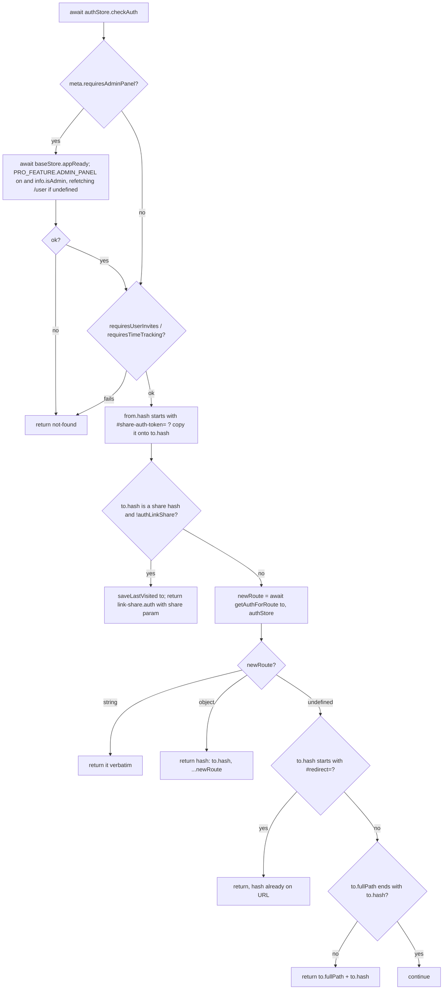

# Bootstrap and routing

How the Vue app starts, decides which layout to show, and moves between routes. This is the skeleton under every feature; the ten-minute version is in [Frontend architecture](../../04-frontend-architecture.md#bootstrap). Verified against the code on 2026-09-16.

## Responsibility

- Owns: `index.html` globals, `main.ts` startup order, `App.vue` layout switch, readiness gating (`Ready.vue`, `stores/base.ts` → `hydrateConfig`), the route table and the `beforeEach` guard, modal-over-route rendering, and "return to where I was" after login.
- Does not own: token storage and refresh ([auth-and-session](./auth-and-session.md)), the `/info` payload (`stores/config.ts`, see [stores](./stores.md)), what individual views render ([project-views](./project-views.md), [task-detail](./task-detail.md)), the websocket client itself ([realtime-and-pwa](./realtime-and-pwa.md)).

## Entry points and public API

| Entry | Where | Called by |
|---|---|---|
| `window.API_URL` (default `/api/v1`) | inline `<script>` at the end of `frontend/index.html` | `main.ts`, `helpers/fetcher.ts` |
| `<!--__vite-plugin-inject-preload__-->` | `frontend/index.html` head | `UnpluginInjectPreload` in `frontend/vite.config.ts` (font preloads at build) |
| `main.ts` | `frontend/src/main.ts` | `<script type="module" src="/src/main.ts">` |
| `useBaseStore().appReady` / `loadApp()` | `frontend/src/stores/base.ts` | router guard, `Ready.vue` |
| `router`, `getAuthForRoute` | `frontend/src/router/index.ts` | `main.ts`, `stores/auth.ts` (`router.push` on logout), `router/index.test.ts` |
| `useRouteWithModal()` | `frontend/src/composables/useRouteWithModal.ts` | `components/home/ContentAuth.vue` |
| `saveLastVisited` / `getLastVisited` / `clearLastVisited` | `frontend/src/helpers/saveLastVisited.ts` | router guard, `useRedirectToLastVisited` |
| `useRedirectToLastVisited()` → `redirectIfSaved`, `getLastVisitedRoute` | `frontend/src/composables/useRedirectToLastVisited.ts` | `Login.vue`, `Register.vue`, `OpenIdAuth.vue`, `DesktopLogin.vue`, `LinkSharingAuth.vue` |
| `AUTH_ROUTE_NAMES` | `frontend/src/constants/authRouteNames.ts` | `App.vue`, router guard |
| `REDIRECT_HASH_PREFIX` (`#redirect=`), `LINK_SHARE_HASH_PREFIX` (`#share-auth-token=`) | `frontend/src/constants/{redirectHash,linkShareHash}.ts` | router, `Login.vue`, `LinkSharingAuth.vue`, `redirectToProvider.ts` |

Who else rewrites `index.html`: `pkg/routes/static.go` → `serveIndexFile` injects `SENTRY_ENABLED`, `SENTRY_DSN`, `CUSTOM_LOGO_URL`, `CUSTOM_LOGO_URL_DARK` (it does not touch `API_URL`), and `desktop/build.js` → `API_URL_SCRIPT_RE` replaces the whole inline script with `<script src="/api-url.js">`. Changing the shape of that inline script breaks both; see [Conventions](../../08-conventions.md#if-you-change-x-you-must-also-change-y).

## Startup order (`frontend/src/main.ts`)

1. `import './client/inviteLink'` first: consumes `#invite-link=` on `/register` before the router or Sentry can observe the URL (`client/inviteLink.ts` → `consumeFragment`).
2. Module imports: `pinia`, `router`, `App.vue`, `message`, `client/http`, `client/queryClient`, `@kyvg/vue3-notification`, `./registerServiceWorker` (registers `sw.js` only when `import.meta.env.PROD`), `./i18n`.
3. `localStorage.API_URL` overrides `window.API_URL`; a trailing `/` is stripped.
4. `configureApiClient()` (`client/http.ts`) sets the generated fetch client's base URL and interceptors.
5. `setupKeyboardModality()`, `handleChunkLoadErrors()` (reloads once per 60 s on stale-chunk errors, `helpers/handleChunkLoadErrors.ts`).
6. `setLanguage(getBrowserLanguage()).then(...)`: everything below runs inside this callback so the first render never lacks a language file.
7. `createApp(App)`; if `window.SENTRY_ENABLED`, dynamic `import('./sentry')`.
8. `app.use(Notifications)`, `app.use(VueQueryPlugin, {queryClient})`.
9. Directives `focus`, `tooltip`, `shortcut`, `cy` (`directives/testid.ts`, renders `data-cy`); global components `Icon`, `XButton`, `Modal`, `Card`.
10. `app.config.errorHandler` → `error(err)` toast (console too in DEV). In DEV only: `warnHandler` toasts and throws, and `window` `error` / `unhandledrejection` listeners toast and rethrow.
11. `app.config.globalProperties.$message = {error, success}`.
12. `app.use(pinia)` → `app.use(router)` → `app.use(i18n)` → `app.mount('#app')`.

Pinia is installed before the router, so `useAuthStore()` inside `router.beforeEach` works; the base store's `hydrateConfig()` starts the moment the store is first instantiated (`stores/base.ts` line `const appReady = hydrateConfig()`).

## Layout switch (`frontend/src/App.vue`)

Everything sits inside `<Ready>`. Branches, in template order:

| Condition | Renders |
|---|---|
| `isQuickAddMode && authStore.authUser` (`composables/useQuickAddMode.ts`, Electron quick-add window) | `QuickAddOverlay` |
| `isQuickAddMode` only | "not logged in" text |
| `showAuthLayout` = `authStore.authUser && route.name is string && !AUTH_ROUTE_NAMES.has(route.name)` | skip link + `AppHeader` + `ContentAuth` |
| `authStore.authLinkShare` | `ContentLinkShare` |
| otherwise | `NoAuthWrapper show-api-config` wrapping `<RouterView v-if="showNoAuthRoute">` |

`showNoAuthRoute` is true only for names in `AUTH_ROUTE_NAMES`: after logout the old app route is still current for a tick, and mounting it in the logged-out shell dereferences a null `authStore.info` (comment in `App.vue`; regression test `App.test.ts`).

Side effects in `App.vue` setup: transparent document background in quick-add mode; `useBodyClass('is-touch', isTouchDevice())`; a `watch` on `route.query.accountDeletionConfirm` that lazy-imports `services/accountDelete` and calls `confirm()`; `setLanguage(authStore.settings.language ?? DEFAULT_LANGUAGE)`; `useColorScheme()`; `useTimeTrackingFavicon()`. Teleported to `body`: `AddToHomeScreen`, `UpdateNotification`, `Notification`, `DemoMode` (all but `Notification` hidden in quick-add mode). `KeyboardShortcuts` renders when `baseStore.keyboardShortcutsActive`. This file is also the only importer of `styles/tailwind.css` and `styles/global.scss`.

## Readiness (`Ready.vue`, `ApiConfig.vue`, `stores/base.ts`)

`components/misc/Ready.vue` renders, in priority: offline screen (`useOnline`), the slot when `baseStore.ready`, an error section with `ApiConfig :configure-open="true" @foundApi="baseStore.loadApp()"` when `baseStore.error !== ''` (special text for `ERROR_NO_API_URL`), and a fixed loading overlay while `baseStore.loading` (`!ready && error === ''`).

`stores/base.ts` → `hydrateConfig()`:

- Desktop (`isDesktopApp()`): ignore `window.API_URL`; only if `localStorage.API_URL` exists run `checkAndSetApiUrl` + `authStore.checkAuth()`, otherwise return without error (the login page then shows `DesktopLogin.vue`).
- Browser: `await checkAndSetApiUrl(window.API_URL)` then `await authStore.checkAuth()`.
- Errors map to `error.value`: `NoApiUrlProvidedError` → `ERROR_NO_API_URL`, `InvalidApiUrlProvidedError` → `t('apiConfig.error')`, anything else → its message.

`appReady = hydrateConfig()` is created at store construction and exported; `appReady.then(() => router.isReady()).then(ready = true)` marks the app ready. `loadApp()` re-runs hydration (used after the user enters a new URL in `ApiConfig.vue`). The guard awaits `appReady`, never `router.isReady()`, because the initial navigation is what `isReady()` waits for (comment at the `appReady` definition).

`components/misc/ApiConfig.vue`: input prefilled with `window.API_URL`; `setApiUrl()` calls `checkAndSetApiUrl` (probe order in [auth-and-session](./auth-and-session.md#api-url-discovery)), toasts `apiConfig.success`, emits `foundApi`. `NoAuthWrapper.vue` shows it when `showApiConfig` and (not desktop, or desktop with a stored URL).

## Route table (`frontend/src/router/index.ts`)

`createWebHistory(import.meta.env.BASE_URL)`. Eager imports: `Login`, `Register`, `LinkSharingAuth`, `OpenIdAuth`, `ShowTasks` (as `UpcomingTasks`), `404.vue`. Everything else is `() => import(...)`. Two FIXMEs ask for lazy imports: `router/index.ts:90` (`user.register`) and `router/index.ts:214` (`link-share.auth`).

| Area | Name → path | View | Meta / notes |
|---|---|---|---|
| Home | `home` `/` | `views/Home.vue` | |
| Not found | `not-found` `/:pathMatch(.*)*`, `bad-not-found` `/:pathMatch(.*)` | `views/404.vue` | guard redirects here for pro-gated routes |
| Auth | `user.login` `/login`, `user.register` `/register`, `user.password-reset.request` `/get-password-reset`, `user.password-reset.reset` `/password-reset` | `views/user/{Login,Register,RequestPasswordReset,PasswordReset}.vue` | `meta.title` i18n key shown by `NoAuthWrapper`/`AppHeader` |
| Auth | `openid.auth` `/auth/openid/:provider`, `oauth.authorize` `/oauth/authorize`, `link-share.auth` `/share/:share/auth` | `views/user/OpenIdAuth.vue`, `views/user/OAuthAuthorize.vue`, `views/sharing/LinkSharingAuth.vue` | `oauth.authorize` is not in `AUTH_ROUTE_NAMES` (needs a session) |
| User settings | `user.settings` `/user/settings` (redirects to `user.settings.general`) with children `avatar`, `caldav`, `mcp`, `data-export`, `feeds`, `deletion`, `email-update`, `general`, `password-update`, `totp`, `apiTokens`, `sessions`, `webhooks`, `bots`; `migrate.start` `/user/settings/migrate`, `migrate.csv` `/migrate/csv`, `migrate.service` `/migrate/:service` | `views/user/Settings.vue` + `views/user/settings/*`, `views/migrate/*` | `caldav` and `totp` have `beforeEnter` that bounce to `general` when `configStore.caldavEnabled` / `totpEnabled && info.isLocalUser` is false |
| Export | `user.export.download` `/user/export/download` | `views/user/DataExportDownload.vue` | |
| Tasks | `task.detail` `/tasks/:id` (props `taskId`), `tasks.range` `/tasks/by/upcoming` (props from `from`, `to`, `showNulls`, `showOverdue`) | `views/tasks/TaskDetailView.vue`, `views/tasks/ShowTasks.vue` | |
| Legacy | `lists` `/lists:pathMatch(.*)*` | redirect to `/projects...` keeping query and hash | |
| Projects | `projects.index` `/projects`, `project.create` `/projects/new`, `project.createFromParent` `/projects/:parentProjectId/new`, `project.index` `/projects/:projectId` (redirect), `project.view` `/projects/:projectId/:viewId`, `project.info` `/projects/:projectId/info` | `views/project/*` | create/info are `showAsModal` |
| Project settings | `project.settings.{edit,background,duplicate,share,webhooks,delete,archive,views}` `/projects/:projectId/settings/<x>` | `views/project/settings/ProjectSettings*.vue` | all `showAsModal` |
| Filters | `filters.create` `/filters/new`, `filter.settings.edit` and `filter.settings.delete` at `/projects/:projectId/settings/{edit,delete}` | `views/filters/{FilterNew,FilterEdit,FilterDelete}.vue` | `showAsModal`; **same paths as `project.settings.edit/delete`** |
| Teams, labels | `teams.index` `/teams`, `teams.create` `/teams/new` (modal), `teams.edit` `/teams/:id/edit`, `labels.index` `/labels`, `labels.create` `/labels/new` (modal) | `views/teams/*`, `views/labels/*` | |
| Misc | `about` `/about` | `views/About.vue` | |
| Pro | `time-tracking` `/time-tracking` | `views/time-tracking/TimeTracking.vue` | `requiresTimeTracking`, `meta.title` |
| Pro | `/admin` shell with `admin.overview` ``, `admin.users` `users`, `admin.projects` `projects`, `admin.inviteLinks` `invite-links` | `views/admin/*` | `requiresAdminPanel`, `adminMode`; invite links also `requiresUserInvites` |

`project.index` redirects to `project.view` with `viewId` from `helpers/projectView.ts` → `getProjectViewId` (localStorage key `projectView`, `0` when unknown; `ProjectView.vue` then picks the first view). Duplicate paths: `filter.settings.edit` and `project.settings.edit` both resolve `/projects/:projectId/settings/edit`; the first definition wins for path matching, so these routes must be navigated **by name** (the saved-filter UI does). Unverified: whether any link relies on path matching for the filter variant.

`scrollBehavior`: saved position on back/forward; scroll to `to.hash` as an element unless it starts with the link-share or redirect prefix; otherwise top-left (written with logical property names `inset-inline-start`/`inset-block-start`; Unverified: whether vue-router honors these keys instead of `left`/`top`).

## The guard (`router.beforeEach`) step by step

`getAuthForRoute(to, authStore)` (exported, unit-tested):

| Case | Result |
|---|---|
| `to.name === 'user.login'` and hash `#redirect=<dest>` | remembers `redirectDest` (the raw fullPath; vue-router already decoded the hash once) |
| `?userEmailConfirm=` present **and** signed in | `refreshUserInfo()`, `verifyEmail(token)`, `refreshUserInfo()`; if a `pendingEmail` was cleared → toast `user.settings.updateEmailConfirmed`, go to `user.settings.email-update`; else `home`. Errors toast `e.cause` (the axios error) |
| signed in (`authUser` or `authLinkShare`) | return `redirectDest` if set (issue #2654: a signed-in browser opening a copied `/login#redirect=/oauth/authorize?...` must run the OAuth flow), else allow |
| `?userPasswordReset=` and not on the reset page | `user.password-reset.reset` with the token in query |
| on `user.password-reset.reset` without token | `user.login` |
| `?userEmailConfirm=` while signed out | store it in `localStorage.emailConfirmToken`; go to `user.login` (Login.vue redeems it in `onBeforeMount`) |
| `to.name === 'oauth.authorize'` | `user.login` with `hash: '#redirect=' + to.fullPath` (hash, not query, so OAuth params stay out of access logs) |
| hash `#redirect=<dest>` | `router.resolve(dest)` and `saveLastVisited(...)` so the destination survives the external OIDC round trip |
| route not in `AUTH_ROUTE_NAMES` and no pending email token | `saveLastVisited(to)` then `user.login` |
| pending email token and not on login | `user.login` with `to.query` |

## Modals over routes (`useRouteWithModal`)

Routes with `meta.showAsModal` are pushed with `history.state.backdropView` (the previous route's location) by their callers; `useRouteWithModal()` resolves that into `routeWithModal` (what the `<RouterView :route>` in `ContentAuth.vue` renders underneath) and builds `currentModal` by re-implementing vue-router's props resolution over `route.matched[0]` and wrapping lazy components in `defineAsyncComponent`. `closeModal()` order: if `history.state.back` matches `/projects/\d+/(\d+)` and the current project changed (task moved from kanban), push `project.view` with the backdrop's query; else `router.back()`; else push the backdrop route (unless `projectId === '0'`); else `project.index` of the current project or `home`.

`ContentAuth.vue` wraps the router view in `<keep-alive :include="['project.view']">`, so `ProjectView.vue` survives opening a task modal; see [project-views](./project-views.md).

## Shell components

- `components/home/ContentAuth.vue`: sidebar (`Navigation.vue`), `QuickActions`, the route/modal pair above, keyboard shortcut button. Setup side effects: `useRenewTokenOnFocus()`, `useWebSocket().connect()`, `projectStore.loadAllProjects()`, a `BroadcastChannel('vikunja-task-updates')` that opens `task.detail` for tasks created from the desktop quick-entry window. A `watch(route.name)` clears `baseStore.currentProject` for a hard-coded list of non-project routes, flagged `// FIXME: this is really error prone` at `ContentAuth.vue:118`; `// TODO: Reset the title if the page component does not set one itself` at `ContentAuth.vue:141` (titles are per-view via `composables/useTitle.ts`, which appends ` | Vikunja`).
- `components/home/AppHeader.vue`: logo link to `home`, `MenuButton`, current project title with info/settings dropdown, or `t(route.meta.title)` for standalone pages, then `TimerBadge`, `OpenQuickActions`, `Notifications`, user dropdown (admin link gated by `PRO_FEATURE.ADMIN_PANEL`). FIXME at `AppHeader.vue:215` about the notifications icon slot.
- `components/home/Navigation.vue`: `RouterLink`s to `home`, `tasks.range`, `projects.index`, `labels.index`, `teams.index`, and `time-tracking` when the pro feature is on; then `ProjectsNavigation` for favorites, saved filters, and root projects; resizable via `useSidebarResize`.
- `components/home/ContentLinkShare.vue`: logo (unless `baseStore.logoVisible` is false), project title button preserving `route.hash`, a plain `<RouterView />` (no keep-alive, no modals), full-width for kanban and gantt.

## Dependencies

- **Uses:** `stores/{auth,base,config,projects}`, `helpers/checkAndSetApiUrl.ts`, `client/http.ts`, `client/queryClient.ts`, `i18n`, `message`, `constants/proFeatures.ts`, `helpers/projectView.ts`, `helpers/time/{parseDateOrString,getNextWeekDate}.ts`.
- **Used by:** every view (route params and names), `stores/auth.ts` (`router.push({name: 'user.login'})` in `logout`), `stores/base.ts` (`router.isReady()`), `sentry.ts` (router instrumentation).

## Invariants and assumptions

- `AUTH_ROUTE_NAMES` must list every route that renders without a session; `App.vue` and the guard both read it. Adding a public route without adding it here yields a login bounce.
- `REDIRECT_HASH_PREFIX` must differ from `LINK_SHARE_HASH_PREFIX`; the guard special-cases the latter first (`constants/redirectHash.ts` comment).
- Pro-gated routes must carry `meta.requires*`; the guard returns `not-found`, never 403, so the feature's existence is not revealed.
- `appReady` must never await `router.isReady()` (deadlock on direct navigation).
- Stores are constructed before the first navigation; `main.ts` installs pinia before the router.
- `lastVisited` in localStorage is consumed exactly once (`getLastVisitedRoute` clears it); `Login.vue` deliberately uses `router.push({name: 'home'})` rather than `redirectIfSaved()` in `onBeforeMount` to avoid consuming it early.

## Configuration

| Source | Key | Effect |
|---|---|---|
| `window` (index.html / `serveIndexFile`) | `API_URL`, `SENTRY_ENABLED`, `SENTRY_DSN`, `CUSTOM_LOGO_URL`, `CUSTOM_LOGO_URL_DARK` | API base, Sentry toggle, logo override |
| `window` (Electron preload) | `vikunjaDesktop.isDesktop` | desktop branches in `hydrateConfig`, `NoAuthWrapper`, `helpers/desktopAuth.ts` |
| `localStorage` | `API_URL`, `lastVisited`, `projectView`, `emailConfirmToken`, `token` | see sections above and [auth-and-session](./auth-and-session.md) |
| `sessionStorage` | `justLoggedOut`, `chunkLoadErrorReloadedAt` | login auto-redirect suppression; reload cooldown |
| `import.meta.env` | `BASE_URL`, `DEV`, `PROD` | history base, dev error handlers, service worker registration |

## Error handling

Uncaught component errors → `app.config.errorHandler` → toast via `message/error`. Readiness failures → `baseStore.error` text on the `Ready.vue` screen. Guard failures are redirects, not thrown errors; `getAuthForRoute` catches `verifyEmail` failures and toasts them. Navigation to a pro-gated route without the feature is silently `not-found`.

## Tests

- `frontend/src/router/index.test.ts`: `getAuthForRoute` email-confirmation branch only (token redemption, double refresh, array query values, no-pending case, error reporting, empty token). `pnpm vitest run src/router`.
- `frontend/src/App.test.ts`: logged-out shell must not render the previous app route (Sentry FRONTEND-OSS-2CJ/2CH).
- e2e (`frontend/tests/e2e/`, run via the `run-e2e-tests` skill): `user/login.spec.ts` ("redirect to /login when no user", "redirect to the previous route after logging in", no login-form flash inside the app shell), `user/password-reset.spec.ts` (query-token redirects), `user/oauth-authorize.spec.ts` (copied `#redirect=` URL in a signed-in browser), `user/email-confirmation.spec.ts`, `sharing/linkShare.spec.ts` (share hash on direct project and task URLs, id collision case), `misc/menu.spec.ts` (sidebar toggling).
- Not covered by unit tests: `scrollBehavior`, the pro-feature branches of `beforeEach`, `useRouteWithModal.closeModal`, `hydrateConfig` error mapping.

## Gotchas and tech debt

- `router/index.ts:90` and `:214`: `Register` and `LinkSharingAuth` are eager imports (FIXME).
- `ContentAuth.vue:118` FIXME (route-name list for clearing the current project) and `:141` TODO (title reset).
- `Register.vue:182` FIXME: logged-in redirect should be a `beforeEnter` hook.
- `LinkSharingAuth.vue:109` FIXME, `:113` and `:151` TODOs (already-authenticated redirect, passwordless flow, centralised auth error mapping).
- `AppHeader.vue:215` FIXME (notifications icon slot).
- Duplicate paths for `filter.settings.*` and `project.settings.*` (see route table).
- The PWA manifest shortcuts in `vite.config.ts` reference routes that no longer exist; the service worker's `NetworkOnly` rule in `src/sw.ts` only matches `/api/v1` (tracked in [Known issues](../../13-known-issues.md)).
- Change frequency since 2025-09-01: `router/index.ts` 15 commits, `stores/auth.ts` 34; treat the guard as a hotspot and add a `router/index.test.ts` case for any new branch.

## Related pages

[auth-and-session](./auth-and-session.md), [stores](./stores.md), [project-views](./project-views.md), [realtime-and-pwa](./realtime-and-pwa.md), [testing-infrastructure](./testing-infrastructure.md), [Frontend architecture](../../04-frontend-architecture.md), [Build a Vue feature](../../playbooks/build-vue-feature.md), backend [http-routing-and-middleware](../backend/http-routing-and-middleware.md) (`serveIndexFile`), [desktop](../desktop.md).
