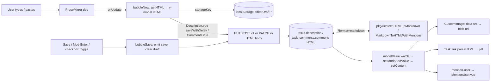

# Editor (TipTap)

The rich-text editor behind task descriptions, comments, and the description fields of projects, teams, labels and saved filters. It is a TipTap/ProseMirror editor wrapped in `frontend/src/components/input/editor/TipTap.vue` that edits **HTML in, HTML out**; the backend stores that HTML verbatim and converts to Markdown only at the API boundary (`pkg/richtext`). Context: [Frontend architecture](../../04-frontend-architecture.md#component-organization), [Data model](../../06-data-model.md#invariants-worth-knowing).

## Responsibility

- Owns: the editor component and its two modes (preview/edit), save/discard semantics, per-field localStorage drafts, image upload + attachment-backed image rendering, links and task-link pills, checklist toggling in preview, slash commands, emoji and `@mention` autocompletion, paste repair and Markdown paste, comment-quote blockquotes.
- Does not own: attachment upload itself (`frontend/src/helpers/attachments.ts` → `uploadFilesForEditor`, `fetchAttachmentBlobUrl`), the comment list that provides the reply context (`components/tasks/partials/Comments.vue`, see [task-detail](./task-detail.md)), the lightbox widget (`components/misc/ImageLightbox.vue`), mention *notification* (backend, [notifications-and-mail](../backend/notifications-and-mail.md)), HTML↔Markdown conversion (`pkg/richtext`, [operations-subsystems](../backend/operations-subsystems.md)).

## Entry points and public API

| Entry | Where | Called by |
|---|---|---|
| `AsyncEditor` (default export) | `frontend/src/components/input/AsyncEditor.ts` → `createAsyncComponent(() => import('.../TipTap.vue'))` | `Description.vue`, `Comments.vue`, `views/filters/Filter{New,Edit}.vue`, `views/labels/ListLabels.vue`, `views/project/settings/ProjectSettingsEdit.vue`, `views/teams/EditTeam.vue` |
| `TipTap.vue` props | `uploadCallback?`, `isEditEnabled` (default `true`), `bottomActions`, `showSave`, `placeholder`, `editShortcut` (e.g. `KeyE`), `enableDiscardShortcut`, `enableMentions`, `projectId`, `storageKey` | consumers above |
| `v-model` (`defineModel<string>`), `@save` | `TipTap.vue` | `Description.vue` (`@update:modelValue="saveWithDelay"`, `@save="save"`), `Comments.vue` (`@save="addComment()"`) |
| `setReplyContent(html)` (`defineExpose`) | `TipTap.vue` | `Comments.vue` → `<blockquote data-comment-id="${parent.id}">…</blockquote>

` |
| `createEditorExtensions(deps)` | `editor/editorExtensions.ts` | `TipTap.vue` and every extension unit test |
| `isEditorContentEmpty(html)` | `frontend/src/helpers/editorContentEmpty.ts` (`'' \|\| '

'`) | `TipTap.vue`, `editorDraftStorage.ts` |
| `saveEditorDraft` / `loadEditorDraft` / `clearEditorDraft` | `frontend/src/helpers/editorDraftStorage.ts` | `TipTap.vue`, `Description.vue`, `Comments.vue` |

## Key types and functions

### `TipTap.vue` (1140 lines)

| Piece | What it does |
|---|---|
| `internalMode` / `isEditing` | `'edit' \| 'preview'`; `isEditing = mode === 'edit' && props.isEditEnabled`. `setModeAndValue()` picks `edit` when the content is empty, otherwise `preview`. Double-click on content (`setEditIfApplicable`) or the "Edit" action enters edit mode. |
| `bubbleNow()` (`onUpdate`) | Reads `getHTML()`, ignores `

` vs `''`, sets `contentHasChanged`, writes the draft when `storageKey` is set, updates the model. |
| `bubbleSave()` | `bubbleNow()`, remembers `lastSavedState`, clears the draft, `emit('save', html)`, returns to preview. Bound to the Save button and `Mod-Enter` (only if `contentHasChanged`). |
| `exitEditMode()` | `setContent(lastSavedState)`, clears the draft, back to preview. Bound to `Escape` via an inline `Extension` when `enableDiscardShortcut`; `handleEscapeKey` additionally `stopPropagation()`s the DOM event so the surrounding modal does not close. |
| `setFocusToEditor()` | Document-level keydown listener when `editShortcut` is set; compares `eventToShortcutString(event)` and ignores inputs/textareas/contentEditable targets. |
| `uploadAndInsertFiles()` | `props.uploadCallback(files)` → for each URL insert `UPLOAD_PLACEHOLDER_ELEMENT` if the doc is empty (TipTap crashes inserting into an empty editor), `setImage`, then strip the placeholder and `setContent`; prompts for alt text when exactly one image was inserted. Rejections go to `error()` (upload quota etc.). |
| `addImage()` | Without `uploadCallback`, prompts for an image URL via `helpers/inputPrompt.ts`. |
| `showTextBubbleMenu` / `showImageBubbleMenu` | Text bubble (bold/italic/underline/strike/code/link) hides over `image` and `taskLink` nodes; the image bubble (`plugin-key="imageBubbleMenu"`) offers only "alt text". |
| `handleContentClick` / `getLightboxImage` | In preview, clicking an `` with `data-src` **and** a `blob:` src opens `ImageLightbox`; zoom math is the pure `frontend/src/helpers/imageZoom.ts` (`clampScale` 1–8, `wheelZoomFactor`, `zoomAround`, `clampTranslate`). |
| `watch(isEditing)` checklist wiring | In preview, attaches `clickTasklistCheckbox` to the second child of every `[data-checked]` item so clicking the label text toggles the checkbox (`event.target.parentNode.parentNode.firstChild.click()`); removed again in edit mode. |
| `liveEditor()` | `useEditor` leaves a destroyed instance in the ref; every post-`await` path uses this guard (commit `572f9a2c0`). |
| Draft restore (`onMounted`) | If `storageKey` has a draft **and** the model is empty: `setContent(draft)`, force edit mode, set the model. Keys are `editorDraft-<storageKey>`; consumers use `task-description-<id>` and `task-comment-<taskId>`. |

### Extension list (`editorExtensions.ts` → `createEditorExtensions`)

| Extension | Source | Notes |
|---|---|---|
| `StarterKit` | `@tiptap/starter-kit` | `codeBlock`, `hardBreak`, `blockquote`, `listKeymap`, `link`, `underline` disabled and re-registered below, otherwise both copies run (e.g. `openOnClick`). |
| `ListKeymapWithJoin` | `listKeymapWithJoin.ts` | Backspace at the start of a non-first list item joins into the previous item (`joinTextblockBackward`) instead of lifting it out (#3480). |
| `DeleteSelectionBeforeEnter` | `deleteSelectionBeforeEnter.ts` | Priority 1000. If Enter would split at document level after deleting a selection that starts at a block boundary, delete first and let the normal handlers continue (`TransformError` fix). |
| `BlockquoteWithCommentId` | `blockquoteWithCommentId.ts` | Adds `commentId` ↔ `data-comment-id` (positive integers only) and the `BlockquoteCommentView.vue` node view. |
| `CodeBlockLowlight` | `lowlight` `common` grammars | Highlight classes styled in `TipTap.vue` `<style>`. |
| `HardBreak` (extended) | inline | `Shift-Enter` hard break; `Mod-Enter` saves. |
| `Placeholder` | `@tiptap/extensions` | Only while editing and (empty or focused). |
| `Typography`, `Subscript`, `Superscript`, `Underline` | stock | `Subscript`/`Superscript` were added by `fb26873f4` so ``/`` survive HTML paste and round-trips (#3606); without a schema mark, pasted HTML silently drops them. |
| `NonInclusiveLink` | `Link.extend({inclusive: false})` | `openOnClick: false`; `validate` allows `https?`, `ftp`, `git`, `obsidian`, `notion`, `message`; `HTMLAttributes = LINK_HTML_ATTRIBUTES` (`target=_blank`, `rel=noopener noreferrer nofollow`, shared with `taskLink.ts`). |
| `TaskLink` | `taskLink.ts` | See below. |
| `Table`, `TableRow`, `TableHeader`, `CustomTableCell` | `@tiptap/extension-table` | Cell gets `backgroundColor` ↔ `data-background-color`. Toolbar has a table mode. |
| `CustomImage` | inline in `editorExtensions.ts` | See "Images" below. |
| `TaskList`, `TaskItemWithId` | `taskItemWithId.ts` | Each item gets `data-task-id` (`nanoid(8)`); an `appendTransaction` plugin regenerates missing/duplicate ids. `onReadOnlyChecked` finds the node by `taskId`, sets `checked` and calls `bubbleSave()` — so toggling a checkbox in preview **saves immediately** (only when `isEditEnabled`). Fixes GitHub #293/#563. |
| `Commands` + `suggestionSetup(t)` | `commands.ts`, `suggestion.ts`, `CommandsList.vue` | `/` menu: text, heading 1–3, bullet/ordered/task list, quote, code, image (clicks `#tiptap__image-upload`), horizontal rule; filtered by `title.startsWith(query)`. |
| `EmojiExtension` | `emoji/emojiExtension.ts`, `emojiSuggestion.ts`, `emojiData.ts`, `EmojiList.vue` | `:` trigger, only after whitespace; shortcode query `[a-zA-Z0-9_]*`; index lazily fetched from `frontend/public/emojis.json` and cached; 15 results, `startsWith` before substring. |
| `PasteHandler` | inline in `editorExtensions.ts` | `clipboardParser: createClipboardParser(schema)`, `transformPasted: repairSliceContent`, `handlePaste`: image files → `uploadAndInsertFiles`; `text/plain` containing `[*\`_\[\]#-]` outside a code block → `marked.parse` → `createNodeFromContent` → `fillRequiredContent` → `insertContent`. |
| `Mention` (only in `TipTap.vue`, when `enableMentions && projectId > 0`) | `mention/mentionSuggestion.ts`, `MentionList.vue`, `MentionUser.vue` | Serialized as `<mention-user>` (`parseHTML`/`renderHTML` overridden), node view `MentionUser.vue` (avatar + label). |
| `escapeKey` (only in `TipTap.vue`, when `enableDiscardShortcut`) | inline | `Escape` → `exitEditMode()`. |

### Content repair (`contentRepair.ts`)

ProseMirror builds nodes its schema rejects and crashes later (`FRONTEND-OSS-2H9`, `-2JY`, `-2JZ` in Sentry). `fillRequiredContent(fragment)` closes every node fully (for inserted content); `repairSliceContent(slice)` only makes each node a valid *prefix* and recomputes `openStart`/`openEnd`; `RepairingClipboardParser.parseSlice` applies it before `prosemirror-view` closes the slice, because `transformPasted` runs too late. `fitContent` wraps or drops children that no filler can fix.

### Task links (`taskLink.ts`, `TaskLinkView.vue`, `TaskLinkPill.vue`, `taskLinkContext.ts`)

- In-memory only: `parseHTML` upgrades an `a[href]` whose text equals its href, whose href yields a task id (`helpers/parseTaskIdFromUrl.ts`), with no children and only `href/target/rel` attributes; `renderHTML` writes the same plain anchor back, so **stored HTML never contains a custom node** (`taskLink.test.ts` "serializes back to the same plain anchor").
- Priority 200 (above the Markdown paste handler, below the `Link` mark at 1000); a paste plugin turns a pasted bare task URL into the node when the selection is empty and not in code.
- `TaskLinkPill.vue` fetches via `helpers/fetchTaskById.ts`, invalidates on `taskCacheVersion` / `taskCacheIdentityVersion` (`helpers/taskCache.ts`), and hides the project prefix when the task lives in the project injected through `taskLinkCurrentProjectIdKey` (provided by `TipTap.vue` from `props.projectId`, because `baseStore.currentProject` is stale on direct task loads and modals).
- `TaskLinkView.vue` opens `task.detail` with `state.backdropView` only when the editor is **not** editable; in edit mode a click just selects the node.

### Images

`CustomImage.renderHTML`: when `src` or `data-src` starts with `window.API_URL`, the URL `/tasks/<taskId>/attachments/<id>` is parsed, the element is rendered with `src="#"`, `data-src=<url>` and `id="tiptap-image-<taskId>-<attachmentId>"`, and a `nextTick` looks that id up **inside the live editor DOM only** and swaps in `fetchAttachmentBlobUrl(...)` (shared blob cache, `ed417c8f9`). The `id` attribute's `parseHTML` returns `null` so a planted id in stored HTML cannot hijack another image's blob (`d068b9f9c`, tested in `editorExtensions.test.ts`). Any other `src` renders unchanged.

### Popups (`suggestionPopup.ts`, `popupContainer.ts`)

`createSuggestionPopup(container, content, getReferenceRect, contextElement)` positions with `@floating-ui/dom` (`bottom-start`, `offset(8)`, `flip`, `shift`), keeps `autoUpdate` alive, and guards every tick behind `destroyed`. The container is `getTopLayerContainer(editor.view.dom)` (`helpers/getTopLayerContainer.ts`) so popups render inside an open `<dialog>` (Kanban task popup) instead of behind it. Slash, emoji and mention suggestions all use it.

## Internal structure

Mentions end to end: `@` → `mentionSuggestionSetup(projectId)` → `ProjectUserService.getAll({projectId}, {s: query})` (`GET /projects/{projectId}/projectusers`, 300 ms debounce, 10 results or 5 for an empty query) → `<mention-user data-id="<username>" data-label="…">` in the saved HTML → backend `pkg/models/mentions.go` → `FindMentionedUsersInText` parses `<mention-user data-id>` and `pkg/models/listeners.go` → `notifyMentionedUsers` sends the mention notifications on comment create/update and description changes. Quoted-comment authors are found the same way through `<blockquote data-comment-id>` (`pkg/models/comment_quotes.go`).

Backend counterpart (`pkg/richtext`): storage stays HTML. `HTMLToMarkdown` (html-to-markdown v2 with TipTap rules in `tiptap.go`: `<mention-user>` → `@username`, task-list `<li data-checked>` → `[x]`) and `MarkdownToHTML` / `MarkdownToHTMLWithMentions` (goldmark GFM, `tasklist_html.go` rewrites task lists into the TipTap `ul[data-type=taskList] > li[data-type=taskItem][data-checked]` shape, `mentions_html.go` → `rebuildMentions` resolves `@username` to `<mention-user>`), `Changed` for semantic change detection and `HTMLIsEmpty`. `pkg/routes/api/v2/richtext.go` applies them when a request sends `?format=markdown` or the `X-Vikunja-Format: markdown` header (PATCH).

## Dependencies

- **Uses:** `@tiptap/*` (core, vue-3, starter-kit, extension-link/image/table/mention/list/subscript/superscript/underline/code-block-lowlight/typography/hard-break/blockquote, suggestion), `@floating-ui/dom`, `marked`, `lowlight`, `nanoid`; `helpers/attachments.ts`, `helpers/inputPrompt.ts`, `helpers/getTopLayerContainer.ts`, `helpers/fetchTaskById.ts`, `helpers/taskCache.ts`, `helpers/parseTaskIdFromUrl.ts`, `helpers/shortcut.ts`; legacy `services/projectUsers.ts`; `stores/base.ts`, `stores/projects.ts`; `components/misc/ImageLightbox.vue`, `UserAvatar.vue`, `TaskGlanceTooltip.vue`.
- **Used by:** the seven consumers listed under entry points; `components/tasks/partials/commentReplyContext.ts` (provided by `Comments.vue`) is injected by `BlockquoteCommentView.vue`.

## Invariants and assumptions

- The model value is HTML and `''`/`

` mean empty (`isEditorContentEmpty`); `bubbleNow` and `editorDraftStorage` both depend on it, as does `richtext.HTMLIsEmpty` on the server.
- Stored HTML never carries editor-only nodes: `taskLink` round-trips to a plain `<a>`, `CustomImage` keeps `data-src` and never persists blob URLs (`src="#"`), `id` is regenerated on every parse. `richtext/tiptap.go` and `pkg/models/mentions.go` rely on the `<mention-user data-id>` shape; `resetDescriptionChecklist` and `tasklist_html.go` rely on `li[data-checked]`.
- Extensions are built **once** at setup: `enableMentions`, `projectId` and `enableDiscardShortcut` are read when the component is created and are not reactive.
- `TaskLink` (priority 200) must stay above the `pasteHandler` plugin and below the `Link` mark (comment in `taskLink.ts`).
- The toolbar and bubble menus use `v-show`, not `v-if`, to avoid a TipTap DOM race (`ueberdosis/tiptap#7342`, comment at the top of `TipTap.vue`).
- `PasteHandler` reads `text/plain` only; HTML clipboard content goes through the schema-repairing `clipboardParser`.

## Error handling

Upload rejections are shown with `error()` from `@/message` (not thrown). Blob resolution failures leave `src="#"` in place. `emojiData.loadEmojis` and `mentionSuggestion` log to `console.error` and return `[]`. Draft storage wraps every `localStorage` access in try/catch and `console.warn`s. Schema-invalid content is repaired silently (`contentRepair.ts`); the Sentry ids in its header comment are the historical crashes.

## Tests

Unit (`pnpm vitest run src/components/input/editor`), all building a real `Editor` from `createEditorExtensions` unless noted:

| File | Covers |
|---|---|
| `TaskLinkPill.test.ts` | loading/identifier/#index fallback/done state, project prefix via the injected key |
| `TaskLinkView.test.ts` | opens the task modal only when not editable |
| `blockquoteWithCommentId.test.ts` | attribute round-trip, malformed ids dropped |
| `clipboardPaste.test.ts` | schema-invalid HTML paste is repaired; lists copied out of the editor survive |
| `deleteSelectionBeforeEnter.test.ts` | Enter with block-boundary selections does not throw |
| `editorExtensions.test.ts` | `CustomImage` blob lookup: fresh, reloaded, legacy (no `data-src`), planted id, dedupe across editors |
| `listKeymapWithJoin.test.ts` | backspace joins bullet/ordered/task items; first item still lifts |
| `markdownPaste.test.ts` | Markdown → nodes at the cursor |
| `subscriptSuperscript.test.ts` | ``/`` through round-trip and HTML paste |
| `suggestionPopup.test.ts` | floating-ui positioning, live reference rect, destroy semantics |
| `taskItemWithId.test.ts` | id preservation, duplicate regeneration |
| `taskLink.test.ts` | anchor upgrade rules and byte-stable serialization |
| `emoji/emojiData.test.ts` | flatten/sort, startsWith preference, 15-result cap, cache |
| `mention/mentionSuggestion.test.ts` | `onExit` without `onStart` |

Also `frontend/src/helpers/imageZoom.test.ts`. E2E (`frontend/tests/e2e/editor/`, run via the `run-e2e-tests` skill): `emoji-autocomplete.spec.ts` (glyph insertion, no popup after non-whitespace), `image-alt-text.spec.ts` (bubble-menu alt text, cancel keeps old alt, prompt after upload), `link-prompt-kanban-popup.spec.ts` (link prompt inside the Kanban dialog, Escape does not close the task), `suggestion-popup-position.spec.ts` (anchored to text, follows scroll), `toolbar-navigation.spec.ts` (roving tabindex). Not covered by unit tests: `TipTap.vue` itself (mode switching, drafts, checklist click forwarding) — commit `40c97e2e5` removed component tests in favour of e2e.

## Gotchas and tech debt

- `suggestion.ts` "Heading 3" runs `setNode('heading', {level: 2})` — the slash command produces an H2 (the toolbar's H3 button is correct).
- `clickTasklistCheckbox` hard-codes the TipTap task-item DOM (`parentNode.parentNode.firstChild`); a TipTap upgrade that changes the markup silently breaks preview toggling. Nested items of a checked parent are exempt from strike-through by CSS only (`d2852649b`).
- Two Escape paths (`escapeKey` extension and `handleEscapeKey` DOM listener) must agree; both are gated on `enableDiscardShortcut`.
- `CommandsList.vue` and `MentionList.vue` are Options API (`eslint-disable vue/component-api-style`) because TipTap's `VueRenderer` calls `ref.onKeyDown`.
- `UPLOAD_PLACEHOLDER_ELEMENT` + `setContent` after upload resets node positions, which is why alt-text prompting is limited to single uploads.
- `mentionSuggestion.ts` and `TaskLinkPill.vue` still use the legacy service/model layer (`ProjectUserService`, `getDisplayName` from `models/user`); see [api-client-legacy](./api-client-legacy.md).
- Hotspot: `git log --follow` counts 87 `fix` commits on `TipTap.vue`; recent ones are all crash guards after `await` (`liveEditor`), popup teardown, and paste repair. No `TODO`/`FIXME` markers exist under `editor/`.

## Related pages

[task-detail](./task-detail.md) (Description, Comments, attachments), [api-client-legacy](./api-client-legacy.md), [styling-and-theming](./styling-and-theming.md) (editor SCSS lives in `TipTap.vue`), [testing-infrastructure](./testing-infrastructure.md), backend [notifications-and-mail](../backend/notifications-and-mail.md) (mention notifications), [operations-subsystems](../backend/operations-subsystems.md) (`pkg/richtext`), [api-v2-huma](../backend/api-v2-huma.md) (`format=markdown`), [Data flows](../../10-data-flows.md#5-background-comment--notification--mail-bell-websocket), [playbooks/build-vue-feature](../../playbooks/build-vue-feature.md).
