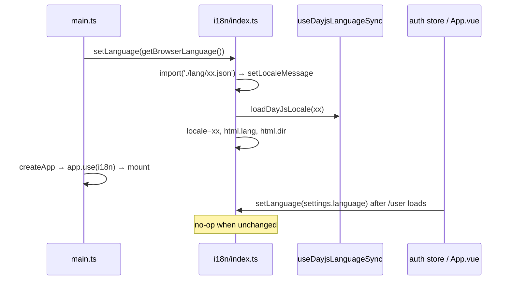

# i18n and formatting

Translations (vue-i18n with lazily loaded locale files), locale side effects (`<html lang/dir>`, dayjs locale), and every date/time formatting helper together with the user settings that steer them. Skeleton context: [Frontend architecture](../../04-frontend-architecture.md); rules in [translations](../../../docs/translations.md) and [Conventions](../../08-conventions.md#translations).

## Responsibility

- **Owns:** `frontend/src/i18n/` (instance, `SUPPORTED_LOCALES`, `setLanguage`, dayjs locale sync), `src/i18n/lang/*.json`, `src/helpers/time/*`, `src/composables/useDateDisplay.ts`, `useTimeFormat.ts`, `useGlobalNow.ts`, `src/constants/dateDisplay.ts`, `timeFormat.ts`, `date.ts`, `src/components/misc/TimeDisplay.vue`.
- **Does not own:** the settings values (auth store, [stores](./stores.md); settings UI in [user-settings-and-admin](./user-settings-and-admin.md)), the backend translator `pkg/i18n` ([operations-subsystems](../backend/operations-subsystems.md)), error-code text lookup (`src/message`, [Frontend architecture](../../04-frontend-architecture.md#errors-to-the-user)), or the datepicker components that consume the helpers.

## Entry points and public API

| Entry | Where | Called by |
|---|---|---|
| `i18n` (vue-i18n instance), `SUPPORTED_LOCALES`, `DEFAULT_LANGUAGE`, `SupportedLocale`, `isRTLLanguage` | `frontend/src/i18n/index.ts` | `main.ts` (`app.use(i18n)`), `histoire.setup.ts`, `formatDate.ts`, `src/message` |
| `setLanguage(lang)` | `i18n/index.ts:90` | `main.ts:66` (browser language before `createApp`), `App.vue:122` (`authStore.settings.language ?? DEFAULT_LANGUAGE`), `stores/auth.ts:455,515` after user info/settings load |
| `getBrowserLanguage()` | `i18n/index.ts:119` | `main.ts`, `stores/auth.ts:249` (register) |
| `loadDayJsLocale`, `useDayjsLanguageSync(dayjs)`, `DAYJS_LOCALE_MAPPING` | `i18n/useDayjsLanguageSync.ts` | `setLanguage` (every switch), `components/gantt/GanttChart.vue:135` (the only `useDayjsLanguageSync` caller), `formatDate.ts:34` |
| `formatDate`, `formatDateLong`, `formatDateShort`, `formatDateSince`, `formatISO`, `formatDisplayDate`, `formatDisplayDateFormat`, `useDateTimeFormatter`, `useWeekDayFromDate`, `dateIsValid` | `helpers/time/formatDate.ts` | `TimeDisplay.vue`, task partials, filters |
| `TimeDisplay` (`date`, `mode: 'short' | 'relative'`, `fallback`) | `components/misc/TimeDisplay.vue` | task lists, detail view, comments |

## Key types and functions

### i18n setup (`i18n/index.ts`)

- `createI18n({legacy: false, fallbackLocale: 'en', messages: {en: langEN}})`: only English is bundled statically; other locales are `import(\`./lang/${lang}.json\`)` on demand in `setLanguage`, which also skips when the locale is already active, falls back to `getBrowserLanguage()` if the import fails, awaits `loadDayJsLocale`, then sets `i18n.global.locale`, `document.documentElement.lang`, and `dir` (`rtl` for `RTL_LANGUAGES = ['ar-SA', 'he-IL', 'fa-IR']`).
- `SUPPORTED_LOCALES` has 32 entries (`en` plus 31 region codes such as `de-DE`, `de-swiss`, `zh-TW`). The two `IMPORTANT` comments at lines 46-47 name the other places to update: `useDayjsLanguageSync.ts` and `pkg/i18n/i18n.go`.
- `pluralRules['ru-RU']`: a custom rule for three-form Russian plurals (`n % 10 === 1` → form 0, `2..4` → 1, else 2, with 11-19 → 2); other locales use vue-i18n's default.
- `getBrowserLanguage()` matches `navigator.language` exactly or by prefix (`de` → `de-DE`), else `en`.

### dayjs sync (`i18n/useDayjsLanguageSync.ts`)

`DAYJS_LOCALE_MAPPING` maps lower-cased locale keys to dayjs locale names (`no-no` → `nb`, `de-swiss` → `de-ch`, `pt-br` → `pt`); `DAYJS_LANGUAGE_IMPORTS` holds the matching `import('dayjs/locale/..')` thunks. `loadDayJsLocale` is a no-op for `en`. `useDayjsLanguageSync` watches `i18n.global.locale`, loads the locale, calls `dayjs.locale(code)` globally, and returns an `isLoading` ref (used by the Gantt chart). Note `formatDate.ts` does not rely on the global locale; it passes `.locale(locale)` per call.

### `lang/en.json`

1450 leaf keys (counted 2026-09-16) in 30 top-level sections: `user` 267, `task` 235, `project` 193, `input` 144, `error` 109, `admin` 76, `filters` 60, `keyboardShortcuts` 50, `migrate` 49, `misc` 46, `home` 36, `team` 36, `quickActions` 23, `sorting` 19, `timeTracking` 18, `label` 15, `menu` 11, `navigation` 10, `notification` 8, `sharing` 8, `apiConfig` 7, `time` 6, `about` 4, `ready` 4, `reaction` 4, `demo` 3, `loadingError` 3, `404` 2, `offline` 2, `update` 2. The `error` section is keyed by the backend numeric code as a string (`"0001"`, `"1001"` ... `"14204"`) plus `error` and `success`; `src/message` looks up `error.<code>`.

`src/i18n/lang/` holds 38 files, but only the 32 in `SUPPORTED_LOCALES` are selectable; `ca-ES`, `eo-UY`, `ro-RO`, `sk-SK`, `sr-CS`, `th-TH` are Crowdin exports with no entry in the map (and no dayjs mapping), so they are dead weight until added.

### Usage patterns (counts are files or occurrences, 2026-09-16)

| Pattern | Count | Example |
|---|---|---|
| `const {t} = useI18n({useScope: 'global'})` | 75 occurrences | `views/labels/ListLabels.vue` (the documented form) |
| `useI18n()` without scope | 19 (excluding tests) | `Notifications.vue:131`; works because messages are global, but the convention is explicit scope |
| `$t('...')` in templates | 152 files | `UpdateNotification.vue:7` |
| `<i18n-t keypath="...">` for interpolated markup | 11 files, 17 `keypath=` | rich strings with slots |
| `i18n.global.t(...)` in non-component TS | 12 | `src/message`, stores |

## Internal structure

### Date and time helpers (`src/helpers/time/`, 17 sources + 11 tests)

| File | Exports | Purpose |
|---|---|---|
| `formatDate.ts` | see above | dayjs-based formatting with per-call locale; `formatDisplayDateFormat` maps `DATE_DISPLAY` to dayjs patterns, `DAY_MONTH_YEAR`/`WEEKDAY_DAY_MONTH_YEAR` to `Intl.DateTimeFormat`, `RELATIVE` to `formatDateSince` which reads `useGlobalNow().now` so relative strings re-render every 60 s |
| `dateMath.ts` | `startOfDay`, `addDays`, `isSameDay`, `isDayBetween` | pure Date arithmetic |
| `dateShortcuts.ts` | `DATE_SHORTCUT_KEYS` (`today`, `tomorrow`, `nextMonday`, `thisWeekend`, `laterThisWeek`, ...), `buildDateShortcuts` | datepicker quick buttons |
| `calendarGrid.ts` | `buildMonthGrid(year, month, weekStart)` (always 6 rows), `weekdayOrder(weekStart)` | month grid for `input/datepicker/CalendarMonth.vue` |
| `smartFillStart.ts` | `smartFillStart(recentEntries, defaultStart, now)` | time-tracking start: continue from the last entry's end, else the user's `timeTrackingDefaultStart` |
| `getDateWithTime.ts` | `parseUserDefaultTime`, `getDefaultTimeParts`, `getDateWithTime` | applies `defaultDueTime` (`HH:MM`) to a date |
| `roundToNaturalDayBoundary.ts` | rounds to 00:00 or 23:59:59.999 depending on `isStart`/afternoon | |
| `calculateDayInterval.ts`, `calculateNearestHours.ts`, `getNextWeekDate.ts` | quick-add magic and reminder defaults | `calculateNearestHours` is tested by `calculateNearestTime.test.ts` (name mismatch) |
| `createDateFromString.ts` | Safari-safe parsing (issue vikunja/frontend#207 in the header) | used by `formatDate` |
| `toISOStringOrNull.ts`, `isoToKebabDate.ts`, `parseDateProp.ts`, `parseDateOrString.ts`, `parseBooleanProp.ts` | serialisation and route-prop parsing (`YYYY-MM-DD`, `now||...` date-math strings pass through) | |
| `period.ts` | `secondsToPeriod`, `periodToSeconds`, `PeriodUnit` | repeat intervals, built on `constants/date.ts` (`SECONDS_A_*`, `MILLISECONDS_A_*`) |

### Composables

- `useDateDisplay()` / `useTimeFormat()` (`createSharedComposable`): expose `store` = `authStore.settings.frontendSettings.dateDisplay` / `.timeFormat`. Constants: `DATE_DISPLAY` (9 values: `relative`, `mm-dd-yyyy`, `dd-mm-yyyy`, `yyyy-mm-dd`, slash variants, `dayMonthYear`, `weekdayDayMonthYear`), `TIME_FORMAT` (`12h`, `24h`). Auth store defaults (`stores/auth.ts:171-172`): `RELATIVE`, `HOURS_24`.
- `useGlobalNow()` (`createGlobalState`): one `now` ref ticking every 60 s (`useIntervalFn`, immediate) and refreshed `onBeforeRouteUpdate` when first created inside a component (guarded by `getCurrentInstance()` because `formatDateSince` can be the first caller).
- `TimeDisplay.vue`: `<time datetime=formatISO>` with a tooltip of `formatDateLong`; `mode='relative'` forces `formatDateSince`, otherwise `formatDisplayDate` honours the user's settings.

### Settings that affect formatting

| Setting | Stored | Read by |
|---|---|---|
| `settings.language` (`SupportedLocale | null`) | `IUserSettings` (`modelTypes/IUserSettings.ts`), persisted server-side via `/user/settings/general`; UI `views/user/settings/General.vue:118` | `App.vue:122`, `stores/auth.ts:454-455,515` → `setLanguage` |
| `settings.timezone` | same; `General.vue:123-128` | `composables/useTaskList.ts`, `stores/tasks.ts`, `stores/kanban.ts`, `views/project/helpers/useGanttTaskList.ts`, `components/input/FormField.vue` (sent as `filter_timezone`); `stores/timeTracking.ts` instead sends `Intl.DateTimeFormat().resolvedOptions().timeZone` |
| `settings.weekStart` (`0..6`) | same; `General.vue:142` | `helpers/time/calendarGrid.ts` via `CalendarMonth.vue:146` (`?? 0`) |
| `frontendSettings.timeFormat` | `IFrontendSettings`; `General.vue:162` | `useTimeFormat` → `formatDisplayDate` |
| `frontendSettings.dateDisplay` | `IFrontendSettings`; `General.vue:152` | `useDateDisplay` → `formatDisplayDate` |
| `frontendSettings.defaultDueTime`, `timeTrackingDefaultStart` | `IFrontendSettings`; `General.vue:64,172` | `getDateWithTime.ts`, `smartFillStart.ts` |
| `frontendSettings.colorSchema` | `IFrontendSettings` | [styling-and-theming](./styling-and-theming.md) |

## Dependencies

- **Uses:** `vue-i18n`, `@intlify/unplugin-vue-i18n` (`vite.config.ts:151`, `fullInstall: true`, `include: src/i18n/lang/**`), `dayjs` + `localizedFormat` + `relativeTime` plugins, `@vueuse/core`, `stores/auth`.
- **Used by:** almost every component; `src/message` (error text); `pkg/i18n` is the server-side sibling for notification and mail strings.

## Invariants and assumptions

- Edit only `en.json` on both sides; Crowdin writes the rest ([translations](../../../docs/translations.md)). Never hand-translate.
- Adding a locale touches four places: `SUPPORTED_LOCALES`, both maps in `useDayjsLanguageSync.ts`, `availableLanguages` in `pkg/i18n/i18n.go`, and Crowdin. The backend validates `settings.language` against its own list, so a frontend-only addition is rejected on save.
- `error.<code>` keys must exist for every `ErrCode*` ([Conventions](../../08-conventions.md#if-you-change-x-you-must-also-change-y)).
- `setLanguage` must complete before `createApp` (`main.ts` comment) so first render has messages.
- `formatDate.ts` reads `i18n.global.locale` at call time; helpers are not reactive to a locale change unless the caller is (computed/template).
- `mage check:translations` (`magefile.go:773`) fails CI on keys used but missing and keys defined but unused. It treats string literals that equal a key as usage hints and literals ending in `.` as dynamic prefixes (`magefile.go:838-856`), which is why `error.${code}` keeps the whole `error` section alive and stale error keys are not caught. It also cannot see keys built by concatenation without a trailing-dot literal.

## Configuration

| Key | Effect |
|---|---|
| `navigator.language` | initial locale before login (`getBrowserLanguage`) |
| User settings above | per-user overrides after `/user` loads |

## Error handling

- Missing locale file: `console.error` and fallback to the browser language (`i18n/index.ts:105-107`). Missing key: vue-i18n falls back to `en`, then renders the key.
- Invalid dates: `formatDate*` return `''`; `dateIsValid` guards `useWeekDayFromDate`.
- Backend rejects unknown `language` with validation code 2002 (`stores/auth.ts:261` handles it during registration).

## Tests

| Test files | Run |
|---|---|
| `helpers/time/*.test.ts` (11: `calculateDayInterval`, `calculateNearestTime`, `calendarGrid`, `createDateFromString`, `dateMath`, `dateShortcuts`, `formatDate`, `getDateWithTime`, `roundToNaturalDayBoundary`, `smartFillStart`, `toISOStringOrNull`) | `cd frontend && pnpm vitest run src/helpers/time` |
| `views/user/settings/General.test.ts` | settings form incl. language/date fields |
| `mage check:translations` | key sync for both `en.json` files (146 API keys, 1725 frontend references on 2026-09-16 per [Development workflow](../../07-development-workflow.md#code-generation)) |

Not covered: `i18n/index.ts` (`setLanguage`, `getBrowserLanguage`, the Russian plural rule), `useDayjsLanguageSync.ts`, `useGlobalNow.ts`, `TimeDisplay.vue`, `period.ts`, `parse*Prop.ts`. Tests that render real strings use `createI18n({legacy: false, locale: 'en', messages: {en}})` as in `views/user/settings/TOTP.test.ts:42`; most others stub `useI18n` to return the key.

## Gotchas and tech debt

- `fa-IR` is in `SUPPORTED_LOCALES` and `RTL_LANGUAGES` but **missing from `pkg/i18n/i18n.go` `availableLanguages`** (grep on 2026-09-16 found no `fa-IR` under `pkg/i18n/` except the JSON file). Unverified in a running instance, but by the validation rule above saving Persian as the user language should fail.
- Six locale JSON files ship without being selectable (see above).
- `DAYJS_LOCALE_MAPPING` keys are lower-case while `SUPPORTED_LOCALES` keys are mixed-case; every consumer must `.toLowerCase()` first (`formatDate.ts:34`, `useDayjsLanguageSync.ts:79,91`).
- `formatDateLong`/`formatDateShort` have untyped `date` parameters (`formatDate.ts:39,43`), part of the typecheck backlog.
- `vite.config.ts:152`: `// TODO: only install needed stuff` on the `VueI18nPlugin` `fullInstall: true` option.
- Two timezone sources: task filters send the user setting, time tracking sends the browser zone (`stores/timeTracking.ts:19`).

## Related pages

- [stores](./stores.md), [user-settings-and-admin](./user-settings-and-admin.md), [styling-and-theming](./styling-and-theming.md) (RTL), [task-detail](./task-detail.md), [filters-and-quick-add](./filters-and-quick-add.md) (date math in filters), [bootstrap-and-routing](./bootstrap-and-routing.md)
- [operations-subsystems](../backend/operations-subsystems.md) (`pkg/i18n`), [notifications-and-mail](../backend/notifications-and-mail.md)
- [translations](../../../docs/translations.md), [Conventions](../../08-conventions.md#translations), [Testing guide](../../11-testing-guide.md)
