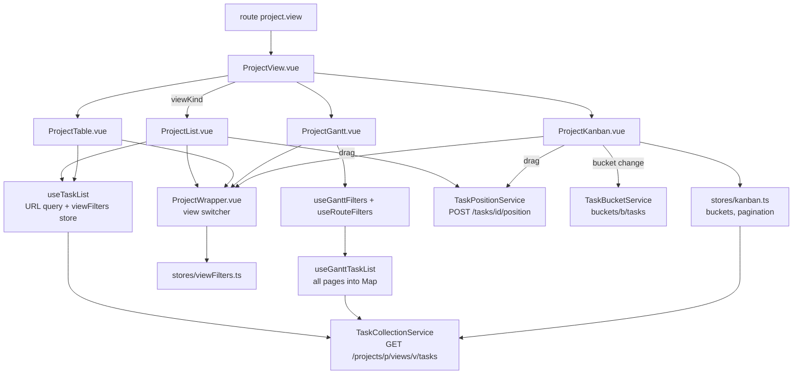

# Project views

The project shell (`views/project/ProjectView.vue` + `components/project/ProjectWrapper.vue`) and the four view kinds it renders: list, table, gantt, kanban. Also the project settings modals and the project list/create/info views. Everything under `frontend/src/`; verified 2026-09-16. Backend counterpart: [models-views-and-kanban](../backend/models-views-and-kanban.md).

## Responsibility

- Owns: resolving `/projects/:projectId/:viewId` to a view component, remembering the last view per project, the view switcher, per-view filter/sort/page state in the URL and localStorage, task ordering (positions) and kanban bucket membership, project settings modals.
- Does not own: the project map (`stores/projects.ts`), the loaded board (`stores/kanban.ts`), the task document (`TaskDetailView.vue`, see [task-detail](./task-detail.md)), the filter DSL transform (`helpers/filters.ts`, see [filters-and-quick-add](./filters-and-quick-add.md)).

## Entry points and public API

| Entry | Where | Called by |
|---|---|---|
| `project.index` (`/projects/:projectId`) | `router/index.ts` redirect → `helpers/projectView.ts` `getProjectViewId(projectId)` (localStorage `projectView`) → `project.view` with `viewId ?? 0` | sidebar, breadcrumbs, `task.detail` back link |
| `project.view` (`/projects/:projectId/:viewId`) | `views/project/ProjectView.vue` (props `projectId`, `viewId`) | router; kept alive by `components/home/ContentAuth.vue` `<keep-alive :include="['project.view']">` |
| `project.settings.{edit,background,duplicate,share,webhooks,delete,archive,views}` | `views/project/settings/ProjectSettings*.vue`, all `meta.showAsModal` | `components/project/ProjectSettingsDropdown.vue` |
| `projects.index`, `project.create`, `project.createFromParent` | `views/project/ListProjects.vue`, `NewProject.vue` | navigation |
| `useTaskList(projectIdGetter, viewIdGetter, sortByDefault, expandGetter)` | `composables/useTaskList.ts` | `ProjectList.vue`, `ProjectTable.vue` |
| `useGanttFilters(route, projectId, viewId)` | `views/project/helpers/useGanttFilters.ts` | `ProjectGantt.vue` |
| `calculateItemPosition(before, after)` | `helpers/calculateItemPosition.ts` | list drag, kanban task and bucket drag, `ProjectSettingsViews.vue` view reorder |

## Key types and functions

### Shell

| Item | File | What it does |
|---|---|---|
| `ProjectView.vue` | `views/project/ProjectView.vue` | Watches `props.projectId`: `ProjectService.get` → `projectStore.setProject` (only the store; the base store is fed by a second deep watcher on `[currentProject, viewId]` calling `baseStore.handleSetCurrentProject`). `redirectToDefaultViewIfNecessary()` runs when `viewId === 0` or the view is unknown: picks `authStore.settings.frontendSettings.defaultView` by `viewKind` unless it is `DEFAULT_PROJECT_VIEW_SETTINGS.FIRST`, falls back to `views[0]`, `router.replace`. `watchEffect`s: `saveProjectToHistory` (only while authenticated), `saveProjectView(projectId, viewId)`, `baseStore.setCurrentProjectViewId(viewId)`. Renders exactly one of `ProjectList`/`ProjectGantt`/`ProjectTable`/`ProjectKanban` by `currentView.viewKind`. |
| `ProjectWrapper.vue` | `components/project/ProjectWrapper.vue` | View switcher: inline buttons, or a `Dropdown` when `useResizeObserver` detects overflow; `getViewRoute(view)` attaches `viewFiltersStore.getViewQuery(view.id)` so switching tabs keeps filters. `getViewTitle` translates the four default titles. Shows the archived warning and `useTitle`. Slots: `#header` (filter/sort popups), default (hidden while `isLoadingProject`). |
| `ProjectSettingsDropdown.vue` | `components/project/` | Three menus: saved filter (`filter.settings.*`), archived (unarchive only), regular (edit, views, background if `configStore.enabledBackgroundProviders` non-empty, share, duplicate, archive, `Subscription`, webhooks, create child, delete only for `maxPermission === ADMIN` or `forceAllActions`). Archive and delete are disabled for `authStore.settings.defaultProjectId`. |
| `helpers/projectView.ts` | `saveProjectView`, `getProjectViewId` | localStorage key `projectView`: `{[projectId]: viewId}`. |
| `modules/projectHistory.ts` | `getHistory`, `saveProjectToHistory`, `removeProjectFromHistory` | Recent projects for `Home.vue`. |

### List and table

| Item | Notes |
|---|---|
| `useTaskList` (`composables/useTaskList.ts`, 274 lines) | URL is the source of truth: `useRouteQuery` for `page`, `filter`, `s`, `sort` (`field:order,...`, validated against `VALID_SORT_FIELDS`, `parseSortQuery`/`serializeSortBy`). `buildStoredQuery` builds the object persisted in `viewFiltersStore` (only non-default values). On view change with an empty URL the stored query is restored with `router.replace`, and `pendingQueryRestore` suppresses the load until that navigation settles. `formatSortOrder` always moves `id` last. A search (`s`) without an explicit sort sends empty `sort_by` so relevance ranking engages. `loadTasks(resetBeforeLoad)` uses a `requestId` to drop stale responses. Loads via `TaskCollectionService.getAll({projectId, viewId}, {...params, filter_timezone, expand}, page)` → `GET /projects/{p}/views/{v}/tasks`. |
| `useTaskListFiltering.ts` → `shouldShowTaskInListView(task, all)` | Hides a subtask only when its parent is in the same result set (it renders nested under the parent); cross-project subtasks stay visible. |
| `ProjectList.vue` (431 lines) | `useTaskList(..., {position: 'asc'}, expand)`; `expand` drops `subtasks` for the favorites pseudo project (`projectId === -1`). Drag with `zhyswan-vuedraggable` (`group: {name: 'tasks', put: false}`, disabled unless `canDragTasks && isPositionSorting`; touch devices use the `.handle` element and no delay). `saveTaskPosition`: first `useTaskDragToProject.handleTaskDropToProject` (drop on a sidebar project), then resolve the moved task **by id from `e.item.dataset.taskId`** (the DOM index is unreliable), `calculateItemPosition(before, after)`, `TaskPositionService.update` → `POST /tasks/{id}/position`. `updateTaskList(newTasks)` after add: reload when not sorted by position, else prepend. `updateTasks(updatedTask)` reloads for pseudo projects (`projectId < 0`). J/K/Enter roving focus through `taskRefs` and `SingleTaskInProject.focus()/click()`. `canWrite = maxPermission > READ && id > 0`; `canMarkAsDone` also for pseudo projects. |
| `ProjectTable.vue` (521 lines) | `useStorage('tableViewColumns')` and `useStorage('tableViewSortBy')` (default `{index: 'desc'}`); `sort(property, event)` supports multi-column with Ctrl/Meta; `setActiveColumnsSortParam` only sends sort keys whose column is visible (`camelCase(prop)`). Rows link to `task.detail` without modal state (TODO at line 477). Columns: index, done, project, title (with `TaskGlanceTooltip`), priority, labels, assignees, comment count, due/start/end/done_at/created/updated (`DateTableCell`), percent done, created by. |
| `partials/SortPopup.vue` | `v-model: SortBy` with a single `field:order` option list; `position:asc` is "manual". |
| `partials/FilterPopup.vue` → `partials/Filters.vue` | `FilterPopup` holds a local copy and emits on "show results"; `Filters.change(event)` decides between blur and immediate mode via `changeImmediately`, runs `transformFilterStringForApi` with label and project resolvers, and routes plain text (no filter tokens, `hasFilterQuery`) into `s` instead of `filter`. `filterFromView` shows the view's own filter read from `projectStore`. |

### Gantt

| Item | Notes |
|---|---|
| `ProjectGantt.vue` (201 lines) | Date range (`DateRangeInput`), "show tasks without dates", reset button, `GanttChart` + `TaskForm` (only `canWrite`). `addGanttTask` creates with today → today+7 days. Receives `route` as a **prop** from `ProjectView.vue` because in modal mode the current route is the task. |
| `views/project/helpers/useGanttFilters.ts` | `GanttFilters {projectId, viewId, dateFrom, dateTo, showTasksWithoutDates}`; defaults today-15 to today+55 days. `ganttRouteToFilters` / `ganttFiltersToRoute` (both marked `// FIXME: use zod for this`, lines 43 and 58) map to query `dateFrom`, `dateTo` (kebab dates), `showTasksWithoutDates`. `ganttFiltersToApiParams` builds a four-clause date-range filter with `filter_include_nulls`, `sort_by: ['start_date','done','id']`, `expand: 'subtasks'`. Persists the query into `viewFiltersStore` like `useTaskList`. Composes `useRouteFilters` + `useGanttTaskList`. |
| `composables/useRouteFilters.ts` | Generic two-way sync between a `filters` ref and the route (`routeToFilters`, `filtersToRoute`, `routeAllowList`), `hasDefaultFilters` via `fast-deep-equal`. |
| `views/project/helpers/useGanttTaskList.ts` | `// FIXME: unify with general useTaskList` (line 24). Loads **all pages** recursively into a `Map<id, ITask>`, watches `filters` deep, mirrors `taskStore.lastUpdatedTask` into the map, `addTask` via `TaskService.create`, `updateTask` optimistic with `klona` rollback and hard-coded English toasts (`success('Saved')`). |
| `components/gantt/GanttChart.vue` (842 lines) | Props `filters`, `tasks: Map`, `isLoading`, default dates; emits `update:task`. Builds rows from `helpers/ganttTaskTree.ts` `buildGanttTaskTree` (parent/subtask nesting via `relatedTasks`, `MAX_INDENT_LEVEL = 4`, derived dates for parents), collapse state per parent, `barPositions` → `helpers/ganttRelationArrows.ts` `buildRelationArrows` (only `blocking` and `precedes`, arrows to a collapsed ancestor). Pointer drag/resize (`startDrag`, `startResize`, `dragState`) and keyboard focus (`handleFocusChange`, `handleEnterPressed`); `updateGanttTask` rounds with `roundToNaturalDayBoundary` and emits. Day width from a `ResizeObserver` (`DAY_WIDTH_PIXELS_MIN = 30`). |
| `components/gantt/*` | `GanttChartBody`, `GanttRow`, `GanttRowBars` (bar geometry, resize handles, drag preview), `GanttTimelineHeader` (uses `useGlobalNow`), `GanttVerticalGridLines`, `GanttRelationArrows`, `primitives/*` (headless bar/row/chart). `composables/useGanttBar.ts` holds `GanttBarModel` and keyboard resize (`changeSize`). |

### Kanban

| Item | Notes |
|---|---|
| `ProjectKanban.vue` (1141 lines) | Outer `draggable` over `kanbanStore.buckets` (`group="buckets"`, disabled unless `canWrite` or while a new-task input is focused); inner `draggable` per bucket over `bucket.tasks` (`group: {name: 'tasks', put: shouldAcceptDrop(bucket) && !dragBucket}`). `DRAG_OPTIONS` delay 1000 ms (300 ms on touch, `.handle` required). Filters: `useRouteQuery('filter')`/`('s')` only, no sort; the watcher on `{params, projectId, viewId}` calls `getCollapsedBucketState` and `kanbanStore.loadBucketsForProject`. Infinite scroll per bucket through `handleTaskContainerScroll` → `loadNextTasksForBucket` when within 25 % of the bottom (`MIN_SCROLL_HEIGHT_PERCENT`). |
| `canWrite` | `baseStore.currentProject.maxPermission > READ && view.bucketConfigurationMode === 'manual'`; `canCreateTasks` additionally `projectId > 0`. Filter-configured buckets are read-only on the board. |
| `updateTaskPosition(e)` | Sidebar drop first (`useTaskDragToProject`), then: target bucket from `e.to.dataset.bucketIndex`, moved task **by id**, `calculateItemPosition(before, after)`; adjusts both bucket `count`s optimistically; `TaskPositionService.update` (`POST /tasks/{id}/position`), then if the bucket changed `TaskBucketService.update` → v1 `POST /projects/{p}/views/{v}/buckets/{b}/tasks` (`pkg/routes/routes.go:971`; the same operation is `PUT` on v2, `pkg/routes/api/v2/task_bucket.go:43`, which is what [Data model](../../06-data-model.md#kanban-membership-and-position) describes). The response may return a different `bucketId` (done bucket rules) and a `bucket`; both are applied. If the first two tasks would both be `0`, the second one is re-positioned through `taskStore.update`. |
| Bucket operations | `createNewBucket` (`BucketModel`), `deleteBucketModal`/`deleteBucket` (refuses when `buckets.length <= 1`), `saveBucketTitle` (contenteditable `h2`, `focusBucketTitle` defers editability so the header can still be dragged), `setBucketLimit` (debounced 2.5 s, `saveBucketLimit`), `updateBucketPosition` (by `data-bucket-id`), `toggleDefaultBucket`/`toggleDoneBucket` (`ProjectViewService.update` then `projectStore.setProject` with the replaced view). Limit display: `count/limit` or count when `alwaysShowBucketTaskCount`; `is-max` class at the limit; add button disabled at the limit. |
| Collapse | `helpers/saveCollapsedBucketState.ts`: localStorage `collapsedBuckets` `{[projectId]: {[bucketId]: true}}`; false entries are pruned. |
| `KanbanCard.vue` | Emits `taskCompletedRecurring`; `handleRecurringTaskCompletion` reloads the board for saved filters whose filter mentions a date field. |
| `useTaskDragToProject` (`composables/`) | `handleTaskDropToProject(e, onSuccess)` finds `[data-project-id]` under the pointer (`document.elementsFromPoint`) and moves `taskStore.draggedTask` there. |
| `helpers/calculateItemPosition.ts` | `MIN_POSITION_SPACING = 0.01` (matches the backend). No neighbours → 0; only after → `after / 2`; only before → `before + 2^16`; both → midpoint; equal neighbours → `after + 0.01`. |

### Settings modals and project pages

| View | Data path |
|---|---|
| `ProjectSettingsEdit.vue` | `useProject(() => props.projectId)` → `save()` (`projectStore.updateProject`), then `baseStore.handleSetCurrentProject`, `router.back()`. Parent chosen with `ProjectSearch`; `null` parent saves `parentProjectId = 0`. |
| `ProjectSettingsBackground.vue` (310) | `BackgroundUnsplashService.getAll/thumb/update`, `BackgroundUploadService.create`, `ProjectService.removeBackground`; each result goes through `baseStore.handleSetCurrentProject({project, forceUpdate: true})` and `projectStore.setProject`. Providers gated by `configStore.enabledBackgroundProviders`. |
| `ProjectSettingsDuplicate.vue` | `useProject().duplicateProject(parentId, duplicateShares)`. |
| `ProjectSettingsShare.vue`, `ProjectSettingsWebhooks.vue` | Load the project themselves with `ProjectService.get` and set it current; render `LinkSharing`/`UserTeam` or `WebhookManager` (`WebhookService`). Admin-only parts keyed on `maxPermission === ADMIN`. |
| `ProjectSettingsDelete.vue` | Counts tasks with `TaskService.getAll({}, {filter: 'project in <ids>'})` over the project and its children, then `projectStore.deleteProject`, `router.push({name: 'home'})`. |
| `ProjectSettingsArchive.vue` | `projectStore.updateProject({...project, isArchived: !isArchived})`, `baseStore.setCurrentProject`, `loadAllProjects`, `router.back()`. |
| `ProjectSettingsViews.vue` (248) + `components/project/views/ViewEditForm.vue` (425) | `ProjectViewService` (`/projects/{p}/views[/{id}]`) create/update/delete/reorder (`calculateItemPosition`), results written back with `projectStore.setProjectView`/`removeProjectView`. `ViewEditForm` converts the view filter and each `bucketConfiguration[].filter` between API ids and titles (`transformFilterStringFromApi`/`ForApi`, waits for labels via `useLabels().isPending`), forces `bucketConfigurationMode: 'none'` for non-kanban kinds and `'manual'` when switching to kanban. |
| `ListProjects.vue`, `partials/ProjectCardGrid.vue`, `partials/ProjectCard.vue` | `projectStore.projectsArray`, `useStorage('showArchived')`; cards use `useProjectBackground`. |
| `NewProject.vue`, `ProjectInfo.vue` | `projectStore.createProject` (router push to `project.index` happens in the store); `ProjectInfo` sanitizes the description with DOMPurify and forces `rel="noopener noreferrer"` on `target` links. |

## Internal structure

Task rows are `SingleTaskInProject.vue` (list) and `KanbanCard.vue` (kanban); both write through `taskStore.update`, which calls `kanbanStore.ensureTaskIsInCorrectBucket` ([stores](./stores.md#task-srcstorestasksts)).

## Dependencies

- **Uses:** `stores/{base,projects,kanban,tasks,auth,config,viewFilters}`, legacy services `TaskCollectionService`, `TaskService`, `TaskPositionService`, `TaskBucketService`, `BucketService`, `ProjectService`, `ProjectViewService`, `SavedFilterService`/`useSavedFilter`, `WebhookService`, background services; `zhyswan-vuedraggable`; `@vueuse/router` `useRouteQuery`; `helpers/filters.ts`.
- **Used by:** the router, `ContentAuth.vue` (keep-alive), `TaskDetailView.vue` (modal renders over these routes via `useRouteWithModal`), `Home.vue` (`ProjectCardGrid`).

## Invariants and assumptions

- `project.view` is kept alive, so `ProjectList`/`ProjectTable` instances survive navigation between projects and views. `useTaskList` therefore tracks `lastSyncedViewId` and re-reads the stored query on view change; any new per-view state must be keyed by `viewId`, not initialised once in `setup`.
- Drag handlers must resolve the moved item by `data-task-id` / `data-bucket-id`, never by `e.newIndex` (comments in `ProjectList.saveTaskPosition`, `ProjectKanban.updateTaskPosition`, `updateBucketPosition`: transition-group leavers shift DOM indices).
- Position updates go to `POST /tasks/{id}/position` with `projectViewId`; positions are per view ([Data model](../../06-data-model.md#kanban-membership-and-position)). Bucket membership is a separate call to the buckets/tasks endpoint, never a `task.bucketId` update.
- Kanban filters have no sort; `loadNextTasksForBucket` forces `sort_by: ['position']`. Kanban `canWrite` depends on `bucketConfigurationMode === 'manual'`.
- `viewFiltersStore` only restores when the URL query is empty; the URL always wins (`useTaskList` watcher, `ProjectWrapper.getViewRoute`).
- `ProjectView.vue` must not set `baseStore.currentProject` directly from the load watcher (comment at lines 56-58); the deep watcher on `[currentProject, viewId]` does it so store updates from elsewhere propagate.
- Saved filters (`projectId < -1`) and favorites (`-1`) reuse these views: `FilterPopup` is hidden for them, `ProjectList` reloads on every task update, kanban `canCreateTasks` is false.
- `calculateItemPosition` must keep `MIN_POSITION_SPACING` in sync with the backend constant.

## Configuration

Client-side only:

| Key | Set by | Read by |
|---|---|---|
| `localStorage.projectView` | `ProjectView.vue` → `saveProjectView` | router `project.index` redirect |
| `localStorage.viewFilters` | `useTaskList`, `useGanttFilters` | `useTaskList`, `ProjectWrapper` |
| `localStorage.tableViewColumns`, `tableViewSortBy` | `ProjectTable.vue` | same |
| `localStorage.collapsedBuckets` | `ProjectKanban.vue` | same |
| `localStorage.showArchived` | `ListProjects.vue` | same |
| user `frontendSettings.defaultView`, `alwaysShowBucketTaskCount`, `defaultProjectId` | settings | `ProjectView.vue`, `ProjectKanban.vue`, `ProjectSettingsDropdown.vue` |
| `window.DEBUG_TASK_POSITION` | manual | `KanbanCard.vue` shows positions |

## Error handling

- `useTaskList.loadTasks` catches and toasts via `error(e)`; `useGanttTaskList.updateTask` toasts English strings and rolls back; kanban store actions throw and `ProjectKanban.vue` mostly lets the global handler toast.
- Bucket limit violations are prevented client-side (`shouldAcceptDrop`, disabled add button); the server still enforces `ErrCodeBucketLimitExceeded 10004`.
- `ProjectView.vue` does not handle a failed `ProjectService.get` beyond `finally { loadedProjectId = id }`; a 403/404 surfaces as a toast and an empty shell (Unverified: no redirect to `not-found` was found in this file).

## Tests

Unit (`pnpm vitest run <path>` in `frontend/`):

| File | Covers |
|---|---|
| `composables/useTaskList.test.ts` (259) | `buildStoredQuery`, relevance sort suppression, stored-query restoration, page reset |
| `composables/useRouteFilters.test.ts`, `views/project/helpers/useGanttFilters.test.ts`, `useGanttTaskList.test.ts` | type inference and query sync; task list is only type-checked |
| `helpers/ganttTaskTree.spec.ts`, `ganttRelationArrows.spec.ts`, `calculateTaskPosition.test.ts` | pure helpers |
| `components/project/views/ProjectKanban.test.ts` | `updateBucketPosition` saves by id and ignores a gone bucket; mocks all stores and `vue-router` |
| `ProjectList.test.ts`, `ProjectWrapper.test.ts`, `ViewEditForm.test.ts`, `gantt/GanttChart.test.ts`, `settings/ProjectSettingsArchive.test.ts`, `ProjectSettingsBackground.test.ts` | as named |

E2E (`frontend/tests/e2e/project/`, run through the `run-e2e-tests` skill; see [testing-infrastructure](./testing-infrastructure.md)):

| Spec | Tests | Scenario |
|---|---|---|
| `project.spec.ts` | 7 | create, redirect to the last visited view, rename everywhere, delete, archive, projects page with and without archived |
| `project-view-list.spec.ts` | 13 | empty state, single and multiline/indented create, read-only share, pagination (and no negative page), cross-project vs same-project subtasks, `?filter=` and `?s=` |
| `project-view-table.spec.ts` | 5 | table renders, column switches, title navigates, `?filter=`, `?s=` |
| `project-view-gantt.spec.ts` | 10 | week start, tasks with/without dates, drag a bar, date range in the query both ways, double-click opens the modal, range survives the modal |
| `project-view-kanban.spec.ts` | 20 | buckets render, add task, create/rename/delete bucket, limit, drag, recurring task on done bucket returns to default, move to another project removes the card, description icon rules, `?filter=`/`?s=`, count display variants |
| `filter-persistence.spec.ts`, `sort-persistence.spec.ts` (#2753) | 4, 2 | `viewFilters` round trips |
| `project-history.spec.ts`, `project-sidebar-drag-handle.spec.ts`, `parent-project-clear.spec.ts`, `saved-filter-favorite.spec.ts`, `saved-filter-subtasks.spec.ts`, `webhooks.spec.ts` | 3, 1, 2, 3, 2, 4 | as named |

Not covered by unit tests: `ProjectView.vue`, `ProjectTable.vue`, `ProjectSettingsViews.vue`, kanban task drag between buckets (e2e only).

## Gotchas and tech debt

- `ProjectKanban.vue:778` `// TODO: fix type` on `updateBucketPosition(e)`; `:1125` `// FIXME: This does not seem to work` (`.task-dragging` rotate style).
- `ProjectTable.vue:477` and `SingleTaskInProject.vue:303` `// TODO: re-enable opening task detail in modal`: list and table open the detail as a page, kanban and gantt open it as a modal (`state: {backdropView}`). `useRouteWithModal.closeModal` has project-specific logic that assumes a `/projects/
/<v>` back entry.
- `useGanttFilters.ts:43,58` FIXME use zod (also `modelSchema/common/repeats.ts` is dead code, see [Known issues](../../13-known-issues.md)); `useGanttTaskList.ts:24` FIXME unify with `useTaskList`.
- `ProjectWrapper.vue:263` FIXME: archived-warning margin should be a `Message` prop.
- `ProjectGantt.vue` imports `useGanttFilters` with a relative `../../../views/...` path instead of `@/`.
- Git history (`git log --follow`, `fix` subjects): `ProjectKanban.vue` 112 of 241 commits, `ProjectList.vue` 72 of 203. Recurrent causes: DOM index vs id after drag, counts drifting after moves, saved filter boards not reloading, touch drag delays.
- Two filter UIs: `Filters.vue` here and `FilterInput`/`FilterAutocomplete` under `components/input/filter/`; view filters in `ViewEditForm.vue` duplicate the transform logic of `Filters.vue`.

## Related pages

- [stores](./stores.md), [task-detail](./task-detail.md), [filters-and-quick-add](./filters-and-quick-add.md), [bootstrap-and-routing](./bootstrap-and-routing.md), [sharing-teams-labels-notifications](./sharing-teams-labels-notifications.md), [testing-infrastructure](./testing-infrastructure.md)
- Backend: [models-views-and-kanban](../backend/models-views-and-kanban.md), [models-filtering-and-search](../backend/models-filtering-and-search.md), [models-tasks](../backend/models-tasks.md)
- [Data flows](../../10-data-flows.md) (kanban move), [Data model](../../06-data-model.md), [Known issues](../../13-known-issues.md)
- Playbook: [build-vue-feature](../../playbooks/build-vue-feature.md)
