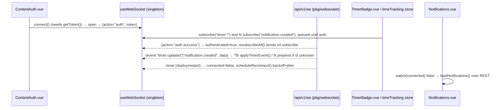

# Realtime and PWA

The parts of the Vue app that talk to the world outside a plain request/response cycle: the WebSocket client that receives server pushes, the service worker and update banner that make the app installable and offline-tolerant, the online/offline gate, and the Sentry error pipeline with its noise filters. Skeleton context: [Frontend architecture](../../04-frontend-architecture.md); the server side of the socket is [websocket](../backend/websocket.md).

## Responsibility

- **Owns:** the single WebSocket connection per tab (`frontend/src/composables/useWebSocket.ts`), its auth/subscribe protocol, reconnect policy, and the subscriber registry; service worker registration and the worker itself (`registerServiceWorker.ts`, `sw.ts`); the PWA manifest (`vite.config.ts` → `VitePWA`); the update, add-to-home-screen, and demo-mode banners; `useOnline`; Sentry initialisation and event filtering; the stale-chunk reload guard.
- **Does not own:** what a pushed event *means*. Consumers apply events to their own state: `stores/timeTracking.ts` for timers, `components/notifications/Notifications.vue` for the bell ([sharing-teams-labels-notifications](./sharing-teams-labels-notifications.md)). Token storage is [auth-and-session](./auth-and-session.md); the socket only reads `getToken()`.

## Entry points and public API

| Entry | Where | Called by |
|---|---|---|
| `useWebSocket()` → `{connect, disconnect, subscribe, connected, authenticated}` | `frontend/src/composables/useWebSocket.ts` | `components/home/ContentAuth.vue:145` (`connect()` at setup), `stores/auth.ts:565` (`disconnect()` first thing in `logout()`), `stores/timeTracking.ts:100`, `components/notifications/Notifications.vue:127` |
| `import './registerServiceWorker'` | `frontend/src/main.ts:16` | side effect at boot, `PROD` only |
| `sw.ts` (built to `sw.js`) | `frontend/src/sw.ts` | browser, via `register-service-worker` |
| `setupSentry(app, router)` | `frontend/src/sentry.ts` | `main.ts:69`, dynamic import guarded by `window.SENTRY_ENABLED` |
| `handleChunkLoadErrors()` | `frontend/src/helpers/handleChunkLoadErrors.ts` | `main.ts:61`, before the app is created |
| `useOnline()` | `frontend/src/composables/useOnline.ts` | `components/misc/Ready.vue:71` only |
| `UpdateNotification`, `AddToHomeScreen`, `DemoMode` | `frontend/src/components/home/*.vue` | `App.vue:35-38`, hidden in quick-add mode |

## Key types and functions

| Name | File | What it does |
|---|---|---|
| module-level `socket`, `subscriptions: Map<string, Set<MessageCallback>>`, `connected`, `authenticated`, `manuallyDisconnected`, `reconnectAttempt` | `useWebSocket.ts:18-24` | Singleton state; `useWebSocket()` returns the same closures every time, refs are exposed `readonly` |
| `getWebSocketUrl()` | `useWebSocket.ts:26` | `window.API_URL` with `http(s)` → `ws(s)` plus `/ws`, so the socket follows the **v1** base URL (`/api/v1/ws`); the backend mounts the same handler on `/api/v2/ws` too (`pkg/routes/routes.go:490,521`) |
| `connect()` | `useWebSocket.ts:117` | No-op without a token or while OPEN/CONNECTING; on `open` sends `{action:'auth', token}` and resets the backoff |
| `handleMessage()` | `useWebSocket.ts:51` | `auth.success` → `authenticated = true` and `resubscribeAll()`; `invalid_token`/`auth_required` are **terminal** (sets `manuallyDisconnected`, closes, no reconnect); otherwise routes `msg.event` to subscribers |
| `scheduleReconnect()` | `useWebSocket.ts:91` | Exponential `1000 * 2^attempt` capped at 30 s, then ±25 % jitter; skipped when `manuallyDisconnected` |
| `subscribe(event, cb)` → unsubscribe fn | `useWebSocket.ts:176` | Adds to the map; only sends `subscribe` on the wire if already authenticated (the rest is replayed after `auth.success`); the last unsubscriber for an event sends `unsubscribe` |
| `disconnect()` | `useWebSocket.ts:160` | Cancels the timer, closes, **clears every subscription** |
| `isChunkLoadError`, `shouldDropEvent`, `stripNavigationFragment` | `helpers/sentryFilters.ts` | Pure filters used by both `sentry.ts` and `handleChunkLoadErrors.ts` |
| `canReloadForChunkLoadError`, `markChunkLoadErrorReload` | `helpers/handleChunkLoadErrors.ts` | 60 s cooldown in `sessionStorage` (`chunkLoadErrorReloadedAt`) so a broken deploy cannot reload forever |

## Internal structure

### WebSocket protocol

Backend contract (`pkg/websocket/connection.go`): first message must be `{action:"auth", token}` within `authTimeout = 30s` or the server closes with a policy violation; the server answers `{action:"auth.success", success:true}` or `{error:"invalid_token"}` and closes. `subscribe`/`unsubscribe` before auth get `{error:"auth_required"}`; an unknown event gets `{error:"invalid_event"}`. Allowed events are the `validEvents` map (`connection.go:265`): `notification.created`, `timer.created`, `timer.updated`, `timer.deleted`. Pushes are `{event, data}` fanned out per user by `Hub.PublishForUser` from the bridges in `pkg/websocket/listener.go` (`RegisterListeners`). Server pings every 30 s (`pingInterval`). Details: [websocket](../backend/websocket.md).

### Consumers

| Consumer | Events | Behaviour on data | Fallback |
|---|---|---|---|
| `stores/timeTracking.ts` → `subscribeToTimerEvents()` (called from `components/time-tracking/TimerBadge.vue:69` `onMounted`, unsubscribed `onUnmounted`) | `timer.created/updated/deleted` | `applyTimerEvent` patches `browsedEntries` in place and sets/clears `activeTimer` by `endTime`; `applyTimerDeletion` drops by id. Messages with `data == null` (subscribe acks) are ignored | `hydrateActiveTimer()` on mount, gated on `PRO_FEATURE.TIME_TRACKING` |
| `components/notifications/Notifications.vue` | `notification.created` | Prepends a `NotificationModel` unless the id is already loaded | `POLL_INTERVAL = 10000` ms `setInterval` that only fetches when `!wsConnected && document.visibilityState === 'visible'`; also refetches on the `connected` true→false edge |

The `authenticated` ref is exported but no consumer outside the composable reads it (grep on 2026-09-16); only `connected` is consumed.

### Service worker and updates

- `registerServiceWorker.ts` registers `<base>sw.js` in `PROD` builds only (`getFullBaseUrl()` guarantees a trailing slash). The `updated` hook dispatches `document` event `swUpdated` with the registration.
- `sw.ts` is built by `VitePWA` in `injectManifest` mode (`vite.config.ts:166`, `injectRegister: false`, `useCredentials: true`). It `importScripts` the copied Workbox runtime (`package.json` → `build: vite build && workbox copyLibraries dist/`, version injected as `__WORKBOX_VERSION__`), precaches `self.__WB_MANIFEST`, then registers two runtime routes: `StaleWhileRevalidate` for `css|json|js|svg|woff2|png|html|txt|wav`, and `NetworkOnly` with `cache: 'no-store'` for `<base>api/v1/.*` (`sw.ts:25`). It handles the `skipWaiting` message and `notificationclick` with action `show-task` (opens `<base>tasks/<id>`), then `clientsClaim()`.
- `UpdateNotification.vue` listens once for `swUpdated`, sets `baseStore.setUpdateAvailable(true)`; clicking posts `skipWaiting` to `registration.waiting` and sets `refreshing`, so the following `controllerchange` reloads. The `refreshing` guard exists because `clientsClaim()` fires `controllerchange` on first install too (comment at `UpdateNotification.vue:32-35`).
- `AddToHomeScreen.vue` shows on narrow screens unless `localStorage.hideAddToHomeScreenMessage` or `display-mode: standalone`; it shifts up 4 rem when the update banner is visible.
- `DemoMode.vue` shows a red banner when `configStore.demoModeEnabled` (from `/info`).
- `useOnline.ts` wraps `@vueuse/core` `useOnline`; when offline and `VITE_IS_ONLINE` is truthy it returns a fake `ref(true)` (for testing the offline screen). `Ready.vue` renders the offline page instead of the app when it is false.

### Sentry

`sentry.ts` is lazy-imported only when the served `index.html` sets `window.SENTRY_ENABLED` (template in `pkg/routes/static.go:48-49`, from `sentry.frontend*` config). It initialises `@sentry/vue` with browser tracing on the router, session replay (`slowClickTimeout: 0` to suppress rage-click issues), an offline transport, `denyUrls` for browser extensions, `beforeSend → shouldDropEvent`, `beforeSendSpan → stripNavigationFragment`, and a capturing `error` listener that reports failed ``/`<link>` loads as warnings. `shouldDropEvent` drops: chunk-load and stale-chunk fallout messages, third-party injection messages, exceptions whose top frame is an extension URL, empty events, `Promise.reject({})`, and any `AxiosError` or `{code, message}` object up to ten `cause` levels deep. Release is `vikunja-frontend@<VERSION>` from `src/version.json`.

`getSentryConfig` in `vite.config.ts:30` has `disable: true` hard-coded, so the source-map upload plugin never runs even with `SENTRY_AUTH_TOKEN`; the token only turns on `build.sourcemap`.

## Dependencies

- **Uses:** `@/helpers/auth` (`getToken`), `window.API_URL`, `@vueuse/core`, `register-service-worker`, `workbox-precaching` + `workbox-cli`, `vite-plugin-pwa`, `@sentry/vue`, `axios` (type check in `sentryFilters.ts`), `stores/base` (`updateAvailable`), `stores/config` (`demoModeEnabled`).
- **Used by:** `App.vue`, `ContentAuth.vue`, `stores/auth.ts`, `stores/timeTracking.ts`, `Notifications.vue`, `Ready.vue`.

## Invariants and assumptions

- One socket per tab. `connect()` is idempotent and `ContentAuth.vue` calls it at setup; nothing else should create a `WebSocket`.
- `subscribe()` may be called before auth; `resubscribeAll()` replays the map after `auth.success` and after every reconnect. `disconnect()` clears the map, so components that survive a logout/login must subscribe again (Notifications and TimerBadge remount, which does this).
- `invalid_token`/`auth_required` stop reconnecting for the rest of the page life; only a fresh `connect()` (next `ContentAuth` mount) resets `manuallyDisconnected`. A refreshed JWT is not re-sent on an open socket; the server keeps the connection authenticated until it closes.
- Every event name must be in the backend `validEvents` map **and** bridged by a listener in `pkg/websocket/listener.go`; see the coupling table in [Conventions](../../08-conventions.md#if-you-change-x-you-must-also-change-y).
- The `NetworkOnly` rule in `sw.ts` matches only `api/v1/`; `/api/v2/` responses fall through to the browser's default fetch (not the `StaleWhileRevalidate` rule, whose regex needs a file extension). Unverified: whether any v2 JSON URL ends in an extension that would match the asset rule.
- `handleChunkLoadErrors()` must run before Sentry so the reload happens first; `shouldDropEvent` then hides the fallout.

## Configuration

| Key | Where | Effect |
|---|---|---|
| `sentry.frontendenabled`, `sentry.frontenddsn` (backend config, `pkg/config/config.go:79-80`) | `pkg/routes/static.go:88-92` → `window.SENTRY_ENABLED/DSN` | Enables the lazy Sentry import; the DSN default points at Vikunja's own Sentry project |
| `VITE_IS_ONLINE` (build env) | `useOnline.ts:7` | Fakes online state while offline |
| `VIKUNJA_FRONTEND_BASE` (build env) | `vite.config.ts:111`, `getFullBaseUrl()` | Base path for `sw.js`, Workbox libs, API pattern |
| `SENTRY_AUTH_TOKEN` (build env) | `vite.config.ts:254` | Only enables source maps; upload plugin is disabled |

## Error handling

- Unparseable socket frames: `console.warn`, dropped. Auth errors: `console.warn` and terminal close. Connection failures: silent reconnect with `console.debug`.
- Notifications initial REST load failure is caught so WS subscription and polling still start (`Notifications.vue:150-157`).
- Service worker registration errors go to `console.error` only.
- Sentry: extension/chunk/request errors are dropped deliberately; request errors are already shown as toasts by `src/message` ([Frontend architecture](../../04-frontend-architecture.md#errors-to-the-user)).

## Tests

| Test | Covers | Run |
|---|---|---|
| `frontend/src/helpers/sentryFilters.test.ts` (23 cases) | every drop rule and `stripNavigationFragment` | `cd frontend && pnpm vitest run src/helpers/sentryFilters.test.ts` |
| `frontend/src/sentry.test.ts` | image-load capture, skipping blank/fragment `src` | `pnpm vitest run src/sentry.test.ts` |
| `frontend/src/helpers/handleChunkLoadErrors.test.ts` | reload cooldown | `pnpm vitest run src/helpers/handleChunkLoadErrors.test.ts` |
| `frontend/src/stores/timeTracking.test.ts` | store reconciliation incl. `hydrateActiveTimer` | `pnpm vitest run src/stores/timeTracking.test.ts` |
| `frontend/tests/e2e/websocket/protocol.spec.ts` (11 tests) | raw protocol: auth, timeout, double auth, subscribe/unsubscribe, delivery, doer exclusion, multi-connection | `VIKUNJA_E2E_API_PORT=3456 mage test:e2e "tests/e2e/websocket"` |
| `frontend/tests/e2e/websocket/frontend.spec.ts` (3), `comment-notification.spec.ts` (1) | bell badge and dropdown update in real time; UI after logout; mention notification | same |

Not covered at unit level: `useWebSocket.ts` itself (backoff, terminal errors, resubscribe), `sw.ts`, `UpdateNotification.vue`. `App.test.ts` and the `auth.*.test.ts` files mock `useWebSocket`. The logout e2e test only checks the bell disappears, not that the socket closed.

## Gotchas and tech debt

- PWA manifest `shortcuts` point at dead routes `/namespaces`, `/tasks/by/week`, and `/tasks/by/month` (`vite.config.ts:197-216`); the router only has `/tasks/by/upcoming` (`src/router/index.ts:225`). `/` and `/teams` still exist.
- `sw.ts:66-67` precaches twice: `precacheAndRoute(self.__WB_MANIFEST)` (line 15, the injectManifest slot) and a legacy `self.__precacheManifest` block that is always empty.
- Top-level `output.manualChunks` for `sentry` in `vite.config.ts:246` sits outside `build.rollupOptions`; Unverified whether Rollup honours it (flagged in [Known issues](../../13-known-issues.md)).
- Socket URL is derived from the v1 API URL, so a deployment that only exposes `/api/v2` would break realtime. Unverified whether such deployments exist.
- `UpdateNotification.vue:63` and `AddToHomeScreen.vue:51`: `// FIXME: We should prevent usage of z-index or at least define it centrally` (both use 5000).
- `ContentAuth.vue:118` `// FIXME: this is really error prone` (route-name based title logic), `:141` `// TODO: Reset the title if the page component does not set one itself`.
- `vite.config.ts:42,50,56`: `// TODO add env`, `// TODO` for Sentry source-map options; the plugin is hard-disabled.
- `sentry.ts:39`: `tracesSampleRate: 1.0` with the SDK's own "adjust in production" comment left in place.

## Related pages

- [auth-and-session](./auth-and-session.md), [stores](./stores.md), [sharing-teams-labels-notifications](./sharing-teams-labels-notifications.md), [bootstrap-and-routing](./bootstrap-and-routing.md)
- [websocket](../backend/websocket.md), [notifications-and-mail](../backend/notifications-and-mail.md), [operations-subsystems](../backend/operations-subsystems.md) (Sentry backend)
- [API contract: realtime channels](../../05-api-contract.md), [Testing guide](../../11-testing-guide.md), [Development workflow](../../07-development-workflow.md)
