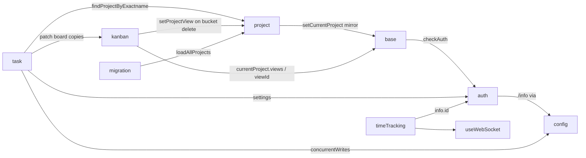

# Pinia stores

Every file in `frontend/src/stores/`. Stores hold UI state and orchestration on top of the legacy service layer; server lists that are plain entity caches are supposed to move to TanStack Query modules instead (see [Frontend architecture](../../04-frontend-architecture.md#state-management)). Verified against the code on 2026-09-16.

## Responsibility

- Owns: app readiness and the "current project" highlight (`base`), the project map and tree (`project`), task mutations plus quick-add orchestration (`task`), the loaded kanban board (`kanban`), the `/info` payload (`config`), timer state (`timeTracking`), import polling (`migration`), per-view filter persistence (`viewFilters`), the session (`auth`).
- Does not own: labels (TanStack Query, `src/client/queries/labels.ts` + `src/composables/useLabels.ts`), per-view task lists for list/table/gantt (`src/composables/useTaskList.ts`, `views/project/helpers/useGanttTaskList.ts`, see [project-views](./project-views.md)), the task detail document itself (`TaskDetailView.vue` keeps its own `ref<ITask>`, see [task-detail](./task-detail.md)).

## Entry points and public API

| Store id | File | Lines | Main consumers (non-test files importing it) |
|---|---|---|---|
| `base` | `src/stores/base.ts` | 232 | 34 files: `App.vue`, `Ready.vue`, `router/index.ts`, `ContentAuth.vue`, `ProjectView.vue`, `ProjectWrapper.vue`, the four project views, `TaskDetailView.vue`, project settings modals |
| `project` | `src/stores/projects.ts` | 418 | 45 files: navigation, `ProjectView.vue`, all settings modals, `ProjectSearch.vue`, `BucketSelect.vue`, `FilterInput.vue`/`FilterAutocomplete.ts`, `Home.vue`, `ShowTasks.vue` |
| `task` | `src/stores/tasks.ts` | 696 | 18 files: `TaskDetailView.vue`, `Heading`, `Description`, `Attachments`, `EditLabels`, `EditAssignees`, `RelatedTasks`, `KanbanCard`, `SingleTaskInProject`, `AddTask.vue`, `ProjectList.vue`, `ProjectKanban.vue`, `QuickActions.vue`, `useTaskDragToProject.ts`, `useGanttTaskList.ts` |
| `kanban` | `src/stores/kanban.ts` | 429 | 3 files: `ProjectKanban.vue`, `BucketSelect.vue`, `TaskDetailView.vue` (plus `tasks.ts`) |
| `config` | `src/stores/config.ts` | 141 | 35 files: router guards, `checkAndSetApiUrl.ts`, login/register, settings views, admin views, `Comments.vue`, `AddTask.vue` |
| `timeTracking` | `src/stores/timeTracking.ts` | 142 | 5 files under `components/time-tracking/`, `views/time-tracking/`, `useTimeTrackingFavicon.ts` |
| `migration` | `src/stores/migration.ts` | 121 | `views/migrate/MigrationHandler.vue`, `MigrationCSV.vue` |
| `viewFilters` | `src/stores/viewFilters.ts` | 28 | `useTaskList.ts`, `useGanttFilters.ts`, `ProjectWrapper.vue` |
| `auth` | `src/stores/auth.ts` | 654 | 56 files; see [auth-and-session](./auth-and-session.md) |
| (helper) | `src/stores/helper.ts` → `setModuleLoading(setter)` | 9 | every store action that toggles `isLoading` |

`setModuleLoading` arms a 100 ms timer before flipping the loading flag to `true` and returns a cancel function that clears the timer and sets `false`; wrap it in `try/finally` as every store does, or the flag sticks.

## Key types and functions

### `base` (`src/stores/base.ts`)

| Item | What it does |
|---|---|
| `ready`, `error`, `loading`, `appReady` | `appReady = hydrateConfig()` runs at store creation: `checkAndSetApiUrl(window.API_URL)` then `authStore.checkAuth()`; on desktop (`isDesktopApp()`) only a stored `localStorage.API_URL` is used. `ready` flips after `router.isReady()`. `loadApp()` re-hydrates when the user changes the API URL in `Ready.vue`. Errors map to `ERROR_NO_API_URL` / `t('apiConfig.error')`. |
| `currentProject`, `currentProjectViewId` | Highlight in the sidebar and the view the kanban store uses to find the done bucket. `setCurrentProject` **keeps the previous `maxPermission`** when the incoming project has none (server updates omit it, and buttons would vanish). |
| `handleSetCurrentProject({project, forceUpdate, currentProjectViewId})` | Loads the background only when the project id changed or `forceUpdate` is set: blurhash via `getBlobFromBlurHash` → `setBlurHash(objectURL)`, then `ProjectService.background()` → `setBackground`. Clears both when `backgroundInformation` is null. `handleSetCurrentProjectIfNotSet` is the id-guarded variant used by `TaskDetailView.vue`. |
| `hasTasks`, `keyboardShortcutsActive`, `quickActionsActive`, `logoVisible`, `updateAvailable` | Plain flags with setters. |
| `...useMenuActive()` | The sidebar state (`menuActive`, `setMenuActive`, `toggleMenu`) is spread from `src/composables/useMenuActive.ts`, which persists the desktop preference in `localStorage.menuActiveDesktopPreference` and auto-closes on mobile route changes. |

All state is exported through `readonly()`; components must call the setters.

### `project` (`src/stores/projects.ts`)

| Item | Endpoint / service | Notes |
|---|---|---|
| `projects` (`{[id]: IProject}`), `projectsArray` (sorted by `position`) | | Saved filters live here too as pseudo projects with negative ids (`id < -1`); `-1` is the favorites pseudo project. |
| `notArchivedRootProjects`, `favoriteProjects`, `savedFilterProjects`, `getChildProjects(id)`, `getAncestors(project)`, `isOrphanedSubProject`, `getEffectiveParentProjectId` | | Orphaned sub-projects (parent not loaded, for example not shared) are shown at root; `getEffectiveParentProjectId` keeps their real parent when saving drag positions. |
| `findProjectByExactname`, `findProjectByIdentifier`, `searchProject`, `searchSavedFilter`, `searchProjectAndFilter` | | Case-insensitive; used by quick-add magic and the filter input. |
| `loadAllProjects()` | `ProjectService.getAll({}, {is_archived: true, expand: 'permissions'}, page)` over every page | Replaces the whole map. Called from `ContentAuth.vue` on mount, after favorites toggle, after position renumbering, after migrations. |
| `loadProject(id)` | `ProjectService.get` | Only fetches when missing; for link shares. |
| `createProject`, `updateProject`, `deleteProject` | `PUT /projects`, `POST /projects/{id}`, `DELETE /projects/{id}` | `updateProject` writes the *input* project to the map, then reloads everything if the server changed `position` (sibling renumbering). `deleteProject` also calls `removeProjectFromHistory`. |
| `toggleProjectFavorite` | `updateProject`, or `SavedFilterService.get` + `update` for filters | Optimistic for saved filters with rollback. |
| `setProject`, `setProjects`, `removeProjectById` (recursive over children) | | `setProject` mirrors into `baseStore.currentProject` when ids match; see the FIXME below. |
| `setProjectView(view)`, `removeProjectView(projectId, viewId)` | | Views are stored inside the project; sorted by `position`. Used by `ProjectSettingsViews.vue`, `kanban.deleteBucket`. |
| `useProject(projectId)` (exported composable, same file) | `ProjectService.get`, `projectStore.updateProject`, `ProjectDuplicateService.create` → `PUT /projects/{projectId}/duplicate` | Reactive single-project editor used by `ProjectSettingsEdit.vue` and `ProjectSettingsDuplicate.vue`; the duplicate gets `maxPermission = ADMIN` client-side. |

### `task` (`src/stores/tasks.ts`)

State: `tasks` (`{[id]: ITask}`, only filled by `loadTasks`), `isLoading`, `draggedTask` (set by list/kanban drag start, consumed by `useTaskDragToProject`), `lastUpdatedTask` (watched by `useGanttTaskList` to sync detail edits into the gantt).

| Action | Layer | Endpoint | Side effects |
|---|---|---|---|
| `loadTasks(params, projectId)` | legacy `TaskService.getAll` or `TaskCollectionService.getAll` when a project id is given | `GET /tasks` or `GET /projects/{p}/tasks` | Fills `filter_timezone` from user settings; sets `baseStore.hasTasks`. Only `ShowTasks.vue` uses it. |
| `update(task)` | legacy `TaskService.update` | `POST /tasks/{id}` | `kanbanStore.ensureTaskIsInCorrectBucket`, sets `lastUpdatedTask`. **This is the single write path for every field edit.** |
| `delete(task)` | legacy | `DELETE /tasks/{id}` | `kanbanStore.removeTaskInBucket` |
| `addTaskAttachment` | none | | Only patches the kanban copy. Unverified: no current caller was found outside the store. |
| `addAssignee` / `removeAssignee` | legacy `TaskAssigneeService` | `PUT /tasks/{t}/assignees`, `DELETE /tasks/{t}/assignees/{u}` | Patches the kanban copy if the task is on the loaded board, otherwise `console.debug` and continue. |
| `addLabel` / `removeLabel` | **generated** `taskLabelsCreate` / `taskLabelsDelete` | v2 task-label routes | Same kanban patching. Labels are the reference "new stack" flow ([Data flows](../../10-data-flows.md)). |
| `ensureLabelsExist(titles)` | `ensureLabels`, `refreshLabels`, `createLabelMutationOptions` from `src/client/queries/labels.ts` | v2 labels | Dedupes titles, refreshes the cache once if something is missing, creates the rest; a failed create (link shares) is skipped, not fatal. `useMutation(..., queryClient)` is passed the client explicitly because the store may be created outside a component. |
| `addLabelsToTask({task, parsedLabels})` | generated | | Runs through `runWrites(..., configStore.concurrentWrites)`. |
| `findProjectId({project, projectId})` | | | Resolution order: quick-add magic name or identifier → passed id → `router.currentRoute.params.projectId` → throw `Error('NO_PROJECT')`. |
| `buildTaskFromQuickAddTitle` | `parseTaskText` from `src/modules/quickAddMagic`, `ProjectUserService.getAll` for assignees | `GET /projects/{p}/projectusers?s=` | Strips only assignees that actually resolved; sets `repeatMode = MONTH` for "every 1 month"; attaches `buildDefaultRemindersForQuickAdd` (only when a due date was parsed). See [filters-and-quick-add](./filters-and-quick-add.md). |
| `createNewTask` | legacy `TaskService.create` | `PUT /projects/{p}/tasks` | Then `addLabelsToTask`. Used by kanban inline add and `RelatedTasks.createAndRelateTask`. |
| `createNewTasksBulk(entries)` | `TaskService.bulkCreate` → `POST /api/v2/projects/{p}/tasks/bulk` | v2 | Returns tasks aligned 1:1 with input (`null` = not created) plus the first error; label attachment errors are toasted, not thrown. Used by `AddTask.vue`. |
| `setCoverImage`, `toggleFavorite`, `duplicateTask`, `markTaskAsRead` | legacy | `POST /tasks/{id}`, `PUT /tasks/{t}/duplicate`, `POST /tasks/{t}/read` | `toggleFavorite` reloads **all projects** so the Favorites pseudo project appears or disappears. |

### `kanban` (`src/stores/kanban.ts`)

Holds only the currently displayed board. State: `buckets: IBucket[]`, `projectId`, `bucketLoading`, `taskPagesPerBucket`, `allTasksLoadedForBucket`, `isLoading`. `TASKS_PER_BUCKET = 25`.

| Function | Notes |
|---|---|
| `getBucketById`, `getTaskById(id)` → `{bucketIndex, taskIndex, task}` | Linear search; `task` is `null` when not on the board. |
| `setBuckets` (resets pagination maps), `addBucket`, `removeBucket`, `setBucketById(bucket, setTasks=true)` | With `setTasks=false` the existing task array is kept (server bucket responses come without tasks). |
| `setTaskInBucketByIndex`, `setTaskInBucket(task)`, `addTaskToBucket` (prepends, `count++`), `addTasksToBucket` (appends a page), `removeTaskInBucket` (`count--`) | |
| `moveTaskToBucket(task, bucketId)` | No-op when the target bucket is not loaded (task detail can move to buckets of another view). |
| `ensureTaskIsInCorrectBucket(task)` | Uses `baseStore.currentProject.views` + `currentProjectViewId` to find `doneBucketId`; moves done tasks into it and undone tasks back to `getDefaultBucketId(view)` (view default or first bucket, "an exact clone of the api"). |
| `loadBucketsForProject(projectId, viewId, params)` | `TaskCollectionService.getAll({projectId, viewId}, {...params, expand: ['comment_count','is_unread'], per_page: 25})` → `GET /projects/{p}/views/{v}/tasks`; the service's `modelFactory` returns `BucketModel`s when the payload has `project_view_id`. Clears the board first. |
| `loadNextTasksForBucket(projectId, viewId, params, bucketId)` | Appends `bucket_id = N` to the filter, sorts by position, page `taskPagesPerBucket[bucketId] + 1`; guarded by `bucketLoading` and `allTasksLoadedForBucket`. |
| `createBucket`, `updateBucket(partial)`, `deleteBucket({bucket, params})` | `BucketService` → `/projects/{p}/views/{v}/buckets[/{id}]`. `updateBucket` is optimistic with `klona` rollback and writes by id so a late response cannot land on a replaced board. `deleteBucket` zeroes `defaultBucketId`/`doneBucketId` on the view (mirrors `Bucket.Delete`) and reloads the board. |

### `config`, `timeTracking`, `migration`, `viewFilters`

| Store | Details |
|---|---|
| `config` | `ConfigState` mirrors `/info` after `objectToCamelCase` (`update()` uses the unauthenticated `HTTPFactory().get('info')`; a payload without `version` throws `InvalidApiUrlProvidedError`). Defaults in the file are "the api defaults". `isProFeatureEnabled(name)` checks `enabledProFeatures`; `availableMigrators` is typed against `views/migrate/migrators.ts`; `apiBase` strips `/api/v1` from `window.API_URL`; `concurrentWrites` throttles `runWrites`. |
| `timeTracking` | `activeTimer`, `browsedEntries`. Service is the hand-written v2 wrapper `useTimeEntryService()` (`src/services/timeEntry.ts`, `apiV2Url('time-entries')`, `POST time-entries/timer/stop`). `applyTimerEvent(entry)` is the single reconciler for local actions and websocket `timer.created`/`timer.updated`; `timer.deleted` goes through `applyTimerDeletion`. `subscribeToTimerEvents()` uses `useWebSocket().subscribe` and stores unsubscribers; `hydrateActiveTimer()` queries `user_id = <me> && end_time = null`. Event names are string literals (see [Data model](../../06-data-model.md#enums-duplicated-across-sides)). |
| `migration` | Polls a `MigrationStatusSource.getStatus()` every 3 s for up to 20 min or 5 consecutive failures; a `generation` counter discards late responses after `stop()`/`start()`. `applyStatus` finishes on a non-null `finished_at`, maps `error_kind` through `FAILURE_KEYS` to an i18n key (`detail` with a message → `migrate.migrationFailed`, unknown → `migrate.failure.reported`) and reloads projects on success. Lives in a store so leaving the view does not kill polling. |
| `viewFilters` | `useLocalStorage('viewFilters', {})` keyed by view id: `setViewQuery`, `getViewQuery`, `clearViewQuery`. The URL query wins when present; this is only the fallback for sidebar links without a query. No HMR block (the only store without one). |

### `auth` (one paragraph)

`src/stores/auth.ts` owns `authenticated`, `needsTotpPasscode`, `info`, `settings`, `currentSessionId`, and the actions `login`, `register`, `registerWithInvite`, `openIdAuth`, `handleDesktopOAuthTokens`, `linkShareAuth`, `checkAuth`, `refreshUserInfo`, `verifyEmail`, `saveUserSettings`, `renewToken`, `logout`. Other stores read `settings.timezone`, `settings.frontendSettings.*` (quick-add mode, default reminders, comment sort order, default view) and `info.id`. `logout` calls `clearTaskCache()` and must not `router.push` before an OIDC redirect (comment in the file). Everything else, including the refresh retry (`refreshTokenWithRetry`) and `JUST_LOGGED_OUT_KEY`, is in [auth-and-session](./auth-and-session.md).

## Internal structure

Store-to-store calls go through `useXStore()` inside the setup function (Pinia resolves lazily), except `tasks.ts`, which passes `queryClient` explicitly to `useMutation`.

## Dependencies

- **Uses:** legacy services in `src/services/*` (see [api-client-legacy](./api-client-legacy.md)); the generated client only for task labels and the labels query module ([api-client-generated-and-queries](./api-client-generated-and-queries.md)); `src/modules/quickAddMagic`, `src/modules/projectHistory`; `@/router` imported directly in `base.ts` and `tasks.ts` (not `useRouter`, because the stores are created outside components).
- **Used by:** views and partials listed in the entry-point table; `router/index.ts` awaits `baseStore.appReady` and `authStore.checkAuth()`.

## Invariants and assumptions

- `taskStore.update()` is the only place that calls `kanbanStore.ensureTaskIsInCorrectBucket`; a component that writes a task through `TaskService` directly (`useGanttTaskList.updateTask`, `SingleTaskInProject` via the store, `DeferTask.vue` via `TaskService`) bypasses the kanban sync. `TaskDetailView.saveTask`, `Heading`, `Description`, `KanbanCard`, `SingleTaskInProject` all go through the store.
- `kanbanStore.ensureTaskIsInCorrectBucket` needs `baseStore.currentProjectViewId` to point at the kanban view; `ProjectView.vue` sets it in a `watchEffect`. In modal mode the task detail is rendered over the kanban route, so the id stays correct.
- Every action that touches a task on the board must tolerate `getTaskById(...).task === null` (board not loaded). The comments in `tasks.ts` say "Vuex seems to have its difficulties with that"; the pattern is to log and return.
- `projectStore.setProject` must stay a plain function call, not a watcher (FIXME at `src/stores/projects.ts:137`: "using a watcher instead will sometimes crash browser processes", reverted from commit `31b7c1f2`).
- `baseStore.setCurrentProject` preserves `maxPermission`; if you ever send a project with `maxPermission: null` on purpose you will not get it applied.
- `projectStore.updateProject` writes the *request* object, not the response, into the map, then reloads all projects only when `position` changed. Fields the server normalizes (for example `parentProjectId` NULL → 0) are only corrected on the next `loadAllProjects`.
- `loadAllProjects` requests `is_archived: true`; consumers filter archived projects themselves (`notArchivedRootProjects`, `ListProjects.vue` `showArchived`).
- Store state returned through `readonly()` (`base`, most of `project`) cannot be mutated by consumers; `task.tasks`, `kanban.buckets`, `timeTracking.*` are mutable refs and are mutated in place by `ProjectKanban.vue` through store functions only.

## Configuration

No `config.yml` keys. Persistent client state:

| Key | Store | Purpose |
|---|---|---|
| `localStorage.API_URL` | `base` (desktop) | Chosen API URL |
| `localStorage.menuActiveDesktopPreference` | `base` via `useMenuActive` | Sidebar open state |
| `localStorage.viewFilters` | `viewFilters` | Per-view `{sort, filter, s, page}` |
| user settings `frontendSettings.{quickAddMagicMode, quickAddDefaultReminders, commentSortOrder, defaultView, alwaysShowBucketTaskCount, filterIdUsedOnOverview}` | read by `task`, `Comments.vue`, `ProjectView.vue`, `ProjectKanban.vue`, `ShowTasks.vue` | |

## Error handling

- Store actions throw; the caller (usually a view) decides. `useTaskList.loadTasks` and `createNewTasksBulk` call `error(e)` from `@/message` themselves.
- `ensureLabelsExist` swallows label load/refresh/create failures with `console.debug` so quick add still creates the task; `AddTask.vue` toasts `task.label.createFailed` for the titles that did not resolve.
- `base.hydrateConfig` converts `NoApiUrlProvidedError` / `InvalidApiUrlProvidedError` into `error.value`, which `Ready.vue` renders with the API URL form.
- `migration` never throws: giving up leaves `isFinished === false` so the "we will email you" copy stays true.
- `projects.updateProject` rollback flips `isFavorite` back, regardless of what field was being updated (only correct for favorite toggles).

## Tests

`src/stores/*.test.ts`, run with `pnpm vitest run src/stores` in `frontend/`. Patterns:

- `vi.mock('@/stores/base', () => ({useBaseStore: () => ({...})}))` and `vi.mock('vue-router', ...)`, `vi.mock('vue-i18n', ...)` at the top of every store test (`tasks.test.ts`, `kanban.test.ts`, `projects.test.ts`).
- Legacy services: `vi.mock('@/services/bucket', ...)`, `vi.mock('@/services/project', ...)`; generated client: `vi.mock('@/client/generated', () => labelSdk)` plus `vi.mock('@/client/queries/labels', () => labelQueries)` (`tasks.test.ts`).
- `migration.test.ts` uses fake timers and an injected `MigrationStatusSource`; `timeTracking.test.ts` mocks `@/services/timeEntry` with `importOriginal` to keep `parseTimeEntry`.

| Test file | Covers |
|---|---|
| `tasks.test.ts` | `buildDefaultRemindersForQuickAdd`, `ensureLabelsExist` (dedupe, refresh, skip on failure), `addLabel`/`removeLabel` through the generated client |
| `kanban.test.ts` | `moveTaskToBucket`, `updateBucket` (late response after board replaced, unknown bucket, tasks kept), `addTaskToBucket` |
| `projects.test.ts` | root/orphan/saved-filter getters, `getEffectiveParentProjectId`, `updateProject` reload-on-position |
| `config.test.ts`, `viewFilters.test.ts`, `migration.test.ts`, `timeTracking.test.ts`, `auth.*.test.ts` | as named |

Not covered: `base.ts` (no test file), `loadTasks`, `createNewTask`/`createNewTasksBulk`, `findProjectId`, `loadNextTasksForBucket`, `deleteBucket`, `useProject()`.

## Gotchas and tech debt

- `src/stores/tasks.ts:147` `// TODO: or is this ITask[]`: `tasks` is declared as a map but `loadTasks` assigns the array returned by the service and then reads `tasks.value.length`; `markTaskAsRead` indexes it by id. Both work only because arrays are objects. Do not rely on the shape.
- `src/stores/tasks.ts:70` `// IDEA: maybe use a small fuzzy search here` (assignee matching in `validateUser`; fuzzy only when exactly one result).
- `src/stores/projects.ts:137` FIXME about the watcher crash (see invariants).
- `findProjectId` step 3 lets the route param override an explicitly passed `projectId`; `AddTask.vue` therefore passes `projectId: 0` and relies on `+project` prefixes only for other projects.
- `toggleFavorite` (tasks) and `toggleSavedFilterFavorite` (projects) reload or re-fetch more than needed; expect a full project reload after every task favorite.
- Two toast/notification stacks: `success()` from `@/message` inside `useProject()`, but the store actions themselves are silent.
- Git history (`git log --follow`, counting subjects starting with `fix`): `tasks.ts` 51 of 103 commits, `projects.ts` 39 of 80, `kanban.ts` 37 of 77, `auth.ts` 49 of 132. Kanban and task store bugs almost always come from a task being patched in one copy (detail view, list, board) but not the others; see the save-path diagram in [task-detail](./task-detail.md#internal-structure).
- Conventions to keep: setup-style `defineStore('x', () => {...})`, the `import.meta.hot.accept(acceptHMRUpdate(...))` block at the bottom (missing only in `viewFilters.ts`), `readonly()` on exported state where practical. Prefer a TanStack Query module (`src/client/queries/<feature>.ts`) over a new store when the state is a server list or entity cache; keep stores for UI state and cross-component orchestration ([Conventions](../../08-conventions.md#data-layer)).

## Related pages

- [Frontend architecture](../../04-frontend-architecture.md), [Conventions](../../08-conventions.md), [Data flows](../../10-data-flows.md)
- [auth-and-session](./auth-and-session.md), [api-client-legacy](./api-client-legacy.md), [api-client-generated-and-queries](./api-client-generated-and-queries.md)
- [project-views](./project-views.md), [task-detail](./task-detail.md), [filters-and-quick-add](./filters-and-quick-add.md), [realtime-and-pwa](./realtime-and-pwa.md)
- Backend: [models-views-and-kanban](../backend/models-views-and-kanban.md), [models-tasks](../backend/models-tasks.md)
- Playbook: [build-vue-feature](../../playbooks/build-vue-feature.md)
