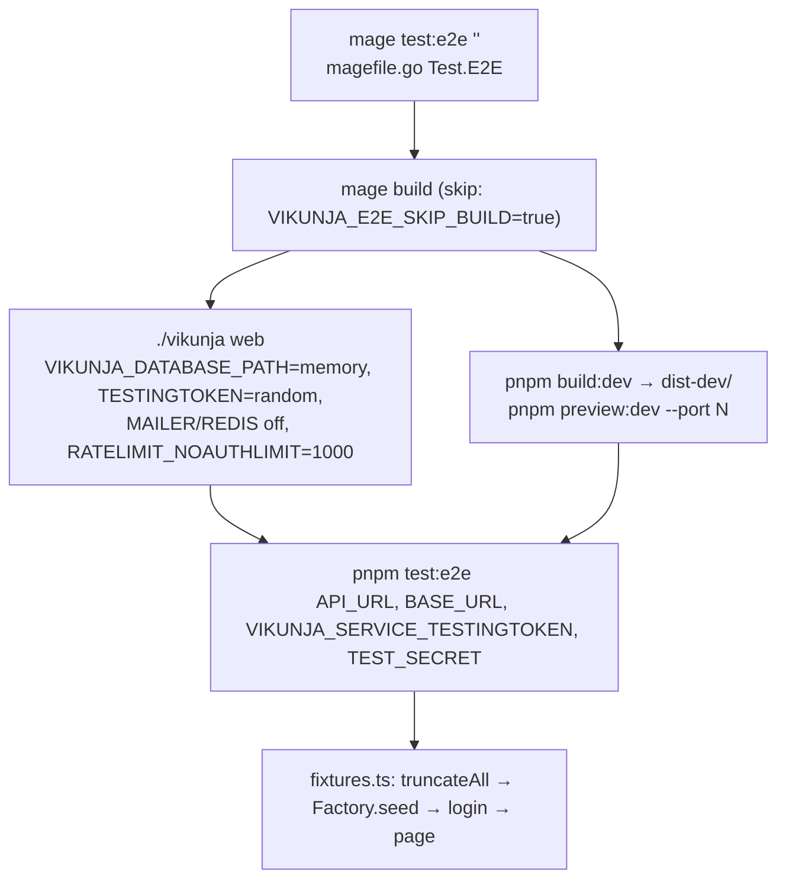

# Testing infrastructure (frontend)

Two layers: Vitest unit tests co-located under `frontend/src/`, and Playwright end-to-end specs under `frontend/tests/e2e/` that drive a built frontend against a real API seeded through `/api/v1/test/*`. This page is the "where is the harness" reference; the cross-cutting how-to is [Testing guide](../../11-testing-guide.md), the rules are [testing](../../../docs/testing.md), and running e2e is the `run-e2e-tests` skill.

## Responsibility

- **Owns:** `vite.config.ts` `test` block, `tsconfig.vitest.json`, `playwright.config.ts`, `tests/support/*`, `tests/factories/*`, `tests/fixtures/*`, `tests/e2e/**`, `src/directives/testid.ts`, the Histoire setup.
- **Does not own:** the seeding endpoint (`pkg/routes/api/v1/testing.go`, [api-v1](../backend/api-v1.md)), the mage target `Test.E2E` (`magefile.go:497-643`, [build-and-release](../build-and-release.md)), or the CI job definition (`.github/workflows/test.yml` → `test-frontend-e2e-playwright`).

## Entry points and public API

| Entry | Where | Used by |
|---|---|---|
| `pnpm test:unit` (`vitest --dir ./src`), `pnpm vitest run <file>` | `package.json:44` | developers, CI `test-frontend-unit` |
| `mage test:e2e "<playwright args>"` | `magefile.go:75` → `Test.E2E` | developers (never `pnpm test:e2e` directly) |
| `test`, `expect` with fixtures `apiContext`, `currentUser`, `userToken`, `authenticatedPage` | `tests/support/fixtures.ts` | every spec imports from here, not from `@playwright/test` |
| `Factory` and 25 subclasses | `tests/support/factory.ts`, `tests/factories/*.ts` | specs seed rows |
| `seed(apiContext, table, data)` | `tests/support/seed.ts` | older specs; duplicate of `Factory.seed` |
| `login`, `setupApiUrl`, `createFakeUser` | `tests/support/authenticateUser.ts` | fixtures |
| `v-cy="id"` → `data-cy` | `src/directives/testid.ts` | templates; Playwright `getByTestId` |

## Key types and functions

### Vitest

- Config is the `test` block in `vite.config.ts:116-120`: `environment: 'happy-dom'`, `exclude: [...configDefaults.exclude, 'e2e/**']`, and `'vitest.commandLine': 'pnpm test:unit'`. Because it sits inside `getBuildConfig`, unit tests get the same aliases (`@` → `src`), the SCSS `additionalData`, and the i18n plugin as a build.
- `tsconfig.vitest.json` extends `tsconfig.app.json`, empties `exclude`, sets `lib: []` and `types: ["node"]`; `pnpm typecheck` builds it as a project reference.
- Files: 121 `*.test.ts` under `src/` plus two `*.spec.ts` (`src/helpers/ganttRelationArrows.spec.ts`, `ganttTaskTree.spec.ts`). Vitest's default include picks up both; the `.spec.ts` name is the e2e convention and the inconsistency is cosmetic. ESLint ignores test files ([Conventions](../../08-conventions.md#frontend)).

### Mocking patterns with real examples

| Pattern | File | Shape |
|---|---|---|
| Legacy service class mock with a hoisted spy | `src/stores/kanban.test.ts:4-10` | `const {bucketUpdate} = vi.hoisted(() => ({bucketUpdate: vi.fn()}))` then `vi.mock('@/services/bucket', () => ({default: class { update = bucketUpdate }}))`; also stubs `vue-router`, `vue-i18n` (`t: key => key`), `@/stores/base`, `@/stores/auth` |
| Partial mock keeping the original module | `src/composables/useTaskList.test.ts:11-20`, `src/views/user/settings/TOTP.test.ts:32-39` | `vi.mock(path, async (importOriginal) => ({...await importOriginal(), default: class {...}}))` |
| Composable under a router host component | `useTaskList.test.ts:62-70` | `createRouter({history: createMemoryHistory(), routes: [...]})`, `mount(defineComponent(...))` with `RouterView`, `flushPromises`, `enableAutoUnmount(afterEach)` |
| Plain component mount | `src/components/input/Button.test.ts` | `mount(Button, {props, slots})`, assert `classes()` / `attributes('style')` |
| Real i18n messages | `TOTP.test.ts:41` | `createI18n({legacy: false, locale: 'en', messages: {en}})` passed as a global plugin; `@/message` mocked |
| Generated client and mutation lifecycle | `src/client/queries/labels.test.ts:13-14,118` | `vi.mock('@/client/generated', () => sdk)`, `vi.mock('@/message', ...)`, run options through `queryClient.getMutationCache().build(queryClient, options).execute(vars)` so `onMutate/onError/onSettled` really fire |
| Store setup | all store tests | `setActivePinia(createPinia())` in `beforeEach` |

### Playwright (`playwright.config.ts`)

| Option | Value | Why |
|---|---|---|
| `testDir` | `./tests/e2e` | |
| `workers` | `1`, `fullyParallel: false` | every test truncates the shared DB (`apiContext` fixture) |
| `retries` | `2` on CI, else 0; `forbidOnly` on CI | |
| `use.baseURL` | `BASE_URL` or `http://127.0.0.1:4173` | |
| `testIdAttribute` | `data-cy` | matches `testid.ts` |
| `serviceWorkers` | `'block'` | the PWA worker would cache assets between tests ([realtime-and-pwa](./realtime-and-pwa.md)) |
| `launchOptions.executablePath` | `PLAYWRIGHT_CHROMIUM_EXECUTABLE_PATH` or `which chromium`, else undefined (bundled browser) | Nix/CI images |
| `webServer` | none (comment at line 40-41) | mage or CI start the servers |
| `trace` / `screenshot` | `on-first-retry` / `only-on-failure` | reports in `playwright-report/` |

### Fixtures (`tests/support/fixtures.ts`)

- `apiContext` (`auto: true`): a request context on `API_URL` (default `http://localhost:3456/api/v1/`), `Factory.setRequestContext`, then **`Factory.truncateAll()` before every test**, disposed after.
- `currentUser`: `UserFactory.create(1)`. `userToken`: `POST login` with `TEST_PASSWORD` (`constants.ts`), returns the JWT for raw API/WebSocket tests.
- `authenticatedPage`: grants clipboard permissions on `BASE_URL`, logs in through the API, and `addInitScript`s `localStorage.API_URL`, `window.API_URL` (`setupApiUrl`, using `127.0.0.1` to match the frontend origin for CORS) and `localStorage.token`. Teardown navigates to `about:blank` so the previous page's polling and token refresh stop holding DB connections that would starve the next test's `Factory.seed` PATCH (comment at lines 40-44).

### Seeding

- `Factory.create(count, override, truncate = true)` (`factory.ts:35`): merges `factory()` defaults with overrides, calls function values with the index, replaces the literal `'{increment}'` with the index, drops non-primitive fields, runs `transformForSeed`, then `PATCH test/<table>?truncate=...` with header `Authorization: VIKUNJA_SERVICE_TESTINGTOKEN` (fallback `averyLongSecretToSe33dtheDB`). `truncateAll()` is `DELETE test/all`. The returned objects keep nested/original values, so specs can read what they seeded.
- `TaskFactory` (`tests/factories/task.ts`) overrides `create` to copy a numeric `id` override into `index`, because `tasks` has `UNIQUE(project_id, index)` and `index: '{increment}'` restarts at 1 per call.
- 25 factories: `bucket`, `label_task`, `labels`, `license`, `link_sharing`, `project`, `project_view`, `saved_filter`, `session`, `task`, `task_assignee`, `task_attachments`, `task_buckets`, `task_comment`, `task_relation`, `task_reminders`, `team`, `team_member`, `team_project`, `time_entry`, `token`, `totp`, `user`, `users_project`, `webhook`. Data from `@faker-js/faker`.
- `tests/support/seed.ts` is an older standalone `seed()` that reads `TEST_SECRET` instead of `VIKUNJA_SERVICE_TESTINGTOKEN`; mage and CI export both with the same value.
- Other support: `commands.ts` (`pasteFile`, `pasteHtmlFromClipboard`, `dragAndDrop`), `filterTestHelpers.ts`, `updateUserSettings.ts`, `userSettings.ts` (`gotoUserSettings`), `websocket.ts` (`openWs`, `authenticateWs`, `subscribeWs`, `waitForMessage`, `collectMessages`, `closeWs`). Binary fixtures: `tests/fixtures/image.jpg`, `image-blue.png`, `test.pdf`.

### E2E inventory (65 specs)

| Directory | Specs | Notes |
|---|---|---|
| `task/` | 18 | `task`, `overview`, comments (`comment-pagination`, `comment-reply`, `comment-sort-order`, `mention-in-comment`), `date-display`, `recurrence`, `bucket-select`, `drag-to-project`, `subtask-duplicates`, `related-tasks-quick-add-magic`, `quick-add-default-reminders`, `nested-checklist-strikethrough`, `read-only-checkbox-overview`, `tiptap-editor-save`, `mobile-bottom-sheet`, `assignee-search-narrow-column` |
| `user/` | 16 | `login`, `logout`, `registration` and `email-confirmation` (Mailpit), `password-reset`, `openid-login` (Dex), `oauth-authorize`, `session-refresh`, `api-tokens`, `settings` plus a `settings/` subdirectory |
| `project/` | 13 | `project`, the four `project-view-{list,kanban,gantt,table}`, `filter-persistence`, `sort-persistence`, `project-history`, `parent-project-clear`, `project-sidebar-drag-handle`, `saved-filter-favorite`, `saved-filter-subtasks`, `webhooks`; shared helper `prepareProjects.ts` |
| `editor/` | 5 | `emoji-autocomplete`, `image-alt-text`, `link-prompt-kanban-popup`, `suggestion-popup-position`, `toolbar-navigation` |
| `misc/` | 3 | `menu` (sidebar and shortcut), `notifications`, `sidebar-resize` |
| `websocket/` | 3 | `protocol`, `frontend`, `comment-notification` |
| `admin/` | 2 | `admin-panel`, `invite-links` |
| `filters/`, `sharing/` | 2 each | `filter-autocomplete`, `filter-date-picker`; `linkShare`, `team` |
| `time-tracking/` | 1 | `time-tracking` |

`tests/e2e/README.md` documents only the mail-dependent tests: they use `MAILER_API_URL` (default `http://127.0.0.1:3457/api/v1`) and `MAILPIT_URL` (`http://127.0.0.1:8025`) and need a second, mail-enabled API started by hand locally (commands in the README) plus `VIKUNJA_E2E_FRONTEND_PORT=4173` so confirmation links point at the test frontend.

## Internal structure

- Ports come from `VIKUNJA_E2E_API_PORT` / `VIKUNJA_E2E_FRONTEND_PORT` (random when unset, `magefile.go:501-509`); the token from `VIKUNJA_E2E_TESTING_TOKEN`. Set **`VIKUNJA_E2E_API_PORT=3456`**: specs that log in through the UI post to the relative `/api/v1`, and the app's fallback probes port 3456 on the same host, so a random port yields 404s ([Development workflow](../../07-development-workflow.md#end-to-end-playwright)).
- `build:dev` uses `--mode development`, so `import.meta.env.MODE === 'development'` and `testid.ts` emits `data-cy` without `window.TESTING`. CI builds production and injects `` into `dist/index.html` with `sed` (`test.yml`, "Inject testing flag into index.html").
- CI (`test-frontend-e2e-playwright`): matrix of 6 shards (`pnpm run test:e2e --shard=N/6`), container `mcr.microsoft.com/playwright:v1.63.0-jammy`, services `dex` (`ghcr.io/go-vikunja/dex-testing`) and `mailpit` (`axllent/mailpit:v1.31.1`); two API instances: the main one on 3456 with `VIKUNJA_MAILER_ENABLED: 0` and `VIKUNJA_AUTH_OPENID_PROVIDERS_DEX_AUTHURL: http://dex:5556`, and a mail-enabled one on 3457 (`VIKUNJA_MAILER_HOST=mailpit`); env `MAILER_API_URL`, `MAILPIT_URL`, `TEST_SECRET` and `VIKUNJA_SERVICE_TESTINGTOKEN` = `averyLongSecretToSe33dtheDB`; `wait-on` gates on `/api/v1/info` of both APIs and Mailpit `/readyz`; reports uploaded per shard.

## Dependencies

- **Uses:** `vitest`, `happy-dom`, `@vue/test-utils`, `@playwright/test` 1.63, `@faker-js/faker`, the backend testing routes (enabled only when `service.testingtoken` is set).
- **Used by:** CI jobs `test-frontend-unit` and `test-frontend-e2e-playwright`; the `run-e2e-tests` skill.

## Invariants and assumptions

- Every e2e test starts from an empty database (`apiContext` auto fixture). Do not rely on rows from another test; seed what you need.
- Seed only primitives; nested objects are dropped by `Factory.create`. Seed join tables (`task_buckets`, `users_project`, ...) explicitly.
- Seeded `id`s are explicit (`'{increment}'`), so a second `TaskFactory.create()` in the same test must pass `truncate: false` and distinct ids or it wipes the first batch.
- The testing token must match between the API (`VIKUNJA_SERVICE_TESTINGTOKEN`) and Playwright (`VIKUNJA_SERVICE_TESTINGTOKEN` **and** `TEST_SECRET`).
- Unit tests must not hit the network: mock `@/client/generated`, `@/services/*`, and `@/message`.

## Configuration

| Env | Read by | Effect |
|---|---|---|
| `API_URL`, `BASE_URL` | `fixtures.ts`, `seed.ts`, `authenticateUser.ts`, `playwright.config.ts` | endpoints (`API_URL` must end with `/api/v1/`) |
| `VIKUNJA_SERVICE_TESTINGTOKEN`, `TEST_SECRET` | `factory.ts`, `seed.ts` | seeding auth |
| `VIKUNJA_E2E_API_PORT`, `VIKUNJA_E2E_FRONTEND_PORT`, `VIKUNJA_E2E_TESTING_TOKEN`, `VIKUNJA_E2E_SKIP_BUILD` | `magefile.go` | local orchestration |
| `MAILER_API_URL`, `MAILPIT_URL` | mail specs | second API and Mailpit |
| `PLAYWRIGHT_CHROMIUM_EXECUTABLE_PATH`, `CI` | `playwright.config.ts` | browser binary; retries/reporters |

## Error handling

- `Factory.seed`/`truncateAll` throw with the HTTP status and backend `message` when the PATCH/DELETE fails; a wrong token shows up here first.
- Playwright keeps traces on first retry and screenshots on failure under `frontend/test-results/` and `playwright-report/`; save console output to a file on the first run (skill rule).

## Tests

- Unit: `cd frontend && pnpm test:unit` (123 files, 1634 tests on 2026-09-16 per [Development workflow](../../07-development-workflow.md#frontend-unit)); one file with `pnpm vitest run src/stores/kanban.test.ts`.
- E2E: `VIKUNJA_E2E_API_PORT=3456 mage test:e2e "tests/e2e/misc/menu.spec.ts" 2>&1 | tee /tmp/e2e.log`.
- Coverage gaps: no unit tests for `src/modelTypes/`, `src/views/admin/`, `src/views/migrate/`; `src/views/` has 11 test files (ShowTasks, PasswordReset, RequestPasswordReset, Mcp, TOTP, General, ApiTokens, two project settings, two gantt helpers), the rest of the views are e2e-only. `useWebSocket.ts`, `sw.ts`, `i18n/index.ts` are untested at unit level.
- Histoire: 8 `*.story.vue` files, `pnpm story:dev`; not run in CI.

## How to write

**A store test** (`src/stores/foo.test.ts`, copy `kanban.test.ts`)
1. `vi.hoisted` the spies you need; `vi.mock('@/services/foo', () => ({default: class {...}}))` or `vi.mock('@/client/generated', () => sdk)`.
2. Stub `vue-router`, `vue-i18n`, sibling stores you do not exercise.
3. Import the store after the mocks; `beforeEach(() => setActivePinia(createPinia()))`.
4. Call actions, assert state and spy calls.

**A composable test** (`src/composables/useFoo.test.ts`, copy `useTaskList.test.ts`)
1. Mock the service with `importOriginal` so helper exports stay real.
2. If it uses the route, build a memory router and mount a `defineComponent` host whose `setup` calls the composable; `await router.push(...)`, `flushPromises()`.
3. `enableAutoUnmount(afterEach)`.

**A component test** (`src/components/x/Foo.test.ts`, copy `Button.test.ts` or `TOTP.test.ts`)
1. First check `tests/e2e/` for the scenario; extend an e2e spec if it can cover it ([testing](../../../docs/testing.md)).
2. `mount(Foo, {props, slots, global: {plugins: [i18n]}})` with a real `createI18n` when text matters; mock `@/message`.
3. Assert on `classes()`, `text()`, emitted events; `flushPromises()` after async actions.

**An e2e spec** (`tests/e2e/<area>/foo.spec.ts`)
1. `import {test, expect} from '../../support/fixtures'`; import the factories you need.
2. Seed inside the test: `const [project] = await ProjectFactory.create(1); await TaskFactory.create(3, {project_id: project.id})`.
3. Use `authenticatedPage` (or `apiContext` + `userToken` for API/WS-level checks), `page.goto('/projects/1/1')`, locate by `getByTestId('...')` (`v-cy` in the template) or role.
4. Run with `VIKUNJA_E2E_API_PORT=3456 mage test:e2e "tests/e2e/<area>/foo.spec.ts"` and read the saved log.

## Gotchas and tech debt

- macOS: `misc/menu.spec.ts:19-27` presses `ControlOrMeta+e`, which Playwright sends as Meta on macOS while the app under the emulated Desktop Chrome UA expects Ctrl; it fails locally and passes in the Linux CI container ([Development workflow](../../07-development-workflow.md#end-to-end-playwright)).
- Specs needing Dex or Mailpit fail locally unless you start those services (README covers Mailpit only).
- `seed.ts` and `Factory.seed` duplicate the PATCH call with different env fallbacks (`TEST_SECRET` vs `VIKUNJA_SERVICE_TESTINGTOKEN`); prefer `Factory`.
- `authenticateUser.ts:62-66` `createFakeUserAndLogin()` returns `undefined` and exists only as a leftover of the Cypress-era API.
- `fixtures.ts:8` types `currentUser` as `any`; factory return values are untyped.
- `workers: 1` makes the full suite slow (65 specs; CI shards 6 ways). Unverified: whether per-test truncation would tolerate more workers with separate API instances.
- No `webServer` block means a bare `pnpm test:e2e` silently targets `127.0.0.1:4173` / `localhost:3456`, whatever happens to be running there; that is why the skill forbids it.

## Related pages

- [Testing guide](../../11-testing-guide.md), [Development workflow](../../07-development-workflow.md#tests), [Conventions](../../08-conventions.md#testing), [Debugging](../../12-debugging.md)
- [api-client-generated-and-queries](./api-client-generated-and-queries.md) (mutation lifecycle), [stores](./stores.md), [realtime-and-pwa](./realtime-and-pwa.md) (WebSocket specs), [auth-and-session](./auth-and-session.md) (token in `localStorage`)
- [api-v1](../backend/api-v1.md) (testing routes), [build-and-release](../build-and-release.md) (`magefile.go`, CI)
