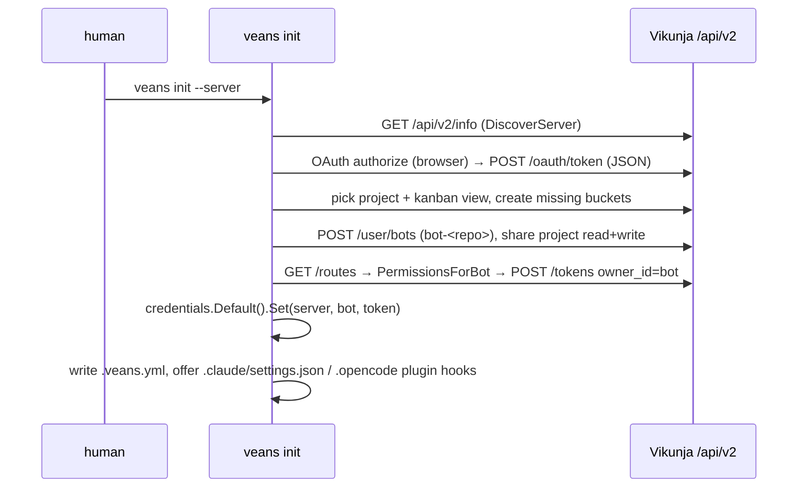

# veans

`veans/` is a separate Go module (`code.vikunja.io/veans`) that ships a small CLI wrapping Vikunja's `/api/v2` so coding agents track their work in a Vikunja kanban project instead of ad-hoc todo files. It is agent-facing at runtime; humans touch it only for `init` and `login`. See [Repository map](../02-repository-map.md) for where it sits and `veans/AGENTS.md` for the long tail of module-specific rules.

## Responsibility

- Owns: the `veans` binary (`veans/cmd/veans`), the JSON wire types it speaks (`veans/internal/client/types.go`), the agent workflow prompt (`veans/internal/commands/prompt.tmpl`), `.veans.yml` (`veans/internal/config/config.go` → `Config`), bot bootstrap and hook installation (`veans/internal/bootstrap/`), credential storage (`veans/internal/credentials/`), its own magefile, linter config and e2e suite.
- Does not own: any server behaviour. It never imports `code.vikunja.io/api` (verified: no such import under `veans/`); `veans/AGENTS.md` explains why (XORM would end up in the CLI). Release cross-compilation and packaging live in `build/magefile.go` → `veansProject()`, see [build-and-release](./build-and-release.md).

## Entry points and public API

| Entry | Where | Called by |
|---|---|---|
| `main()` sets `client.UserAgent` from the `-X main.version` ldflag and calls `commands.Execute` | `veans/cmd/veans/main.go` | the binary |
| `commands.Root` registers `version init list show create update claim prime api login` | `veans/internal/commands/root.go` | `Execute` |
| `commands.Execute` turns any error into `{"code","error"}` on stderr, exit 1 | `veans/internal/commands/root.go` | `main` |
| `veans prime` renders `prompt.tmpl`; exits 0 silently with no `.veans.yml` | `veans/internal/commands/prime.go` | agent hooks (`SessionStart`, `PreCompact`) |
| `veans api METHOD PATH` raw passthrough | `veans/internal/commands/api.go` → `newAPICmd` | agents, for unwrapped endpoints |
| `bootstrap.Init` | `veans/internal/bootstrap/bootstrap.go` | `init` command |
| `client.New`, `Client.Do`, `Client.DoMerge` | `veans/internal/client/client.go` | every command |

Audience split (`veans/AGENTS.md` "Audience split"): `init` and `login` prompt humans; everything else prints JSON unconditionally (`list` a raw array, the rest a single task object) and has no `--json` flag or interactive branch.

## Key types and functions

| Name | File | What it does |
|---|---|---|
| `apiBasePath = "/api/v2"` | `internal/client/client.go` | every request is `BaseURL + /api/v2 + path`; v1 is never used |
| `Paginated[T]`, `doList`, `doListAll` | `internal/client/client.go` | decode the v2 list envelope; `doListAll` pages with `per_page=50` until `page >= total_pages` |
| `vikunjaError` | `internal/client/client.go` | RFC 9457 problem+json body (`title`, `detail`, numeric `code`), `message` kept as a v1 fallback |
| `Routes`, `PermissionsForBot` | `internal/client/routes.go` | `GET /routes`, then intersect a wanted map of group → actions with what the server exposes |
| `CreateToken` | `internal/client/tokens.go` | `POST /tokens` with `owner_id` = bot id |
| `FarFuture` | `internal/client/types.go:204` | year-9999 `expires_at` for "no expiry" (the field is required upstream) |
| `DiscoverServer` | `internal/client/discover.go` | probes candidate URLs for `/api/v2/info`; a server without v2 fails cleanly |
| `TaskPatch` | `internal/client/types.go` | pointer/omitempty body for `PATCH /tasks/{id}` (`application/merge-patch+json`) |
| `credentials.Default()` | `internal/credentials/store.go` | `Chain{Keyring, Env, File}` |
| `auth.AcquireHumanToken` | `internal/auth/auth.go` | OAuth (default), `--token`, or `--use-password` → `POST /login` |
| `runOAuthFlow`, `bindLoopbackListener` | `internal/auth/oauth.go` | PKCE S256 loopback flow, `client_id` `veans-cli` |
| `status.Status`, `BucketTitleAliases`, `BucketID` | `internal/status/status.go` | five statuses ↔ bucket ids in `.veans.yml`; `Done()` is true for `completed` and `scrapped` |
| `config.Find`, `Load`, `FormatTaskID` | `internal/config/config.go` | walk upward for `.veans.yml`; render `PROJ-NN` or `#NN` |
| `picker.Pick` | `internal/picker/picker.go` | bubbletea v2 fuzzy project picker used by `init` |
| `output.Code*`, `output.New/Wrap` | `internal/output/errors.go` | `NOT_FOUND CONFLICT VALIDATION_ERROR AUTH_ERROR RATE_LIMITED BOT_USERS_UNAVAILABLE NOT_CONFIGURED UNKNOWN` |

## Internal structure

Layout: `cmd/veans` (main), `internal/auth` (human login, OAuth), `internal/bootstrap` (init flow, bot user, hook files), `internal/client` (one file per resource: assignees, auth, buckets, comments, discover, info, labels, projects, relations, routes, tasks, tokens, users), `internal/commands` (one cobra command per file + `runtime.go` + `prompt.tmpl`), `internal/config`, `internal/credentials`, `internal/output`, `internal/picker`, `internal/status`, `e2e/`.

The workflow the prompt teaches (`prompt.tmpl`, `README.md` "Status model"): `todo` → `veans claim` (`in-progress`) → agent works, keeps the HTML description in sync, comments on decisions → `update -s in-review` with a summary → a human closes (`completed`). Agents never close tasks; abandoning is `--status scrapped --reason`.

`claim` (`internal/commands/claim.go`): resolve the `in-progress` bucket id → `MoveTaskToBucket` → assign the bot (already-assigned is a soft skip) → add a label named after the current git branch.

## Dependencies

- **Uses:** `spf13/cobra`, `charm.land/bubbletea/v2` + `lipgloss/v2`, `zalando/go-keyring`, `pkg/browser`, `sahilm/fuzzy`, `golang-petname`, `gopkg.in/yaml.v3`, `x/term`, `x/sys` (`veans/go.mod`). Server side it relies on v2 routes, `GET /routes`, `POST /user/bots`, the OAuth2 server, and `PATCH /api/v1/test/{table}` for e2e seeding only.
- **Used by:** agent hooks (Claude Code `SessionStart`/`PreCompact`, OpenCode plugin) written by `internal/bootstrap/hooks.go`; `build/magefile.go` for releases.

## Invariants and assumptions

- Wire structs in `types.go` are hand-mirrored from `pkg/models`; a JSON tag change upstream silently breaks veans (no generated client, no shared types).
- `ProjectView.ViewKind` and bucket configuration mode are strings (`ViewKindKanban = "kanban"`), matching the custom `MarshalJSON` on the parent enums.
- `Task.BucketID` from `GET /tasks/:id` is always 0; use `?expand=buckets` and `task.CurrentBucketID(viewID)`.
- Canonical bucket titles are the first alias in `status.BucketTitleAliases`; `prompt.tmpl` and e2e assertions repeat them as literals.
- `prime` must never write to stdout without `.veans.yml` (`prime.go:56-62`), so the hook is safe globally.
- Error envelopes are always `{"code","error"}` on stderr (`output.EmitError`); commands must wrap with `output.New/Wrap`, never raw strings.
- Credentials are keyed by `(server, bot username)`; the human token is never persisted (`credentials/store.go` package comment).

## Wire-format gotchas

Summarised from `veans/AGENTS.md` "Vikunja wire-format gotchas"; read that section before adding an endpoint.

| Topic | Rule | Code |
|---|---|---|
| Lists | wrapped in `{items,total,page,per_page,total_pages}`; single objects unwrapped | `Paginated[T]` |
| Pagination | tasks/projects/labels/comments/bots are server-paged (50) → `doListAll`; buckets and views return everything → single `doList` (paging duplicates) | `client.go` comments on `doListAll` |
| Verbs | v2 creates are `POST`, task update is `PATCH` merge-patch, bucket move is `PUT` | `DoMerge`, `MoveTaskToBucket` |
| Task update body | build from `TaskPatch`; a full `Task` would clobber `done`/`title` (issue #2962) | `UpdateTask` |
| Search | `q`, not v1's `s` | `ListParams.Q` |
| Enums | `view_kind` / `bucket_configuration_mode` are strings | `types.go` constants |
| Bucket membership | `Task.BucketID` is 0; move via `PUT /projects/{p}/views/{v}/buckets/{b}/tasks` `{"task_id":N}` | `buckets.go` |
| Bots | `POST /user/bots`, username must start with `bot-` | `users.go`, `bootstrap.validateBotUsername` |
| Tokens | `expires_at` required → `FarFuture` | `types.go` |
| Descriptions | HTML (TipTap shapes), never markdown; no conversion in the CLI | `prompt.tmpl` |

## Permissions, bots, OAuth, credentials

- **Permission discovery**: `PermissionsForBot` requests both `views_buckets_tasks` and `views_buckets_tasks_put` because the bucket-move `PUT` and buckets-with-tasks `GET` collide on that subkey and which one gets the bare name depends on route-init order (`routes.go` comment). v1 and v2 share `(group, permission)` keys because `pkg/models/api_routes.go` → `getRouteDetail` normalises the inverted verbs and `CanDoAPIRoute` accepts `PATCH` as an alias for stored `PUT`. Never hard-code group names.
- **Bot ownership**: `POST /user/bots` sets `bot_owner_id` to the caller; only the owner can `POST /tokens` with `owner_id`. Bots cannot `POST /login`, so `veans login` re-authenticates the human and mints a new bot token (`login.go:70-105`).
- **OAuth loopback** (`internal/auth/oauth.go`): `generatePKCE` → `bindLoopbackListener` on `127.0.0.1:0` giving `http://127.0.0.1:N/callback` → `browser.OpenURL` → `newCallbackServer`/`waitForCallback` → token exchange. Shutdown uses `context.WithoutCancel(ctx)` so an outer cancel still drains the server. The exchange is hand-rolled JSON (`client.ExchangeOAuthCode`, per `AGENTS.md`) because `x/oauth2` hard-codes form encoding.
- **Credential chain** (`internal/credentials/`): `Get` walks keyring → `VEANS_TOKEN` env → `~/.config/veans/credentials.yml`; `Set` skips env, falls through on error and prints a one-line warning to `ChainStderr` when a later backend accepted the write. File backend: temp file + `Rename`, `Chmod 0o600` re-asserted, `flock` on `<path>.lock` (`lock_unix.go`; `lock_other.go` is a no-op stub). `XDG_CONFIG_HOME` is deliberately ignored (`file.go:63`).

## Tests

- Unit: `cd veans && mage test` (`Test.All`, `go test -short ./...`) or `mage test:filter <re>`. Test files sit next to code (`*_test.go` in `internal/*`).
- E2E (`veans/e2e/`): `TestMain` skips under `-short`. `mage test:e2e` (`veans/magefile.go` → `Test.E2E`) requires `VEANS_E2E_API_URL` and either `VEANS_E2E_TESTING_TOKEN` (harness seeds an admin via `PATCH /api/v1/test/users?truncate=true`, `e2e/helpers.go` → `seedAdmin`) or `VEANS_E2E_ADMIN_TOKEN` (use a JWT as-is, no seeding). It builds `./veans` unless `VEANS_E2E_SKIP_BUILD` is set and exports `VEANS_BINARY` so tests reuse it (`buildOrLocate`). Each test gets a temp git repo and a temp `HOME` (`NewWorkspace`), and `Run` strips inherited `VEANS_*` (`filterEnv`) so your keyring is never touched.
- CI (`.github/workflows/test.yml`): `veans-lint` (composite `golangci-lint` action, `working-directory: veans`), `veans-test` (installs `mage@v1.17.2` and runs `mage test`; the cached `mage-static` cannot see `veans/magefile.go`), `test-veans-e2e` (needs `api-build`, downloads `vikunja_bin`, boots `./vikunja web` with sqlite `memory`, `VIKUNJA_SERVICE_TESTINGTOKEN=averyLongSecretToSe33dtheDB`, waits on `/api/v1/info`, runs `cd veans && mage test:e2e`, uploads `/tmp/vikunja.log` on failure).
- Not covered: the bubbletea picker beyond `flatten_test.go`/`tree_test.go`; keyring backend (only file backend has tests).

## Lint

`veans/.golangci.yml` (v2 config, `build-tags: [mage]`) enables `goheader` with `template-path: code-header-template.txt`; that file is a byte-identical copy of the root `code-header-template.txt` (verified with `diff`) kept local so the path resolves per module. Notable exclusions: `err113` dynamic-error rule off everywhere, `gosec` G704/G705 off (HTTP CLI), G306 off for `internal/config` and `internal/bootstrap` (0644 is intended). `noctx` is on: every `exec` needs `CommandContext`.

## Release artifacts

- `release.yml` → `veans-binaries` uses `.github/actions/release-binaries` with `project: veans`: `cd build && mage release:build veans` (xgo matrix, upx, sha256, zip), GPG-signs zips, uploads to S3 `/veans/<tag|unstable>`, stores artifacts `veans_bins` and (tags only) `veans_bin_packages`.
- `veans-os-package` (matrix rpm/deb/apk/archlinux × amd64/arm64/arm7) uses `release-os-package`: `mage release:prepare-nfpm-config veans <arch>` templates `veans/nfpm.yaml` (`<version>`, `<arch>`, `<binlocation>` → `/usr/local/bin/veans`, license `AGPLv3`), nfpm builds, artifact `veans_os_package_*`, S3 `/veans/...`.
- `publish-repos` merges `veans_os_package_*` into the same apt/rpm/pacman/apk repos as the server; `create-release` attaches `veans*.zip|rpm|deb|apk|archlinux`. veans has no `LICENSE` file; `build/magefile.go` → `veansProject().OsPackageExtras` copies the root one.

## Gotchas and tech debt

- `veans/README.md` is stale in several places versus code: it says credentials honour `XDG_CONFIG_HOME` (code and `AGENTS.md` say no), mints tokens with `PUT /tokens` (code: `POST`), points at `.github/workflows/veans-e2e.yml` (the job is `test-veans-e2e` in `test.yml`), lists `VEANS_E2E_ADMIN_USER/PASS` env vars the harness does not read, and describes pasting a `vikunja-veans-cli://callback` URL while `oauth.go` runs a loopback listener.
- `mage test` only works because of the `Aliases` map; without it mage rejects bare namespace names (`veans/magefile.go` comment).
- `veans/CLAUDE.md` is a symlink to `AGENTS.md`.
- No TODO/FIXME comments in `veans/` (only the literal "TODO" status in tests).

## When a parent-repo change must be mirrored here

| Parent change | Mirror in veans |
|---|---|
| JSON tags or new fields on `Task`, `Project`, `ProjectView`, `Bucket`, `Label`, `TaskComment`, `APIToken`, `User`/bot, `Info` | `internal/client/types.go`; if a `Task` field is added, update the "useful fields" note in `prompt.tmpl` |
| v2 route path or verb change, list envelope, pagination default | `internal/client/*.go`, `doListAll` vs `doList` choice |
| `pkg/models/api_routes.go` group/action naming | `PermissionsForBot` wanted list (discovery drops unknown names, so stale entries lose permissions silently) |
| Default kanban bucket titles, `ProjectViewKind` strings | `internal/status/status.go`, `prompt.tmpl`, e2e assertions |
| OAuth server (`/oauth/authorize`, `/oauth/token`, PKCE, loopback rules) | `internal/auth/oauth.go`, `client.ExchangeOAuthCode` |
| Bot username validation, `bot_owner_id`, token `expires_at` | `bootstrap.validateBotUsername`, `FarFuture` |
| `/api/v1/test/{table}` seeding endpoint or testing-token semantics | `e2e/helpers.go` → `seedAdmin`, `test.yml` → `test-veans-e2e` |
| `code-header-template.txt`, golangci-lint version, Go version | `veans/code-header-template.txt`, `.github/actions/golangci-lint` default, `veans/go.mod` |
| Error body shape (problem+json `detail`/`code`) | `vikunjaError`, `mapStatusToCode` in `commands/api.go` |

## Related pages

[build-and-release](./build-and-release.md), [API contract](../05-api-contract.md), [backend/auth-and-sessions](./backend/auth-and-sessions.md), [backend/api-v2-huma](./backend/api-v2-huma.md), [backend/user-package](./backend/user-package.md), [Development workflow](../07-development-workflow.md).
